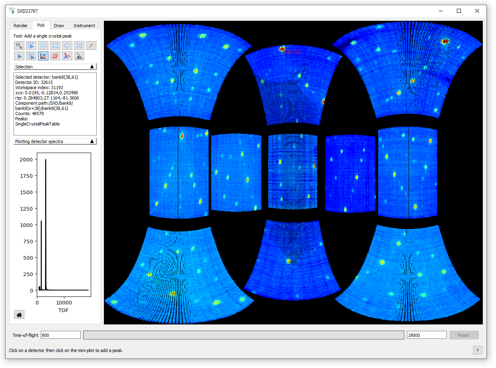

.. _sliceviewer_testing:

SliceViewer Testing
===================

.. contents::
   :local:

Introduction
------------

The Sliceviewer in Workbench has the joint functionality of the SpectrumViewer and SliceViewer from MantidPlot. So while the advanced use cases for multi-dimensional diffraction data are important to test, it is also worth checking more basic uses, for example opening a Workspace2D and examining the subplots and dynamic cursor data.

See here for a brief :ref:`Overview of the Sliceviewer<mantid:sliceviewer_release>` in Workbench.

Data
----

- 2D data (normal MatrixWorkspace), simply load ``CNCS_7860_event.nxs`` from the `TrainingCourseData <https://download.mantidproject.org/>`_.

- Create fake 4D data and take a 3D cut:

.. code-block:: python

	from mantid.simpleapi import *

	md_4D = CreateMDWorkspace(Dimensions=4, Extents=[-1,1,-1,1,-1,1,-10,10], Names="H,K,L,E", Units="U,U,U,V")
	FakeMDEventData(InputWorkspace=md_4D, PeakParams='500000,0,0,0,0,3') # 4D data
	# Create a histogrammed (binned) workspace with 100 bins in each of the H, K and L dimensions
	histoWS_3D = BinMD(InputWorkspace=md_4D, AlignedDim0='H,-1,1,100', AlignedDim1='K,-1,1,100', AlignedDim2='L,-1,1,100') # 3D cut

- Create an MD workspace with non-orthogonal axes:

.. code-block:: python

	from mantid.simpleapi import *

	# SXD23767.raw is available in the TrainingCourseData from the downloads page
	SXD23767 = Load(Filename='SXD23767.raw', LoadMonitors='Exclude')
	# Set some UB with angles we can play with
	SetUB(SXD23767, 1,1,2,90,90,120)
	md_non_ortho = ConvertToDiffractionMDWorkspace(InputWorkspace='SXD23767', OutputDimensions='HKL')

- Create a PeaksWorkspace:

  - Open instrument viewer by right-clicking on the workspace``SXD23767``.
  - On the *Pick* tab, select the |PickTabAddPeakButton.png| "Add a single crystal peak" button.
  - Click on an intense bragg peak on the detectors, and then click on one or many of the intense peaks in the produced mini-plot. Repeat for a few different bragg peaks across the detectors.
  - Notice that this has produced a ``SingleCrystalPeakTable``.
  - Rename the above workspace to ``peaks`` and in instrument viewer, select more peaks for a second peaksworkspace.

- Create an Integrated PeaksWorkspace:

.. code-block:: python

	peaks = mtd['peaks']
	integrated_peaks = IntegratePeaksMD(InputWorkspace='md_non_ortho', PeaksWorkspace='peaks',\
	     PeakRadius=0.12, BackgroundOuterRadius=0.2, BackgroundInnerRadius=0.16)

Tests
-----

Remember to SliceView 2D,3D,4D and non-orthogonal data. To enable non-orthogonal axes view, select the tri-fold toolbar button.

.. figure:: ../../../../docs/source/images/wb-sliceviewer51-nonorthobutton.png
   :class: screenshot
   :align: center

1. Viewing Data
###############

For the data types above:
	- Change the number of bins displayed
	- Move the sliders
	- Edit color limits, colormap, scale(lin/log), etc.

2. Select Axes
##############

- Change the axes that are displayed by selecting the relevant ``X`` and ``Y`` axes in the top left. This is more interesting for higher dimension data.

3. Cursor Tracking
##################

- Toggle "Track Cursor" on/off and check the cursor data makes sense
- For a MatrixWorkspace there is much more information than for an MDWorkspace. See :ref:`Cursor Information Widget<mantid:sliceviewer_cursor>` for more details.

4. Peak Overlay
###############

.. figure:: ../../../../docs/source/images/wb-sliceviewer51-peaksbutton.png
   :class: screenshot
   :align: center

- Select the peak overlay button to choose which PeakWorkspace/s to overlay
- Click on different peaks in the peak sorting table to display them
- Try overlaying multiple peaks workspaces
- Overlay Integrated peaks and observe the peak radius and background shell
  (see *Calculations* section of :ref:`algm-IntegratePeaksMD`) as displayed in the image below.
- Click on a column title in the peak table to sort by that value, such as ``DetID``
- Zooming in on peaks, and check that the data and peak move together
- Repeat step 2. (Select Axes) with peaks shown
- Peak overlay should not be shown for 2D data

.. figure:: ../../../../docs/source/images/wb-sliceviewer51-peaksoverlay.png
   :class: screenshot
   :width: 75%
   :align: center

5. Toolbar buttons for changing axis limits
###########################################

- Home
- Pan + Stretch
- Zoom (dynamic rebinning to ``_svrebinned`` workspace) - both by selecting region with mouse and scrolling

6. Toggle gridlines on/off
##########################

- For normal and non-orthogonal axes data

7. Line subplots and Region of Interest integration
###################################################

**(disabled for non-orthogonal data)**

.. figure:: ../../../../docs/source/images/wb-sliceviewer51-roibutton.png
   :class: screenshot
   :align: center

- Select the toolbar button for region of interest integration
- Draw a shape to integrate over on the image and notice the line subplots change
- Test the keyboard options in the bottom status bar message to output to workspaces
	- Output the cuts displayed on line-subplots, for axis: x = X , y = Y, c = Both
	- Output slice over the region of interest box: r = roi

- Also, test that the basic Line-subplots toolbar button (to the left of ROI integration button) works.
	- Check keyboard options for cuts displayed on line-subplots, for axis: x = X , y = Y, c = Both

.. figure:: ../../../../docs/source/images/wb-sliceviewer51-roi.png
   :class: screenshot
   :width: 75%
   :align: center

8. Save image
#############

- Use the Save image toolbar button, in many instances, such as with peaks overlaid
- In future there will also be a toolbar button to copy the image to clipboard

9. Resizing
###########

- Play around with resizing the window and adjusting the size of the peak table**

10. Alter the underlying workspace
##################################

- Delete the workspace and Sliceviewer should close
- Rename the workspace and Sliceviewer should stay open and continue to work
- Change the data in the workspace by cropping or running some algorithm (e.g. double the data ``md_non_ortho *= 2``)

.. |PickTabAddPeakButton.png| image:: ../../../../docs/source/images/PickTabAddPeakButton.png

