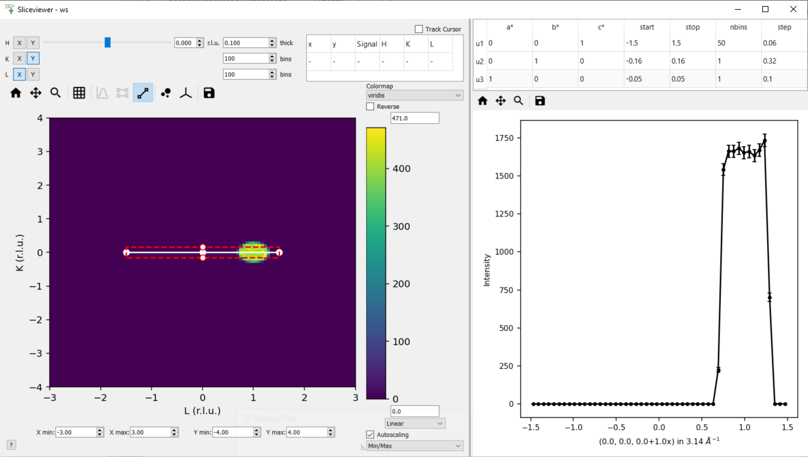

.. _sliceviewer_testing:

SliceViewer Testing
===================

.. contents::
   :local:

Introduction
------------

The Sliceviewer in Workbench has the joint functionality of the SpectrumViewer and SliceViewer from MantidPlot. So while the advanced use cases for multi-dimensional diffraction data are important to test, it is also worth checking more basic uses, for example opening a Workspace2D and examining the subplots and dynamic cursor data.

See here for a brief overview of the :ref:`sliceviewer`.

Basic Usage
-----------

.. _toolbar-checklist:

MatrixWorkspace
###############

Do the following tests with an EventWorkspace (e.g. ``CNCS_7860_event.nxs``) and a Workspace2D (e.g. ``MAR11060.raw``) from the `TrainingCourseData <https://download.mantidproject.org/>`_.

1. Load the workspace and open in sliceviewer (right-click on the workspace in the ADS > Show Slice Viewer).
2. Confirm that for MatrixWorkspaces the :ref:`Peak overlay<mantid:sliceviewer_roi>`, :ref:`Nonorthogonal view<mantid:sliceviewer_nonortho>` and :ref:`Non-axis aligned cutting tool <mantid:sliceviewer_nonaxiscuts>` buttons should be disabled (greyed out).
3. Check the other toolbar buttons.

    a. Pan and Zoom (use mouse scroll and magnifying glass tool) and Home

        * As you zoom check the color scale changes if autoscale checked in checkbox below colorbar).

    b. Toggle grid lines on/off
    c. Enable line plots

        * Confirm the curves update with the cursor position correctly

    d. Export cuts to workspaces in ADS using keys `x`, `y`, `c`

        * This should produce workspaces in the ADS with suffix `_cut_x` and `_cut_y`
        * Plot these in workbench check they agree with sliceviewer plots

    e. Disable line plots and Enable :ref:`ROI tool<mantid:sliceviewer_roi>`

        .. figure:: ../../../../docs/source/images/wb-sliceviewer51-roibutton.png
           :class: screenshot
           :width: 50%
           :align: center

        * The line plot button should be automatically enabled

    f. Draw, move and resize the rectangle

        * Move it off the axes (it should just clip itself to be contained within the axes).
        * Export the cuts with keys `x`, `y`, `c`
        * In addition the ROI can be exported by pressing `r`

            - This should produce another workspace with suffix `_roi`
            - Open it in sliceviewer and check the data and limits agree with the ROI drawn.

    g.  Disable the ROI tool

        * The line plot tool should remain enabled.

4. Try saving the figure (with and without ROI/lineplots).
5. Test the colorbar and colorscale

    a. Change normalisation

        * The color limits should only change if autoscale is enabled.

    b. Change the scale type to e.g. Log

        * In Log scale bins with 0 counts should appear white
        * When you zoom in to a region comprising only of bins with 0 counts it will set the color axis limits to (0.1,1) and force the scale to be linear

    c. Change colormap
    d. Reverse colormap
    e. Change auto-scale option from default `Min/Max`  to another e.g. `3-sigma`

6. Test transposing axes: click the Y button to the right of the Time-of-flight label (top left corner) - the image should be transposed and the axes labels updated.

7. Test the :ref:`Cursor Information Widget<mantid:sliceviewer_cursor>` (table at top of sliceviewer window with TOF, spectrum, DetID etc.)

    a. Confirm it tracks with the cursor when Track Cursor is checked
    b. Uncheck the track cursor and confirm it updates when the cursor is clicked.
    c. Transpose the axes (as in step 6) and confirm the cursor position displayed is still correct (note if Track Cursor is checked you will need to click on the colorfill plot again).

8. Resize the sliceviewer window, check the widgets, buttons etc. are still visible and clear for reasonable aspect ratios.

MD Workspaces
#############

MD workspaces hold multi-dimensional data (typically 2-4D) and come in two forms: :ref:`MDEventWorkspace <MDWorkspace>`, :ref:`MDHistoWorkspace <MDHistoWorkspace>`.
In terms of sliceviewer functionality, the key difference is that MDHistoWorkspace have binned the events onto a regular grid and cannot be dynamically rebinned unless the original MDWorkspace
(that holds the events) exists in the ADS (and the MDHistoWorkspace has not been altered by a binary operation e.g. ``MinusMD``).

.. _md_event_tests:

MDWorkspace (with events)
~~~~~~~~~~~~~~~~~~~~~~~~~
1. Create a 3D and 4D MDWorkspaces with some data - repeat the following tests with both ``md_4D`` and ``md_3D``. Note this will throw a warning relating to the ``SlicingAlgorithm``.

.. code-block:: python

    from mantid.simpleapi import *

    md_4D = CreateMDWorkspace(Dimensions=4, Extents=[0,2,-1,1,-1.5,1.5,-0.25,0.25], Names="H,K,L,E", Frames='HKL,HKL,HKL,General Frame',Units='r.l.u.,r.l.u.,r.l.u.,meV')
    FakeMDEventData(InputWorkspace=md_4D, UniformParams='5e5') # 4D data
    FakeMDEventData(InputWorkspace=md_4D, UniformParams='1e5,0.5,1.5,-0.5,0.5,-0.75,0.75,-0.1,0.1') # 4D data

    # Add a non-orthogonal UB
    expt_info = CreateSampleWorkspace()
    md_4D.addExperimentInfo(expt_info)
    SetUB(Workspace='md_4D', c=2, gamma=120)

    # make a 3D MDEvent workspace by integrating over all E
    md_3D = SliceMD(InputWorkspace='md_4D', AlignedDim0='H,0,2,100', AlignedDim1='K,-1,1,100', AlignedDim2='L,-1.5,1.5,100')

    # Create a peaks workspace and fake data in 3D MD
    CreatePeaksWorkspace(InstrumentWorkspace='md_3D', NumberOfPeaks=0, OutputWorkspace='peaks')
    CopySample(InputWorkspace='md_3D', OutputWorkspace='peaks', CopyName=False, CopyMaterial=False, CopyEnvironment=False, CopyShape=False)
    AddPeakHKL(Workspace='peaks', HKL='1,0,1')
    AddPeakHKL(Workspace='peaks', HKL='1,0,0')

2. Test the toolbar buttons pan, zoom, line plots, ROI as in step 3 of the :ref:`toolbar-checklist` instructions.

    - This workspace should be dynamically rebinned - i.e. the number of bins within the view limits along each axis should be preserved when zooming.
    - The cursor info table should also display the HKL of the cursor

3. Change the number of bins along one of the viewing axes (easier to pick a small number e.g. 2)
4. Change the integration-width/slice-thickness (spinbox to the left of the word `thick`) along the non-viewed axes.

    - Increasing the width should improve the stats on the uniform background and the color limit should increase (event counts are summed not averaged).

5. Change the slicepoint along one of the non-viewed axes

    a. Confirm the slider moves when the spinbox value is updated.
    b. Confirm moving the slider updates the spinbox.
    c. Check the slicepoint is updated in the cursor info table (note if Track Cursor is checked you will need to click on the colorfill plot again).

Test the :ref:`Nonorthogonal view<mantid:sliceviewer_nonortho>`

1. Click the nonorthogonal view button in the toolbar

    - This should disable ROI and lineplot buttons in the toolbar
    - This should automatically turn on gridlines
    - When H and K are the viewing axes the gridlines should not be perpendicular to each other
    - The features in the data should align with the grid lines

2. Zoom and pan

    - Confirm the autoscaling of the colorbar works in non-orthogonal view

3. Note the range of data in `X` and `Y` axes to be `0 to 2` for `H` and `-1 to +1` for `K` respectively. Swap the viewing axes by clicking `Y` button next to `H` in the top left of the window

    - `X` and `Y` axes should now display data for `K` and `H` respectively preserving their original ranges.

4. Click on `X` button next to the `H` button to swap the axes again

    - Now `X` and `Y` axes should display data for `H` and `K` respectively preserving their original ranges.

5. Change one of the viewing axes to be `L` (e.g. click `X` button next to L in top left of window)

    - Gridlines should now appear to be orthogonal

6. For ``md_4D`` only change one of the viewing axes to be `E` (e.g. click `Y` button next to `E` in top left of window)

    - Nonorthogonal view should be disabled (only enabled for momentum axes)
    - Line plots and ROI should be enabled
    - Change the viewing axis presently selected as `E` to be a momentum axis (e.g. `H`)

            - The nonorthogonal view should be automatically re-enabled.

Test the :ref:`Peak Overlay<mantid:sliceviewer_peaks_overlay>`

.. figure:: ../../../../docs/source/images/wb-sliceviewer51-peaksbutton.png
   :class: screenshot
   :align: center

1. Click to peak overlay button in the toolbar
2. Check the `Overlay?` box next to ``peaks``

    - This should open a table (peak viewer) on the RHS of the sliceviewer window - it should have two rows corresponding to peaks at HKL = (1,0,1) and (1,0,0).

3. Double click a row

    - It should change the slicepoint along the integrated momentum axis and zoom into the peak - e.g. in (X,Y) = (H,K) then the slicepoint along L will be set to 1 and there will be a cross at (0,0).
    - Note for ``md_4D`` a peak will not be plotted if a non-Q axis is viewed, if both axes are Q-dimensions then the cross should be plotted at all E (obviously a Bragg peak will only be on the elastic line but the peak object has no elastic/inelastic logic and the sliceviewer only knows that `E` is not a momentum axis, it could be temperature etc.).

4. Click Add Peaks in the Peak Actions section at the top of the peak viewer (note for 4D workspaces the peak overlay won't work for non_Q dimensions).

5. Click somewhere in the colorfill plot

    - Confirm a peak has been added to the table at the position you clicked
    - Note that peaks need to have H > 0 to be valid due to the assumed beam direction (otherwise you will get an error in the log ``ValueError: Peak::setQLabFrame(): Wavelength found was negative``)

6. Click Remove Peaks
7. Click on the cross corresponding to the peak you just added

    - Confirm the correct row has been removed from the table
    - The cross should be removed from the plot

8. Repeat the above steps 1-7 in non-orthogonal view.

9. Check the ``Concise View`` checkbox above one of the peak tables on the right hand side - this should hide some columns.

MDHistoWorkspace
~~~~~~~~~~~~~~~~

1. Make a 3D MDHistoWorkspace

.. code-block:: python

    md_3D_histo = BinMD(InputWorkspace='md_4D', AlignedDim0='H,-2,2,100', AlignedDim1='K,-1,1,100', AlignedDim2='L,-1.5,1.5,100')

2. Open ``md_3D_histo`` in sliceviewer it should not support dynamic rebinning (can't change number of bins).
3. Test the toolbar buttons pan, zoom, line plots, ROI as in step 3 of the :ref:`toolbar-checklist` instructions.
4. Test changing/swapping viewing axes
5. Test the :ref:`Nonorthogonal view<mantid:sliceviewer_nonortho>` as above
6. Open ``md_4D_svrebinned`` in sliceviewer (should be in the ADS after preceding tests).

    - It should support dynamic rebinning (i.e. will be able to change number of bins along each axis).

7. With ``md_4D_svrebinned`` open in the sliceviewer, delete ``md_4D`` in the ADS.

    - It should close sliceviewer because the support for dynamic rebinning has changed

8. Open ``md_4D_svrebinned`` in sliceviewer again

    - It should no longer support dynamic rebinning
    - Confirm transposing axes works

CutViewer Tool
--------------

1. Check the :ref:`Non-axis aligned cutting tool <mantid:sliceviewer_nonaxiscuts>` button is only enabled for 3D MD workspaces where all dimensions are Q by opening the following workspaces in sliceviewer.
It should only be enabled for the `ws_3D` and `ws_3D_QLab` workspaces (see comment for details) - the first 3 column headers for the vectors should be a*,b*,c* and Qx,Qy,Qz for the two workspaces respectively.

.. code-block:: python

    Load(Filename='CNCS_7860_event.nxs', OutputWorkspace='CNCS_7860_event')  # disabled (MatrixWorkspace)

    ws_2D = CreateMDWorkspace(Dimensions='2', Extents='-5,5,-4,4', Names='H,K',
                              Units='r.l.u.,r.l.u.', Frames='HKL,HKL',
                              SplitInto='2', SplitThreshold='50')  #  disabled (2D MD)

    ws_3D = CreateMDWorkspace(Dimensions='3', Extents='-5,5,-4,4,-3,3',
                              Names='H,K,L', Units='r.l.u.,r.l.u.,r.l.u.',
                              Frames='HKL,HKL,HKL', SplitInto='2', SplitThreshold='50')  # enabled!

    ws_3D_nonQdim = CreateMDWorkspace(Dimensions=3, Extents=[-1, 1, -1, 1, -1, 1],
                              Names="E,H,K", Frames='General Frame,HKL,HKL',
                              Units='meV,r.l.u.,r.l.u.')  # disabled (3D but 1 non-Q)

    ws_4D = CreateMDWorkspace(Dimensions=4, Extents=[-1, 1, -1, 1, -1, 1, -1, 1],
                              Names="E,H,K,L", Frames='General Frame,HKL,HKL,HKL',
                              Units='meV,r.l.u.,r.l.u.,r.l.u.')  # disabled (4D - one non-Q)

    ws_3D_QLab = CreateMDWorkspace(Dimensions='3', Extents='-5,5,-4,4,-3,3',
                                   Names='Q_lab_x,Q_lab_y,Q_lab_z', Units='U,U,U',
                                   Frames='QLab,QLab,QLab', SplitInto='2', SplitThreshold='50')  # enabled!

2. Close any sliceviewer windows and clear the workspaces in the ADS

3.  Run the following and open `ws` in sliceviewer.

.. code-block:: python

    ws = CreateMDWorkspace(Dimensions='3', Extents='-5,5,-4,4,-3,3',
                              Names='H,K,L', Units='r.l.u.,r.l.u.,r.l.u.',
                              Frames='HKL,HKL,HKL', SplitInto='2', SplitThreshold='50')
    expt_info = CreateSampleWorkspace()
    SetUB(expt_info, 1,1,2,90,90,120)
    ws.addExperimentInfo(expt_info)
    # make some fake data
    FakeMDEventData(ws, UniformParams='1e5', PeakParams='1e+05,0,0,1,0.3', RandomSeed='3873875')

4. Open the cut tool and check that:

    - Disabled ROI tool
    - Disabled line plots
    - Sliceviewer should look like

.. figure:: ../../images/SliceViewer/CutViewer_HKplane.png
   :class: screenshot
   :align: center

6. Check that transposing the axes (X <-> Y) will swap the u1 and u2 vectors in the table
7. Set the axes to (X,Y) = (L, K) - check u1 = [0,0,1] and u2 = [0,1,0]
8. Change the slice point of H to be 0 - it should look like this

9.  In the table double the step along u1 (i.e. set step to 0.12) - this should change nbins = 25 along u1
10. Set the nbins = 50 along u1 - the step should go back to it's original value (0.06)
11. Set the stop for u1 to 0 and check that

    - step size = 0.03
    - the cut representation line on the colorfill plot has the correct start/stop
    - the 1D plot in the cut viewer pane has the correct axes limits

12. Set step of u1 to be 2 (i.e. greater than the extent of the cut) - this should set nbins=1 and step = 1.5 and put the cut along u2 with nbins = 50.
13. Transpose the axes so now (X,Y) = (K,L) - the cut should have 50 bins along K (default value)
14. Change the nbins of u2 to 50 (it should set nbins=1 for u1 and change the step=4). Check the white line of the cut representation on the colorfill plot is now vertical.
15. Try to change the a* column of the u1 to 1 (this would take u1 out of the plane of the slice, i.e. not orthogonal to u3) - it should reset to 0 - i.e. u1 = [0,1,0].
16. Click and hold down on one of the red markers with white face on the colorfill plot and drag, release at ~K=1.

    - This should reset the vectors in the table such that the cut is along u1 = [0,0,1] - i.e. u1 and u2 are swapped
    - The thickness along u2 should be adjusted to ~2

17. Set the step of u2 = 2 in the table, check that it sets (start,stop) = (-1,1)
18. Drag the top white marker of the cut representation up to L~2

    - u1 ~ [0,0,1]  and u2 ~ [0,1,0]
    - There should be a peak in the 1D plot at x~1

19. For u1 set b*=0 and c* = -1 and start=-2 - check that u2 = [0,-1,0] and there is a peak at x~-1
20. To change the centre of the cut move the central white marker of the cut representation to (K,L) ~ (2,0),

    - The entire cut representation should move
    - The axes label of the 1D plot should be similar to ``(0.0, 2.0,0.0-1.0x) in 3.14 Ang^-1``
    - There should be no peak on the 1D plot

21. Increase the thickness by dragging the left red marker of the cut representation to encompass the peak in the data - check the peak appears in the 1D plot at the right thickness.
22. Play around with the direction of the cut by dragging the white markers at the end points of the white line - the vectors u1 and u3 should be orthogonal unit vectors.
23. Reset the cut by transposing the axes so (X,Y) = (L,K)
24. Double the slice thickness along H from 0.1 -> 0.2 (the counts of the peak in the 1D plot should double from ~2000 -> ~4000)
25. Change c* of u1 from 1 -> -1

    - The peak in the 1D plot should move from x= 1 -> -1
    - Check u2 = [0,-1,0]

26. Turn on non-orthogonal view and play around with the cut tool representation

    - Check that the table values are updated correctly (use the HKL in the cursor info table to help determine this)

27. Produce a non-axis aligned cut where the peak is not in the center of the x-range. Take the x-value at the peak maximum and plug it into the axis label - it should produce the HKL of the peak (0,0,1).

Specific Tests
--------------

1. Representation of integrated peaks
#####################################

1. Run the code below to generate fake data and integrate peaks in the 3D MDWorkspace ``md_3D`` from :ref:`md_event_tests`

.. code-block:: python

    # Fake data in 3D MD and integrate
    FakeMDEventData(md_3D, EllipsoidParams='1e4,1,0,1,1,0,0,0,1,0,0,0,1,0.005,0.005,0.015,0', RandomSeed='3873875') # ellipsoid
    FakeMDEventData(md_3D, EllipsoidParams='1e4,1,0,0,1,0,0,0,1,0,0,0,1,0.005,0.005,0.005,0', RandomSeed='3873875')  # spherical
    IntegratePeaksMD(InputWorkspace='md_3D', PeakRadius='0.25', BackgroundInnerRadius='0.25', BackgroundOuterRadius='0.32', PeaksWorkspace='peaks', OutputWorkspace='peaks_int_ellip', IntegrateIfOnEdge=False, Ellipsoid=True, UseOnePercentBackgroundCorrection=False)
    IntegratePeaksMD(InputWorkspace='md_3D', PeakRadius='0.25', BackgroundInnerRadius='0.25', BackgroundOuterRadius='0.32', PeaksWorkspace='peaks', OutputWorkspace='peaks_int_sphere', IntegrateIfOnEdge=False, Ellipsoid=False, UseOnePercentBackgroundCorrection=False)
    IntegratePeaksMD(InputWorkspace='md_3D', PeakRadius='0.25', BackgroundInnerRadius='0', BackgroundOuterRadius='0', PeaksWorkspace='peaks', OutputWorkspace='peaks_int_no_bg', IntegrateIfOnEdge=False, Ellipsoid=False, UseOnePercentBackgroundCorrection=False)
    # IntegratePeaksMD will throw an error
    #   Error in execution of algorithm MaskBTP:...
    # This is because the simulated ws don't have a real instrument but the integration will be executed

2. Open ``md_3D`` in sliceviewer
3. Click the peak overlay button in the toolbar
4. Overlay ``peaks_int_ellip`` and ``peaks_int_sphere``
5. Click the first row in the first table

    - It should zoom to a peak.
    - There should be an ellipse and a circle drawn with dashed lines with different colors (the color should match the color of the workspace name in the peak viewer table).
    - There should be a transparent shell indicating the background for each peak.
    - The ellipse should be smaller than the circle.

6. Alter the slice point by moving the slider along the integrated dimension

    - The circle and ellipse should shrink
    - There should be no gap between the background shell and the dashed line.

7. Click on the second row on the second table.

    - It should zoom in on a different peak.
    - The ellipse and circle should be very similar (not quite same as the covariance matrix was evaluated numerically for randomly generated data).

8. Click the nonorthogonal view button
9. The ellipse and circle should still agree with each other and the shape of the generated data.
10. Click the Peak overlay button in the toolbar
11. Overlay the ``peaks_int_no_bg`` workspace and remove ``peaks_int_sphere``
12. Zoom in on a peak (click a row in the table)

    - There should be a dashed line but no background shell for peaks in ``peaks_int_no_bg``

Keep the three peak workspaces overlain for the next test.

2. ADS observer for peak overlay
################################

1. Rename ``peaks_int_ellip`` in the ADS to e.g. ``peaks_int_ellipse``

    a. Confirm the name changes in the peak viewer table
    b. Click on a peak, the ellipse should still be drawn on the colofill plot

2. Remove a row from ``peaks_int_no_bg`` table (open table from ADS > Right-click on a row > Delete)

    a. Confirm the correct row is removed from the corresponding row in the peak viewer table
    b. Click on the peak in the ``peaks_int_ellipse`` table that has been removed from ``peaks_int_no_bg``

        - Only the ellipse should be plotted.

3. Delete ``peaks_int_no_bg`` from the ADS

    - The table should be removed from the peaks viewer
    - Confirm the Peak actions combo box is updated to only contain ``peaks_int_ellipse``

4. Delete ``peaks_int_ellipse`` from the ADS

    - The peak overlay should be turned off and the table hidden

3. ADS observer for workspace
#############################

With ``md_3D`` open in sliceviewer

1. Rename ``md_3D`` to e.g. ``md_3Dim``

    - The workspace name in the  title of the sliceviewer window should have updated
    - Zoom to check dynamic rebinning still works

2. Ensure colorbar autoscale is checked.

3. Take a note of the colorbar limits and execute this command in the ipython terminal

    .. code-block:: python

        mtd['md_3Dim'] *= 2

    - The colorbar max should be doubled.
    - Zoom to check dynamic rebinning still works

4. Clone the workspace for future tests

.. code-block:: python

    CloneWorkspace(InputWorkspace='md_3Dim', OutputWorkspace='md_3D')

5. Delete ``md_3Dim`` in the ADS

    - The sliceviewer window should close

4. ADS observer for support for nonorthogonal view
##################################################

1. Open ``md_3D`` in sliceviewer
2. Run ``ClearUB`` algorithm on ``md_3D``

    - Sliceviewer window should close with message ``Closing Sliceviewer as the underlying workspace was changed: The property supports_nonorthogonal_axes is different on the new workspace.``

5. Check BinMD called with NormalizeBasisVectors=False for HKL data
###################################################################

1. Create a workspace with peaks at integer HKL and take a non axis-aligned cut

.. code-block:: python

    ws = CreateMDWorkspace(Dimensions='3', Extents='-3,3,-3,3,-3,3',
                           Names='H,K,L', Units='r.l.u.,r.l.u.,r.l.u.',
                           Frames='HKL,HKL,HKL',
                           SplitInto='2', SplitThreshold='10')

    # add fake Bragg peaks for primitive lattice in data
    for h in range(-3,4):
        for k in range(-3,4):
            for l in range(-3,4):
                hkl = ",".join([str(x) for x in [h,k,l]])
                FakeMDEventData(ws, PeakParams='1e+02,' + hkl + ',0.02', RandomSeed='3873875')

    BinMD(InputWorkspace=ws, AxisAligned=False,
        BasisVector0='[00L],U,0,0,1',
        BasisVector1='[HH0],U,1,1,0',
        BasisVector2='[-HH0],U,-1,1,0',
        OutputExtents='-4,4,-4,4,-0.25,0.25',
        OutputBins='101,101,1', OutputWorkspace='BinMD_out', NormalizeBasisVectors=False)

2. Open ``BinMD_out`` in sliceviewer.

    - There should be peaks at integer HKL

3. Zoom in (so that the data are rebinned)

    - The peaks should still be at integer HKL (rather than multiples of :math:`\sqrt{2}`)

6. Check gets the correct basis vectors for MDHisto workspaces
##############################################################

This tests that the sliceviewer gets the correct basis vectors for an ``MDHisto`` object from a non-axis aligned cut.

1. Create the workspace

.. code-block:: python

    ws = CreateMDWorkspace(Dimensions='3', Extents='-3,3,-3,3,-3,3',
                       Names='H,K,L', Units='r.l.u.,r.l.u.,r.l.u.',
                       Frames='HKL,HKL,HKL',
                       SplitInto='2', SplitThreshold='10')
    expt_info = CreateSampleWorkspace()
    ws.addExperimentInfo(expt_info)
    SetUB(ws, 1,1,2,90,90,120)
    BinMD(InputWorkspace=ws, AxisAligned=False,
        BasisVector0='[00L],r.l.u.,0,0,1',
        BasisVector1='[HH0],r.l.u.,1,1,0',
        BasisVector2='[-HH0],r.l.u.,-1,1,0',
        OutputExtents='-4,4,-4,4,-0.25,0.25',
        OutputBins='101,101,1', OutputWorkspace='ws_slice', NormalizeBasisVectors=False)

2. Open ``ws_slice`` in the sliceviewer.

    - The non-orthogonal view should be enabled (not greyed out).

3. Click the non-orthogonal view button

    - Rectangular gridlines should appear (as in this case 110 is orthogonal to 001).

7. Check non-orthogonal view is disabled for non-Q axes
#######################################################
Check that the non-orthogonal view is disabled for non-Q axes such as energy

1. Create a workspace with energy as the first axis.

.. code-block:: python

    ws_4D = CreateMDWorkspace(Dimensions=4, Extents=[-1, 1, -1, 1, -1, 1, -1, 1], Names="E,H,K,L",
                                  Frames='General Frame,HKL,HKL,HKL', Units='meV,r.l.u.,r.l.u.,r.l.u.')
    expt_info_4D = CreateSampleWorkspace()
    ws_4D.addExperimentInfo(expt_info_4D)
    SetUB(ws_4D, 1, 1, 2, 90, 90, 120)

2. Open ``ws_4D`` in sliceviewer.
3. Confirm that when the Energy axis is viewed (as X or Y) the non-orthogonal view is disabled.
4. The button should be re-enabled when you view two Q-axes e.g. H and K.
