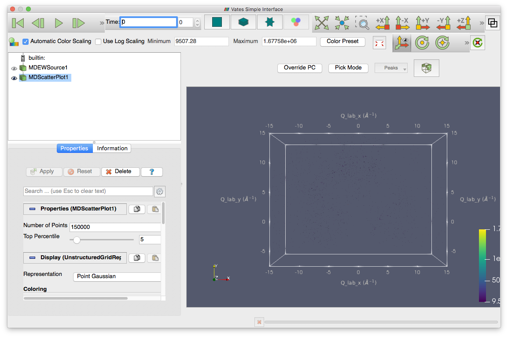

.. _vsi_testing:

VSI Testing
=============

.. contents::
   :local:

*Preparation*

- Get the scripts from the Mantid repository `this directory <https://github.com/mantidproject/mantid/tree/master/scripts/Vates>`_.
- Make sure that you have the Mantid system test data. You can do this by building a SystemTestData target of Mantid.
- Put the system test data directory in your Mantid user directories

**Time required 20-30 minutes**

--------------

#. Load the script SXD_NaCl.py in MantidPlot. Run it.
#. This should load a workspace called QLab. Right-click this workspace and choose 'Show Vates simple interface'.
#. This should open the VSI window. Like the picture below. Check that all tabs are present.

   
#. Click the various tabs making sure that the interface does not crash. 
#. Make sure all tabs have a tool tip when you hover over them.
#. Go into three slice mode (the star shaped tab at the top).
#. Play with the maximum and minimum parameters at the top of the plot, make sure the colours change in the plot.
#. Hover on each of the upper two plots and the lower left plot. While hovering over a plot use the roll bar (or equivalent), the slices in the other plots should update. The lower right plot should show all three slices. Check that the text on the plots is legible and updates appropriately.
#. Switch to multi-slice view (just to the left of three slice view).

   #. In the properties tab (left of the plot) select the Display menu.
   #.  Choose all options for Representation, make sure they work.
   #. Change the Styling and Lighting sliders, make sure the picture updates.
   #. Next to Data Axes Grid click edit, this should open a new dialog of settings for the plot.
   #. Change some of the properties in this dialog and click apply, the plot should update accordingly.
   #. Make sure that the sliders for the plot work. These are the triangles on the scales above and to the left of the plot. Slide them and move through the plot.
   #. On the slider scale Shift+Right-click should add another slice
   #. Select the View menu.
   #. Turn on/off the orientation axes visibility, check that the little axes icon on the plot turns on and off.
   #. Check and uncheck the parallel camera box, make sure the view switches between perspective on and off.

#. Switch to standard view (left of multi-slice)

   #. In the Rebin drop-down (above the plot) select Fast Rebin and click Slice - a new MDScaleWorkspace should appear in the list
   #. In the Properties tab select Properties and change the X/Y/Z scaling factors, click Apply. The plot should distort accordingly. 
   #. In the properties tab click Delete and the plot alterations should be removed from the plot.
   #. Repeat the previous three steps for the different Rebin options.  

#. Close the VSI interface and then reopen as before. You are now in scatter plot mode.

   #. Under Properties, change the Number of Points and Top Percentile settings and see that the plot changes.
   #. Drag the peaks_qLab workspace from the main GUI onto VSI. This should show the peak position in the plot as points.
   #. Drag the peaks_qLab_integrated workspace from the main GUI onto VSI. This should show the peak positions in the plot as spheres.

#. Close the VSI GUI.

