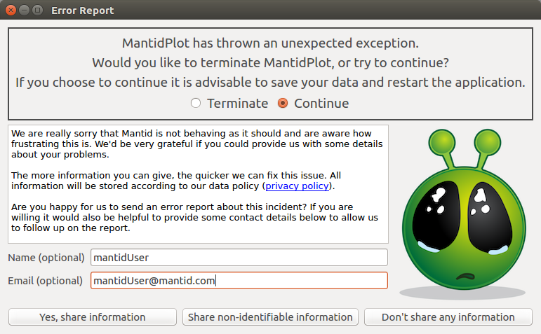

# User Support

```{contents}
:local:
```

## Introduction

As Mantid continues to facilitate cutting-edge scientific research, for
an increasing number of users, the support side of Mantid is growing
more and more important. This can be in many circumstances and through
different avenues; therefore, below is detailed our support procedures.

The main purpose of user support for the Mantid project, is to aide
contact between the users and developers.

<figure>

<figcaption><em>Error reporter sends details directly to Mantid
support</em></figcaption>
</figure>

## Bugs and Error Reports

1.  Users can report bugs via the [Mantid Help
    Forum](https://forum.mantidproject.org/) or the [Mantid Help
    Email](mailto:mantid-help@mantidproject.org), or from collected **Error
    Reports**. Currently this is a quick first contact with the team,
    but doesn't give much detail about the usage or unexpected error.
2.  The bug is verified and reproduced by the support team.
3.  The impact and importance are assessed by the support team member by
    contacting the users, instrument scientists, developers or project
    manager as appropriate.
4.  A GitHub issue to resolve the problem is created if appropriate
    and/or workaround tested if possible.
5.  The user is contacted to give a link to the created issue and/or
    workaround solution, by the support team.
6.  When any issue is completed naming a user, that user is contacted to
    let them know it will be available in the nightly build and next
    release. The gatekeeper that merges the fix should message the
    appropriate developer, to remind them to contact the original
    reporter. This could simply be through adding a comment while
    merging that points this out.

## Troubleshooting

This is a list designed to take a user through how to gain diagnostic
information, particularly when Mantid (Workbench) fails to **launch**.

For performance profiling check out our [recommended
tools](http://developer.mantidproject.org/ToolsOverview.html#profiling).

### Windows

For a full release, `C:\MantidInstall` is likely the correct install
path. Take care to readjust this to `C:\MantidNightlyInstall` if you
are diagnosing a nightly version.

1.  Does the **splash screen** appear? Can get a rough idea how far
    through launch it stops.

2.  Does the **error reporter** appear? Is there a useful stacktrace?
    \[If the errorreport won't send, the user can check with "Show
    Details"\]

3.  Try launching from a command prompt:

    ``` shell
    C:\MantidInstall\bin\MantidWorkbench
    ```

    If this does not work, try launching with:

    ``` shell
    cd C:\MantidInstall\bin
    set QT_PLUGIN_PATH=%CD%\..\plugins\qt5
    set PYTHONPATH=%CD%;%PYTHONPATH%
    python -m workbench.app.main
    ```

4.  Does **Qt** import correctly? In a command prompt / terminal window,
    run the following:

    ``` shell
    C:\MantidInstall\bin\python.exe
    import qtpy.QtCore
    ```

5.  Do **Mantid Algorithms** import correctly?

    ``` shell
    C:\MantidInstall\bin\python.exe
    import mantid.simpleapi
    ```

6.  Turn off **Server Checks**: Open
    `C:\MantidInstall\bin\Mantid.user.properties` in any texteditor, add
    each code line to the end of the file and try to open Workbench
    after each.

    1.  Instrument File : `UpdateInstrumentDefinitions.OnStartup = 0`
    2.  Mantid Version : `CheckMantidVersion.OnStartup = 0`
    3.  Usage Reporting: `usagereports.enabled = 0`
    4.  Project Recovery: `projectRecovery.enabled=false`

7.  Try renaming **Config Files**:

    ``` shell
    cd %APPDATA%\mantidproject
    mv mantidproject.ini mantidproject.ini.backup
    # Try again to start workbench, if that doesn't work ...

    cd %APPDATA%\mantidproject
    mv mantid mantidbackup
    # Try again to start workbench
    ```

**Advanced options:**

8.  Check the PATH for conflicts with Mantid:

    ``` shell
    echo %PATH%
    ```

    ``` shell
    cd C:\MantidInstall\bin\
    python -c "import sys; import os; import pprint; pprint.pprint(sys.path); pprint.pprint(os.environ)"
    ```

9.  Check for conflicts with **numpy**:
    `python -c "import numpy; print(numpy.__file__)"` Anything outside
    of `C:\MantidInstall` could be a problem.

    If there is a local version of Numpy, Matplotlib, Scipy etc.,
    prevent Mantid from looking there, by running:
    `set PYTHONNOUSERSITE=1`

10. Try to open workbench. After it fails, open **Event Viewer** (just
    search in the Windows menu bar) and selected
    `Windows Logs->Application`. Double-click on the relevant error
    line/s and send the crash information to the dev team.

11. **Process Monitor**: [Download
    here](https://docs.microsoft.com/en-us/sysinternals/downloads/procmon).
    Extract the ProcessMonitor.zip and run Procmon.exe (which requires
    admin credentials). Set up a configuration filter for
    `Process Name contains python`, click `ADD`, `APPLY`, `OK` and then
    launch Mantid Workbench, then back in Process Monitor select
    File\>Save and save as a `LogFile.PML` file and send to the dev
    team.

### Linux

For a full release, `/opt/Mantid/` is likely the correct install path.
Take care to readjust this to `/opt/mantidnightly/` if you are
diagnosing a nightly version.

1.  Does the **splash screen** appear? Can get a rough idea how far
    through launch it stops.

2.  Does the **error reporter** appear? Is there a useful stacktrace?
    \[If the errorreport won't send, the user can check with "Show
    Details"\]

3.  Try launching from the terminal:

    ``` shell
    /opt/Mantid/bin/mantidworkbench
    ```

4.  Does **Qt** import correctly? In terminal, run the following:

    ``` shell
    /opt/Mantid/bin/python3
    import qtpy.QtCore
    ```

5.  Do **Mantid Algorithms** import correctly?

    ``` shell
    /opt/Mantid/bin/python3
    import mantid.simpleapi
    ```

6.  Try renaming **Config Files**:

    ``` shell
    cd $HOME/.config/mantidproject
    mv mantidproject.ini mantidproject.ini.backup
    # Try again to start workbench, if that doesn't work ...

    cd $HOME
    mv .mantid .mantidbackup
    # Try again to start workbench
    ```

7.  Turn off **Server Checks**: Open
    `$HOME/.mantid/Mantid.user.properties` in any texteditor, add each
    code line to the end of the file and try to open Workbench after
    each.

    1.  Instrument File : `UpdateInstrumentDefinitions.OnStartup = 0`
    2.  Mantid Version : `CheckMantidVersion.OnStartup = 0`
    3.  Usage Reporting: `usagereports.enabled = 0`
    4.  Project Recovery: `projectRecovery.enabled=false`

**Advanced Options:**

8.  Check the PATH for conflicts with Mantid: e.g. Anything relating to
    `.local` could be a problem.

    ``` shell
    echo $PATH
    ```

    ``` shell
    cd /opt/Mantid/bin/
    python -c "import sys; import os; import pprint; pprint.pprint(sys.path); pprint.pprint(os.environ)"
    ```

9.  Check for conflicts with **numpy**:
    `python -c "import numpy; print(numpy.__file__)"` Anything relating
    to `.local` could be a problem.

    If there is a local version of Numpy, Matplotlib, Scipy etc.,
    prevent Mantid from looking there, by running:
    `export PYTHONNOUSERSITE=1`

10. Check the terminal output for an error
    `Failed to create history session`.

    This can happen if the sqlite database has not been unlocked, e.g.
    from a previous crashed session. To work around this, replace the
    original with a new copy. The warning should give the location of
    the database, e.g. `~/.ipython/profile_default/history.sqlite`.
    Ensure there are no Mantid sessions running, then make a copy of the
    database as follows (replace the path if it is different):

    ``` shell
    cd ~/.ipython/profile_default/
    mv history.sqlite history.sqlite.orig
    cp history.sqlite.orig history.sqlite
    ```

11. Further diagnosis for process monitoring:
    [strace](https://strace.io/).

12. After a hard crash run: `dmesg | grep -i memory` and you may get an
    error log such as `“Out of memory: Killed process”…`

13. To get a stacktrace from C++ follow these steps:

    - Before opening MantidWorkbench, open a terminal and run
      `ulimit -c unlimited`
    - Then in the same terminal, open MantidWorkbench with
      `/opt/mantidworkbench/bin/mantidworkbench` and use as normal.
    - If there is a crash, then you will find a `core.1234` (some
      number) file in the current working directory of the terminal,
      which the user can send to us!
    - Run `gdb python3 core.1234` to get the stacktrace from this
      coredump file.

#### Built-in Help Not Displaying

It has been observed that the built-in help window can display empty
content under some circumstances. If another package has created a
directory in the path `$HOME/.local/share/mime` along with a file
`$HOME/.local/share/mime/packages/user-extension-html.xml` then that
package has registered that it will handle all `.html` files, causing
Mantid help to display a blank page.

The Mantid help can be restored by renaming the `mime` directory:

``` shell
mv ~/.local/share/mime .local/share/mime.orig
```

It is unclear what might break in other applications but nothing as yet
has been observed.

### MacOS

1.  Does the **splash screen** appear? Can get a rough idea how far
    through launch it stops.

2.  Does the **error reporter** appear? Is there a useful stacktrace?
    \[If the errorreport won't send, the user can check with "Show
    Details"\]

3.  Try launching from terminal, by running the following:

    ``` shell
    open --stdout=workbench_bundle.log --stderr=workbench_bundle.log /Applications/MantidWorkbench.app
    ```

    If this does not work, try launching with:

    ``` shell
    cd /Applications/MantidWorkbench.app/Contents/MacOS
    ../Resources/bin/python -m workbench.app.main
    ```

4.  Does **Qt** import correctly?

    ``` shell
    /Applications/MantidWorkbench.app/Contents/Resources/bin/python
    import qtpy.QtCore
    ```

5.  Do **Mantid Algorithms** import correctly?

    ``` shell
    /Applications/MantidWorkbench.app/Contents/Resources/bin/python
    import mantid.simpleapi
    ```

6.  Turn off **Server Checks**: Open
    `$HOME/.mantid/Mantid.user.properties` in any texteditor, add each
    code line to the end of the file and try to open Workbench after
    each.

    1.  Instrument File : `UpdateInstrumentDefinitions.OnStartup = 0`
    2.  Mantid Version : `CheckMantidVersion.OnStartup = 0`
    3.  Usage Reporting: `usagereports.enabled = 0`
    4.  Project Recovery: `projectRecovery.enabled=false`

7.  Try renaming **Config files**:

    ``` shell
    cd $HOME/.config/mantidproject
    mv mantidproject.ini mantidproject.ini.backup
    # Try again to start workbench, if that doesn't work ...

    cd ~
    mv .mantid .mantidbackup
    # Try again to start workbench
    ```

**Advanced Options:**

8.  Check the PATH for conflicts with Mantid: e.g. Anything relating to
    `.local` could be a problem.

    ``` shell
    echo $PATH
    ```

    ``` shell
    cd /Applications/MantidWorkbench.app/Contents/Resources/bin/
    python -c "import sys; import os; import pprint; pprint.pprint(sys.path); pprint.pprint(os.environ)"
    ```

9.  Check for conflicts with **numpy**:
    `python -c "import numpy; print(numpy.__file__)"` Anything relating
    to `.local` could be a problem.

    If there is a local version of Numpy, Matplotlib, Scipy etc.,
    prevent Mantid from looking there, by running:
    `export PYTHONNOUSERSITE=1`

10. Further diagnosis for process monitoring:
    [dtrace](http://dtrace.org/).
