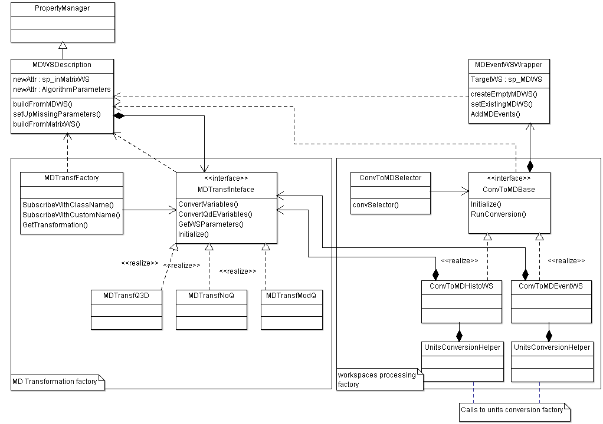

.. _WritingCustomConvertToMDTransformation:

Writing a Custom ConvertToMD Transformation
===========================================

.. contents::
  :local:

Introduction
############

This information is intended for a developer who needs to write a customized
`ConvertToMD class <http://docs.mantidproject.org/nightly/algorithms/ConvertToMD.html>`__ (plugin). The
plugin then becomes automatically available to use in the
`ConvertToMD <http://docs.mantidproject.org/nightly/algorithms/ConvertToMD.html>`__ algorithm and via the
`Create MD workspaces <http://www.mantidproject.org/Create_MD_Workspace_GUI>`__
interface to produce multidimensional workspace for further visualization and analysis.

As the MD transformation factory is similar to the `Dynamic Factory <http://www.mantidproject.org/Dynamic_Factory>`__
used for `converting units <http://docs.mantidproject.org/nightly/concepts/UnitFactory.html>`__, the
procedure of writing a custom ``ConvertToMD`` transformation is very similar to adding a new unit to use
with `ConvertUnits <http://docs.mantidproject.org/nightly/algorithms/ConvertUnits.html>`__ algorithm
or writing a new algorithm to use with Mantid.

The plugin interface deals with the task of converting a generic n-dimensional point of a ``MatrixWorkspace``
into a generic m-dimensional point of an ``MDWorkspace`` using the necessary parameters.

Examples of such transformations could be a conversion of signal and error at detector num
at specific time of flight plus log values for temperature and pressure (**The instrument's
space**: 4 numbers + information about the detector) into 6-D point in the **Physical space
qx,qy,qz,dE,T,P** (qx,qy,qz -- the components of momentum transfer) or into 3-D point in
**Physical space \|Q\|,dE,Fugacity** (\|Q\| - modulus of momentum transfer).

Writing a simple custom plugin
##############################

Summary
-------

If a single point of a ``MatrixWorkspace`` together with correspondent log files can be converted into a single
``MDEvent`` (multidimensional point of MD workspace), a simple custom plugin can be written to do this transformation.
The existing framework in this case deals with all other tasks, namely the iterations over source workspace,
conversion of the workspace units into the units of the conversion formula, defining the target workspace,
constructing ``MDEvent`` instances and adding these events to the ``MDWorkspace``.

A ``ConvertToMD`` plugin implements ``MDTransfInterface``, so to write a plugin you must write a class
which inherits from this interface and register this class with ``MDTransfFactory``. The macro to
register the class with the factory is similar to the macro used to register an algorithm with
Mantid or a ``Unit`` class with the Unit conversion factory. The macro is located in ``MDTransfFactory.h``.

The class inheriting from ``MDTransfInterface`` performs two tasks:

- Define the target ``MDWorkspace`` and its dimensions (both the number of dimensions and the dimension units).

- Initialize the transformation and define a formula to transform a single point of input data into output data.

These two tasks are mainly independent, but implemented within a single class to be handled by the single dynamic factory.
**Note that the functions which define the target MDWorkspace are called before the MDTransfFactory initialize function.**
The ``initialize`` function accepts the ``MDWorkspace`` description and is expected to fully define all class variables used during
the transformation from a point of a ``MatrixWorkspace`` into an MD point of a target ``MDWorkspace``.

Workflow
--------
This workflow is implemented in the ``ConvertToMD`` algorithm's ``exec()`` function.

#. Select a conversion and obtain additional algorithm parameters from the algorithm interface.

#. Build ``MDWorkspace`` description (call ``MDTransfFactory`` and ask for the conversion plugin parameters).

#. Build new ``MDWorkspace`` on the basis of its description (if new workspace is requested or check if existing workspace is suitable).

#. Initialize the conversion plugin (using ``MDWSDescription``).

#. Run the conversion itself by looping over detectors and their values (use ``MDTransfFactory`` and selected conversion plugin to convert
   each input point into output MD point).

The ``MDTransformationFactory`` is deployed twice during the conversion. The methods used during each conversion stage are clearly
specified in ``MDTransformationInterface.h``.

Defining the target workspace
-----------------------------

This describes steps 1-3 of the workflow.

The input data at this stage are the name of the plugin and the outputs -- the information necessary for the transformation to work
including the number of output dimensions, units for the selected physical transformation formula, units of the target workspace, etc.

The methods used while defining the workspace should not access or change anything accessed through this pointer of
the custom plugin. The result of the first stage is a ``MDWSDescription`` class, which can be considered
as a large XML string that provides a common interface to different data obtained from the algorithm's parameters.
Any data users want to transfer to the custom plugin can be added to this class, as long as this does not lead to
excessive memory usage or overhead.

The ``MDWSDescription`` class is copy constructable and assignable and if these operators fail due to the changes
to the class, custom copy constructor and assignment operators have to be defined.

Doing the transformation
------------------------

This describes steps 4-5 of the workflow.

The input data at this stage are points of the "Experimental Space", e.g. coordinates of points in the input workspace and
additional information about these points, e.g. detectors coordinates and log files for values of interest. The output values
are the vectors of the coordinates of the selected points in the space of interest and (possibly) modified/corrected values of
the signal and error at this point.

During the second stage of the transformation, the algorithm calculates the multidimensional coordinates of MD points in the
target workspace, places these coordinates into an MD vector of coordinates and modifies the neutron signal/error if necessary
(e.g. Lorentz corrections). This stage can be best described by the pseudo-code below. It describes performing the conversion
over the whole workspace:

.. code-block:: cpp

    /** initialize all internal variables used for transformation of workspace into MD workspace
      WorkspaceDescription -- the workspace description obtained on the first stage of the transformation */
    plugin->initialize(WorkspaceDescription);
    /** calculate generic variables, which are usually placed in logs and do not depend on detectors positions
       or neutron counts (e.g. temperature) and place these values into proper position in the coordinates vector. */
    if(!plugin->calcGenericVariables(std::vector<coord_t> &Coord, size_t N_Dimensions))
        return; // finish if these data are out of range requested

    for(i in array of detectors)
    {
         /** Here we calculate all MD coordinates which depend on detectors position only. The plugin also
         changes the internal plugin values which depend on detector's position e.g. sets up the unit conversion */
         if(!plugin->calcYDepCoordinates(std::vector<coord_t> &Coord,size_t i))
             continue;  // skip detector if these data are out of range requested

         /** obtain signal and error, array, corresponding to the i-th detector */
         spectra[i] = InputWorkspace->getSpectraCorrespondingToTheDetector(size_t i);

         /**Convert units into the units, requested by the plugin */
         MantidVector X = convertUnits(spectra[i].X_coordinates);
         for(j in spectra[i])
         {
            Signal = spectra[i].Signal[j];
            Error  = spectra[i].Error[j];
            /**Calculate remaining MD coordinates and put them into vector of coordinates.
               Modify Signal and error if the signal and error depends on Coord */
            plugin->calcMatrixCoordinates(const MantidVec& X, size_t i, size_t j,
                                          std::vector<coord_t> &Coord, Signal, Error);

            /**Convert Coord signal and error to MD event with coordinate Coord and add the MDEvent to MD workspace*/
            AddPointToMDWorkspace(Coord,Signal,Error);
         }
    }

PreprocessDetectorsToMD with custom plugins
-------------------------------------------

Unit conversion uses the angular positions and sample-detector distances.
This information is usually expensive to calculate so it is calculated separately by the
`PreprocessDetectorsToMD <http://docs.mantidproject.org/nightly/algorithms/PreprocessDetectorsToMD-v1.html>`__ algorithm.
The detector information can be extracted directly from the input workspace, but consider checking the table workspace
returned by `PreprocessDetectorsToMD <http://docs.mantidproject.org/nightly/algorithms/PreprocessDetectorsToMD-v1.html>`__
and check if the information is already provided there.

`PreprocessDetectorsToMD <http://docs.mantidproject.org/nightly/algorithms/PreprocessDetectorsToMD-v1.html>`__ can also
be modified to add some additional detector information. This information can then be added to the resulting table workspace
and used in the custom plugin.
All currently existing plugins use the information about the detector's positions calculated by
`PreprocessDetectorsToMD <http://docs.mantidproject.org/nightly/algorithms/PreprocessDetectorsToMD-v1.html>`__.

Complex Transformations
#######################

It is possible that the approach of converting a single point of a ``MatrixWorkspace`` into a single ``MDEvent`` is
incorrect or inefficient for what is required. In this situation, more complex changes to the conversion framework
have to be implemented.
To make the changes one needs to understand the interaction between different classes involved in the conversion.

The class diagram with all main classes involved in the conversion is presented below:

Two factories are involved into the conversion. ``MDTransfFactory`` deals with different formulae to
transform a single matrix point into an MD point. The other factory (``ConvToMDSelector`` and the algorithm inheriting
from ``ConvToMDBase``) deal with different kinds of workspaces. There are currently two workspaces that can be transformed
into an ``MDWorkspace``, namely ``EventWorkspace`` and ``MatrixWorkspace``. ``ConvToMDSelector`` identifies which algorithm to
deploy based on the input workspace.

If the input workspace has some special properties (e.g. a workspace obtained for an experiment with a rotating crystal,
which has special units of time of flight with a special time series attached which describe a crystal position),
the ``ConvToMDSelector`` should be modified to identify such a workspace and an additional class inheriting from
``ConvToMDBase`` to deal with such workspaces has to be written.

There are two other important classes in the diagram. The first one is ``MDWSDescription``, briefly mentioned above.
The purpose of this class is to collect all input information from the algorithm interface and transfer this information
through the common interface in a way convenient for a plugin to use. The user who is writing his own plugin is expected to
add all the information necessary for the plugin to work to this class.

Another is the ``MDEventWSWrapper``. This class interfaces ``MDEventWorkspace``. The ``MDEventWorkspace`` is templated by number
of dimensions and the purpose of ``MDEventWSWrapper`` is to provide a unified interface to this workspace regardless of the
number of workspace dimensions calculated during the run. It uses ``MDEventWorkspace`` methods for which the
``IMDWorkspace`` interface to the ``MDEventWorkspace`` is not efficient. You do not usually need to modify this class unless
you are modifying ``MDEventWorkspace`` code.
