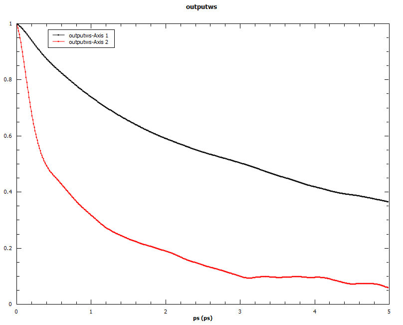

.. algorithm::

.. summary::

.. relatedalgorithms::

.. properties::

Description
------------
Loads a netcdf file generated by nMoldyn containing MMTK format trajectories. The algorithm calculates angular auto-correlations of molecule in the simulation along a user-defined axis. The trajectory file must therefore contain molecule definitions.
The first axis vector is drawn from the average position of atoms of type SpeciesOne to the average position of atoms of type SpeciesTwo. The second axis vector is drawn by extracting the component, orthogonal to the first axis, of the vector connecting the average position of atoms of type SpeciesTwo and an arbitrary atom of type SpeciesThree.

Example
------------
Angular auto-correlations calculated for methyliodide.

Usage
-------

.. code-block:: python

    output_ws, output_ws_ft = AngularCorrelationsTwoAxes(InputFile = 'trajectory_methyliodide.nc',
                                                                                           Timestep = '10.0',
                                                                                           SpeciesOne = 'C',
                                                                                           SpeciesTwo = 'I',
                                                                                           SpeciesThree = 'H')

.. categories::

.. sourcelink::
