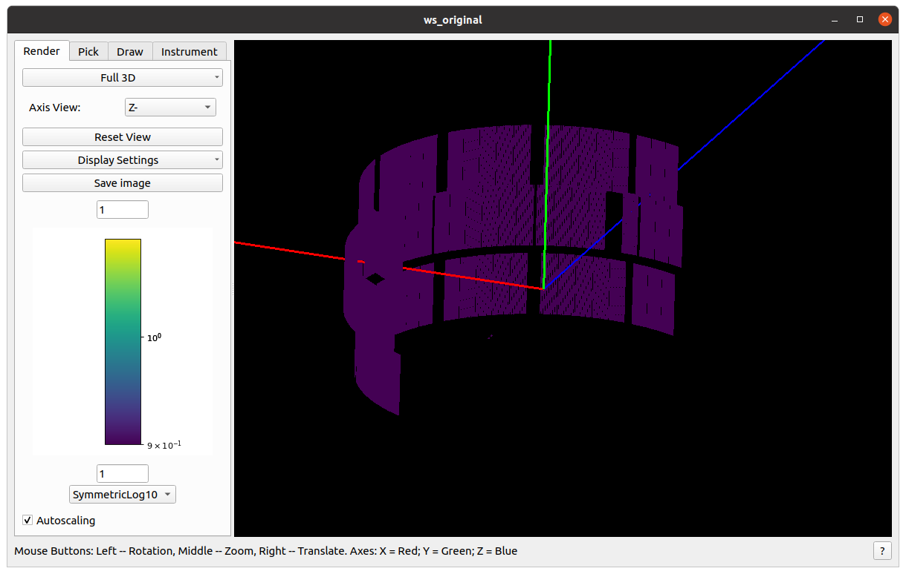
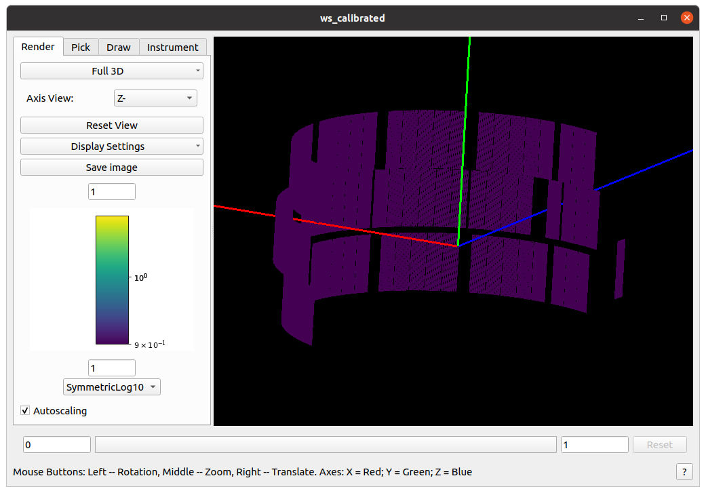

.. algorithm::

.. summary::

.. relatedalgorithms::

.. properties::

Description
-----------

Update the CORELLI instrument geometry with calibration data stored in a predefined calibration table workspace.
The current inputs are:

- Workspace:  EventWorkspace generated from CORELLI instrument
- CalibrationTable: TableWorkspace with predefined layout.

The calibration table must have the following columns

- ComponentName: name of each component in the CORELLI instrument
- Xposition, Yposition, Zposition: these three columns specify the absolute translation in the calibration for each component
- XdirectionCosine, YdirectionCosine, ZdirectionCosine: these three columns specify the rotation axis (direction cosione) for each component
- RotationAngle: the absolute rotation angle in degrees for each component

Applying the calibration involves the following steps:

- translate each component by ``(Xposition, Yposition, Zposition)``
- rotate each component by ``RotationAngle`` degrees around rotation axis ``(directionCosine, YdirectionCosine, ZdirectionCosine)``

Usage
-----

* Example -  move bank42 (perpendicular to x-axis) 180 around y-axis

.. testcode::

    # import mantid algorithms, numpy and matplotlib
    from mantid.simpleapi import *
    import matplotlib.pyplot as plt
    import numpy as np

    # setting up a mocked calibration table
    calitable = CreateEmptyTableWorkspace()

    headers = [
        "ComponentName",
        "Xposition", "Yposition", "Zposition",
        "XdirectionCosine", "YdirectionCosine", "ZdirectionCosine", "RotationAngle",
        ]
    datatypes = ["str"] + ["double"]*7

    for dt, hd in zip(datatypes, headers):
        calitable.addColumn(dt, hd)

    calitable.addRow(["bank42/sixteenpack", 0., 0, 0., 0,1,0,180])  # move to (0,0,0) and rotate to (0,1,0)@180degree

    # load empty instrument
    ws_original = LoadEmptyInstrument("CORELLI_Definition.xml")
    ws_calibrated = ConvertToEventWorkspace(ws_original)

    # apply the calibration to ws
    CorelliCalibrationApply(ws_calibrated, calitable)  # in-place operation

The original instrument view

and the calibrated instrument view (notice one panel is moved to the center and rotate to (0,1,0)@180 degree)

.. categories::

.. sourcelink::
