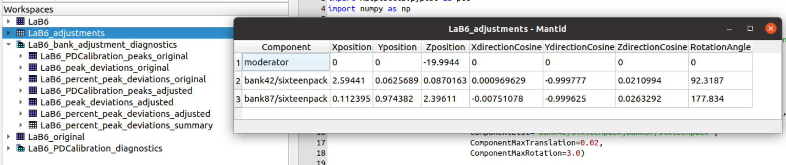
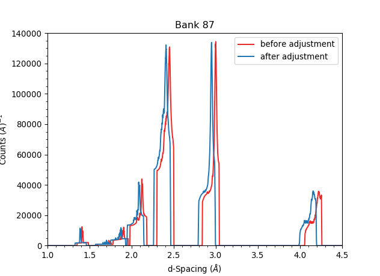
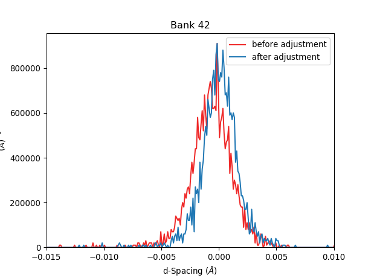
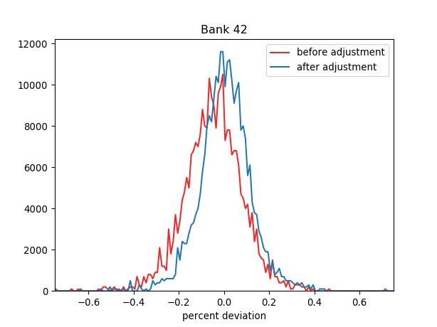
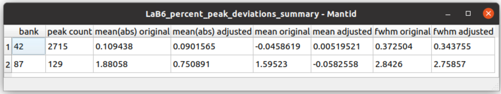

.. algorithm::

.. summary::

.. relatedalgorithms::

.. properties::

Description
-----------

Standard powder samples with Bragg scattering diffraction rings of accurately known lattice spacings
can be used to adjust the position and/or orientation for the components of an instrument (moderator and
detector bank) such that the observed peak intensities yield lattice plane spacings as close as
possible to the standard reference values.

This algorithm adjusts the position of the moderator as well as the position and orientation of each bank
of detector pixels. The goal of these adjustments is to produce neutron paths and scattering angles that lead
to optimal comparison between observed and reference lattice plane spacings

It is recommended *not* to adjust the position of the moderator, but only that of the banks. By setting
all calibrations at a fixed source-to-sample distance, calibrations taken at different times
and with different samples can be combined. the default value (`SourceSampleDistance=20.004`) is
the result of adjusting the position of the moderator with three different samples (Si, LaB6, and CsLaNb2O7).

The execution workflow is as follows:

.. diagram:: CorelliPowderCalibrationCreate-v1_wkflw.dot

Usage
-----

For best results, a tube calibration should be applied to the input event workspace, before attempting to
adjust the position and orientation of each bank.

* Example -  adjust banks 42 and 87

.. code-block:: python

    from mantid.simpleapi import *
    from corelli.calibration import load_calibration_set, apply_calibration
    #
    # Loading the runs for the standard powder sample
    LoadNexus(Filename='/tmp/CORELLI_124036_banks42_87.nxs', OutputWorkspace='LaB6')
    #
    # Apply the tube calibration
    table, mask = load_calibration_set(input_workspace, '/SNS/CORELLI/shared/tube_calibration/', 'table', 'mask')
    apply_calibration('LaB6', table)
    #
    # Adjust the position of the moderator. Adjust the position and orentation of banks 42 and 87
    CorelliPowderCalibrationCreate(InputWorkspace='LaB6',
                                   OutputWorkspacesPrefix='LaB6_',
                                   TubeDatabaseDir='/tmp',
                                   TofBinning=[3000,-0.001,16660],
                                   PeakFunction='Gaussian',
                                   PeakPositions=[1.3143, 1.3854,1.6967, 1.8587, 2.0781, 2.3995, 2.9388, 4.1561],
                                   SourceMaxTranslation=0.1,
                                   ComponentList='bank42/sixteenpack,bank87/sixteenpack',
                                   ComponentMaxTranslation=0.02,
                                   ComponentMaxRotation=3.0)

A set of output workspaces are created, including the adjustment diagnostic workspaces.

All workspaces are prefixed by ``LaB6_``, which is the value we set for option ``OutputWorkspacesPrefix`` when we
invoked the algorithm. A description of the output workspaces follows:

Workspace ``LaB6_adjustments`` is the main result, a table containing adjustments for different instrument components.
In our example, we have adjusted the moderator and banks 42 and 87.

+--------------------+------------+-----------+-----------+------------------+------------------+------------------+---------------+
| ComponentName      | Xposition  | Yposition | Zposition | XdirectionCosine | YdirectionCosine | ZdirectionCosine | RotationAngle |
+====================+============+===========+===========+==================+==================+==================+===============+
| moderator          | 0.0        | 0.0       | -19.9944  |      0.0         |      0.0         |      0.0         |      0.0      |
+--------------------+------------+-----------+-----------+------------------+------------------+------------------+---------------+
| bank42/sixteenpack | 2.5941     | 0.0625    | 0.0870    | 0.0009           | -0.9997          | 0.0210           |       92.3187 |
+--------------------+------------+-----------+-----------+------------------+------------------+------------------+---------------+

- ``Xposition``, ``Yposition``, ``Zposition``: coordinates for the center of ``ComponentName`` in the lab's frame of reference. Units are in Angstroms.
- ``XdirectionCosine``, ``YdirectionCosine``, ``ZdirectionCosine``: direction cosines in the lab's frame of reference. They define a rotation axis to set the orientation of ``ComponentName``.
- ``RotationAngle``: rotate this many degrees around the previous rotation axis to set the orientation of ``ComponentName``.

While ``LaB6_adjustments`` contains absolute position and orientation values, table ``LaB6_displacements`` lists
changes in position and orientation for each Bank, as follows:

- `DeltaR`: change in distance from Component to Sample (in mili-meter)
- `DeltaX`: change in X-coordinate of Component (in mili-meter)
- `DeltaY`: change in Y-coordinate of Component (in mili-meter)
- `DeltaZ`: change in Z-coordinate of Component (in mili-meter)
- `DeltaAlpha`: change in rotation around the Y-axis (in degrees)
- `DeltaBeta`: change in rotation around the X-axis (in degrees)
- `DeltaGamma`: change in rotation around the Z-axis (in degrees)

Option `FixY=True` will result in `DeltaY=0` for all banks. Similarly, option `FixYaw=True` will result in
`DeltaGamma=0` for all banks.

The diagnostics workspaces are stored within ``WorkspaceGroup LaB6_bank_adjustment_diagnostics``. These are:

- ``LaB6_PDCalibration_peaks_original`` and ``LaB6_PDCalibration_peaks_adjustments`` contains one fitted-intensity spectrum per bank versus ``d-spacing`` before and after the banks are adjusted.

As one can see, intensity is displayed only in the neighborhood of those values of `d-spacing` where peaks are found.
In addition, we don't show the raw intensity, but we substitute each raw peak with a Gaussian fit of the peak.
This substitution takes place on every pixel of the bank. Later, we add up all these fitted-intensity peaks for all
pixels within one bank.

- ``LaB6_peak_deviations_original`` and ``LaB6_peak_deviations_adjustment`` finds for each peak the difference between the peak center and the reference d-spacing value we know from the standard. These peak center deviations are collected for all peaks found in the pixels of the bank, and then histogrammed.

Adjusting the bank removes any observed systemic deviation, thus centering the histogram around the
no-deviation value. The FHWM of these histograms is only modestly reduced, indicating that the remaining
observed deviations are not due to misalignment in the position and orientation of the bank.

- ``LaB6_percent_peak_deviations_original`` and ``LaB6_percent_peak_deviations_adjustment`` histograms the unitless peak center deviations, this achieved dividing each deviation by its reference d-spacing, i.e. :math:`\frac{d_{observed} - d_{reference}}{d_{reference}}`. This largely eliminates the scaling of the peak center deviation with the value of the peak center.

Adjusting the bank removes the previously observed systemic deviation and modestly reduces the FWHM of the histogram.

- ``LaB6_percent_peak_deviations_summary`` presents basics statistics for the histograms of ``LaB6_percent_peak_deviations_original`` and ``LaB6_percent_peak_deviations_adjustment``, namely the average and FWHM of each histogram, as well as the average of the absolute value of the deviations.

From the picture, peaks in bank87 deviated from their reference value between :math:`mean - FWHM \simeq -1\%` and
:math:`mean + FWHM \simeq +4.5\%` before adjustment. After adjustment the peaks deviated between :math:`-2\%` and
:math:`+2\%`

.. categories::

.. sourcelink::
