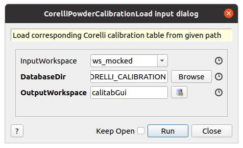

.. algorithm::

.. summary::

.. relatedalgorithms::

.. properties::

Description
-----------

Load a Corelli calibration table that is located in a given database directory or the default location.
The selection of the database file (csv) is determined by the starting time stamp inside the given InputWorkspace.
The database files are assumed to be generated with ``CorelliPowderCalibrationDatabase``.

Usage
-----

Example - Load a example database (not provided here)

.. code-block:: python

    # import mantid algorithms, numpy and matplotlib
    from mantid.simpleapi import *
    import matplotlib.pyplot as plt
    import numpy as np

    # generate a mock Corelli workspace
    ws_raw = LoadEmptyInstrument("CORELLI_Definition.xml")
    ws_mocked = ConvertToEventWorkspace(ws_raw)
    ws_mocked.run().addProperty("start_time", "2020-11-22T12:57:17", True)

    # 1_method: call the function directly
    CorelliPowderCalibrationLoad(
        InputWorkspace='ws_mocked', 
        DatabaseDir='/tmp',
        OutputWorkspace='caliTable1')

    # 2_method: call the function and return the Calibration Table to a Python handle
    caliTable2 = CorelliPowderCalibrationLoad(InputWorkspace='ws_mocked', DatabaseDir='/tmp')

    # 3_method
    # Launch the GUI (see attached screenshot)

The corresponding GUI is

.. categories::

.. sourcelink::