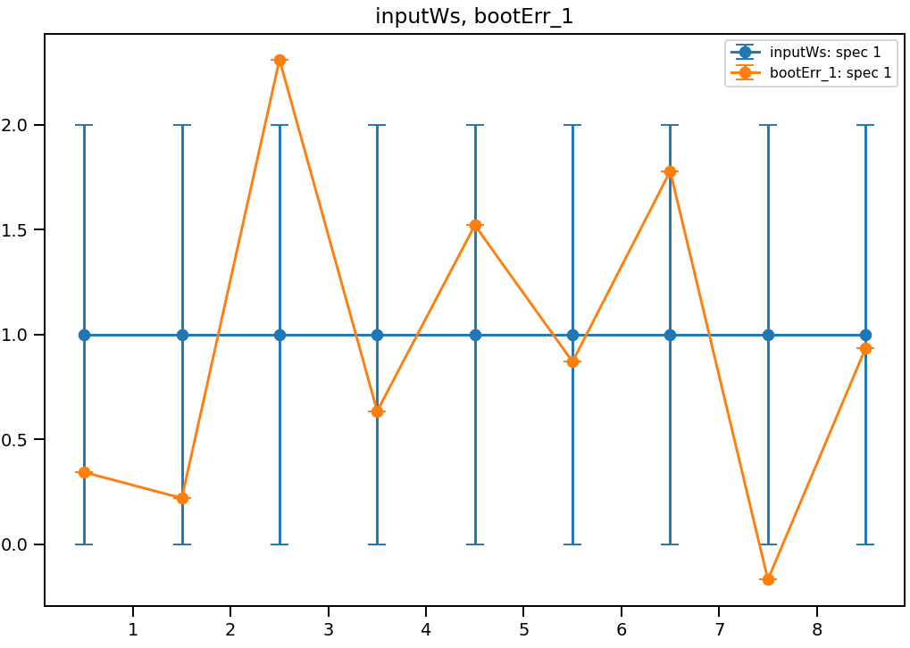
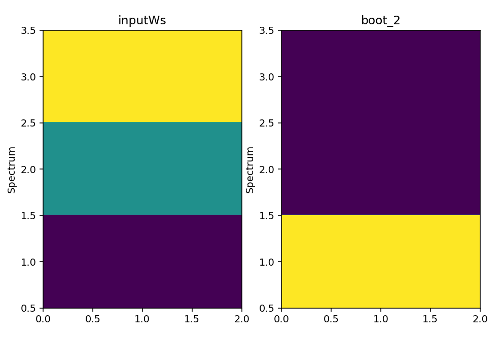

.. algorithm::

.. summary::

.. relatedalgorithms::

.. properties::

Description
-----------
The algorithm generates simulated workspaces by randomly sampling from the input workspace.
Meant to be used for creating many workspaces that are randomly simulated from the starting workspace, for performing the Bootstrap technique.
Bootstrap works by running a single routine or procedure on the many simulated replicas and then comparing the statistical deviation of the results at the end.
The Bootstrap replicas can be generated in two ways:

   * ``BootstrapType=ErrorSampling``: This type of sampling changes the value of each Y data point by randomly sampling from a normal distribution with the mean at Y and deviation of the error at that datapoint, i.e. ``newDataY = Gaussian(originalDataY, originalDataE)``. This means that data from one spectrum does not have any influence on the data from another spectrum, as the sampling is done point by point.
   * ``BootstrapType=SpectraSampling``: This type of sampling does not change the data on each spectra but instead samples the spectrum numbers with repetition. This means that each row of the workspace is equal to an original row picked at random from the input workspace. In practice, this means that each spectra is calculated as ``boot_sample_ws.dataY(index) = input_ws.dataY(Uniform[0, numberOfHistograms])``. This kind of bootstrap replicas might make sense when the input workspace is averaged as part of the routine you're trying to investigate.

Usage
-----

**Example - CreateBootstrapWorkspaces**

.. testcode:: Create bootstrap replicas with error sampling

   # import mantid algorithms, numpy and matplotlib
   from mantid.simpleapi import *
   import matplotlib.pyplot as plt
   import numpy as np

   dataX = [0,1,2,3,4,5,6,7,8,9] # or use dataX=range(0,10)
   dataY = [1,1,1,1,1,1,1,1,1] # or use dataY=[1]*9
   dataE = [1,1,1,1,1,1,1,1,1] # or use dataY=[1]*9
   inputWs = CreateWorkspace(dataX, dataY, dataE)

   CreateBootstrapWorkspaces(
      InputWorkspace=inputWs,
      Seed=32,
      NumberOfReplicas=10,
      BootstrapType="ErrorSampling",
      OutputWorkspaceGroup="bootErr"
   )

   plotSpectrum(["inputWs", "bootErr_1"], indices=0, error_bars=True)

.. testcode:: Create bootstrap replicas with spectra sampling

   from mantid.simpleapi import *
   import matplotlib.pyplot as plt
   import numpy as np

   dataX = [0,1,2,0,1,2,0,1,2] # or use dataX=range(0,10)
   dataY = [1,1,1,2,2,2,3,3,3] # or use dataY=[1]*9
   dataE = [1,1,1,1,1,1,1,1,1] # or use dataY=[1]*9
   inputWs = CreateWorkspace(dataX, dataY, dataE, NSpec=3)

   CreateBootstrapWorkspaces(
       InputWorkspace=inputWs,
       Seed=32,
       NumberOfReplicas=10,
       BootstrapType="SpectraSampling",
       OutputWorkspaceGroup="bootSpectra"
   )

   fig, axes = plt.subplots(nrows=1, ncols=2, subplot_kw={'projection':'mantid'})
   axes[0].imshow(inputWs, origin = 'lower', cmap='viridis', aspect='auto')
   axes[0].set_title("inputWs")
   axes[1].imshow(mtd["bootSpectra_2"], origin = 'lower', cmap='viridis', aspect='auto')
   axes[1].set_title("bootSpectra_2")
   # fig.show()

.. note::
   In the case of spectra sampling, the sampling is done with repetition, meaning that an original spectra might be selected multiple times in the bootstrap replica. You can see this behaviour in the previous image.

.. categories::

.. sourcelink::
