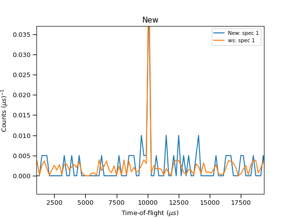

.. algorithm::

.. summary::

.. relatedalgorithms::

.. properties::

Description
-----------
The algorithm generates a simulated workspace by sampling from the probability
distribution of input data, useful for testing of fitting functions and modeling.
By generating a simulated dataset that mirrors the probability
distribution of existing data.

Usage
-----

**Example - CreateMonteCarloWorkspace**

.. testcode:: Create simulation and compare

    from mantid.simpleapi import *
    from mantid.api import AnalysisDataService as ADS
    import matplotlib.pyplot as plt

    # Create Sample Workspace and Run Simulation
    ws = CreateSampleWorkspace(Random= True)
    wsOut = CreateMonteCarloWorkspace(InputWorkspace= 'ws', Seed= 32, OutputWorkspace= "New")

    # Plot both of the above
    fig, axes = plt.subplots(edgecolor='#ffffff', num='New', subplot_kw={'projection': 'mantid'})
    for data, color, label in [(ADS.retrieve('New'), '#1f77b4', 'New: spec 1'),
                               (ADS.retrieve('ws'), '#ff7f0e', 'ws: spec 1')]:
        axes.plot(data, color=color, label=label, wkspIndex=0)

    axes.tick_params(axis='both', which='major', size=6, tickdir='out', width=1, gridOn=False, label1On=True)
    axes.set(title='New', xlabel='Time-of-flight ($\\mu s$)', ylabel='Counts ($\\mu s$)$^{-1}$', ylim=[-0.00225, 0.04725])
    axes.legend(fontsize=8.0).set_draggable(True)

    fig.show()

Output:
    A histogram similar to the original but generated in a random way.

.. categories::

.. sourcelink::
