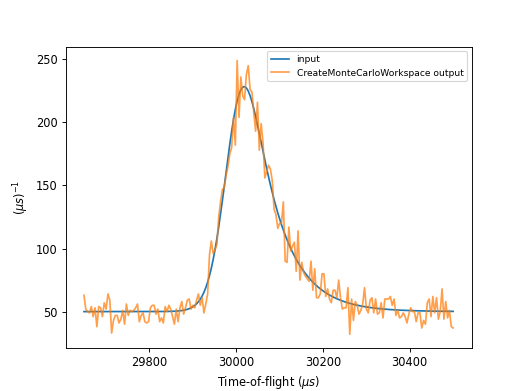

.. algorithm::

.. summary::

.. relatedalgorithms::

.. properties::

Description
-----------
The algorithm generates a simulated workspace by sampling from the probability
distribution of input data, useful for testing of fitting functions and modeling.

Usage
-----

**Example - CreateMonteCarloWorkspace**

.. testcode:: Create simulation and compare

    # import mantid algorithms, numpy and matplotlib
    from mantid.simpleapi import *
    import matplotlib.pyplot as plt
    import numpy as np
    from mantid.api import FunctionFactory

    func = FunctionWrapper(FunctionFactory.createInitialized("name=BackToBackExponential,I=25000,A=0.06,B=0.015,X0=30000,S=30;name=FlatBackground,A0=50"))
    # create input workspace
    x = np.linspace(29650.0, 30500.0, 201)
    y = func(x)
    e = np.sqrt(y)
    ws = CreateWorkspace(DataX=x, DataY=y, DataE=e, UnitX="TOF")
    # call algorithm
    ws_mc = CreateMonteCarloWorkspace(InputWorkspace=ws, Seed=0)

    fig, axes = plt.subplots(subplot_kw={'projection': 'mantid'})
    axes.plot(ws, label='input', wkspIndex=0)
    axes.plot(ws_mc, label='CreateMonteCarloWorkspace output', wkspIndex=0, alpha=0.75)
    legend = axes.legend(fontsize=8.0).set_draggable(True).legend
    fig.show()

.. categories::

.. sourcelink::
