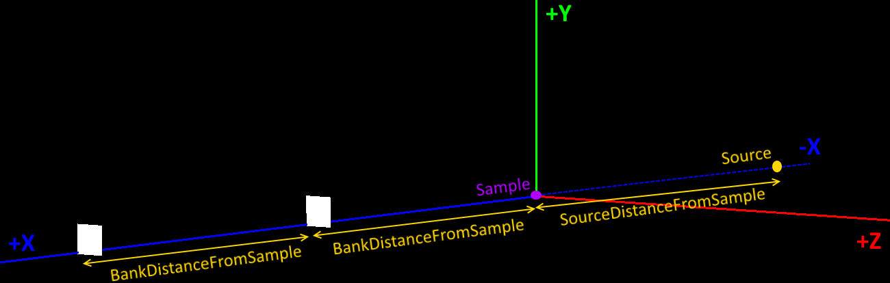

.. algorithm::

.. summary::

.. relatedalgorithms::

.. properties::

Description
-----------

Creates sample workspaces for usage examples and other situations.

You can select a predefined function for the data or enter your own by selecting
User Defined in the drop down.

The data will be the same for each spectrum, and is defined by the function
selected, and a little noise if Random is selected. All values are taken
converted to absolute values at present so negative values will become positive.
For event workspaces the intensity of the graph will be affected by the number
of events selected.

Here is an example of a user defined formula containing two peaks and a
background.::

	"name=LinearBackground, A0=0.5;
	name=Gaussian, PeakCentre=10000, Height=50, Sigma=0.5;
	name=Gaussian, PeakCentre=1000, Height=80, Sigma=0.5"

Random also affects the distribution of events within bins for event
workspaces. If Random is selected the results will differ between runs
of the algorithm and will not be comparable. If comparing the output is
important set Random to false or uncheck the box.

.. note::
  For the Quasielastic and Quasielastic Tunnelling presets the XMin and XMax
  values should be set to a range symmetrical around x=0.

Instrument
##########

The instrument created by CreateSample workspace is very simple and looks like
this.

The sample is placed at the origin.  The source is separated from the sample in
the negative direction by the value you specify in "SourceDistanceFromSample".
The instrument has "NumBanks" detector banks, each bank is moved down the Z axis
by "BankDistanceFromSample" from the sample or the previous bank.

Each bank is a square rectangular bank comprising of "BankPixelWidth" pixels in
width and height.  The size of each pixel 4mm square, but additional padding can
be set using "PixelSpacing".

If "NumMonitors" is also given the first monitor is created half-way between the
sample and the first bank, then between each bank (or where the banks would be
if "NumMonitors" > "NumBanks").

If "NumScanPoints" > 1 then a scanning workspace is created, that is one with time
indexed positions and rotations. The scan is set up such that for each scan point
all the detectors are rotated by 1 degree around the sample.

The following algorithm properties belong to a property group called "Instrument",
and appear in the following order:
NumMonitors
BankDistanceFromSample
SourceDistanceFromSample
NumBanks
BankPixelWidth
PixelWidth
PixelSpacing

Usage
-----

**Example - create a simple histogram workspace:**

.. testcode:: ExHistSimple

   # create histogram workspace
   ws = CreateSampleWorkspace()

   print("Number of spectra: {}".format(ws.getNumberHistograms()))
   print("Number of bins: {}".format(ws.blocksize()))
   print("Each spectra has a level background of {} counts and a peak in the centre of {} counts.".format(ws.readY(0)[0], ws.readY(0)[50]))

Output:

.. testoutput:: ExHistSimple

   Number of spectra: 200
   Number of bins: 100
   Each spectra has a level background of 0.3 counts and a peak in the centre of 10.3 counts.

**Example - create a simple event workspace:**

.. testcode:: ExEventSimple

   # create event workspace
   ws = CreateSampleWorkspace("Event")

   print("Number of spectra: {}".format(ws.getNumberHistograms()))
   print("Number of bins: {}".format(ws.blocksize()))
   print("Number of events: {}".format(ws.getNumberEvents()))
   print("Event Workspaces come with bins set by default to a bin width of {}".format(ws.readX(0)[1]-ws.readX(0)[0]))
   #The data itensity of an EventWorkspce is scaled by the number of events used, so the values differ from the histogram above.
   print("Each spectra has a level background of {} counts and a peak in the centre of {} counts.".format(ws.readY(0)[0], ws.readY(0)[50]))

Output:

.. testoutput:: ExEventSimple

   Number of spectra: 200
   Number of bins: 100
   Number of events: 190000
   Event Workspaces come with bins set by default to a bin width of 200.0
   Each spectra has a level background of 7.0 counts and a peak in the centre of 257.0 counts.

**Example - Using the preset functions:**

.. testcode:: ExHistPresets

   # create a workspace with Flat Background
   wsFlat = CreateSampleWorkspace("Histogram","Flat background")
   print("Flat background has a constant value of {} counts.".format(wsFlat.readY(0)[0]))

   # create a workspace with multiple peaks
   wsMulti = CreateSampleWorkspace("Histogram","Multiple Peaks")
   print("Multiple Peaks has a level background of {} counts and two gaussian peaks, the largest of which is {} counts.".
         format(wsMulti.readY(0)[0], wsMulti.readY(0)[60]))

   # create a workspace with Exponential Decay
   wsExp = CreateSampleWorkspace("Histogram","Exp Decay")
   print("Exp Decay starts high and drops rapidly to {:.2f} counts at 8,000 us (with the default binning).".format(wsExp.readY(0)[40]))

Output:

.. testoutput:: ExHistPresets

   Flat background has a constant value of 1.0 counts.
   Multiple Peaks has a level background of 0.3 counts and two gaussian peaks, the largest of which is 8.3 counts.
   Exp Decay starts high and drops rapidly to 0.03 counts at 8,000 us (with the default binning).

**Example - Using the your own function:**

.. testcode:: ExHistUserFunc

   # create a workspace with data defined using the function string below
   myFunc = "name=LinearBackground, A0=0.5;name=Gaussian, PeakCentre=10100, Height=50, Sigma=0.5;name=Gaussian, PeakCentre=1100, Height=80, Sigma=0.5"

   ws = CreateSampleWorkspace("Histogram","User Defined",myFunc)

   print("My function defined a background of {} counts.".format(ws.readY(0)[0]))
   print("With a peak reaching {} counts at 1,100 us,".format(ws.readY(0)[5]))
   print("and another reaching {} counts at 10,100 us.".format(ws.readY(0)[50]))

Output:

.. testoutput:: ExHistUserFunc

   My function defined a background of 0.5 counts.
   With a peak reaching ... counts at 1,100 us,
   and another reaching ... counts at 10,100 us.

**Example - Quasielastic:**

.. testcode:: ExQuasielastic

   ws=CreateSampleWorkspace(Function="Quasielastic",
                            XUnit="DeltaE",
                            XMin=-0.5,
                            XMax=0.5,
                            BinWidth=0.01)

   print("Number of spectra: {}".format(ws.getNumberHistograms()))
   print("Number of bins: {}".format(ws.blocksize()))

Output:

.. testoutput:: ExQuasielastic

   Number of spectra: ...
   Number of bins: ...

**Example - Setting every Option:**

.. testcode:: ExEveryOption

   #Random adds a little random noise to the data function
   ws=CreateSampleWorkspace(WorkspaceType="Event",Function="One Peak",NumBanks=4,NumMonitors=3,BankPixelWidth=5,NumEvents=500,Random=True,XUnit="tof",XMin=0, XMax=8000, BinWidth=100)

   print("Number of spectra: {}".format(ws.getNumberHistograms()))
   print("Number of bins: {}".format(ws.blocksize()))

Output:

.. testoutput:: ExEveryOption

   Number of spectra: ...
   Number of bins: ...

.. categories::

.. sourcelink::
