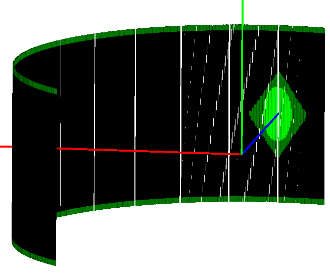

.. algorithm::

.. summary::

.. relatedalgorithms::

.. properties::

Description
-----------

This algorithm performs detector diagnostics and masking. It is part of :ref:`ILL's direct geometry data reduction suite <DirectILL>`. The diagnostics are calculated using the counts from *InputWorkspace* which is preferably the raw workspace provided by the *OutputRawWorkspace* property of :ref:`DirectILLCollectData <algm-DirectILLCollectData>`. The output is a special mask workspace which can be further fed to :ref:`DirectILLReduction <algm-DirectILLReduction>` to mask the detectors diagnosed as bad. Optionally, an instrument specific default mask, a beam stop mask and/or a user specified hard mask given by *MaskedDetectors* or *MaskedComponents* can be added to the diagnostics mask.

A workflow diagram for the diagnostics is shown below:

.. diagram:: DirectILLDiagnostics-v1_wkflw.dot

Diagnostics performed
#####################

The algorithm performs two tests for each spectrum in *InputWorkspace*: elastic peak diagnostics and flat background diagnostics. Basically both tests calculate the median of the test values over all spectra, then compare the individual values to the median. For more detailed information, see :ref:`MedianDetectorTest <algm-MedianDetectorTest>`.

Elastic peak diagnostics
^^^^^^^^^^^^^^^^^^^^^^^^

The EPP table given in *EPPWorkspace* and the value of *ElasticPeakWidthInSigmas* are used to integrate the spectra around the elastic peaks, giving the elastic intensities. The intensities are further normalised by the opening solid angles of the detectors, given by :ref:`SolidAngle <algm-SolidAngle>` before the actual diagnostics.

Flat background diagnostics
^^^^^^^^^^^^^^^^^^^^^^^^^^^

Similarly to elastic peak diagnostics, *EPPWorkspace* and *NonBgkRegionInSigmas* are used to integrate the time-independent background regions of *InputWorkspace*. *NonBkgRegionInSigmas* is a factor applied to the 'Sigma' column in *EPPWorkspace* and this interval around the elastic peak positions is excluded from the integration. No opening angle corrections are applied to the background diagnostics.

Beam stop
#########

The shadow cast on the detectors by a beam stop can be masked by the diagnostics, as well. This functionality is automatically enabled when 'beam_stop_diagnostics_spectra' instrument parameter is defined and can be disabled by *BeamStopDiagnostics*. The algorithm tries to mask a continuous region within the spectra listed in 'beam_stop_diagnostics_spectra'. The *BeamStopThreshold* property can be used to fine-tune the operation.

The 'beam_stop_diagnostics_spectra' instrument parameter lists ranges of spectrum numbers. Each range should cover a region of a physical detector tube, part of which is behind the beam stop.

The masking procedure proceeds as follows:

#. Pick a range from 'beam_stop_diagnostics_spectra'.
#. Integrate the spectra within the range.
#. Divide the range into two halves from the middle.
#. Pick one of the halves, take the maximum integrated value.
#. Starting from the spectrum containing the maximum value, and stepping towards the center of the range, find the first spectrum where the integrated intensity is less than the maximum intensity multiplied by *BeamStopThreshold*. Lets call this the threshold spectrum.
#. Mark all spectra from the middle of the range to the threshold spectrum as masked.
#. Repeat for the other half.

Default mask
############

The default mask file is defined by the 'Workflow.MaskFile' instrument parameter.

Currently, there is a default mask available for ILL's IN5 and PANTHER instruments.

Diagnostics reporting
#####################

The optional *OutputReportWorkspace* property returns a table workspace summarizing the diagnostics. The table has six columns:

#. 'WorkspaceIndex'
#. 'UserMask': Holds non-zero values for spectra masked by the default mask, *MaskedDetectors* and *MaskedComponents*.
#. 'ElasticIntensity': Holds the value of integrated elastic peaks used for the diagnostics.
#. 'IntensityDiagnosed': Holds non-zero values for spectra diagnosed as 'bad' in elastic peak diagnostics.
#. 'FlagBkg': Holds the value of the flat backgrounds used for the diagnostics.
#. 'FlatBkgDiagnosed': Non-zero values in this column indicate that the spectrum did not pass the background diagnostics.

The columns can be plotted to get an overview of the diagnostics.

Additionally, a string listing the masked and diagnosed detectors can be accessed via the *OutputReport* property.

Defaults and ILL's instrument specific values
---------------------------------------------

The following settings are used when not explicitly overwritten by the algorithm's properties or the IPFs of non-ILL instruments:

+---------------------------+---------------------------+--------------------------+---------------------------+--------------------------+---------------------------+
| Property                  | IN4                       | IN5                      | IN6                       | PANTHER                  | Default                   |
+===========================+===========================+==========================+===========================+==========================+===========================+
| ElasticPeakDiagnostics    | Peak Diagnostics ON       | Peak Diagnostics OFF     | Peak Diagnostics ON       | Peak Diagnostics OFF     | Peak Diagnostics ON       |
+---------------------------+---------------------------+--------------------------+---------------------------+--------------------------+---------------------------+
| ElasticPeakLowThreshold   | 0.1                       | 0.1                      | 0.45                      | 0.1                      | 0.1                       |
+---------------------------+---------------------------+--------------------------+---------------------------+--------------------------+---------------------------+
| ElasticPeakHighThreshold  | 3.0                       | 3.0                      | 3.0                       | 3.0                      | 3.0                       |
+---------------------------+---------------------------+--------------------------+---------------------------+--------------------------+---------------------------+
| ElasticPeakErrorThreshold | 3.3                       | 3.3                      | 3.3                       | 3.3                      | 3.3                       |
+---------------------------+---------------------------+--------------------------+---------------------------+--------------------------+---------------------------+
| BkgDiagnostics            | Bkg Diagnostics ON        | Bkg Diagnostics OFF      | Bkg Diagnostics ON        | Bkg Diagnostics OFF      | Bkg Diagnostics ON        |
+---------------------------+---------------------------+--------------------------+---------------------------+--------------------------+---------------------------+
| NoisyLowThreshold         | 0.1                       | 0.1                      | 0.1                       | 0.1                      | 0.1                       |
+---------------------------+---------------------------+--------------------------+---------------------------+--------------------------+---------------------------+
| NoisyBkgHighThreshold     | 3.3                       | 3.3                      | 3.3                       | 3.3                      | 3.3                       |
+---------------------------+---------------------------+--------------------------+---------------------------+--------------------------+---------------------------+
| NoisyBkgErrorThreshold    | 3.3                       | 3.3                      | 3.3                       | 3.3                      | 3.3                       |
+---------------------------+---------------------------+--------------------------+---------------------------+--------------------------+---------------------------+
| BeamStopDiagnostics       | Beam Stop Diagnostics OFF | Beam Stop Diagnostics ON | Beam Stop Diagnostics OFF | Beam Stop Diagnostics ON | Beam Stop Diagnostics OFF |
+---------------------------+---------------------------+--------------------------+---------------------------+--------------------------+---------------------------+

Usage
-----

For usage of this algorithm as part of the direct geometry data reduction, check the examples :ref:`here <DirectILL>`.

.. include:: ../usagedata-note.txt

**Example - Diagnostics on IN4 workspace**

.. testsetup:: IN4Example

    config['default.facility'] = 'ILL'
    config['default.instrument'] = 'IN4'

.. testcode:: IN4Example

    DirectILLCollectData(
        Run='ILL/IN4/087283-087290.nxs',
        OutputWorkspace='preprocessed',
        OutputRawWorkspace='raw',  # Needed for the diagnostics
        OutputEPPWorkspace='epps'  # Needed for the diagnostics
    )
    
    diagnostics = DirectILLDiagnostics(
        InputWorkspace='raw',  # Use 'raw' rather than 'preprocessed' for background diagnostics
        OutputWorkspace='mask',  # A special MaskWorkspace
        EPPWorkspace='epps',
        MaskedComponents='rosace',
        OutputReportWorkspace='diagnostics_report'
    )
    print(diagnostics.OutputReport)

Output:

.. testoutput:: IN4Example

    Spectra masked by default mask file:
    None
    Spectra masked by beam stop diagnostics:
    None
    Additional spectra marked as bad by elastic peak diagnostics:
    13, 40, 51, 64, 72-73, 78-79, 81-83, 100-101, 139, 150-151, 165, 173, 180-181, 183-184, 213, 239-240, 264, 272-273, 278-279, 281-283, 300-308, 313-320, 325-331, 337-344, 348-354, 361-366, 373-376, 378, 385-391
    Additional spectra marked as bad by flat background diagnostics:
    13, 100-101, 132, 213, 300-309, 313-319, 321, 325-331, 337-343, 345, 348-357, 361-367, 373-378, 381, 385-391

**Example - Default and beam stop masks on IN5 workspace**

.. testsetup:: IN5Example

    config['default.facility'] = 'ILL'
    config['default.instrument'] = 'IN4'

.. testcode:: IN5Example

    # On IN5 we don't usually diagnose the pixels, but apply
    # a hark mask + beam stop mask.
    DirectILLCollectData(
        Run='ILL/IN5/104007.nxs',
        OutputWorkspace='preprocessed',
    )
    DirectILLDiagnostics(
        InputWorkspace='preprocessed',  # Any IN5 workspace goes, doesn't have to be 'raw'
        OutputWorkspace='mask',  # A special MaskWorkspace
        OutputReportWorkspace='report'
    )
    # Read some data from the report table workspace
    report = mtd['report']
    default_column = report.column('DefaultMask')
    beam_stop_column = report.column('BeamStopMask')
    print('Total number of pixels masked by default mask: {}'.format(int(sum(default_column))))
    print('Total number of pixels masked under beam stop: {}'.format(int(sum(beam_stop_column))))

.. testoutput:: IN5Example

    Total number of pixels masked by default mask: 7261
    Total number of pixels masked under beam stop: 2457

The figure below shows the mask produced by the IN5 example script above. The green pixels show the default hard mask and the beam stop.

.. categories::

.. sourcelink::
