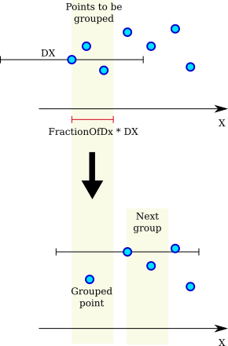

.. algorithm::

.. summary::

.. relatedalgorithms::

.. properties::

Description
-----------

This algorithm groups the points of a single histogram workspace according to the X resolution stored in the DX array.

The figure below shows schematically how the grouping procedure proceeds.

#. Select first ungrouped point :math:`i`. The X resolution (DX) for this point is :math:`D_{i}`.
#. Calculate grouping width :math:`w_{i} =` ``FractionOfDx`` * :math:`D_{i}`.
#. Select ungrouped points within :math:`w_{i}` from point :math:`i`.
#. Calculate the average X, average Y, and the square root of the averaged squared sums of E of the selected points.
#. Calculate new resolution :math:`D^{\circ} = \sqrt{D_{i}^{2} + (0.68 \Delta X)^{2}}` where :math:`\Delta X` is span of the X values of the selected points.
#. Replace the selected points with a single grouped point.
#. Return to 1.

Usage
-----

**Example - Grouping points to X resolution**

.. plot::
   :include-source:

   from mantid.simpleapi import CreateWorkspace, DeleteWorkspaces, GroupToXResolution
   import matplotlib.pyplot as plt
   import numpy as np
   # Create a workspace with exponential decay.
   Xs = np.arange(0.01, 5., 0.01)
   Ys = np.exp(-Xs)
   # A clumsy way for filling a numpy array.
   # Numpy version > 1.7 would support 'DXs = full_like(Ys, 1.)'
   DXs = np.empty_like(Ys)
   DXs.fill(1.)
   original = CreateWorkspace(Xs, Ys, Dx=DXs, NSpec=1)
   grouped = GroupToXResolution(original)
   # Plot side-by-side comparison.
   fig, (left, right) = plt.subplots(ncols=2, subplot_kw={'projection':'mantid'})
   left.errorbar(original, linestyle='-')
   left.set_title('Original')
   right.errorbar(grouped, linestyle='-')
   right.set_title('Grouped')
   # Uncomment the next line to show the plot window.
   #fig.show()
   DeleteWorkspaces(['original', 'grouped'])

.. categories::

.. sourcelink::
