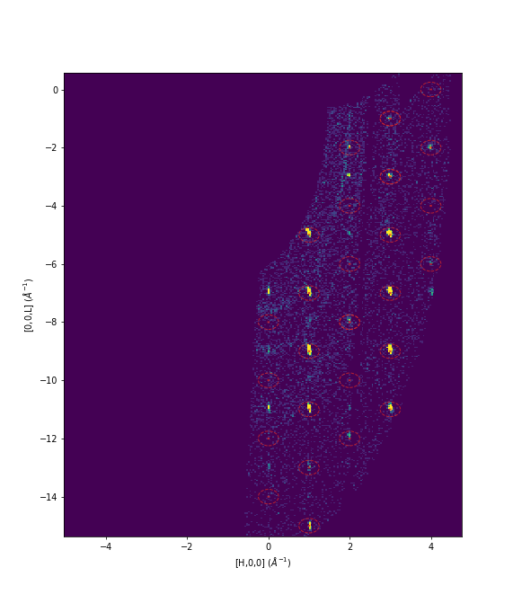

.. algorithm::

.. summary::

.. relatedalgorithms::

.. properties::

Description
-----------

Uses a :ref:`MDEventWorkspace <MDWorkspace>` and `PeaksWorkspace` to integrate the peaks provided in the peaks
workspace. A :ref:`LorentzCorrection <algm-LorentzCorrection>` can be optionally applied to the integrated peaks with
the `ApplyLorentz` option.

The output peaks workspace can be written to `OutputFile` in either SHELX format with direction cosines using
:ref:`SaveHKL <algm-SaveHKL>` or in the Fullprof format using :ref:`SaveReflections <algm-SaveReflections>`.

The input to this algorithm is intended as part of the DEMAND data
reduction workflow, using :ref:`HB3AAdjustSampleNorm
<algm-HB3AAdjustSampleNorm>` and :ref:`HB3AFindPeaks
<algm-HB3AFindPeaks>` or :ref:`HB3APredictPeaks <algm-HB3APredictPeaks>`
which can be seen below in the example usage.

You can make use of :ref:`ConvertQtoHKLMDHisto <algm-ConvertQtoHKLMDHisto>` to view the data in HKL.

Workflow
--------

There are a few ways to go about processing DEMAND (HB3A) data. First
you can simply load the data with :ref:`HB3AAdjustSampleNorm
<algm-HB3AAdjustSampleNorm>`, then predict the peaks positions with
:ref:`HB3APredictPeaks <algm-HB3APredictPeaks>` using the existing UB in
the data workspace, then integrate peaks with HB3AIntegratePeaks.

If you don't have the correct UB you can use :ref:`HB3AFindPeaks
<algm-HB3AFindPeaks>` to find peaks and the UB, then integrate the
peaks found with HB3AIntegratePeaks. Alternatively, once you found the
new UB you can use it to predict all expected peaks with
:ref:`HB3APredictPeaks <algm-HB3APredictPeaks>`.

.. diagram:: HB3AWorkflow.dot

Usage
-----

**Example - DEMAND Workflow predicting peaks**

.. code-block:: python

    # Input detector scan data to use. Can be a list of files, or workspaces - see HB3AAdjustSampleNorm for details
    data_files = "HB3A_exp0724_scan0182.nxs, HB3A_exp0724_scan0183.nxs"

    # Converts to MDEventWorkspace
    #  If needed, the sample position can be adjusted by a height and distance - see the HB3AAdjustSampleNorm docs
    data = HB3AAdjustSampleNorm(Filename=data_files)

    # Finds peaks on the combined workspace, optimizing the UB matrix for the given cell type parameters
    #  lattice parameters can be optionally specified to calculate the UB matrix (see docs for HB3AFindPeaks)
    peaks = HB3APredictPeaks(InputWorkspace=data,
                             ReflectionCondition='B-face centred')

    # Integrate the predicted peaks from the workspace above
    integrated_peaks = HB3AIntegratePeaks(InputWorkspace=data, PeaksWorkspace=peaks,
                                          PeakRadius=0.25,
                                          OutputFile="./integrated_peaks.hkl")

    # To visualize the combined data sets you can merge them together and overlay the integrated peaks in sliceviewer
    merged = MergeMD(data)
    # You can also convert the merged data in HKL to visualize the HKL data and overlay the integrated peaks in sliceviewer, see figure below
    HKL = ConvertQtoHKLMDHisto(merged,
                               Extents='-5.1,5.1,-2.1,2.1,-20.1,20.1',
                               Bins='251,101,1001')

**Example - DEMAND Workflow finding peaks and determining the UB**

.. code-block:: python

    # Input detector scan data to use. Can be a list of files, or workspaces - see HB3AAdjustSampleNorm for details
    data_files = "HB3A_exp0724_scan0182.nxs, HB3A_exp0724_scan0183.nxs"

    # Converts to MDEventWorkspace
    #  If needed, the sample position can be adjusted by a height and distance - see the HB3AAdjustSampleNorm docs
    data = HB3AAdjustSampleNorm(Filename=data_files)

    # Finds peaks on the combined workspace, optimizing the UB matrix for the given cell type parameters
    #  lattice parameters can be optionally specified to calculate the UB matrix (see docs for HB3AFindPeaks)
    peaks = HB3AFindPeaks(InputWorkspace=data,
                          CellType="Orthorhombic",
                          Centering="F")

    # Integrate the peaks from the optimized peaks workspace above
    integrated_peaks = HB3AIntegratePeaks(InputWorkspace=data,
                                          PeaksWorkspace=peaks,
                                          PeakRadius=0.25,
                                          OutputFile="./integrated_peaks.hkl")

    # Alternatively, predict the peaks using the newly found UB, then integrate
    predicted_peaks = HB3APredictPeaks(InputWorkspace=data,
                                       UBWorkspace=peaks,
                                       ReflectionCondition='B-face centred')
    integrated_predicted_peaks = HB3AIntegratePeaks(InputWorkspace=data,
                                                    PeaksWorkspace=predicted_peaks,
                                                    PeakRadius=0.25,
                                                    OutputFile="./integrated_peaks.hkl")

.. categories::

.. sourcelink::
