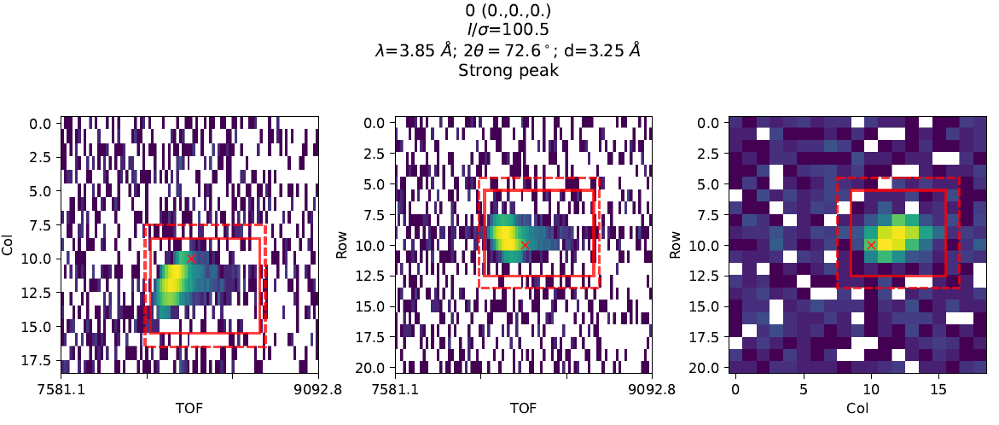

.. algorithm::

.. summary::

.. relatedalgorithms::

.. properties::

Background
-----------

Fixed mask/shoebox integration methods have previously been developed for Time-of-flight (TOF) neutron diffraction [1]_.
For monochromatic neutron diffractometers, a dynamic shoebox method that optimised the shoebox dimensions on a 2D
detector by maximising the Intensity/sigma ratio of each peak has been shown to improve the R-factors obtained [2]_.

This algorithm generalises the 2D dynamic shoebox integration of [2]_ to 3D peaks in TOF Laue,
and several improvements have been made to suit TOF Laue data

1. Avoids nearby peaks that are closer to another peak position when optimising shoebox position

2. The shoebox dimensions of weak peaks can be obtained from nearby stronger peaks with scaling of the TOF dimension
to account for the instrument resolution.

Description
-----------

This is an algorithm to integrate single-crystal Bragg peaks in a :ref:`MatrixWorkspace <MatrixWorkspace>`.
An initial integration is performed by summing up the counts in a fixed shoebox of user specified size ``NRows`` and
``NCols`` on the detector and ``NBins`` along the TOF direction. The dimensions of the shoebox are then optionally
optimised to maximise I/sigma.

The default ``Nbins`` can be specified in one of two ways:

1. Provide ``NBins`` directly - number of TOF bins in the kernel

2. Setting ``GetNBinsFromBackToBackParams=True`` and providing ``NFWHM`` - in which case ``NBins`` will be NFWHM x FWHM
   of a :ref:`BackToBackExponential <func-BackToBackExponential>` peak at the center of each detector panel/bank at the
   middle of the spectrum.

Note to use method 2, back-to-back exponential coefficients must be defined in the Parameters.xml file for the
instrument.

The integration requires a background shell with negative weights, there are approximately the same number of bins in
the background shell as in the peak region.

The algorithm proceeds as follows:

1. Take a window of the data, ``NShoeboxInWindow`` the size of the initial user specified shoebox (``NRows`` x ``NCols`` x ``NBins``)

2. Convolve the shoebox kernel with the data in the window to find the position with largest Intensity/sigma
   (closest to the predicted peak position than to any other peaks in the table).

3. Integrate using the shoebox at the optimal position

4. If the peak is strong (Intensity/sigma > ``WeakPeakThreshold``) and ``OptimiseShoebox=True`` then optimise the shoebox
   dimensions to maximise Intensity/sigma

5. If the peak is weak, it can be integrated using the initial shoebox (``WeakPeakStrategy="Fix"``) or using the
   shoebox dimensions from the nearest strong peak (``WeakPeakStrategy="NearestStrongPeak"``)

When looking for the nearest strong peaks for ``WeakPeakStrategy="NearestStrongPeak"``, the algorithm first checks for
peaks in detector IDs in the data window around the peak, before looking at the whole peak table.
The closest peak is defined as the one with the smallest angle between the QLab vectors of the two peaks. The TOF extent
of the shoebox is scaled by the ratio of the FWHM of the weak and strong peak if ``GetNBinsFromBackToBackParams=True``,
otherwise it is scaled by the ratio of TOF (i.e. assumes dTOF/TOF resolution is the same for both peaks).

Optionally if ``OutputFile`` is provided a pdf can be output that shows the shoebox kernel and the data integrated along
each dimension like so

          (Right)

Usage
-----

**Example - IntegratePeaksShoeboxTOF**

.. testcode:: exampleIntegratePeaksShoeboxTOF

    from mantid.simpleapi import *

    Load(Filename="SXD23767.raw", OutputWorkspace="SXD23767")
    CreatePeaksWorkspace(InstrumentWorkspace="SXD23767", NumberOfPeaks=0, OutputWorkspace="peaks")
    AddPeak(PeaksWorkspace="peaks", RunWorkspace="SXD23767", TOF=8303.3735339704781, DetectorID=7646)

    peaks_out = IntegratePeaksShoeboxTOF(InputWorkspace="SXD23767", PeaksWorkspace="peaks",
                                         GetNBinsFromBackToBackParams=True, WeakPeakThreshold=0.0, LorentzCorrection=False)

    print(f"I/sigma = {peaks_out.getPeak(0).getIntensityOverSigma():.2f}")

**Output:**

.. testoutput:: exampleIntegratePeaksShoeboxTOF

    I/sigma = 100.80

References
----------

.. [1] Wilkinson, C., and A. J. Schultz. (1989) J. Appl. Cryst. 22.2, 110-114.

.. [2] Wilkinson, C., Khamis, H. W., Stansfield, R. F. D. & McIntyre, G. J. (1988). J. Appl. Cryst. 21, 471-478.

.. categories::

.. sourcelink::
