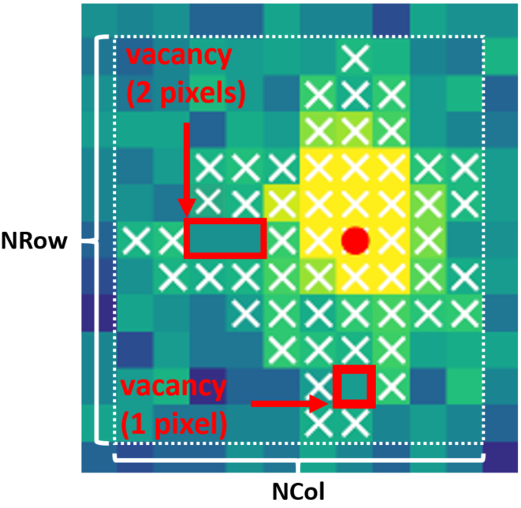

.. algorithm::

.. summary::

.. relatedalgorithms::

.. properties::

Description
-----------

IntegratePeaksSkew is an algorithm that integrates single-crystal Bragg peaks in a :ref:`MatrixWorkspace <MatrixWorkspace>`
by identifying the detectors and bins that contribute to a peak by minimising the skew (third moment) of the points in
the background.

The algorithm is inspired by seed-skew integration methods for peaks on image plates used in monochromatic x-ray
instruments [1]_. The seed-skew method [1]_ has previously been directly applied to 3D Bragg peaks from TOF neutron Laue
data [2]_, however it has been noted that skew methods typically underestimate the intensity of weak reflections
(due to premature termination of the seed growth) - a systematic effect that is expected to be worse for 3D Bragg peaks.

In order to improve the performance and more accurately integrate weak reflections a different approach is used here:
data are integrated over an initial TOF window in order to maximise the signal-to-noise and then a 2D peak mask is
determined to find the detectors contributing to the peak; data in these detectors are then focused (and a
background subtracted) before applying the same method to identify the bins that contribute to the peak in the focused
spectrum. The full TOF extent of the peak is determined by maximising :math:`I/\sigma` (similar to integration methods
for step-scans with monochromatic x-rays [3]_) starting from a seed of bins identified using the skew method.
The user can then optionally use the optimal TOF extent to repeat the procedure to find the detectors contributing to
the peak.

Technically this algorithm does not use the a seed-skew algorithm that grows a seed, rather non-background points found
by minimising the skew of the background, subsequently nearest-neighbour connected regions are found in the
non-background points and a single region is assigned to the peak (by proximity to the expected peak position).

Note this algorithm applies the Lorentz correction to the integrated intensity.

The algorithm proceeds as follows:

1.  Calculates an initial TOF window using the input parameter ``FractionalTOFWindow`` or (if ``FractionalTOFWindow = 0``)
    evaluating a resolution function of the form

        .. math::

            \frac{dTOF}{TOF} = \sqrt{(\cot(\theta)d\theta)^2 + \left(\frac{dt_0}{t_0}\right)^2 + \left(\frac{dL}{L}\right)^2}

    where :math:`dTOF` refers to the integration window size rather than the FWHM of a peak, the parameter
    ``BackscatteringTOFResolution`` is the fractional window size (:math:`dTOF/TOF`) of a peak at backscattering
    (equivalent to :math:`\sqrt{(\frac{dt_0}{t_0})^2 + (\frac{dL}{L})^2}`) and ``ThetaWidth`` :math:`= d\theta`
    (which is adjusted to reproduce the window size required for peaks at larger scattering angles).

2. Integrate the data over the range :math:`TOF_{peak} \pm 0.5*dTOF`

3. Find the detectors contributing to the background by minimising the skew of the integrated intensity of detectors in
   a square window of side length ``2*NPixels + 1``.

4. Take the peak mask (detectors which contribute to the peak) to be the contiguous region of nearest-neighbour
   connected detectors not contributing to the background that contains the peak detector ID
   (or if ``UseNearest=True`` then it will be the nearest region).

5. Focuses the data (in TOF) for detectors assigned to the peak subtracting the spectra from a shell of
   adjacent background pixels. This has the added benefit of roughly subtracting powder lines (if the detectors are
   close enough for powder lines to roughly line up in TOF when averaged over the mask/shell).

6. Find the bins in the focused spectrum contributing to the peak by minimising the skew in the TOF window.

7. Increase the TOF window until the ratio of :math:`I/\sigma` reaches a maximum.

8. If ``OptimiseMask=True`` then steps 4-7 will be repeated using the optimal TOF window to find the detectors
   contributing to the peak.

9. The bins contributing to the peak in the focused spectrum are summed (with the errors added in quadrature).

Peak mask validation
--------------------

The algorithm includes several parameters that allow the peak mask (detectors contributing to the peak) to be
validated before advancing to step 5.

Integration of peaks on the edge of a detector
##############################################

To integrate peaks for which the peak mask includes pixels on the edge of the detector bank set ``IntegrateIfOnEdge=True``.

Vacancies
#########

Defined as regions of background pixels entirely enclosed within the peak mask - examples of vacancies are shown below.
If more than ``NVacanciesMax`` vacancies are found with a number of pixels greater than or equal to
``NPixPerVacancyMin`` then the peak is not integrated.

          ``NRow`` and ``NCol`` are the lengths of the bounding box (dashed white line).

Peak size and shape
###################

The minimum number of pixels allowed for a peak is set using the parameter ``NPixMin``.

Limits on the peak size can be set with parameters ``NColMax`` and ``NRowMax`` which are upper limits on ``NCol`` and
``NRow``, the number of columns and rows in the bounding box of the peak mask (as labelled in the image above).

There can also be a limit on the minimum density, ``DensityPixMin``, of the peak mask (the total number of detectors in
the mask divided by the area of the bounding box.

Finding nearby peaks
--------------------

If the parameter ``UseNearest=True`` then the peak will be integrated using a mask that contains the nearest
contiguous region of nearest-neighbour connected detectors not contributing to the background), even if the detector ID
of the peak corresponds to a background detector (as identified in step 3).

If ``UpdatePeakPosition=True`` then the peak detector ID will be replaced with the detector ID corresponding to the
maxiumum integrated intensity over the TOF window which maximises :math:`I/\sigma`. The peak TOF will be replaced
with the TOF of the maximum in the focused spectrum.

Plotting
--------

Optionally the user can ask for a pdf to be saved to ``OutputFile``. For each peak the file contains a 2D colorfill plot
showing the peak mask and the data integrated over the TOF window that maximises :math:`I/\sigma`, and the
focused, background subtracted spectra with vertical lines to mark the initial and optimal TOF window and the peak
centre.

Useage
-----------

**Example:**

.. code-block:: python

    from mantid.simpleapi import *

    Load(Filename='SXD23767.raw', OutputWorkspace='SXD23767')
    CreatePeaksWorkspace(InstrumentWorkspace='SXD23767', NumberOfPeaks=0, OutputWorkspace='SingleCrystalPeakTable')
    AddPeak(PeaksWorkspace='SingleCrystalPeakTable', RunWorkspace='SXD23767', TOF=3271, DetectorID=32615)

    IntegratePeaksSkew(InputWorkspace='SXD23767', PeaksWorkspace='SingleCrystalPeakTable',
        OutputWorkspace='out', OutputFile="out.pdf",
        UseNearestPeak=True, IntegrateIfOnEdge=True, NVacanciesMax=0, NPixPerVacancyMin=2,
        BackScatteringTOFResolution=0.04, ThetaWidth=0.02, UpdatePeakPosition=True)

References
----------

.. [1] Bolotovsky, R., White, M. A., Darovsky, A. & Coppens, P. (1995). J. Appl. Cryst. 28, 86–95.

.. [2] Peters, J. (2003) J. Appl. Cryst. 36.6, 1475-1479.

.. [3] Lehmann, M. T., & Larsen, F. K. (1974). Acta Crystallogr. A. 30(4), 580-584.

.. categories::

.. sourcelink::
