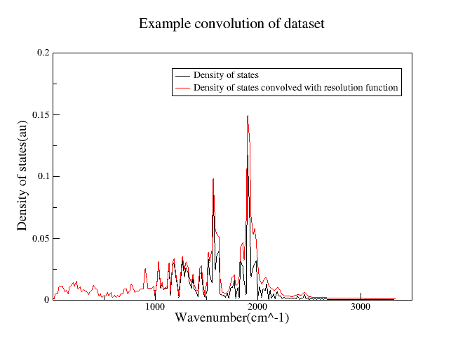

.. algorithm::

.. summary::

.. relatedalgorithms::

.. properties::

Description
------------
Loads density of states and velocity autocorrelation data from version 4 of
nMOLDYN saved in an ASCII format after being extracted from the '.tar'
archive. Will convolute this data with an instrument resolution function if
required. Only a TOSCA resolution function is available at present. See below for
an example of resolution convolution.

Functions must be provided in the format of the filenames. For example, a
function 'dos_total' will be loaded if 'dos_total' is entered as a chosen
function.

Assumptions on data format
--------------------------

The 'Directory' property must be given the directory that is produced when
you extract the '.tar' archive from nMOLDYN without modifications which must
only contain the data files produced from a single nMOLDYN export operation.
Crucially, there must be a '\\frequency.dat' file in order to load dos data
and a '\\time.dat' file in order to load vacf data.

Axis Unit Conversions
---------------------

When loading certain axes from nMOLDYN 4 the units may be converted to an
equivalent unit in Mantid. The possible conversions are shown in the table
below:

+-----------+---------+------------------+--------------+
| nMOLDYN             | Mantid                          |
+-----------+---------+------------------+--------------+
| name      | unit    | name             | unit         |
+===========+=========+==================+==============+
| frequency | THz     | Wavenumber       | cm^-1        |
+-----------+---------+------------------+--------------+
| Time      | pSecond | TOF              | uSecond      |
+-----------+---------+------------------+--------------+

Usage
-----

**Example - Loading a simulation from an nMOLDYN 4 data file, without
resolution convolution**

.. code-block:: python

    data = LoadNMoldyn4Ascii1D(Directory=r'C:\MantidInstall\data\pristinedata',
                               Functions=['dos_total', 'vacf_total'])

    for ws in data:
        print(ws.name())

Output:

.. code-block:: python

    data(dos_total)
    data(vacf_total)

.. categories::

.. sourcelink::

