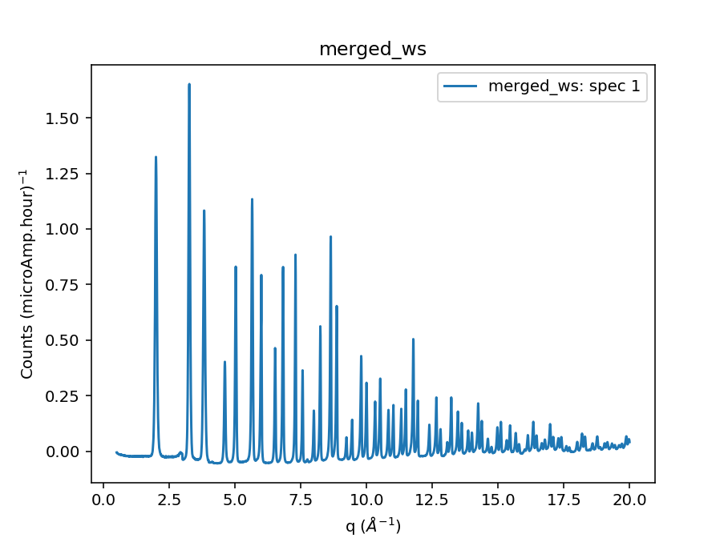

.. algorithm::

.. summary::

.. relatedalgorithms::

.. properties::

Description
-----------

This is a workflow algorithm that merges down a workspace, workspace
group, or list of workspaces, `MatchSpectra <algm-MatchSpectra>`
and sums the spectra using weighted mean from ranges for each
spectra. For each workspace an XMin and XMax is supplied, the
workspace is then cropped to that range and all workspaces are
Rebinned to have common bin edges. The output is the mean value
for each bin for all workspaces with a value in that bin.
This is done by executing several sub-algorithms as
listed below.

#. :ref:`algm-Rebin` To rebin all spectra to have common bins.
#. :ref:`algm-ConjoinWorkspaces` repeated for every workspaces in the workspace group.
#. :ref:`algm-MatchSpectra` Matched against the spectra with the largest original x range.
#. :ref:`algm-CropWorkspaceRagged` to cut spectra to match the X limits given.
#. :ref:`algm-Rebin` To rebin all spectra to have common bins.
#. :ref:`algm-SumSpectra` using `WeightedSum=True` and `MultiplyBySpectra=False`.

Usage
-----

.. code-block:: python

    from mantid.simpleapi import *

    import numpy as np

    from isis_powder import polaris, SampleDetails
    config_file_path = r"C:/Users/wey38795/Documents/polaris-calculate-pdf/polaris_config_example.yaml"
    polaris = polaris.Polaris(config_file=config_file_path, user_name="test", mode="PDF")

    sample_details = SampleDetails(height=4.0, radius=0.2985, center=[0, 0, 0], shape='cylinder')
    sample_details.set_material(chemical_formula='Si')
    polaris.set_sample_details(sample=sample_details)

    polaris.create_vanadium(first_cycle_run_no="98532",
                            multiple_scattering=False)
    polaris.focus(run_number="98533", input_mode='Summed')

    polaris.create_total_scattering_pdf(run_number="98533", merge_banks=False)
    x_min = np.array([0.5, 3, 4, 6, 7])
    x_max = np.array([3.5, 5, 7, 11, 20])
    merged_ws = MatchAndMergeWorkspaces(WorkspaceGroup='focused_ws', XMin=x_min, XMax=x_max, CalculateScale=False)

    fig, ax = plt.subplots(subplot_kw={'projection':'mantid'})
    ax.plot(merged_ws)
    ax.legend()
    fig.show()

This will produce a plot that looks like this:

Workflow
########

.. diagram:: MatchAndMergeWorkspaces-v1_wkflw.dot
