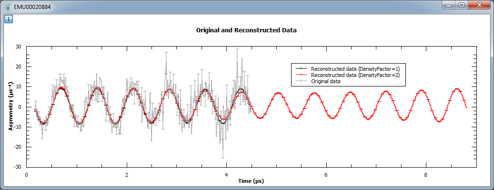

.. algorithm::

.. summary::

.. alias::

.. properties::

Description
-----------

The maximum entropy method (MEM) is used as a signal processing technique for reconstructing
images from noisy data. It selects a single
image from the many images which fit the data with the same value of the statistic,
:math:`\chi^2`. The maximum entropy method selects from this *feasible set* of images, the one which
has minimum information (maximum entropy).
More specifically, the algorithm maximizes the entropy :math:`S\left(x\right)` subject to the constraint:

.. math:: \chi^2 = \sum_m \frac{\left(d_m - d_m^c\right)^2}{\sigma_m^2} \leq C_{target}

where :math:`d_m` are the experimental data, :math:`\sigma_m` the associated errors, and :math:`d_m^c`
the calculated or reconstructed data. The image is the set of numbers
:math:`\{x_0, x_1, \dots, x_N\}` which relates to the measured data as:

.. math:: d_m = \sum_j M_{mj} x_j

where the measurement kernel matrix :math:`\mathbf{M}` represents a Fourier transform,
:math:`M_{mj} = \exp\left(-ik_mj\right)`. At present, nothing is assumed about :math:`x_j`:
it can be either positive or negative and real or complex, and the entropy is defined as

.. math:: S = \sum_j \left(x_j/A\right) \sinh^{-1} \left(x_j/A\right)

where :math:`A` is a constant. The sensitive of the reconstructed image to reconstructed
image will vary depending on the data. In general a smaller value would preduce a
sharper image. See section 4.7 in Ref. [1] for recommended strategy to selected :math:`A`.

The implementation used to find the solution where the entropy is maximized
subject to the constraint in :math:`\chi^2` follows the approach by Skilling & Bryan [2], which is an
algorithm that is not explicitly using Lagrange multiplier. Instead, they
construct a subspace from a set of *search directions* to approach the maximum entropy solution. Initially,
the image :math:`x` is set to the flat background :math:`A` and the search directions are constructed
using the gradients of :math:`S` and :math:`\chi^2`:

.. math:: \mathbf{e}_1 = f\left(\nabla S\right)
.. math:: \mathbf{e}_2 = f\left(\nabla \chi^2\right)

where :math:`f\left(\nabla S\right)` stands for a componentwise multiplication. The algorithm next uses
a quadratic approximation to determine the increment :math:`\delta \mathbf{x}` that *moves* the image
one step closer to the solution:

.. math:: \mathbf{x} = \mathbf{x} + \delta \mathbf{x}

Output Workspaces
-----------------

There are four output workspaces: *ReconstructedImage* and *ReconstructedData* contain the image and
calculated data respectively, and *EvolChi* and *EvolAngle* record the algorithm's evolution.
*ReconstructedData* can be used to check that the calculated data approaches the experimental,
measured data, and *ReconstructedImage* corresponds to its Fourier transform. If the input data are real they
contain twice the original number of spectra, as the Fourier transform will be a complex signal
in general. The real and imaginary parts are organized as follows (see Table 1): assuming your input workspace has
:math:`M` spectra, the real part of the reconstructed spectrum :math:`s` corresponds to
spectrum :math:`s` in the output workspaces *ReconstructedImage* and *ReconstructedData*, while the imaginary part can be found in spectrum :math:`s+M`.

When the input data are complex, the input workspace is expected to have :math:`2M` spectra, where
real and imaginary parts of input :math:`s`, are arranged in spectra :math:`(s, s+M)` respectively. In other words,
*ReconstructedData* and *ReconstructedImage* will contain :math:`2M` spectra, where spectra
:math:`(s, s+M)` correspond to the real and imaginary parts reconstructed from the input signal at
:math:`(s, s+M)` in the input workspace (see Table 2 below).

The workspaces *EvolChi* and *EvolAngle* record the evolution of :math:`\chi^2` and the angle (or
non-parallelism) between :math:`\nabla S` and :math:`\nabla \chi^2`. Note that the algorithm runs
until a solution is found, and that an image is considered to be a true maximum entropy
solution when the following two conditions are met simultaneously:

.. math:: \chi^2_{Target} - \chi^2 < \epsilon_1, \qquad \frac{1}{2} \left| \frac{\nabla S}{\left|\nabla S\right|} - \frac{\nabla \chi^2}{\left|\nabla \chi^2\right|} \right| < \epsilon_2

While one of these conditions is not satisfied the algorithm keeps running until it reaches the maximum
number of iterations. When the maximum number of iterations is reached, the last
reconstructed image and its corresponding calculated data are returned, even if they do not correspond to
a true maximum entropy solution satisfying the conditions above. In this way, the user can check by inspecting
the output workspaces whether the algorithm was evolving towards the correct solution or not.
On the other hand, the user must always check the validity of the solution by inspecting *EvolChi* and *EvolAngle*,
whose values will be set to zero once the true maximum entropy solution is found.

.. table:: Table 1. Output workspaces for the case of real data (M histograms and N bins in the input workspace)

    +-------------------+------------------------------+----------------+--------------------------------------------------------------------------------------------------------------------------------------------------------------------------------------------------------------------------------------------------------------------------------------------------------------------+
    | Workspace         | Number of histograms         | Number of bins | Description                                                                                                                                                                                                                                                                                                        |
    +===================+==============================+================+====================================================================================================================================================================================================================================================================================================================+
    | EvolChi           | M                            | MaxIterations  | Evolution of :math:`\chi^2` until the solution is found. Then all values are set to zero.                                                                                                                                                                                                                          |
    +-------------------+------------------------------+----------------+--------------------------------------------------------------------------------------------------------------------------------------------------------------------------------------------------------------------------------------------------------------------------------------------------------------------+
    | EvolAngle         | M                            | MaxIterations  | Evolution of the angle between :math:`\nabla S` and :math:`\nabla \chi^2`, until the solution is found. Then all values are set to zero.                                                                                                                                                                           |
    +-------------------+------------------------------+----------------+--------------------------------------------------------------------------------------------------------------------------------------------------------------------------------------------------------------------------------------------------------------------------------------------------------------------+
    | ReconstructedImage| 2M                           | N              | For spectrum :math:`s` in the input workspace, the reconstructed image is stored in spectra :math:`s` (real part) and :math:`s+M` (imaginary part)                                                                                                                                                                 |
    +-------------------+------------------------------+----------------+--------------------------------------------------------------------------------------------------------------------------------------------------------------------------------------------------------------------------------------------------------------------------------------------------------------------+
    | ReconstructedData | 2M                           | N              | For spectrum :math:`s` in the input workspace, the reconstructed data are stored in spectrum :math:`s` (real part) and :math:`s+M` (imaginary part). Note that although the input is real, the imaginary part is recorded for debugging purposes, it should be zero for all data points.                           |
    +-------------------+------------------------------+----------------+--------------------------------------------------------------------------------------------------------------------------------------------------------------------------------------------------------------------------------------------------------------------------------------------------------------------+

.. table:: Table 2. Output workspaces for the case of complex input (2M histograms and N bins in the input workspace. Real and imaginary parts must be consecutive)

    +-------------------+------------------------------+----------------+------------------------------------------------------------------------------------------------------------------------------------------------------------+
    | Workspace         | Number of histograms         | Number of bins | Description                                                                                                                                                |
    +===================+==============================+================+============================================================================================================================================================+
    | EvolChi           | M                            | MaxIterations  | Evolution of :math:`\chi^2` until the solution is found. Then all values are set to zero.                                                                  |
    +-------------------+------------------------------+----------------+------------------------------------------------------------------------------------------------------------------------------------------------------------+
    | EvolAngle         | M                            | MaxIterations  | Evolution of the angle between :math:`\nabla S` and :math:`\nabla \chi^2`, until the solution is found. Then all values are set to zero.                   |
    +-------------------+------------------------------+----------------+------------------------------------------------------------------------------------------------------------------------------------------------------------+
    | ReconstructedImage| 2M                           | :math:`N`      | For spectrum :math:`(s, s+M)` in the input workspace, the reconstructed image is stored in spectra :math:`s` (real part) and :math:`s+M` (imaginary part)  |
    +-------------------+------------------------------+----------------+------------------------------------------------------------------------------------------------------------------------------------------------------------+
    | ReconstructedData | 2M                           | :math:`N`      | For spectrum :math:`(s, s+M)` in the input workspace, the reconstructed data are stored in spectra :math:`s` (real part) and :math:`s+M` (imaginary part)  |
    +-------------------+------------------------------+----------------+------------------------------------------------------------------------------------------------------------------------------------------------------------+

Usage
-----

**Example - Reconstruct Fourier coefficients**

In the example below, a workspace containing five Fourier coefficients is created and
used as input to :ref:`algm-MaxEnt`. In the figure we show the original and reconstructed data (left),
and the reconstructed image, i.e. Fourier transform (right).

.. testcode:: ExFourierCoeffs

   # Create an empty workspace
   X = []
   Y = []
   E = []
   N = 200
   for i in range(0,N):
       x = ((i-N/2) *1./N)
       X.append(x)
       Y.append(0)
       E.append(0.001)

   # Fill in five Fourier coefficients
   # The input signal must be symmetric
   Y[5] = Y[195] = 0.85
   Y[10] = Y[190] = 0.85
   Y[20] = Y[180] = 0.85
   Y[12] = Y[188] = 0.90
   Y[14] = Y[186] = 0.90
   CreateWorkspace(OutputWorkspace='inputws',DataX=X,DataY=Y,DataE=E,NSpec=1)
   evolChi, evolAngle, image, data = MaxEnt(InputWorkspace='inputws', chiTarget=N, A=0.0001)

   print "First  reconstructed coefficient: %.3f" % data.readY(0)[5]
   print "Second reconstructed coefficient: %.3f" % data.readY(0)[10]
   print "Third  reconstructed coefficient: %.3f" % data.readY(0)[20]
   print "Fourth reconstructed coefficient: %.3f" % data.readY(0)[12]
   print "Fifth  reconstructed coefficient: %.3f" % data.readY(0)[14]

Output:

.. testoutput:: ExFourierCoeffs

   First  reconstructed coefficient: 0.849
   Second reconstructed coefficient: 0.847
   Third  reconstructed coefficient: 0.848
   Fourth reconstructed coefficient: 0.901
   Fifth  reconstructed coefficient: 0.899

.. figure:: ../images/MaxEntFourierCoefficients.png
   :align: center

**Example - Reconstruct a real muon dataset**

In this example, :ref:`algm-MaxEnt` is run on a pre-analyzed muon dataset. The corresponding figure shows
the original and reconstructed data (left), and the real part of the image obtained with :ref:`algm-MaxEnt`
and :ref:`algm-FFT` (right).

.. testcode:: ExMUSR00022725

   Load(Filename=r'MUSR00022725.nxs', OutputWorkspace='MUSR00022725')
   CropWorkspace(InputWorkspace='MUSR00022725', OutputWorkspace='MUSR00022725', XMin=0.11, XMax=1.6, EndWorkspaceIndex=0)
   RemoveExpDecay(InputWorkspace='MUSR00022725', OutputWorkspace='MUSR00022725')
   Rebin(InputWorkspace='MUSR00022725', OutputWorkspace='MUSR00022725', Params='0.016')
   evolChi, evolAngle, image, data = MaxEnt(InputWorkspace='MUSR00022725', A=0.005, ChiTarget=90)
   # Compare MaxEnt to FFT
   imageFFT = FFT(InputWorkspace='MUSR00022725')

   print "Image at %.3f: %.3f" % (image.readX(0)[44], image.readY(0)[44])
   print "Image at %.3f: %.3f" % (image.readX(0)[46], image.readY(0)[46])
   print "Image at %.3f: %.3f" % (image.readX(0)[48], image.readY(0)[48])

Output:

.. testoutput:: ExMUSR00022725

   Image at -1.359: 0.102
   Image at 0.000: 0.010
   Image at 1.359: 0.102

.. figure:: ../images/MaxEntMUSR00022725.png
   :align: center

Next, :ref:`algm-MaxEnt` is run on a different muon dataset. The figure shows
the original and reconstructed data (left), the real part of the image (middle)
and its imaginary part (right).

.. testcode:: ExEMU00020884

   Load(Filename=r'EMU00020884.nxs', OutputWorkspace='EMU00020884')
   CropWorkspace(InputWorkspace='EMU00020884', OutputWorkspace='EMU00020884', XMin=0.17, XMax=4.5, EndWorkspaceIndex=0)
   RemoveExpDecay(InputWorkspace='EMU00020884', OutputWorkspace='EMU00020884')
   Rebin(InputWorkspace='EMU00020884', OutputWorkspace='EMU00020884', Params='0.016')
   evolChi, evolAngle, image, data = MaxEnt(InputWorkspace='EMU00020884', A=0.0001, ChiTarget=300, MaxIterations=2500)
   # Compare MaxEnt to FFT
   imageFFT = FFT(InputWorkspace='EMU00020884')

   print "Image (real part) at %.3f: %.3f" % (image.readX(0)[129], image.readY(0)[129])
   print "Image (real part) at  %.3f:  %.3f" % (image.readX(0)[135], image.readY(0)[135])
   print "Image (real part) at  %.3f: %.3f" % (image.readX(0)[141], image.readY(0)[141])
   print "Image (imaginary part) at %.3f: %.3f" % (image.readX(0)[129], image.readY(0)[129])
   print "Image (imaginary part) at  %.3f:  %.3f" % (image.readX(0)[135], image.readY(0)[135])
   print "Image (imaginary part) at  %.3f: %.3f" % (image.readX(0)[141], image.readY(0)[141])

Output:

.. testoutput:: ExEMU00020884

   Image (real part) at -1.389: -0.079
   Image (real part) at  0.000:  0.015
   Image (real part) at  1.389: -0.079
   Image (imaginary part) at -1.389: -0.079
   Image (imaginary part) at  0.000:  0.015
   Image (imaginary part) at  1.389: -0.079

.. figure:: ../images/MaxEntMUSR00020884.png
   :align: center

Finally, we show an example where a complex signal is analyzed. In this case, the input workspace contains two spectra corresponding to the
real and imaginary part of the same signal. The figure shows
the original and reconstructed data (left), and the reconstructed image (right).

.. testcode:: ExRealImage

   from math import pi, sin, cos
   from random import random, seed
   seed(0)
   # Create a test workspace
   X = []
   YRe = []
   YIm = []
   E = []
   N = 200
   w = 3
   for i in range(0,N):
       x = 2*pi*i/N
       X.append(x)
       YRe.append(cos(w*x)+(random()-0.5)*0.3)
       YIm.append(sin(w*x)+(random()-0.5)*0.3)
       E.append(0.1)
   CreateWorkspace(OutputWorkspace='ws',DataX=X+X,DataY=YRe+YIm,DataE=E+E,NSpec=2)
   evolChi, evolAngle, image, data = MaxEnt(InputWorkspace='ws', ComplexData=True, chiTarget=2*N, A=0.001)

   print "Image (real part) at %.3f: %.3f" % (image.readX(0)[102], image.readY(0)[102])
   print "Image (real part) at %.3f: %.3f" % (image.readX(0)[103], image.readY(0)[103])
   print "Image (real part) at %.3f: %.3f" % (image.readX(0)[104], image.readY(0)[104])

Output:

.. testoutput:: ExRealImage

   Image (real part) at 0.318: 0.000
   Image (real part) at 0.477: 5.842
   Image (real part) at 0.637: 0.000

.. figure:: ../images/MaxEntComplexData.png
   :align: center

Positive Images
---------------

The algorithm allows users to restrict the reconstructed image to positive values only. This behaviour can be
selected by setting the input property *PositiveImage* to true. In this case, the entropy is defined by the
alternative expression:

.. math:: S = -\sum_j x_j \left(\log(x_j/A)-1\right)

In addition, the algorithm explicitly protects against negative values by setting those to a fraction of the maximum entropy constant *A*.
In the example below both modes are compared. As the input is a complex signal with expected Fourier transform :math:`F(\omega) = \delta\left(\omega-\omega_0\right)`,
i.e. positive,
both modes should produce the same results (note that the maximum entropy constant *A* typically needs to be set to smaller values for positive
image in order to obtain smooth results).

.. testcode:: ExRealPosImage

   from math import pi, sin, cos
   from random import random, seed
   seed(0)
   # Create a test workspace
   X = []
   YRe = []
   YIm = []
   E = []
   N = 200
   w = 3
   for i in range(0,N):
       x = 2*pi*i/N
       X.append(x)
       YRe.append(cos(w*x)+(random()-0.5)*0.3)
       YIm.append(sin(w*x)+(random()-0.5)*0.3)
       E.append(0.1)
   CreateWorkspace(OutputWorkspace='ws',DataX=X+X,DataY=YRe+YIm,DataE=E+E,NSpec=2)
   evolChi, evolAngle, image, data = MaxEnt(InputWorkspace='ws', ComplexData=True, chiTarget=2*N, A=1, PositiveImage=False)
   evolChiP, evolAngleP, imageP, dataP = MaxEnt(InputWorkspace='ws', ComplexData=True, chiTarget=2*N, A=0.001, PositiveImage=True)

   print "Image at %.3f: %.3f (PositiveImage=False), %.3f (PositiveImage=True)" % (image.readX(0)[102], image.readY(0)[102], imageP.readY(0)[102])
   print "Image at %.3f:  %.3f (PositiveImage=False), %.3f (PositiveImage=True)" % (image.readX(0)[103], image.readY(0)[103], imageP.readY(0)[103])
   print "Image at %.3f: %.3f (PositiveImage=False), %.3f (PositiveImage=True)" % (image.readX(0)[104], image.readY(0)[104], imageP.readY(0)[102])

Output:

.. testoutput:: ExRealPosImage

   Image at 0.318: -0.000 (PositiveImage=False), 0.000 (PositiveImage=True)
   Image at 0.477:  5.843 (PositiveImage=False), 5.842 (PositiveImage=True)
   Image at 0.637: -0.000 (PositiveImage=False), 0.000 (PositiveImage=True)

.. figure:: ../images/MaxEntPositiveImage.png
   :align: center

Increasing the density of points in the image
---------------------------------------------

The algorithm has an input property, *DensityFactor* that allows to increase the number of points in the reconstructed image. This is
at present done by extending the range (and also the number of points) in the reconstructed data. The number of reconstructed
points can be increased by any integer factor, but note that this will slow down the algorithm and a greater number of maxent iterations may be needed
for the algorithm to converge to a solution.

An example script where the density of points is increased by a factor of 2 can be found below. Note that when a factor of 2 is used,
the reconstructed data is twice the size of the original (experimental) data.

.. testcode:: ExDensityFactor

   Load(Filename=r'EMU00020884.nxs', OutputWorkspace='ws')
   CropWorkspace(InputWorkspace='ws', OutputWorkspace='ws', XMin=0.17, XMax=4.5, EndWorkspaceIndex=0)
   ws = RemoveExpDecay(InputWorkspace='ws')
   ws = Rebin(InputWorkspace='ws', Params='0.016')
   evolChi1, evolAngle1, image1, data1 = MaxEnt(InputWorkspace='ws', A=0.0001, ChiTarget=300, MaxIterations=2500, DensityFactor=1)
   evolChi2, evolAngle2, image2, data2 = MaxEnt(InputWorkspace='ws', A=0.0001, ChiTarget=300, MaxIterations=5000, DensityFactor=2)

   print "Image at %.3f:  %.3f (DensityFactor=1)" % (image1.readX(0)[103], image1.readY(0)[103])
   print "Image at %.3f: %.3f (DensityFactor=2)" % (image2.readX(0)[258], image2.readY(0)[258])

Output:

.. testoutput:: ExDensityFactor

   Image at -7.407:  0.000 (DensityFactor=1)
   Image at -1.389: -0.081 (DensityFactor=2)

In the next example, we increased the density of points by factors of 10, 20 and 40. We show the reconstructed image (left) and
a zoom into the region :math:`0.82 < x < 1.44` and :math:`-0.187 < y < 0.004`.

.. code-block:: python

   Load(Filename=r'EMU00020884.nxs', OutputWorkspace='ws')
   CropWorkspace(InputWorkspace='ws', OutputWorkspace='ws', XMin=0.17, XMax=4.5, EndWorkspaceIndex=0)
   ws = RemoveExpDecay(InputWorkspace='ws')
   ws = Rebin(InputWorkspace='ws', Params='0.016')
   evolChi1, evolAngle1, image1, data1 = MaxEnt(InputWorkspace='ws', A=0.0001, ChiTarget=300, MaxIterations=2500, DensityFactor=1)
   evolChi10, evolAngle10, image10, data10 = MaxEnt(InputWorkspace='ws', A=0.0001, ChiTarget=300, MaxIterations=25000, DensityFactor=10)
   evolChi20, evolAngle20, image20, data20 = MaxEnt(InputWorkspace='ws', A=0.0001, ChiTarget=300, MaxIterations=50000, DensityFactor=20)
   evolChi40, evolAngle40, image40, data40 = MaxEnt(InputWorkspace='ws', A=0.0001, ChiTarget=300, MaxIterations=75000, DensityFactor=40)

References
----------

[1] Anders Johannes Markvardsen, (2000). Polarised neutron diffraction measurements of PrBa2Cu3O6+x and the Bayesian statistical analysis of such data. DPhil. University of Oxford (http://ora.ox.ac.uk/objects/uuid:bef0c991-4e1c-4b07-952a-a0fe7e4943f7)

[2] Skilling & Bryan, (1984). Maximum entropy image reconstruction: general algorithm. Mon. Not. R. astr. Soc. 211, 111-124.

[3] Smith & Player, (1990). Deconvolution of bipolar ultrasonic signals using a modified maximum entropy method. J. Phys. D: Appl. Phys. 24, 1714-1721.

.. categories::

.. sourcelink::