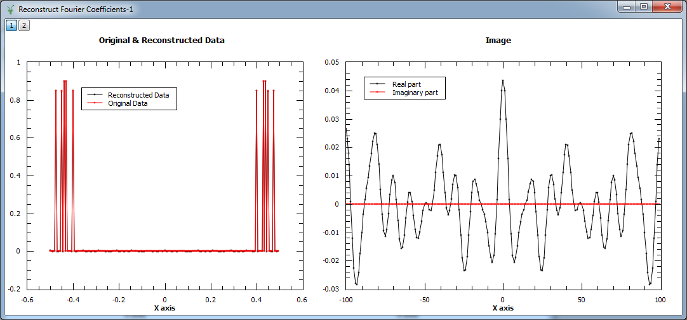
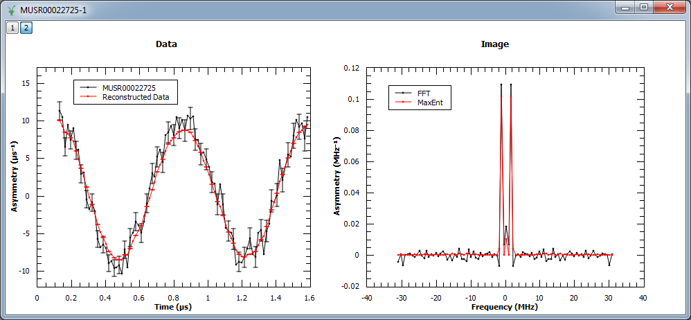
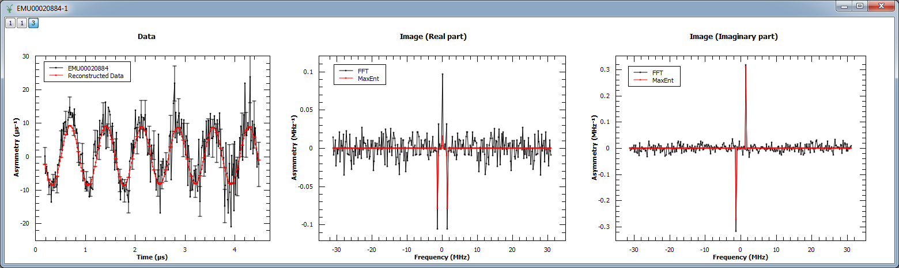
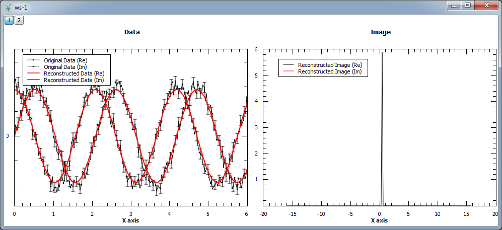
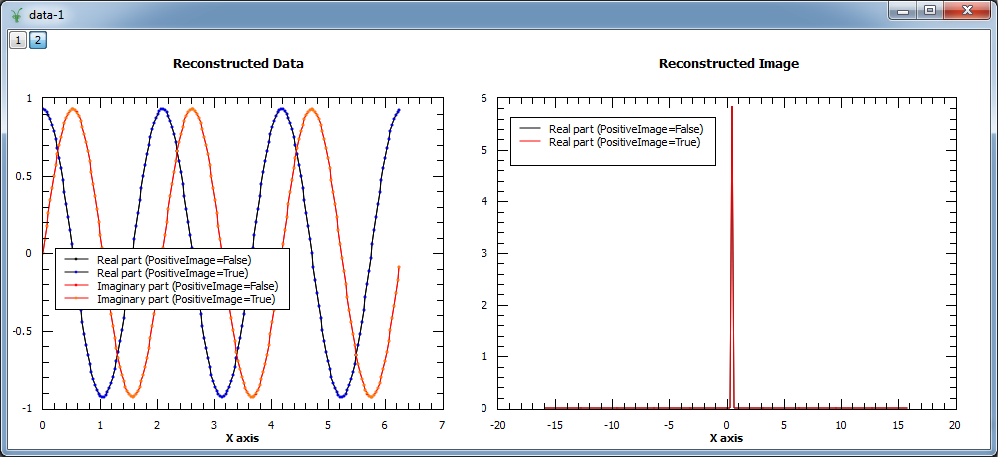
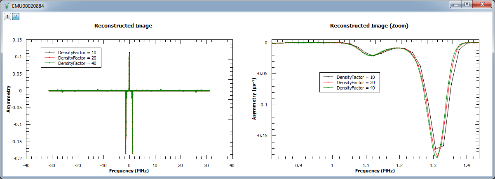
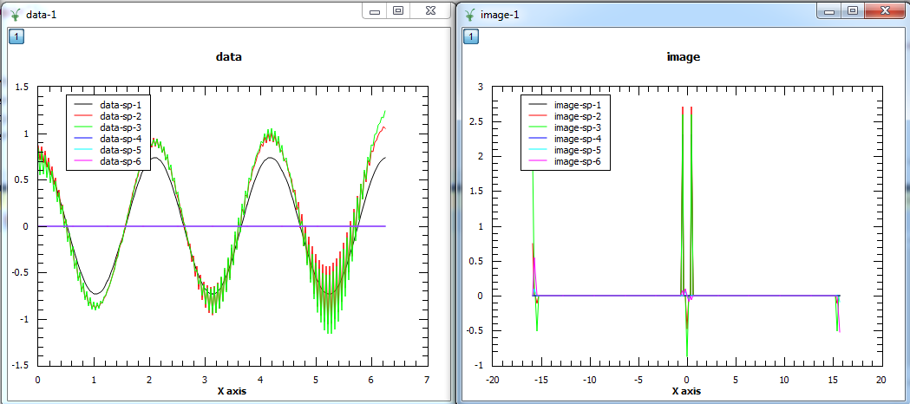
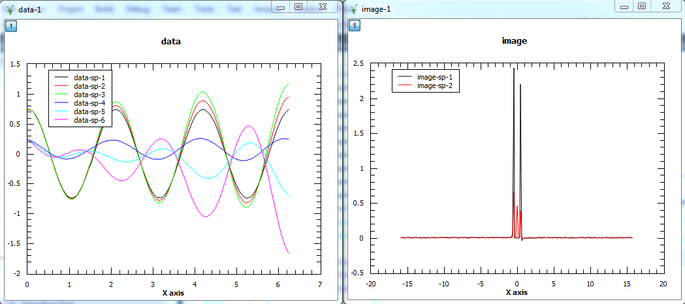

.. algorithm::

.. summary::

.. relatedalgorithms::

.. properties::

Description
-----------

The maximum entropy method (MEM) is used as a signal processing technique for reconstructing
images from noisy data. It selects a single
image from the many images which fit the data with the same value of the statistic,
:math:`\chi^2`. The maximum entropy method selects from this *feasible set* of images, the one which
has minimum information (maximum entropy).
More specifically, the algorithm maximizes the entropy :math:`S\left(x\right)` subject to the constraint:

.. math:: \chi^2 = \frac{1}{N'}\sum_m \frac{\left(d_m - d_m^c\right)^2}{\sigma_m^2} \leq \chi^2_{target}

where :math:`d_m` are the experimental data, :math:`\sigma_m` the associated errors, :math:`d_m^c`
the calculated or reconstructed data, :math:`\chi^2_{target}` is value of the input algorithm 
property ChiTargetOverN and :math:`N'` the number of measured data point. The image is a set of numbers
:math:`\{x_0, x_1, \dots, x_{N-1}\}` related to the measured data via a 1D Fourier transform:

.. math:: d_m = \frac{1}{N} \sum_{j=0}^{N-1} x_j e^{i 2\pi m j / N}

where :math:`N` is the number of image points, which can be made different from :math:`N'` and
is controlled by the input algorithm property ResolutionFactor, see examples further below.

Note that even for real input data the reconstructed image can be complex, which means that both the real and
imaginary parts will be taken into account for the calculations. This is the default behaviour, which can be
changed by setting the input property *ComplexImage* to *False*. Note that the algorithm will fail to converge
if the image is complex (i.e. the data does not satisfy Friedel's law) and this option is set to *False*. 
For this reason, it is recomended to use the default when no prior knowledge is available. 

The entropy is defined on the image :math:`\{x_j\}` as:

.. math:: S = \sum_j \left[ \sqrt{x_j^2 + A^2} - x_j \sinh^{-1}\left(\frac{x_j}{A}\right) \right]

or

.. math:: S = -\sum_j x_j \left(\log(x_j/A)-1\right)

where :math:`A` is a constant and the formula which is used depends on the input property *PositiveImage*: when it is
set to *False* the first equation will be applied, whereas the latter expresion will be used if this property
is set to *True*. The sensitive of the reconstructed image to reconstructed
image will vary depending on the data. In general a smaller value would preduce a
sharper image. See section 4.7 in Ref. [1] for recommended strategy to selected :math:`A`.

The implementation used to find the solution where the entropy is maximized
subject to the constraint in :math:`\chi^2` follows the approach by Skilling & Bryan [2], which is an
algorithm that is not explicitly using Lagrange multiplier. Instead, they
construct a subspace from a set of *search directions* to approach the maximum entropy solution. Initially,
the image :math:`x` is set to the flat background :math:`A` and the search directions are constructed
using the gradients of :math:`S` and :math:`\chi^2`:

.. math:: \mathbf{e}_1 = \left|x\right|\left(\nabla S\right)
.. math:: \mathbf{e}_2 = \left|x\right|\left(\nabla \chi^2\right)

where :math:`a\left(b\right)` stands for a componentwise multiplication between vectors
:math:`a` and :math:`b`. The algorithm next uses
a quadratic approximation to determine the increment :math:`\delta \mathbf{x}` that *moves* the image
one step closer to the solution:

.. math:: \mathbf{x} = \mathbf{x} + \delta \mathbf{x}

If *DataLinearAdj* :math:`l_m` and *DataConstAdj* :math:`c_m` are set 
then the reconstructed data is adjusted to

.. math:: d_m = \frac{l_m}{N} \sum_{j=0}^{N-1} x_j e^{i 2\pi m j / N} + c_m

If *PerSpectrumImage* is set false, then chi squared is calculated for all spectra together to form a single image

.. math:: \chi^2 = \frac{1}{N'}\sum_{m,k} \frac{\left(d_{m,k} - d_{m,k}^c\right)^2}{\sigma_{m,k}^2} \leq \chi^2_{target}

then the reconstructed data are calculated from this single image and the adjustments are applied for each spectrum:

.. math:: d_{m,k} = \frac{l_{m,k}}{N} \sum_{j=0}^{N-1} x_j e^{i 2\pi m j / N} + c_{m,k}

Output Workspaces
-----------------

There are four output workspaces: *ReconstructedImage* and *ReconstructedData* contain the image and
calculated data respectively, and *EvolChi* and *EvolAngle* record the algorithm's evolution.
*ReconstructedData* can be used to check that the calculated data approaches the experimental,
measured data, and *ReconstructedImage* corresponds to its Fourier transform. If the input data are real they
contain twice the original number of spectra, as the Fourier transform will be a complex signal
in general. The real and imaginary parts are organized as follows (see Table 1): assuming your input workspace has
:math:`M` spectra, the real part of the reconstructed spectrum :math:`s` corresponds to
spectrum :math:`s` in the output workspaces *ReconstructedImage* and *ReconstructedData*, while the imaginary part can be found in spectrum :math:`s+M`.

When the input data are complex, the input workspace is expected to have :math:`2M` spectra, where
real and imaginary parts of input :math:`s`, are arranged in spectra :math:`(s, s+M)` respectively. In other words,
*ReconstructedData* and *ReconstructedImage* will contain :math:`2M` spectra, where spectra
:math:`(s, s+M)` correspond to the real and imaginary parts reconstructed from the input signal at
:math:`(s, s+M)` in the input workspace (see Table 2 below).

The workspaces *EvolChi* and *EvolAngle* record the evolution of :math:`\chi^2` and the angle (or
non-parallelism) between :math:`\nabla S` and :math:`\nabla \chi^2`. Note that the algorithm runs
until a solution is found, and that an image is considered to be a true maximum entropy
solution when the following two conditions are met simultaneously:

.. math:: \chi^2_{Target} - \chi^2 < \epsilon_1, \qquad \frac{1}{2} \left| \frac{\nabla S}{\left|\nabla S\right|} - \frac{\nabla \chi^2}{\left|\nabla \chi^2\right|} \right| < \epsilon_2

While one of these conditions is not satisfied the algorithm keeps running until it reaches the maximum
number of iterations. When the maximum number of iterations is reached, the last
reconstructed image and its corresponding calculated data are returned, even if they do not correspond to
a true maximum entropy solution satisfying the conditions above. In this way, the user can check by inspecting
the output workspaces whether the algorithm was evolving towards the correct solution or not.
On the other hand, the user must always check the validity of the solution by inspecting *EvolChi* and *EvolAngle*,
whose values will be set to zero once the true maximum entropy solution is found.

.. table:: Table 1. Output workspaces for a real input workspace with M histograms and N bins, taking J iterations.

    +-------------------+------------------------------+----------------+--------------------------------------------------------------------------------------------------------------------------------------------------------------------------------------------------------------------------------------------------------------------------------------------------------------------+
    | Workspace         | Number of histograms         | Number of bins | Description                                                                                                                                                                                                                                                                                                        |
    +===================+==============================+================+====================================================================================================================================================================================================================================================================================================================+
    | EvolChi           | M                            | J              | For spectrum :math:`k` in the input workspace, evolution of :math:`\chi^2` until the solution is found                                                                                                                                                                                                             |
    +-------------------+------------------------------+----------------+--------------------------------------------------------------------------------------------------------------------------------------------------------------------------------------------------------------------------------------------------------------------------------------------------------------------+
    | EvolAngle         | M                            | J              | For spectrum :math:`k` in the input workspace, evolution of the angle between :math:`\nabla S` and :math:`\nabla \chi^2`, until the solution is found                                                                                                                                                              |
    +-------------------+------------------------------+----------------+--------------------------------------------------------------------------------------------------------------------------------------------------------------------------------------------------------------------------------------------------------------------------------------------------------------------+
    | ReconstructedImage| 2M                           | N              | For spectrum :math:`k` in the input workspace, the reconstructed image is stored in spectra :math:`k` (real part) and :math:`k+M` (imaginary part)                                                                                                                                                                 |
    +-------------------+------------------------------+----------------+--------------------------------------------------------------------------------------------------------------------------------------------------------------------------------------------------------------------------------------------------------------------------------------------------------------------+
    | ReconstructedData | 2M                           | N              | For spectrum :math:`k` in the input workspace, the reconstructed data are stored in spectrum :math:`k` (real part) and :math:`k+M` (imaginary part). Note that although the input is real, the imaginary part is recorded for debugging purposes, it should be zero for all data points.                           |
    +-------------------+------------------------------+----------------+--------------------------------------------------------------------------------------------------------------------------------------------------------------------------------------------------------------------------------------------------------------------------------------------------------------------+

.. table:: Table 2. Output workspaces for a complex input workspace with 2M histograms and N bins, taking J iterations.

    +-------------------+------------------------------+----------------+--------------------------------------------------------------------------------------------------------------------------------------------------------------+
    | Workspace         | Number of histograms         | Number of bins | Description                                                                                                                                                  |
    +===================+==============================+================+==============================================================================================================================================================+
    | EvolChi           | M                            | J              | For spectrum :math:`(k, k+M)` in the input workspace, evolution of :math:`\chi^2` until the solution is found                                                |
    +-------------------+------------------------------+----------------+--------------------------------------------------------------------------------------------------------------------------------------------------------------+
    | EvolAngle         | M                            | J              | For spectrum :math:`(k, k+M)` in the input workspace, evolution of the angle between :math:`\nabla S` and :math:`\nabla \chi^2`, until the solution is found |
    +-------------------+------------------------------+----------------+--------------------------------------------------------------------------------------------------------------------------------------------------------------+
    | ReconstructedImage| 2M                           | :math:`N`      | For spectrum :math:`(k, k+M)` in the input workspace, the reconstructed image is stored in spectra :math:`k` (real part) and :math:`k+M` (imaginary part)    |
    +-------------------+------------------------------+----------------+--------------------------------------------------------------------------------------------------------------------------------------------------------------+
    | ReconstructedData | 2M                           | :math:`N`      | For spectrum :math:`(k, k+M)` in the input workspace, the reconstructed data are stored in spectra :math:`k` (real part) and :math:`k+M` (imaginary part)    |
    +-------------------+------------------------------+----------------+--------------------------------------------------------------------------------------------------------------------------------------------------------------+

Usage
-----

Some of the usage examples use usage data files.

.. include:: ../usagedata-note.txt

**Example - Reconstruct Fourier coefficients**

In the example below, a workspace containing five Fourier coefficients is created and
used as input to :ref:`algm-MaxEnt`. In the figure we show the original and reconstructed data (left),
and the reconstructed image, i.e. Fourier transform (right).

.. testcode:: ExFourierCoeffs

   # Create an empty workspace
   X = []
   Y = []
   E = []
   N = 200
   for i in range(0,N):
       x = ((i-N/2) *1./N)
       X.append(x)
       Y.append(0)
       E.append(0.001)

   # Fill in five Fourier coefficients
   # The input signal must be symmetric to get a real image
   Y[5] = Y[195] = 0.85
   Y[10] = Y[190] = 0.85
   Y[20] = Y[180] = 0.85
   Y[12] = Y[188] = 0.90
   Y[14] = Y[186] = 0.90
   CreateWorkspace(OutputWorkspace='inputws',DataX=X,DataY=Y,DataE=E,NSpec=1)
   evolChi, evolAngle, image, data = MaxEnt(InputWorkspace='inputws', A=0.0001)

   print("First  reconstructed coefficient: {:.3f}".format(data.readY(0)[5]))
   print("Second reconstructed coefficient: {:.3f}".format(data.readY(0)[10]))
   print("Third  reconstructed coefficient: {:.3f}".format(data.readY(0)[20]))
   print("Fourth reconstructed coefficient: {:.3f}".format(data.readY(0)[12]))
   print("Fifth  reconstructed coefficient: {:.3f}".format(data.readY(0)[14]))
   print("Number of iterations: "+str( len(evolAngle.readX(0))))

Output:

.. testoutput:: ExFourierCoeffs
   :options: +ELLIPSIS +NORMALIZE_WHITESPACE

   First  reconstructed coefficient: 0.847
   Second reconstructed coefficient: 0.846
   Third  reconstructed coefficient: 0.846
   Fourth reconstructed coefficient: 0.896
   Fifth  reconstructed coefficient: 0.896
   Number of iterations: ...

   

**Example - Reconstruct a real muon dataset**

In this example, :ref:`algm-MaxEnt` is run on a pre-analyzed muon dataset. The corresponding figure shows
the original and reconstructed data (left), and the real part of the image obtained with :ref:`algm-MaxEnt`
and :ref:`algm-FFT` (right).

.. testcode:: ExMUSR00022725

   Load(Filename=r'MUSR00022725.nxs', OutputWorkspace='MUSR00022725')
   CropWorkspace(InputWorkspace='MUSR00022725', OutputWorkspace='MUSR00022725', XMin=0.11, XMax=1.6, EndWorkspaceIndex=0)
   RemoveExpDecay(InputWorkspace='MUSR00022725', OutputWorkspace='MUSR00022725')
   Rebin(InputWorkspace='MUSR00022725', OutputWorkspace='MUSR00022725', Params='0.016')
   evolChi, evolAngle, image, data = MaxEnt(InputWorkspace='MUSR00022725', A=0.005)
   # Compare MaxEnt to FFT
   imageFFT = FFT(InputWorkspace='MUSR00022725')

   print("Image at {:.3f}: {:.3f}".format(image.readX(0)[44], image.readY(0)[44]))
   print("Image at {:.3f}: {:.3f}".format(image.readX(0)[46], image.readY(0)[46]))
   print("Image at {:.3f}: {:.3f}".format(image.readX(0)[48], image.readY(0)[48]))
   # check background is not nosiy
   def getInt(originalX,originalY,xMin,xMax):
      import numpy as np
      yData=[]
      xData=[]
      for j in range(0,len(originalX)):
          if originalX[j]>xMin and originalX[j]<xMax:
              yData.append(originalY[j]**2)
              xData.append(originalX[j])
      return np.trapz(x=xData,y=np.sqrt(yData))
   # Do not change these numbers - they test if noise has been added to the alg    
   print("Negative background {:.6f}".format(getInt(image.readX(0), image.readY(0),-30,-2 )))
   print("Positive background {:.6f}".format(getInt(image.readX(0), image.readY(0),2,30 )))
   print ("Number of iterations: "+str( len(evolAngle.readX(0))))
   
Output:

.. testoutput:: ExMUSR00022725
   :options: +ELLIPSIS +NORMALIZE_WHITESPACE

   Image at -1.359: 0.100
   Image at 0.000: 0.009
   Image at 1.359: 0.100
   Negative background 0.006431
   Positive background 0.006431
   Number of iterations: ...

Next, :ref:`algm-MaxEnt` is run on a different muon dataset. The figure shows
the original and reconstructed data (left), the real part of the image (middle)
and its imaginary part (right).

.. testcode:: ExEMU00020884

   Load(Filename=r'EMU00020884.nxs', OutputWorkspace='EMU00020884')
   CropWorkspace(InputWorkspace='EMU00020884', OutputWorkspace='EMU00020884', XMin=0.17, XMax=4.5, EndWorkspaceIndex=0)
   RemoveExpDecay(InputWorkspace='EMU00020884', OutputWorkspace='EMU00020884')
   Rebin(InputWorkspace='EMU00020884', OutputWorkspace='EMU00020884', Params='0.016')
   evolChi, evolAngle, image, data = MaxEnt(InputWorkspace='EMU00020884', A=0.0001, MaxIterations=2500, ChiTargetOverN=300.0/270.0)
   # Compare MaxEnt to FFT
   imageFFT = FFT(InputWorkspace='EMU00020884')

   print("Image (real part) at {:.3f}: {:.3f}".format(image.readX(0)[129], image.readY(0)[129]))
   print("Image (real part) at  {:.3f}:  {:.3f}".format(image.readX(0)[135], image.readY(0)[135]))
   print("Image (real part) at  {:.3f}: {:.3f}".format(image.readX(0)[141], image.readY(0)[141]))
   print("Image (imaginary part) at {:.3f}: {:.3f}".format(image.readX(1)[129], image.readY(1)[129]))
   print("Image (imaginary part) at  {:.3f}:  {:.3f}".format(image.readX(1)[135], image.readY(1)[135]))
   print("Image (imaginary part) at  {:.3f}:  {:.3f}".format(image.readX(1)[141], image.readY(1)[141]))
   print ("Number of iterations: "+str( len(evolAngle.readX(0))))

Output:

.. testoutput:: ExEMU00020884
   :options: +ELLIPSIS +NORMALIZE_WHITESPACE

   Image (real part) at -1.389: -0.063
   Image (real part) at  0.000:  0.035
   Image (real part) at  1.389: -0.063
   Image (imaginary part) at -1.389: -0.277
   Image (imaginary part) at  0.000:  0.000
   Image (imaginary part) at  1.389:  0.277
   Number of iterations: ...

Finally, we show an example where a complex signal is analyzed. In this case, the input workspace contains two spectra corresponding to the
real and imaginary part of the same signal. The figure shows
the original and reconstructed data (left), and the reconstructed image (right).

.. testcode:: ExRealImage

   from math import pi, sin, cos
   from random import random, seed
   seed(0)
   # Create a test workspace
   X = []
   YRe = []
   YIm = []
   E = []
   N = 200
   w = 3
   for i in range(0,N):
       x = 2*pi*i/N
       X.append(x)
       YRe.append(cos(w*x)+(random()-0.5)*0.3)
       YIm.append(sin(w*x)+(random()-0.5)*0.3)
       E.append(0.1)
   CreateWorkspace(OutputWorkspace='ws',DataX=X+X,DataY=YRe+YIm,DataE=E+E,NSpec=2)
   evolChi, evolAngle, image, data = MaxEnt(InputWorkspace='ws', ComplexData=True, A=0.001)

   print("Image (real part) at {:.3f}: {:.3f}".format(image.readX(0)[102], image.readY(0)[102]))
   print("Image (real part) at {:.3f}: {:.3f}".format(image.readX(0)[103], image.readY(0)[103]))
   print("Image (real part) at {:.3f}: {:.3f}".format(image.readX(0)[104], image.readY(0)[104]))
   print ("Number of iterations: "+str( len(evolAngle.readX(0))))

Output:

.. testoutput:: ExRealImage
   :options: +ELLIPSIS +NORMALIZE_WHITESPACE

   Image (real part) at 0.318: 0.000
   Image (real part) at 0.477: 5.862
   Image (real part) at 0.637: 0.000
   Number of iterations: ...

Positive Images
---------------

The algorithm allows users to restrict the reconstructed image to positive values only. This behaviour can be
selected by setting the input property *PositiveImage* to true. In this case, the entropy is defined by the
expression:

.. math:: S = -\sum_j x_j \left(\log(x_j/A)-1\right)

In addition, the algorithm explicitly protects against negative values by setting those to a fraction of the maximum entropy constant *A*.
In the example below both modes are compared. As the input is a complex signal with expected Fourier transform :math:`F(\omega) = \delta\left(\omega-\omega_0\right)`,
i.e. positive,
both modes should produce the same results (note that the maximum entropy constant *A* typically needs to be set to smaller values for positive
image in order to obtain smooth results).

.. testcode:: ExRealPosImage

   from math import pi, sin, cos
   from random import random, seed
   seed(0)
   # Create a test workspace
   X = []
   YRe = []
   YIm = []
   E = []
   N = 200
   w = 3
   for i in range(0,N):
       x = 2*pi*i/N
       X.append(x)
       YRe.append(cos(w*x)+(random()-0.5)*0.3)
       YIm.append(sin(w*x)+(random()-0.5)*0.3)
       E.append(0.1)
   CreateWorkspace(OutputWorkspace='ws',DataX=X+X,DataY=YRe+YIm,DataE=E+E,NSpec=2)
   evolChi, evolAngle, image, data = MaxEnt(InputWorkspace='ws', ComplexData=True, A=0.001, PositiveImage=False)
   evolChiP, evolAngleP, imageP, dataP = MaxEnt(InputWorkspace='ws', ComplexData=True, A=0.001, PositiveImage=True)

   print("Image at {:.3f}: {:.3f} (PositiveImage=False), {:.3f} (PositiveImage=True)".format(image.readX(0)[102], image.readY(0)[102], imageP.readY(0)[102]))
   print("Image at {:.3f}: {:.3f} (PositiveImage=False), {:.3f} (PositiveImage=True)".format(image.readX(0)[103], image.readY(0)[103], imageP.readY(0)[103]))
   print("Image at {:.3f}: {:.3f} (PositiveImage=False), {:.3f} (PositiveImage=True)".format(image.readX(0)[104], image.readY(0)[104], imageP.readY(0)[102]))
   print ("Number of iterations: "+str( len(evolAngle.readX(0))))
   print ("Number of iterations: "+str( len(evolAngleP.readX(0))))
   
Output:

.. testoutput:: ExRealPosImage
   :options: +ELLIPSIS +NORMALIZE_WHITESPACE

   Image at 0.318: 0.000 (PositiveImage=False), 0.000 (PositiveImage=True)
   Image at 0.477: 5.862 (PositiveImage=False), 5.913 (PositiveImage=True)
   Image at 0.637: 0.000 (PositiveImage=False), 0.000 (PositiveImage=True)
   Number of iterations: ...
   Number of iterations: ...

Complex Images
--------------

By default the input property *ComplexImage* is set to *True* and the algorithm will assume complex images for the calculations.
This means that the set of numbers :math:`\{x_j\}` that form the image will have a real and an imaginary part, and both components will be
considered to evaluate the entropy, :math:`S\left(x_j\right)`, and its derivative, :math:`\nabla S\left(x_j\right)`. This effectively means
splitting the entropy (the same applies to its derivative) in two terms, :math:`S\left(x_j\right) = \left[S\left(x_j^{re}\right), S\left(x_j^{im}\right)\right]`,
where the first one refers to the real part of the entropy and the second one to the imaginary part. This is the recommended option when no prior knowledge
about the image is available, as trying to reconstruct images that are inherently complex discarding the imaginary part will prevent the algorithm
from converging. If the image is known to be real this property can be safely set to *False*.

Complex Data
------------
If the input property *ComplexData* is set to *True*, the algorithm will assume complex data for the calculations with all the
real parts listed before all the imaginary parts. This means that if you have workspaces where the imaginary part immediately
follow the real part, such workspaces cannot be combined by using the :ref:`algm-AppendSpectra` algorithm because the resulting
output will not order the real and imaginary parts corrected as needed for this algorithm. The following usage example
shows how to combine two workspaces with complex data.

.. testcode:: ExComplexData

   from math import pi, sin, cos
   from random import random, seed
   seed(0)
   # Create complex data for a workspace
   X = []
   YRe = []
   YIm = []
   E = []
   N = 200
   w = 3
   for i in range(0,N):
       x = 2*pi*i/N
       X.append(x)
       YRe.append(cos(w*x)+(random()-0.5)*0.3)
       YIm.append(sin(w*x)+(random()-0.5)*0.3)
       E.append(0.1)

   seed(0)
   # Create complex data for a second workspace
   X2 = []
   YRe2 = []
   YIm2 = []
   E2 = []
   N2 = 200
   w2 = 4
   for i in range(0,N2):
       x = 2*pi*i/N2
       X2.append(x)
       YRe2.append(cos(w2*x)+(random()-0.5)*0.3)
       YIm2.append(sin(w2*x)+(random()-0.5)*0.3)
       E2.append(0.5)

   # Create two workspaces of one spectrum each    
   CreateWorkspace(OutputWorkspace='ws1',DataX=X+X,DataY=YRe+YIm,DataE=E+E,NSpec=2)
   evolChiP, evolAngleP, imageP, dataP = MaxEnt(InputWorkspace='ws1', ComplexData=True, A=0.001, PositiveImage=True)

   print ("Number of iterations dataset1 separate: "+str( len(evolAngleP.readX(0))))

   CreateWorkspace(OutputWorkspace='ws2',DataX=X2+X2,DataY=YRe2+YIm2,DataE=E2+E2,NSpec=2)
   evolChiP2, evolAngleP2, imageP2, dataP2 = MaxEnt(InputWorkspace='ws2', ComplexData=True, A=0.001, PositiveImage=True)

   print ("Number of iterations dataset2 separate: "+str( len(evolAngleP2.readX(0))))

   # Combine the two workspaces
   CreateWorkspace(OutputWorkspace='wsCombined',DataX=X+X2+X+X2,DataY=YRe+YRe2+YIm+YIm2,DataE=E+E2+E+E2,NSpec=4)
   evolChiC, evolAngleC, imageC, dataC = MaxEnt(InputWorkspace='wsCombined', ComplexData=True, A=0.001, PositiveImage=True)

   print ("Number of iterations dataset1 combined: "+str( len(evolAngleC.readX(0))))
   print ("Number of iterations dataset2 combined: "+str( len(evolAngleC.readX(1))))

Output:

.. testoutput:: ExComplexData
   :options: +ELLIPSIS +NORMALIZE_WHITESPACE

   Number of iterations dataset1 separate: ...
   Number of iterations dataset2 separate: ...
   Number of iterations dataset1 combined: ...
   Number of iterations dataset2 combined: ...

Increasing the number of points in the image
--------------------------------------------

The algorithm has an input property, *ResolutionFactor*, that allows to increase the number of points in the reconstructed image. This is
at present done by extending the range (and therefore the number of points) in the reconstructed data. The number of reconstructed
points can be increased by any integer factor, but note that this will slow down the algorithm and you may need to increase the number of
maxent iterations so that the algorithm is able to converge to a solution.

An example script where the density of points is increased by a factor of 2 can be found below. Note that when a factor of 2 is used,
the reconstructed data is twice the size of the original (experimental) data. Also shown is how ChiTargetOverN property may be varied away
from the default 1.0; the dataset contains 270 data points and here set to be slightly higher at 300/270.

.. testcode:: ExResolutionFactor

   Load(Filename=r'EMU00020884.nxs', OutputWorkspace='ws')
   CropWorkspace(InputWorkspace='ws', OutputWorkspace='ws', XMin=0.17, XMax=4.5, EndWorkspaceIndex=0)
   ws = RemoveExpDecay(InputWorkspace='ws')
   ws = Rebin(InputWorkspace='ws', Params='0.016')
   evolChi1, evolAngle1, image1, data1 = MaxEnt(InputWorkspace='ws', A=0.0001, MaxIterations=2500, ResolutionFactor=1, ChiTargetOverN=300.0/270.0)
   evolChi2, evolAngle2, image2, data2 = MaxEnt(InputWorkspace='ws', A=0.0001, MaxIterations=5000, ResolutionFactor=2, ChiTargetOverN=300.0/270.0)

   print("Image at {:.3f}: {:.3f} (ResolutionFactor=1)".format(image1.readX(0)[135], image1.readY(0)[135]))
   print("Image at {:.3f}: {:.3f} (ResolutionFactor=2)".format(image2.readX(0)[270], image2.readY(0)[270]))
   print ("Number of iterations: "+str( len(evolAngle1.readX(0))))
   print ("Number of iterations: "+str( len(evolAngle2.readX(0))))

Output:

.. testoutput:: ExResolutionFactor
   :options: +ELLIPSIS +NORMALIZE_WHITESPACE

   Image at 0.000: 0.035 (ResolutionFactor=1)
   Image at 0.000: 0.068 (ResolutionFactor=2)
   Number of iterations: ...
   Number of iterations: ...

   
In the next example, we increased the density of points by factors of 10, 20 and 40. We show the reconstructed image (left) and
a zoom into the region :math:`0.82 < x < 1.44` and :math:`-0.187 < y < 0.004`.

.. testcode:: ExResolutionFactor2

   Load(Filename=r'EMU00020884.nxs', OutputWorkspace='ws')
   CropWorkspace(InputWorkspace='ws', OutputWorkspace='ws', XMin=0.17, XMax=4.5, EndWorkspaceIndex=0)
   ws = RemoveExpDecay(InputWorkspace='ws')
   ws = Rebin(InputWorkspace='ws', Params='0.016')
   evolChi1, evolAngle1, image1, data1 = MaxEnt(InputWorkspace='ws', A=0.0001, MaxIterations=2500, ResolutionFactor=1)
   evolChi10, evolAngle10, image10, data10 = MaxEnt(InputWorkspace='ws', A=0.0001, MaxIterations=25000, ResolutionFactor=10)
   evolChi20, evolAngle20, image20, data20 = MaxEnt(InputWorkspace='ws', A=0.0001, MaxIterations=50000, ResolutionFactor=20)
   evolChi40, evolAngle40, image40, data40 = MaxEnt(InputWorkspace='ws', A=0.0001, MaxIterations=75000, ResolutionFactor=40)

   print ("Number of iterations: "+str( len(evolAngle1.readX(0))))
   print ("Number of iterations: "+str( len(evolAngle10.readX(0))))
   print ("Number of iterations: "+str( len(evolAngle20.readX(0))))
   print ("Number of iterations: "+str( len(evolAngle40.readX(0))))

Output:

.. testoutput:: ExResolutionFactor2
   :options: +ELLIPSIS +NORMALIZE_WHITESPACE

   Number of iterations: ...
   Number of iterations: ...
   Number of iterations: ...
   Number of iterations: ...

   
Adjusting the Reconstructed Data
--------------------------------
The reconstructed data can be adjusted by multiplying by the *DataLinearAdj* property and then adding the *DataConstAdj* property. 
Each of these properties is a workspace with complex Y values, just like complex input workspaces. Each Y value is then applied to 
the corresponding Y values in the reconstructed data at each iteration.

.. testcode:: ExAdjustment

   from math import pi, sin, cos
   from random import random, seed

   # Construct workspace (cosine + noise) over 3 spectra
   X = []
   Y = []
   E = []
   N = 200
   w = 3
   for s in range(0,3):
       seed(0)
       for i in range(0,N):
           x = 2*pi*i/N
           X.append(x)
           Y.append(cos(w*x)+(random()-0.5)*0.3)
           E.append(0.2)
        
   CreateWorkspace(OutputWorkspace='inputws',DataX=X,DataY=Y,DataE=E,NSpec=3)

   # Construct linear adjustment workspace (real = 1, imaginary linear)
   # no adjustment on first spectrum, double adjustment on third spectrum.
   Zeroes = []
   Ylin = []
   Magnitude = - 0.1
   # Real values
   for s in range(0,3):
       for i in range(0,N):
           Ylin.append(1.0)
           Zeroes.append(0)
        
   # Imaginary values
   for s in range(0,3):
       for i in range(0,N):
           X.append(X[i])
           Ylin.append(s*Magnitude*X[i])
           Zeroes.append(0)
        
   CreateWorkspace(OutputWorkspace='linadj', DataX=X, DataY=Ylin, DataE=Zeroes, NSpec=6)

   # Construct linear adjustment workspace (real = 0, imaginary linear)
   # no adjustment on first spectrum, double adjustment on third spectrum.
   Yconst = []
   Magnitude = 0.2
   # Real values
   for s in range(0,3):
       for i in range(0,N):
           Yconst.append(0)
        
   # Imaginary values
   for s in range(0,3):
       for i in range(0,N):
           Yconst.append(s*Magnitude*X[i])
        
   CreateWorkspace(OutputWorkspace='constadj',DataX=X, DataY=Yconst, DataE=Zeroes, NSpec=6)

   evolChi, evolAngle, image, data = MaxEnt(InputWorkspace='inputws', DataLinearAdj='linadj', DataConstAdj='constadj',A=0.001)
    
   print("Reconstruction at 05 of first spectrum: {:.3f}".format(data.readY(0)[5]))
   print("Reconstruction at 10 of first spectrum: {:.3f}".format(data.readY(0)[10]))
   print("Reconstruction at 15 of first spectrum: {:.3f}".format(data.readY(0)[15]))
   print("Reconstruction at 05 of third spectrum: {:.3f}".format(data.readY(2)[5]))
   print("Reconstruction at 10 of third spectrum: {:.3f}".format(data.readY(2)[10]))
   print("Reconstruction at 15 of third spectrum: {:.3f}".format(data.readY(2)[15]))
   print("Number of iterations of first spectrum: "+str( len(evolAngle.readX(0))))
   print("Number of iterations of second spectrum: "+str( len(evolAngle.readX(1))))
   print("Number of iterations of third spectrum: "+str( len(evolAngle.readX(2))))

Output:

.. testoutput:: ExAdjustment
   
   Reconstruction at 05 of first spectrum: 0.657
   Reconstruction at 10 of first spectrum: 0.433
   Reconstruction at 15 of first spectrum: 0.115
   Reconstruction at 05 of third spectrum: 0.522
   Reconstruction at 10 of third spectrum: 0.485
   Reconstruction at 15 of third spectrum: -0.019
   Number of iterations of first spectrum: 5
   Number of iterations of second spectrum: 37
   Number of iterations of third spectrum: 70
   

   
   The first plot shows the reconstructed data and the second plot the corresponding image.
   The first three spectra plotted are the real parts of the 3 spectra
   and the other three spectra are the imaginary parts.
   
This can also be done with the spectra of the data effectively concatenated and converted into a single image.
The reconstructed data is then obtained by converting the image back to data copied for each spectrum and applying the adjustments.

This is done by setting the *PerSpectrumImage* property to *false*.

.. testcode:: ExAdjustmentTogether

   from math import pi, sin, cos
   from random import random, seed

   # Construct workspace (cosine + noise) over 3 spectra
   X = []
   Y = []
   E = []
   N = 200
   w = 3
   for s in range(0,3):
      # Real values
      seed(0)
      for i in range(0,N):
        x = 2*pi*i/N
        X.append(x)
        Y.append(cos(w*x)+(random()-0.5)*0.3)
        E.append(0.27)
     
   for s in range(0,3):
      # Imaginary values
      for i in range(0,N):
        x = 2*pi*i/N
        X.append(x)
        Y.append((random()-0.5)*0.3)
        E.append(0.27)

   CreateWorkspace(OutputWorkspace='inputws',DataX=X,DataY=Y,DataE=E,NSpec=6)

   # Construct linear adjustment workspace (real = 1, imaginary linear)
   # no adjustment on first spectrum, double adjustment on third spectrum.
   Zeroes = []
   Xlin = []
   Ylin = []
   Magnitude = - 0.1
   for s in range(0,3):
      # Real values
      for i in range(0,N):
         Xlin.append(X[i])
         Ylin.append(1.0)
         Zeroes.append(0)

   for s in range(0,3):
      # Imaginary values
      for i in range(0,N):
         Xlin.append(X[i])
         Ylin.append(Magnitude*X[i])
         Zeroes.append(0)

   CreateWorkspace(OutputWorkspace='linadj', DataX=Xlin, DataY=Ylin, DataE=Zeroes, NSpec=6)

   # Construct constant adjustment workspace (real = 0, imaginary linear)
   # no adjustment on first spectrum, double adjustment on third spectrum.
   Yconst = []
   Magnitude = 0.2
   # Real values
   for s in range(0,3):
       for i in range(0,N):
          Yconst.append(0)

   # Imaginary values
   for s in range(0,3):
       for i in range(0,N):
           Yconst.append(Magnitude*X[i])

   CreateWorkspace(OutputWorkspace='constadj',DataX=Xlin, DataY=Yconst, DataE=Zeroes, NSpec=6)

   evolChi, evolAngle, image, data = MaxEnt(InputWorkspace='inputws', ComplexData=True, DataLinearAdj='linadj', DataConstAdj='constadj',A=0.001, PerSpectrumReconstruction=False)

   print("Reconstruction at 05 of first spectrum: {:.3f}".format(data.readY(0)[5]))
   print("Reconstruction at 10 of first spectrum: {:.3f}".format(data.readY(0)[10]))
   print("Reconstruction at 15 of first spectrum: {:.3f}".format(data.readY(0)[15]))
   print("Reconstruction at 05 of third spectrum: {:.3f}".format(data.readY(2)[5]))
   print("Reconstruction at 10 of third spectrum: {:.3f}".format(data.readY(2)[10]))
   print("Reconstruction at 15 of third spectrum: {:.3f}".format(data.readY(2)[15]))
   print("Number of iterations: "+str( len(evolAngle.readX(0))))
   
Output:

.. testoutput:: ExAdjustmentTogether

   Reconstruction at 05 of first spectrum: 0.971
   Reconstruction at 10 of first spectrum: 0.935
   Reconstruction at 15 of first spectrum: 0.881
   Reconstruction at 05 of third spectrum: 0.831
   Reconstruction at 10 of third spectrum: 0.800
   Reconstruction at 15 of third spectrum: 0.746
   Number of iterations: 59
   

   
   The first plot shows the reconstructed data and the second plot the corresponding image.
   In the data, the first three spectra plotted are the real parts of the 3 spectra
   and the other three spectra are the imaginary parts.
   In the image, the first spectrum is the real part and the second spectrum is the imaginary part.

References
----------

[1] Anders Johannes Markvardsen, (2000). Polarised neutron diffraction measurements of PrBa2Cu3O6+x and the Bayesian statistical analysis of such data. DPhil. University of Oxford (http://ora.ox.ac.uk/objects/uuid:bef0c991-4e1c-4b07-952a-a0fe7e4943f7)

[2] Skilling & Bryan, (1984). Maximum entropy image reconstruction: general algorithm. Mon. Not. R. astr. Soc. 211, 111-124.

.. categories::

.. sourcelink::
