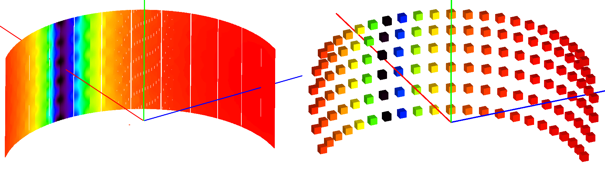

.. algorithm::

.. summary::

.. relatedalgorithms::

.. properties::

Description
-----------

This algorithm performs a Monte Carlo simulation to calculate the correction factors due
to attenuation & single scattering within a sample plus optionally its sample environment.

Input Workspace Requirements
############################

The algorithm will compute the correction factors on a bin-by-bin basis for each spectrum within
the input workspace. The following assumptions on the input workspace will are made:

- X units are in wavelength
- the instrument is fully defined
- properties of the sample and optionally its environment have been set with
  :ref:`SetSample <algm-SetSample>`

By default the beam is assumed to be the a slit with width and height matching
the width and height of the sample. This can be overridden using :ref:`SetBeam <algm-SetBeam>`.

Method
######

By default, the material for the sample & containers will define the values of the cross section used to compute the absorption factor and will
include contributions from both the total scattering cross section & absorption cross section.
This follows the Hamilton-Darwin [#DAR]_, [#HAM]_ approach as described by T. M. Sabine in the International Tables of Crystallography Vol. C [#SAB]_.

The algorithm proceeds as follows. For each spectrum:

#. find the associated detector position

#. find the associated efixed value (if applicable) & convert to wavelength (:math:`\lambda_{fixed}`)

#. for each event in `NEvents`

   * loop over the bins.

     - If `ResimulateTracksForDifferentWavelengths` = True then generate tracks using the following procedure for each wavelength step,
       where the size of each wavelength step is defined by `NumberOfWavelengthPoints`. If `ResimulateTracksForDifferentWavelengths` = false
       generate one set of tracks and define a step size of 1 ie all bins are visited. At the moment there are no wavelength dependent effects in the simulation that affect the simulation of the track geometry so the default value for `ResimulateTracksForDifferentWavelengths` is false.
       For each step (:math:`\lambda_{step}`)

     - generate a random point on the beam face defined by the input height & width. If the point is outside of the
       area defined by the face of the sample then it is pulled to the boundary of this area

     - generate a random point within the sample or container objects as the scatter point and create a `Track`
       from the selected position on the beam face to the scatter point

     - test for intersections of the track & sample/container objects, giving the number of subsections
       and corresponding distances within the object for each section, call them :math:`l_{1i}`

     - form a second `Track` with the scatter position as the starting point and the direction defined by
       `detPos - scatterPos`

     - test for intersections of the track & sample/container objects, giving the number of subsections
       and corresponding distances within the object for each section, call them :math:`l_{2i}`

     - define :math:`\lambda_1` as the wavelength before scattering & :math:`\lambda_2` as wavelength after scattering:

        - Direct: :math:`\lambda_1 = \lambda_1`, :math:`\lambda_2 = \lambda_{step}`

        - Indirect: :math:`\lambda_1 = \lambda_{step}`, :math:`\lambda_2 = \lambda_{fixed}`

        - Elastic: :math:`\lambda_1 = \lambda_2 = \lambda_{step}`

     - compute the self-attenuation factor for all intersections as
       :math:`\prod\limits_{i} \exp(-(\rho_{1i}\sigma_{1i}(\lambda_{1i})l_{1i} + \rho_{2i}\sigma_{2i}(\lambda_{2i})l_{2i}))`
       where :math:`\rho` is the mass density of the material &
       :math:`\sigma` the absorption cross-section at a given wavelength

     - accumulate this wavelength-specific factor across all `NEvents`

#. average the accumulated attentuation factors over `NEvents` and assign this as the correction factor for
   this :math:`\lambda_{step}`. Calculate the error as the standard deviation of the accumulated attenuation factors divided by :math:`\sqrt{NEvents}`

#. finally, if `ResimulateTracksForDifferentWavelengths` = True, interpolate through the unsimulated wavelength points using the selected method

The algorithm generates some statistics on the number of scatter points generated in the sample and each environment component if the logging level is set to debug.

Interpolation
#############

The default linear interpolation method will produce an absorption curve that is not smooth. CSpline interpolation
will produce a smoother result by using a 3rd-order polynomial to approximate the original points - although if the data includes sudden changes it may introduce oscillations including negative values at the interpolated points.

The errors that the Monte Carlo simulation calculates for different wavelength points in a single spectrum may or may not be independent. If the same set of tracks have been used for different wavelengths (ResimulateTracksForDifferentWavelengths=False) then the errors will be correlated. A worst case positive correlation has been assumed giving an error on the interpolated point that is approximately the same as the surrounding simulated points.

If ResimulateTracksForDifferentWavelengths=True then the errors on the simulated points will be independent and the errors can be combined using standard formulae for combining errors on independent variables.

The error propagation through the spline interpolation is complex because each cubic polynomial is usually expressed as a function of the known y values and a derivative of those y values at the same points (some texts use the first derivative others the second). The error in y and the derivative of y are correlated at a particular x value and the derivatives at different x values are also correlated. So some extra covariances are required in addition to the error (variance) of each y value. The method followed [#GAR]_ involves inverting a symmetric tridiagonal matrix and an analytic calculation for the inversion has been implemented to minimize the run time [#HUO]_

Sparse instrument
#################

The simulation may take long to complete on instruments with a large number of detectors. To speed up the simulation, the instrument can be approximated by a sparse grid of detectors. The behavior can be enabled by setting the *SparseInstrument* property to true.

The sparse instrument consists of a grid of detectors covering the full instrument entirely. The figure below shows an example of a such an instrument approximating the IN5 spectrometer at ILL.

   Absorption corrections for IN5 spectrometer interpolated from the sparse instrument shown on the right. The sparse instrument has 6 detector rows and 22 columns, a total of 132 detectors. IN5, on the other hand, has approximately 100000 detectors.

.. note:: It is recommended to remove monitor spectra from the input workspace since these are included in the area covered by the sparse instrument and may make the detector grid unnecessarily large.

When the sparse instrument option is enabled, a sparse instrument corresponding to the instrument attached to the input workspace is created. The simulation is then run using the created instrument. Finally, the simulated absorption corrections are interpolated to the output workspace.

The interpolation is a two step process: first a spatial interpolation is done from the detector grid of the sparse instrument to the actual detector positions of the full instrument. Then, if `ResimulateTracksForDifferentWavelengths` = True the correction factors are interpolated over the missing wavelengths.

.. note:: Currently, the sparse instrument mode does not support instruments with varying *EFixed*.

Spatial interpolation
^^^^^^^^^^^^^^^^^^^^^

The sample to detector distance does not matter for absorption, so it suffices to consider directions only. The detector grid of the sparse instrument consists of detectors at constant latitude and longitude intervals. For a detector :math:`D` of the full input instrument at latitude :math:`\phi` and longitude :math:`\lambda`, we pick the four detectors :math:`D_{ij}` (:math:`i = 1, 2` :math:`j = 1, 2`) at the corners of the grid cell which includes (:math:`\phi`, :math:`\lambda`).

If :math:`D` coincides with any :math:`D_{ij}`, the :math:`y` values of the histogram linked to :math:`D` are directly taken from :math:`D_{ij}`. Otherwise, :math:`y` is interpolated using a bilinear interpolation method. The data is interpolated in the longitude direction first:

.. math::

   y_1 = \frac{(\lambda_2 - \lambda) * y_{11} + (\lambda - \lambda_1) * y_{21}}{\lambda_2 - \lambda_1}

   y_2 = \frac{(\lambda_2 - \lambda) * y_{12} + (\lambda - \lambda_1) * y_{22}}{\lambda_2 - \lambda_1},

and then finally in the latitude direction:

.. math::

   y = \frac{(\phi_2 - \phi) * y_1 + (\phi - \phi_1) * y_2}{\phi_2 - \phi_1}

The errors present in the 4 simulated histograms are assumed to be independent and they are propagated through the bilinear formulae given above to give one contribution to the error on the interpolated histogram. The second contribution is the interpolation error (how well the bilinear interpolation matches the actual attenuation factor variation). This is calculated based on the second derivative of the attenuation factor in the :math:`\phi` and :math:`\lambda` directions ([#SEV]_)

Wavelength interpolation for sparse instruments
^^^^^^^^^^^^^^^^^^^^^^^^^^^^^^^^^^^^^^^^^^^^^^^

The wavelength points for simulation with the sparse instrument are chosen as follows:

#. Find the global minimum and maximum wavelengths of the input workspace.

#. Divide the wavelength interval to as many points as defined by the input parameters.

After the simulation has been run and the spatial interpolation done, the interpolated histograms will be further interpolated to the wavelength points of the input workspace. This is done similarly to the full instrument case. If only a single wavelength point is specified, then the output histograms will be filled with the single simulated value.

.. note:: If the input workspace contains varying bin widths then the output is always interpolated.

Interaction Region
##################

Within the algorithm, the ``SimulateScatteringPointIn`` parameter can be used to control whether scattering points are simulate from within the sample, within the environment, or both. Additionally, the volume from which scattered points are generated can be controlled by altering the beam profile (:ref:`SetSample <algm-SetSample>`) or by defining a gauge volume (:ref:`algm-DefineGaugeVolume`).

.. note:: If a gauge volume is set, any definition of ``SimulateScatteringPointIn`` will be overridden to ``SampleOnly``.

Usage
-----

**Example: A cylindrical sample with no container**

.. testcode:: ExCylinderSampleOnly

   data = CreateSampleWorkspace(WorkspaceType='Histogram', NumBanks=1)
   data = ConvertUnits(data, Target="Wavelength")
   # Default up axis is Y
   SetSample(data, Geometry={'Shape': 'Cylinder', 'Height': 5.0, 'Radius': 1.0,
                     'Center': [0.0,0.0,0.0]},
                   Material={'ChemicalFormula': '(Li7)2-C-H4-N-Cl6', 'SampleNumberDensity': 0.07})
   # Simulating every data point can be slow. Use a smaller set and interpolate
   abscor = MonteCarloAbsorption(data)
   corrected = data/abscor

**Example: A cylindrical sample with no container, resimulating tracks for different wavelengths, interpolating with a CSpline**

.. testcode:: ExCylinderSampleOnlyAndSpline

   data = CreateSampleWorkspace(WorkspaceType='Histogram', NumBanks=1)
   data = ConvertUnits(data, Target="Wavelength")
   # Default up axis is Y
   SetSample(data, Geometry={'Shape': 'Cylinder', 'Height': 5.0, 'Radius': 1.0,
                     'Center': [0.0,0.0,0.0]},
                   Material={'ChemicalFormula': '(Li7)2-C-H4-N-Cl6', 'SampleNumberDensity': 0.07})
   # Simulating every data point can be slow. Use a smaller set and interpolate
   abscor = MonteCarloAbsorption(data, ResimulateTracksForDifferentWavelengths=True, NumberOfWavelengthPoints=50,
                                 Interpolation='CSpline')
   corrected = data/abscor

**Example: A cylindrical sample setting a beam size**

.. testcode:: ExCylinderSampleAndBeamSize

   data = CreateSampleWorkspace(WorkspaceType='Histogram', NumBanks=1)
   data = ConvertUnits(data, Target="Wavelength")
   # Default up axis is Y
   SetSample(data, Geometry={'Shape': 'Cylinder', 'Height': 5.0, 'Radius': 1.0,
                     'Center': [0.0,0.0,0.0]},
                     Material={'ChemicalFormula': '(Li7)2-C-H4-N-Cl6', 'SampleNumberDensity': 0.07})
   SetBeam(data, Geometry={'Shape': 'Slit', 'Width': 0.8, 'Height': 1.0})
   # Simulating every data point can be slow. Use a smaller set and interpolate
   abscor = MonteCarloAbsorption(data, NumberOfWavelengthPoints=50)
   corrected = data/abscor

**Example: A cylindrical sample with predefined container**

The following example uses a test sample environment defined for the ``TEST_LIVE``
facility and ``ISIS_Histogram`` instrument and assumes that these are set as the
default facility and instrument respectively. The definition can be found at
``[INSTALLDIR]/instrument/sampleenvironments/TEST_LIVE/ISIS_Histogram/CRYO-01.xml``.

.. testsetup:: ExCylinderPlusEnvironment

   FACILITY_AT_START = config['default.facility']
   INSTRUMENT_AT_START = config['default.instrument']
   config['default.facility'] = 'TEST_LIVE'
   config['default.instrument'] = 'ISIS_Histogram'

.. testcleanup:: ExCylinderPlusEnvironment

   config['default.facility'] = FACILITY_AT_START
   config['default.instrument'] = INSTRUMENT_AT_START

.. testcode:: ExCylinderPlusEnvironment

   data = CreateSampleWorkspace(WorkspaceType='Histogram', NumBanks=1)
   data = ConvertUnits(data, Target="Wavelength")
   # Sample geometry is defined by container but not completely filled so
   # we just define the height
   SetSample(data, Environment={'Name': 'CRYO-01', 'Container': '8mm'},
             Geometry={'Height': 4.0},
             Material={'ChemicalFormula': '(Li7)2-C-H4-N-Cl6', 'SampleNumberDensity': 0.07})
   # Simulating every data point can be slow. Use a smaller set and interpolate
   abscor = MonteCarloAbsorption(data)
   corrected = data/abscor

**Example: A cylindrical sample using a sparse instrument description, interpolating with a CSpline**

.. testcode:: ExSpatialInstrument

   data = CreateSampleWorkspace(WorkspaceType='Histogram', NumBanks=1)
   data = ConvertUnits(data, Target='Wavelength')
   SetSample(data, Geometry={'Shape': 'Cylinder', 'Height': 5.0, 'Radius': 1.0,
                     'Center': [0.0,0.0,0.0]},
                   Material={'ChemicalFormula': '(Li7)2-C-H4-N-Cl6', 'SampleNumberDensity': 0.07},
            )

   abscor = MonteCarloAbsorption(data, SparseInstrument=True,
                                 NumberOfDetectorRows=5, NumberOfDetectorColumns=5,
                                 Interpolation='CSpline')
   corrected = data/abscor

References
----------

.. [#DAR] Darwin, C. G., *Philos. Mag.*, **43** 800 (1922)
          `doi: 10.1080/10448639208218770 <http://dx.doi.org/10.1080/10448639208218770>`_
.. [#HAM] Hamilton, W.C., *Acta Cryst*, **10**, 629 (1957)
          `doi: 10.1107/S0365110X57002212 <http://dx.doi.org/10.1107/S0365110X57002212>`_
.. [#SAB] Sabine, T. M., *International Tables for Crystallography*, Vol. C, Page 609, Ed. Wilson, A. J. C and Prince, E. Kluwer Publishers (2004)
          `doi: 10.1107/97809553602060000103 <http://dx.doi.org/10.1107/97809553602060000103>`_
.. [#GAR] Gardner, James L., *Journal of Research of the National Institute of Standards and Technology*, section 4 (2003),
          `https://nvlpubs.nist.gov/nistpubs/jres/108/1/j80gar.pdf <https://nvlpubs.nist.gov/nistpubs/jres/108/1/j80gar.pdf>`_
.. [#SEV] Severens, Ivo, technische universiteit eindhoven, (2003),
          `https://www.win.tue.nl/casa/meetings/seminar/previous/_abstract030122_files/4.pdf <https://www.win.tue.nl/casa/meetings/seminar/previous/_abstract030122_files/4.pdf>`_
.. [#HUO] Hu, G. Y., O'Connell, R.F. , *Journal of Physics A*, **29** 1511 (1996),
          `doi: 10.1088/0305-4470/29/7/020 <http://dx.doi.org/10.1088/0305-4470/29/7/020>`_
          Note: the following edits have been applied to the formulae in the paper for the case -2 < D < 2:
          a) D = -2 cos :math:`\lambda` has been implemented instead of D = 2 cos :math:`\lambda`
          b) equation (10) has been modified for the -2 < D < 2 case so that the leading minus sign on the right hand side is removed

|

.. categories::

.. sourcelink::
