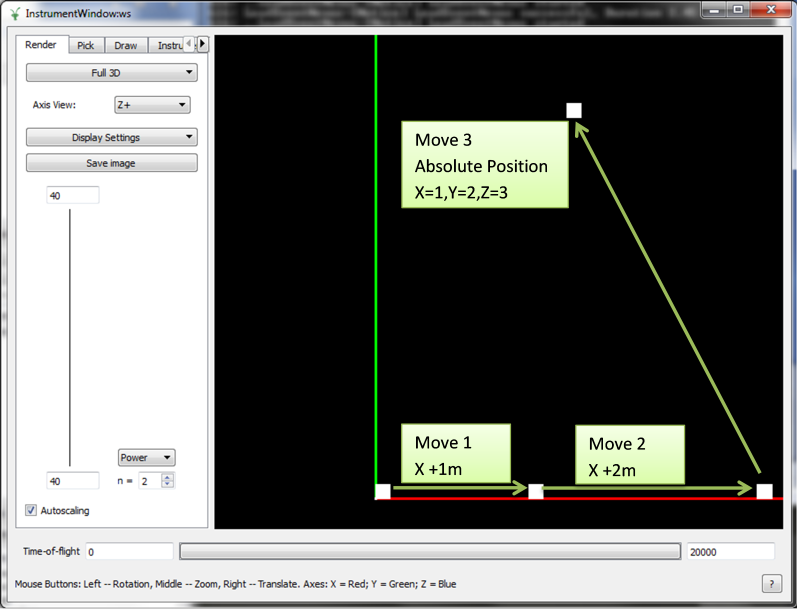
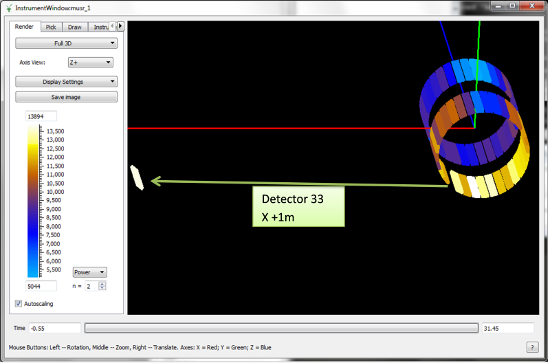

.. algorithm::

.. summary::

.. relatedalgorithms::

.. properties::

Description
-----------

This moves an instrument component, e.g. a bank or a pixel.

You can specify a pathname as the name of a non-unique component (e.g.
"WISH/panel03/WISHpanel03/tube005") and one can skip parts not needed
for uniqueness (e.g. "panel03/tube005"). For a unique component, you can
just specify the name (e.g. "panel03").

You can either specify an absolute position or a relative position. The
relative position will be applied to the current position, so applying
this twice will move the detector twice.

If you move a component that is made up of smaller parts (such as a bank is made up of detectors, or a tube is made up of pixels) then the smaller parts will be transated along with the component.

Usage
-----

Example 1: Move a component by name
###################################

   Moving a bank through three movements.  All the pixels of the bank move along with the bank component.

.. testcode:: ExByName

  # Create a workspace with a simple instrument
  ws = CreateSampleWorkspace()

  # Original position of instrument component 'bank1'
  print(ws.getInstrument().getComponentByName('bank1').getPos())

  # Move 'bank1' by vector (1,0,0) relative to its original position
  MoveInstrumentComponent( ws, 'bank1', X=1,Y=0,Z=0 )

  # Check the new position of 'bank1'
  print(ws.getInstrument().getComponentByName('bank1').getPos())

  # Move the same bank again by vector (2,0,0)
  MoveInstrumentComponent( ws, 'bank1', X=2,Y=0,Z=0 )

  # Check the new position of 'bank1'
  print(ws.getInstrument().getComponentByName('bank1').getPos())

  # Move 'bank1' to a new absolute position (1,2,3)
  MoveInstrumentComponent( ws, 'bank1', X=1,Y=2,Z=3, RelativePosition=False )

  # Check the new position of 'bank1'
  print(ws.getInstrument().getComponentByName('bank1').getPos())

Output
^^^^^^

.. testoutput:: ExByName

  [0,0,5]
  [1,0,5]
  [3,0,5]
  [1,2,3]

Example 2: Move a detector by ID
################################

   Moving an individual detector using the detector ID.

.. testcode:: ExByID

  # Load a MUSR file
  musr = Load('MUSR00015189')
  # and use the first workspace in the workspace group
  ws = mtd['musr_1']

  # Original position of detector 33
  print(ws.getInstrument().getDetector(33).getPos())

  # Move detector 33 by vector (1,0,0) relative to its original position
  MoveInstrumentComponent( ws, DetectorID=33, X=1,Y=0,Z=0 )

  # Check the new position of detector 33
  print(ws.getInstrument().getDetector(33).getPos())

Output
^^^^^^

.. testoutput:: ExByID

  [0.0888151,-0.108221,-0.145]
  [1.08882,-0.108221,-0.145]

.. categories::

.. sourcelink::
