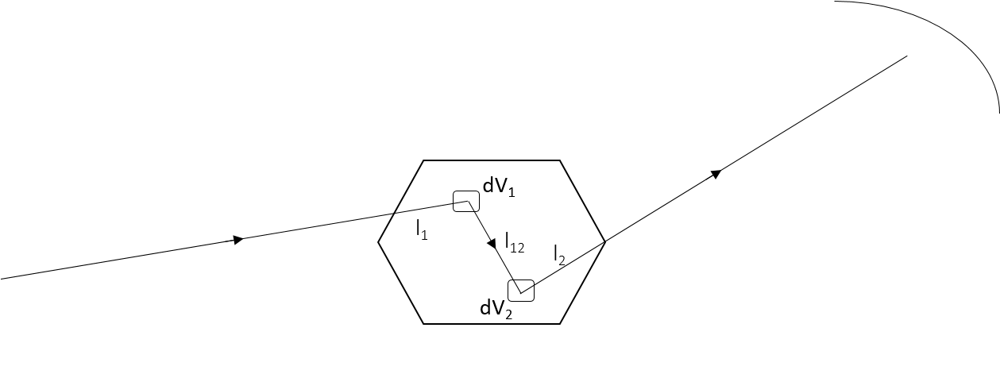

.. algorithm::

.. summary::

.. relatedalgorithms::

.. properties::

Description
-----------

This algorithm uses numerical integration to approximate the sample correction factor for multiple scattering events
using the formula detailed in the concept page of Absorption and Multiple Scattering Corrections.

Here is a quick recap of the physical model used in the numerical integration.
The scattered neutron can bounce into another atom before leaving the sample when the sample is sufficiently thick, leading to
a double scattering event.

With the assumption of elastic and isotropic scattering as well as the approximation where we assume the intensity ratio
between incoming and outgoing neutron are a fixed value, the multiple scattering intensity can be expressed as

.. math::
    :label: Im_final

    I_{m} = I_{total} \frac{\rho \sigma_{s} A_{2}}{4 \pi A_{1}}

where :math:`I_{total}` is the measured intensity, :math:`\rho` is the effective number density, and :math:`\sigma_{s}` is the
total scattering cross section.
The term :math:`A_{1}` is a function of wavelength, and can be defined as

.. math::
    :label: A1_final

    A_{1}(\lambda) = \int_V exp[-\mu(\lambda)(l_1 + l_2)] dV

where :math:`\mu` is the sample absorption coefficient (a function of wavelength), :math:`l_1` is the distance from source to
scattering volume one, and :math:`l_2` is the distance from volume two to the detector.
Similarly, :math:`A_{2}` can be defined as

.. math::
    :label: A2_final

    A_2(\lambda) = \int_V\int_V\frac{exp[-\mu(\lambda)(l_1 + l_{12} + l_2)]}{l_{12}^2}dVdV

where :math:`l_{12}` is the distance between volume one and volume two.

This algorithm uses a rasterizer internally to compute all the distances and angles, therefore it is crucial to have the instrument
and sample geometry properly defined within the input workspace.
Also, both :math:`l_1` and :math:`l_{12}` are pre-computed and cached as 1D vector, which tends to occupy a significant amount of
memory when the selected element size is below the standard 1 mm.
Some operating system will stop Mantid from claiming/reserving the memory, leading to a memory allocation error at the starting
stage.
This is a known limitation and we are actively searching for a solution.

By default, the algorithm uses the ``SampleOnly`` method where it ignores container's contribution as well as its interaction with sample.
When ``SampleAndContainer`` is selected, the algorithm will compute the distance within sample and container separately.
Consequently, the term :math:`A_{1}` now becomes

.. math::
    :label: A1_final_sampleAndContainer

    A_{1}(\lambda) = \int \rho \sigma \exp[ -\mu^\text{s} (l_\text{S1}^\text{s} + l_\text{1D}^\text{s}) -\mu^\text{c} (l_\text{S1}^\text{c} + l_\text{1D}^\text{c})] dV

where :math:`\mu^\text{s}` denotes the sample absorption coefficient and :math:`\mu^\text{c}` denotes the container absorption coefficient.
Notice that the number density :math:`\rho` as well as the scattering cross section :math:`\sigma` are inside the integral now.
This is because the material of the sample is often different from the material of the container, therefore we need to consider the material
while performing the integration, which is different from when working with a single material component.

Similarly, the term :math:`A_{2}` is now

.. math::
    :label: A2_final_sampleAndContainer

    A_2(\lambda) = \int \rho_1 \sigma_1
            \int \rho_2 \sigma_2
                 \dfrac{ \exp\left[
                          -\mu^\text{s}( l_\text{S1}^\text{s}
                                       + l_\text{12}^\text{s}
                                       + l_\text{2D}^\text{s})
                          -\mu^\text{c}( l_\text{S1}^\text{c}
                                       + l_\text{12}^\text{c}
                                       + l_\text{2D}^\text{c})
                         \right]
                      }{l_\text{12}^2}
            dV_2
        dV_1

where the distance within different material (sample and container) are summed independently.

.. categories::

.. sourcelink::
