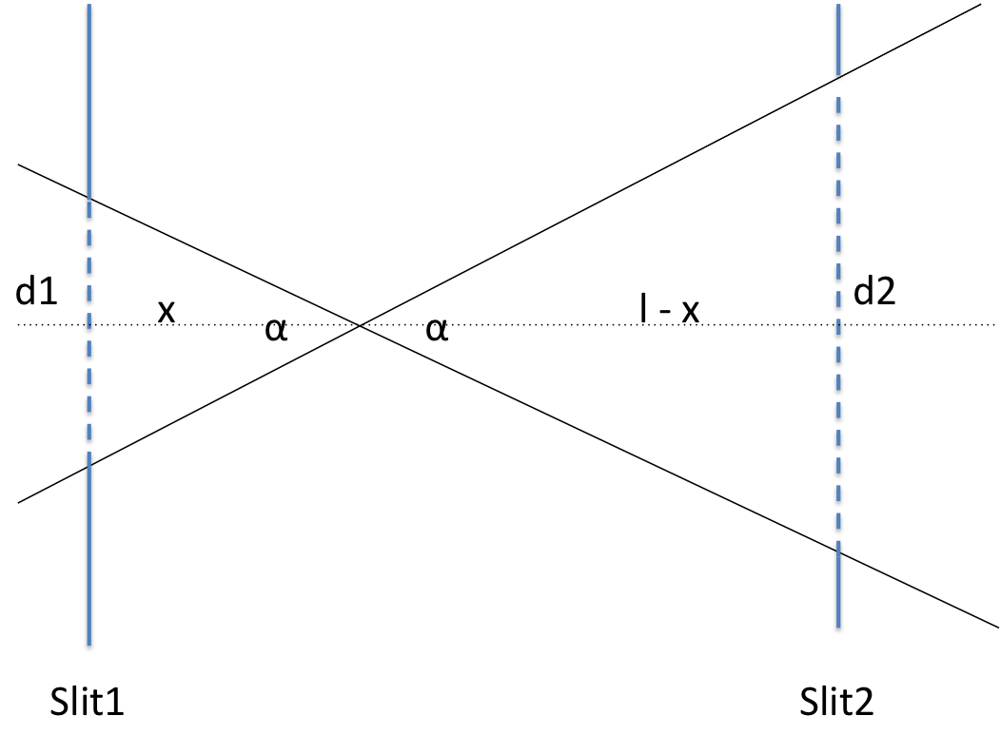

.. algorithm::

.. summary::

.. relatedalgorithms::

.. properties::

Description
-----------

This algorithm takes a workspace and a value for two theta, and attempts to calculate
the reflectometry resolution (dQ/Q) from them. If no value is provided for two theta
then NRCalculateSlitResolution will attempt to fetch a value from the workspace's log
using the theta log name provided.

The effective inverse of this algorithm is :ref:`algm-CalculateSlits`.

Beam Divergence
###############

   Schematic showing beam divergence using two slits (*Slit1* and *Slit2*)

**Proof**

.. math::

   \frac{d1}{x}  \equiv \frac{d2}{l - x}  \equiv \tan(\alpha)

   \therefore \frac{d1}{x} = \frac{d1 + d2}{l}

   \therefore \alpha = \arctan\left(\frac{d1 + d2}{l}\right)

where :math:`\alpha` gives is the beam divergence in radians. Parameter *d1* is the vertical distance of *Slit1* opening, *d2* is the same for *Slit2*. parameter *l* is the distance between the slits in the beam direction. See figure above for reference.

The resolution is then calculated from:

.. math::
   resolution = \frac{\alpha}{2 \tan(\theta)}

Usage
-----

.. testcode::

  ws = Load('INTER00013460')
  res = NRCalculateSlitResolution(Workspace = ws, TwoTheta = 0.7 * 2)
  print("Resolution: {:.4f}".format(res))

.. testoutput::

  Resolution: 0.0340

.. categories::

.. sourcelink::
