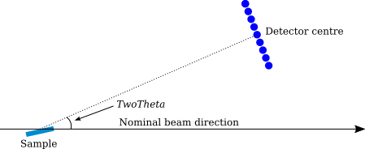
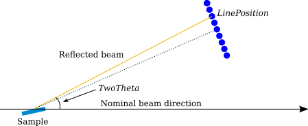
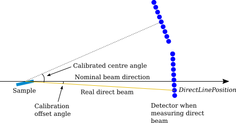

.. algorithm::

.. summary::

.. relatedalgorithms::

.. properties::

Description
-----------

This algorithm adjusts the detector angle of a reflectometer instrument. The detector component is rotated around the sample position to a desired specular angle while keeping the sample-to-detector distance constant and ensuring the detector centre normal faces the sample. 

The name of the detector component to rotate is given by the *DetectorComponent* property.

In the simplest case when only *TwoTheta* is given, the detector is rotated such that the line from the detector centre to the sample position forms an angle of *TwoTheta* degrees with the beam direction (usually the :math:`Z` axis), as shown in the figure below.

Supplying the algorithm with *TwoTheta*, *LinePosition* and *PixelSize* enables one to specify the specular angle of a single pixel, see the figure below. *LinPosition* does not have to be an integral number. A floating point number from a line finding algorithm works as well.

A direct beam reference can be used to calibrate the detector angle when *PixelSize*, *DirectLinePosition* and *DirectBeamWorkspace* are given. In this case, the algorithm calculates the deviation angle between the measured direct beam and the nominal beam direction (usually the :math:`Z` axis). The resulting offset angle is then applied to the detector angle as is schematically shown below. *DirectLinePosition* is a floating point number which can be obtained from a reflectometry line fitting algorithm.

Usage
-----

**Example - Rotate detector centre to given TwoTheta**

.. testcode:: DetectorCentreEx

   import numpy
   # We'll just use an empty workspace here.
   ws = LoadEmptyInstrument(InstrumentName='D17')
   # Get rid of monitors
   ExtractMonitors(ws, DetectorWorkspace='ws')
   ws = mtd['ws']
   # A helper function
   def mean2Theta(ws):
       '''Return the average 2theta of the two centre pixels in degrees.'''
       spectrum_info = ws.spectrumInfo()
       two_theta1 = spectrum_info.twoTheta(127)
       two_theta2 = spectrum_info.twoTheta(128)
       return numpy.rad2deg((two_theta1 + two_theta2) / 2.)
   two_theta = mean2Theta(ws)
   print('Detector centre 2theta')
   print('before angle correction: {:.3}'.format(two_theta))
   ws = ReflectometryCorrectDetectorAngle(ws, DetectorComponent='detector', TwoTheta=1.5)
   two_theta = mean2Theta(ws)
   print('after angle correction: {:.3}'.format(two_theta))

Output:

.. testoutput:: DetectorCentreEx

   Detector centre 2theta
   before angle correction: 0.011
   after angle correction: 1.5

**Example - Rotate given pixel**

.. testcode:: PixelCentreEx

   import numpy
   # We'll just use an empty workspace here.
   ws = LoadEmptyInstrument(InstrumentName='D17')
   # Get rid of monitors
   ExtractMonitors(ws, DetectorWorkspace='ws')
   ws = mtd['ws']
   line_position = 22.
   spectrum_info = ws.spectrumInfo()
   two_theta = numpy.rad2deg(spectrum_info.twoTheta(int(line_position)))
   print('Pixel {} 2theta'.format(int(line_position)))
   print('before angle correction: {:.3}'.format(two_theta))
   ws = ReflectometryCorrectDetectorAngle(ws, DetectorComponent='detector',
       LinePosition=line_position, PixelSize=0.001195, TwoTheta=1.5)
   spectrum_info = ws.spectrumInfo()
   two_theta = numpy.rad2deg(spectrum_info.twoTheta(int(line_position)))
   print('after angle correction: {:.3}'.format(two_theta))

Output:

.. testoutput:: PixelCentreEx

   Pixel 22 2theta
   before angle correction: 2.33
   after angle correction: 1.5

**Example - Use direct beam for angle calibration**

.. testcode:: DirectBeamEx

   import numpy
   # We'll just use empty workspaces here.
   reflected = LoadEmptyInstrument(InstrumentName='Figaro')
   direct = LoadEmptyInstrument(InstrumentName='Figaro')
   # Get rid of monitors
   ExtractMonitors(reflected, DetectorWorkspace='reflected')
   reflected = mtd['reflected']
   ExtractMonitors(direct, DetectorWorkspace='direct')
   direct = mtd['direct']
   line_position = 202.
   spectrum_info = reflected.spectrumInfo()
   two_theta = numpy.rad2deg(spectrum_info.twoTheta(int(line_position)))
   print('Pixel {} 2theta'.format(int(line_position)))
   print('before angle correction: {:.3}'.format(two_theta))
   direct_line_position = 130.7  # This could come from some fitting procedure
   reflected = ReflectometryCorrectDetectorAngle(reflected, DetectorComponent='detector',
       PixelSize=0.001195, DirectBeamWorkspace=direct, DirectLinePosition=direct_line_position)
   spectrum_info = reflected.spectrumInfo()
   two_theta = numpy.rad2deg(spectrum_info.twoTheta(int(line_position)))
   print('after angle correction: {:.3}'.format(two_theta))

Output:

.. testoutput:: DirectBeamEx

   Pixel 202 2theta
   before angle correction: 5.11
   after angle correction: 4.89

.. categories::

.. sourcelink::

