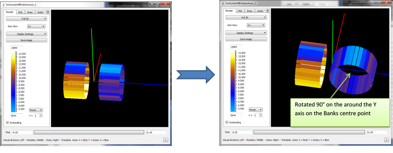
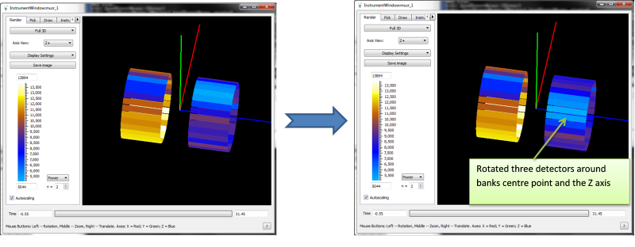
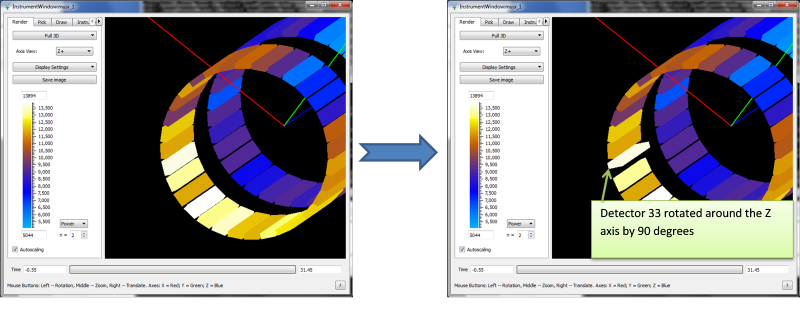

.. algorithm::

.. summary::

.. relatedalgorithms::

.. properties::

Description
-----------

RotateInstrumentComponent rotates a component around an axis of rotation
by an angle given in degrees. Rotation by 0 degrees does not change the
component's orientation. The rotation axis (X,Y,Z) must be given in the
co-ordinate system attached to the component and rotates with it.
The centre of rotation is the centre of the component to be rotated,
and any children of that component (such as detectors in a bank, or pixels in a tube)
are moved and rotated along with the component.

Usage
-----

Example 1: Rotating a bank around the Y Axis
############################################

   Rotating a bank around the 90° round Y Axis.  The centre of rotation is the centre of the component to be rotated, and any children of that component (such as each detector in this instance) are moved and rotated along with the bank.

.. testcode:: ExBank

  # Load a MUSR file
  musr = Load('MUSR00015189')
  # and use the first workspace in the workspace group
  ws = mtd['musr_1']

  def pos3D_as_str(pos, digits=6):
     """ Produces a string with a V3D position (x, y, z) from a V3D object,
         using a fixed limited number of digits (for robust string comparisons).
     """
     def nz(value):
        """ Handles potential issues with +-0 (for 6 digits text output) """
        return 0.0 if abs(value) < 1e-7 else value

     precision = str(digits)
     format_str = '[{0:.'+precision+'f}, {1:.'+precision+'f}, {2:.'+precision+'f}]'
     result = format_str.format(nz(pos.getX()), nz(pos.getY()), nz(pos.getZ()))
     return result

  print('Original positions of detectors 1 and 2')
  opos1 = ws.getInstrument().getDetector(1).getPos()
  opos2 = ws.getInstrument().getDetector(2).getPos()
  print('Det 1: {0}'.format(pos3D_as_str(opos1)))
  print('Det 2: {0}'.format(pos3D_as_str(opos2)))

  # Rotate bank 'back' around the Z axis by 90
  RotateInstrumentComponent( ws, ComponentName='back', X=0,Y=1,Z=0, Angle=90.0 )

  print('Positions of detectors 1 and 2 after rotation')
  pos1 = ws.getInstrument().getDetector(1).getPos()
  pos2 = ws.getInstrument().getDetector(2).getPos()
  print('Det 1: {0}'.format(pos3D_as_str(pos1)))
  print('Det 2: {0}'.format(pos3D_as_str(pos2)))

Output
^^^^^^

.. testoutput:: ExBank

  Original positions of detectors 1 and 2
  Det 1: [-0.088815, -0.108221, 0.145000]
  Det 2: [-0.065996, -0.123469, 0.145000]
  Positions of detectors 1 and 2 after rotation
  Det 1: [0.000000, -0.108221, 0.233815]
  Det 2: [0.000000, -0.123469, 0.210996]

Example 2: Rotating a bank around the Z Axis
############################################

   Rotating the bank around the Z Axis.  The centre of rotation is the centre of the bank, so the detectors are translated and rotated to match.

.. testcode:: ExBank2

  # Load a MUSR file
  musr = Load('MUSR00015189')
  # and use the first workspace in the workspace group
  ws = mtd['musr_1']

  def pos3D_as_str(pos, digits=6):
     """ Produces a string with a V3D position (x, y, z) from a V3D object,
         using a fixed limited number of digits (for robust string comparisons).
     """
     def nz(value):
        """ Handles potential issues with +-0 (for 6 digits text output) """
        return 0.0 if abs(value) < 1e-7 else value

     precision = str(digits)
     format_str = '[{0:.'+precision+'f}, {1:.'+precision+'f}, {2:.'+precision+'f}]'
     result = format_str.format(nz(pos.getX()), nz(pos.getY()), nz(pos.getZ()))
     return result

  print('Original positions of detectors 1 and 4')
  opos1 = ws.getInstrument().getDetector(1).getPos()
  opos4 = ws.getInstrument().getDetector(4).getPos()
  print('Det 1: {0}'.format(pos3D_as_str(opos1)))
  print('Det 4: {0}'.format(pos3D_as_str(opos4)))

  # Rotate bank 'back' around the Z axis by 3 detectors.
  RotateInstrumentComponent( ws, ComponentName='back', X=0,Y=0,Z=1, Angle=3*360.0 / 32 )

  print('Positions of detector 1 after rotation')
  pos1 = ws.getInstrument().getDetector(1).getPos()
  print('Det 1: {0}'.format(pos3D_as_str(pos1)))
  print('Detector 1 took place of detector 4')

Output
^^^^^^

.. testoutput:: ExBank2

  Original positions of detectors 1 and 4
  Det 1: [-0.088815, -0.108221, 0.145000]
  Det 4: [-0.013722, -0.139326, 0.145000]
  Positions of detector 1 after rotation
  Det 1: [-0.013722, -0.139326, 0.145000]
  Detector 1 took place of detector 4

Example 3: Rotating a single detector
#####################################

   Rotating the detector around the Z Axis by 90 degrees.  The centre of rotation is the centre of the detector.

.. testcode:: ExDet

  import numpy as np

  # Load a MUSR file
  musr = Load('MUSR00015189')
  # and use the first workspace in the workspace group
  ws = mtd['musr_1']

  # Rotating a detector doesn't change its position, just its orientation

  # Original position of detector 33
  print(ws.getInstrument().getDetector(33).getPos())

  # Calculate the solid angles for all detectors in the instrument
  # The result is a single-bin workspace with solid angles for all spectra in ws
  saws = SolidAngle( ws )
  # Collect the solid angles from the first bin in saws and save them in numpy array.
  # Numpy module makes it easy to manipulate arrays
  sa1 = np.array( [ saws.readY(i)[0] for i in range(saws.getNumberHistograms()) ] )

  # Rotate detector 33 around the Z axis by 90 degrees.
  RotateInstrumentComponent( ws, DetectorID=33, X=0,Y=0,Z=1, Angle=90 )

  # Check the position of detector 33 stays unchanged
  print(ws.getInstrument().getDetector(33).getPos())

  # Calculate the solid angles after rotation
  saws = SolidAngle( ws )
  sa2 = np.array( [ saws.readY(i)[0] for i in range(saws.getNumberHistograms()) ] )

  # Take element by element difference of the solid angles
  diff = sa2 - sa1
  # numpy.set_printoptions is not stable across versions.
  # manually print array to ensure consistent display for tests
  diff = diff.reshape(8, 8)
  diff_as_str = ''
  for row in range(8):
      for col in range(8):
          diff_as_str += '{: .5f} '.format(diff[row][col])
      diff_as_str += '\n'
  print(diff_as_str)
  print('The non-zero difference {:.13f} is due to detector {}'.format(diff[4][0], ws.getDetector(32).getID()))

Output
^^^^^^

.. testoutput:: ExDet
   :options: +NORMALIZE_WHITESPACE

    [0.0888151,-0.108221,-0.145]
    [0.0888151,-0.108221,-0.145]
     0.00000  0.00000  0.00000  0.00000  0.00000  0.00000  0.00000  0.00000
     0.00000  0.00000  0.00000  0.00000  0.00000  0.00000  0.00000  0.00000
     0.00000  0.00000  0.00000  0.00000  0.00000  0.00000  0.00000  0.00000
     0.00000  0.00000  0.00000  0.00000  0.00000  0.00000  0.00000  0.00000
    -0.04645  0.00000  0.00000  0.00000  0.00000  0.00000  0.00000  0.00000
     0.00000  0.00000  0.00000  0.00000  0.00000  0.00000  0.00000  0.00000
     0.00000  0.00000  0.00000  0.00000  0.00000  0.00000  0.00000  0.00000
     0.00000  0.00000  0.00000  0.00000  0.00000  0.00000  0.00000  0.00000

    The non-zero difference -0.0464531276188 is due to detector 33

.. categories::

.. sourcelink::
