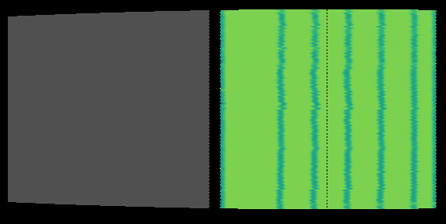
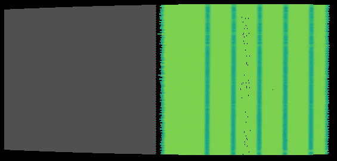

.. algorithm::

.. summary::

.. relatedalgorithms::

.. properties::

Description
-----------

This algorithm calibrates the individual pixels for either the front or rear detector of the Sans2d instrument at ISIS.
The ``DataFiles`` property takes a list of file names, each one containing scattering data from H2O, which is a constant intensity 2D image, but masked by a vertical strip beamstop held at a different location in front of the detector.
Since the strip is a straight vertical line, the image of the strip onto the detector should be a straight vertical line, after calibration of the pixels of the detector.
The list of strip positions that each data file corresponds to is passed to the ``StripPositions`` property.
The algorithm uses this information to find the correct detector pixel positions and outputs a workspace with the detector pixels in these calibrated positions.
Once separate front and rear detector calibration files have been saved from this algorithm, :ref:`algm-SANSTubeMerge` can be used to merge these into a single calibration file.

Loading and Merging the Input Data
----------------------------------

The algorithm attempts to load all the data files by checking a number of locations to ensure that loading is as fast as possible. If a matching workspace can be found in the ADS, then this will be used.
If not, the algorithm checks the locations in your Mantid user directories to find and load any input files that were previously saved by the algorithm.
Finally, if nothing has been found, then the data is loaded from the archive and rebinned to convert it to histogram data. The value of the ``Timebins`` property provides the rebinning parameters for this step.

If property ``SaveIntegratedWorkspaces`` is set to ``True``, then any data that needed to be loaded and rebinned will be saved to the user’s default save location (with prefix ``tubeCalibSaved_``) to allow for faster loading in future.

As part of loading, each dataset is cropped to extract only the data for the Sans2d detector that we are calibrating.
Each dataset is then scaled relative to the first dataset in the list, using the relative ``proton_charge_by_period`` log values as the scale factor.

The algorithm merges each individual dataset into a single workspace containing all of the vertical strips. The workspace containing the merged data will appear in the ADS with name ``original``.

Finding the Correct Pixel Locations
-----------------------------------

Each detector tube is calibrated in turn using the merged dataset. The first step is to find the approximate pixel locations of the strip edges in the data for the given tube.
The counts in the data should be very low where the strips are located, so should change from high to low at the left edge of each strip and from low to high at the right edge.
The ``Threshold`` property is used to find the estimated pixel locations. It defines the count value above which we assume we are in a non-strip region in the data, and below which we assume we are in a strip region.
A threshold should be chosen that results in the same number of estimated edges as known strip edges, however it won’t always be possible to find a value that works for all tubes.
Once the best possible value is chosen, the property ``SkipTubesOnError`` can be selected to force the algorithm to calibrate all tubes that it can and skip any that it cannot.

Next, a fitting function is used to fit the peak positions in each tube, using the estimated strip edge pixel locations as the peak centres.
By default, the algorithm uses the ``FlatTopPeak`` fitting function for peak finding, however if the ``FitEdges`` property is set to ``True`` then function :ref:`func-EndErfc` is used instead.
A quadratic fitting function is then used to compare the known positions with the fitted positions from the data and give the position error for each detector pixel in the tube.
This position error is then used to calculate the corrected position for each detector pixel.

Correcting the Detector Pixel Locations
---------------------------------------

Once the corrected pixel positions have been calculated for all tubes, :ref:`ApplyCalibration <algm-ApplyCalibration>` is called to move all the detector pixels in the workspace to their correct positions.
On completion of the calibration, there will be a workspace in the ADS called ``result`` that contains these corrected detector positions.
If a value has been provided for the ``OutputFile`` property, then this workspace is automatically saved out as a Nexus file to the specified location.

A workspace called ``cvalues`` gives the average resolution of the fit parameter for each tube, giving an indication of the quality of the calibration.
When the algorithm completes, a notice will be printed in the messages pane for any tube with an average resolution greater than the value specified in the ``CValueThreshold`` property. These tubes are considered to have a poor quality calibration.
This list can be written out to a text file by passing a filepath to the ``CValueOutputFile`` property.

If ``SkipTubesOnError`` was set to ``True``, then warnings will be printed when the algorithm completes detailing any tubes that were not calibrated and stating the reasons why.

A number of other diagnostic workspaces are output to the ADS during the calibration. These allow closer inspection of the results from the fitting and other calibration steps for each tube.
They provide the following information:

- Fit – the data from the peak fitting
- Tube – the count data for the tube
- Data – the fitted positions for the tube
- Shift – how much the detector pixels have been shifted for the tube

Usage
-----

Calibrate the Sans2d rear detector:

.. code-block:: python

    # import mantid algorithms
    from mantid.simpleapi import *

    SANSTubeCalibration(
        StripPositions=[920, 755, 590, 425, 260],
        DataFiles=["SANS2D00069117.nxs", "SANS2D00069118.nxs", "SANS2D00069119.nxs", "SANS2D00069120.nxs", "SANS2D00069116.nxs"],
        EncoderAtBeamCentre=270.0,
        EncoderAtBeamCentreForRear260Strip=470.0,
        RearDetector=True,
        Threshold=500)

The original instrument view:

The instrument view after running the calibration:

.. categories::

.. sourcelink::
