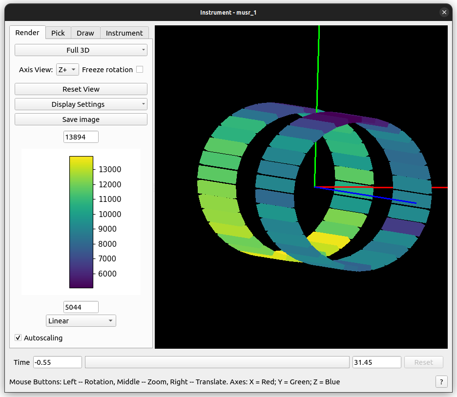
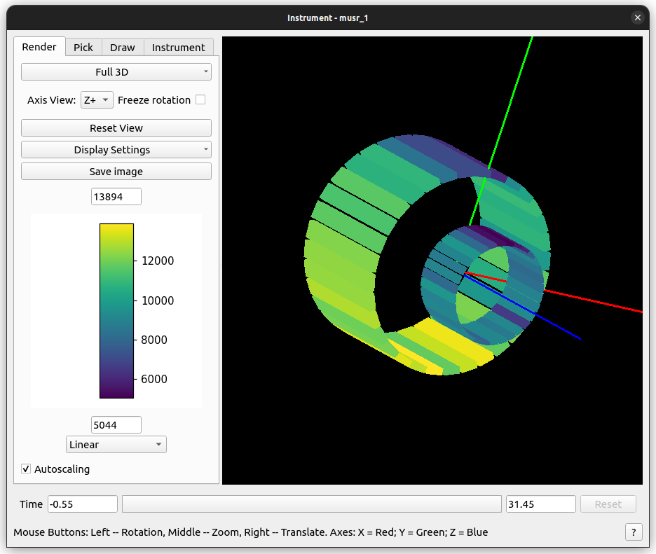
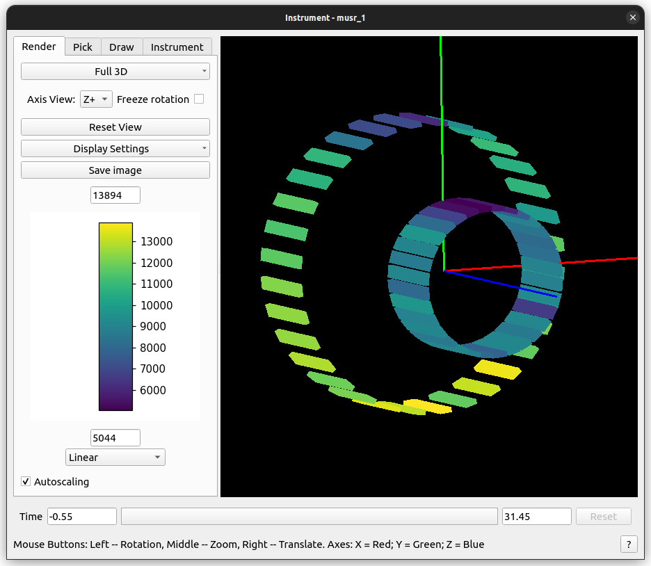

.. algorithm::

.. summary::

.. relatedalgorithms::

.. properties::

Description
-----------

This scales the detecors and pixels in a component. This can effectively expand or contract the overall dimensions
of the component by resizing its detector pixels, without moving its geometrical center. You can choose to scale the component
without scaling the size of the detector pixels. This would allow you to expand or contract the detectors without changing the
size of the pixels.

The vector position of each detector is determined by :math:`Mr + (1 - M)R` where :math:`M` is a diagonal matrix with diagonal components given by parameter ``scalings``,
:math:`R` is the position of the component, and :math:`r` is the position of the detector.

You can specify a pathname as the name of a non-unique component (e.g.
"WISH/panel03/WISHpanel03/tube005"). You can also skip parts not needed
for uniqueness (e.g. "panel03/tube005"). For a unique component, you can
just specify the name (e.g. "panel03").

Usage
-----

    For both examples, this is the starting size and position of the 'front' and 'back' component.

Example 1: Scale a Component and Detector Pixels
################################################

   Scaling a component and all detectors.  All the pixels will be scaled with the component.

.. testcode:: ExWithPixels

  def printComponentPositions(ws, component):
    compInfo = ws.componentInfo()
    compIndex = compInfo.indexOfAny(component)
    print(f'Position of {component}: {compInfo.position(compIndex)}')
    for i in compInfo.detectorsInSubtree(compIndex):
      print(f'Detector {i} - Position: {compInfo.position(int(i))}, Pixel Scale: {compInfo.scaleFactor(int(i))}')

  # Load a MUSR file
  musr = Load('MUSR00015189')
  # and use the first workspace in the workspace group
  ws = mtd['musr_1']

  # Original position of 'front' component
  print("Before ScaleInstrumentComponent")
  printComponentPositions(ws, 'front')

  # Scale the 'front' component by vector (2,2,2)
  ScaleInstrumentComponent(ws, ComponentName='front', scalings=[2.0, 2.0, 2.0])

  # Check the new position of 'front' component and detectors
  print("\nAfter ScaleInstrumentComponent")
  printComponentPositions(ws, 'front')

Output
^^^^^^

.. testoutput:: ExWithPixels

  Before ScaleInstrumentComponent
  Position of front: [0,0,-0.145]
  Detector 32 - Position: [0.0888151,-0.108221,-0.145], Pixel Scale: [1,1,1]
  Detector 33 - Position: [0.0659955,-0.123469,-0.145], Pixel Scale: [1,1,1]
  Detector 34 - Position: [0.0406399,-0.133972,-0.145], Pixel Scale: [1,1,1]
  Detector 35 - Position: [0.0137224,-0.139326,-0.145], Pixel Scale: [1,1,1]
  Detector 36 - Position: [-0.0137224,-0.139326,-0.145], Pixel Scale: [1,1,1]
  Detector 37 - Position: [-0.0406399,-0.133972,-0.145], Pixel Scale: [1,1,1]
  Detector 38 - Position: [-0.0659955,-0.123469,-0.145], Pixel Scale: [1,1,1]
  Detector 39 - Position: [-0.0888151,-0.108221,-0.145], Pixel Scale: [1,1,1]
  Detector 40 - Position: [-0.108221,-0.0888151,-0.145], Pixel Scale: [1,1,1]
  Detector 41 - Position: [-0.123469,-0.0659955,-0.145], Pixel Scale: [1,1,1]
  Detector 42 - Position: [-0.133972,-0.0406399,-0.145], Pixel Scale: [1,1,1]
  Detector 43 - Position: [-0.139326,-0.0137224,-0.145], Pixel Scale: [1,1,1]
  Detector 44 - Position: [-0.139326,0.0137224,-0.145], Pixel Scale: [1,1,1]
  Detector 45 - Position: [-0.133972,0.0406399,-0.145], Pixel Scale: [1,1,1]
  Detector 46 - Position: [-0.123469,0.0659955,-0.145], Pixel Scale: [1,1,1]
  Detector 47 - Position: [-0.108221,0.0888151,-0.145], Pixel Scale: [1,1,1]
  Detector 48 - Position: [-0.0888151,0.108221,-0.145], Pixel Scale: [1,1,1]
  Detector 49 - Position: [-0.0659955,0.123469,-0.145], Pixel Scale: [1,1,1]
  Detector 50 - Position: [-0.0406399,0.133972,-0.145], Pixel Scale: [1,1,1]
  Detector 51 - Position: [-0.0137224,0.139326,-0.145], Pixel Scale: [1,1,1]
  Detector 52 - Position: [0.0137224,0.139326,-0.145], Pixel Scale: [1,1,1]
  Detector 53 - Position: [0.0406399,0.133972,-0.145], Pixel Scale: [1,1,1]
  Detector 54 - Position: [0.0659955,0.123469,-0.145], Pixel Scale: [1,1,1]
  Detector 55 - Position: [0.0888151,0.108221,-0.145], Pixel Scale: [1,1,1]
  Detector 56 - Position: [0.108221,0.0888151,-0.145], Pixel Scale: [1,1,1]
  Detector 57 - Position: [0.123469,0.0659955,-0.145], Pixel Scale: [1,1,1]
  Detector 58 - Position: [0.133972,0.0406399,-0.145], Pixel Scale: [1,1,1]
  Detector 59 - Position: [0.139326,0.0137224,-0.145], Pixel Scale: [1,1,1]
  Detector 60 - Position: [0.139326,-0.0137224,-0.145], Pixel Scale: [1,1,1]
  Detector 61 - Position: [0.133972,-0.0406399,-0.145], Pixel Scale: [1,1,1]
  Detector 62 - Position: [0.123469,-0.0659955,-0.145], Pixel Scale: [1,1,1]
  Detector 63 - Position: [0.108221,-0.0888151,-0.145], Pixel Scale: [1,1,1]

  After ScaleInstrumentComponent
  Position of front: [0,0,-0.145]
  Detector 32 - Position: [0.17763,-0.216443,-0.145], Pixel Scale: [2,2,2]
  Detector 33 - Position: [0.131991,-0.246938,-0.145], Pixel Scale: [2,2,2]
  Detector 34 - Position: [0.0812797,-0.267943,-0.145], Pixel Scale: [2,2,2]
  Detector 35 - Position: [0.0274448,-0.278652,-0.145], Pixel Scale: [2,2,2]
  Detector 36 - Position: [-0.0274448,-0.278652,-0.145], Pixel Scale: [2,2,2]
  Detector 37 - Position: [-0.0812797,-0.267943,-0.145], Pixel Scale: [2,2,2]
  Detector 38 - Position: [-0.131991,-0.246938,-0.145], Pixel Scale: [2,2,2]
  Detector 39 - Position: [-0.17763,-0.216443,-0.145], Pixel Scale: [2,2,2]
  Detector 40 - Position: [-0.216443,-0.17763,-0.145], Pixel Scale: [2,2,2]
  Detector 41 - Position: [-0.246938,-0.131991,-0.145], Pixel Scale: [2,2,2]
  Detector 42 - Position: [-0.267943,-0.0812797,-0.145], Pixel Scale: [2,2,2]
  Detector 43 - Position: [-0.278652,-0.0274448,-0.145], Pixel Scale: [2,2,2]
  Detector 44 - Position: [-0.278652,0.0274448,-0.145], Pixel Scale: [2,2,2]
  Detector 45 - Position: [-0.267943,0.0812797,-0.145], Pixel Scale: [2,2,2]
  Detector 46 - Position: [-0.246938,0.131991,-0.145], Pixel Scale: [2,2,2]
  Detector 47 - Position: [-0.216443,0.17763,-0.145], Pixel Scale: [2,2,2]
  Detector 48 - Position: [-0.17763,0.216443,-0.145], Pixel Scale: [2,2,2]
  Detector 49 - Position: [-0.131991,0.246938,-0.145], Pixel Scale: [2,2,2]
  Detector 50 - Position: [-0.0812797,0.267943,-0.145], Pixel Scale: [2,2,2]
  Detector 51 - Position: [-0.0274448,0.278652,-0.145], Pixel Scale: [2,2,2]
  Detector 52 - Position: [0.0274448,0.278652,-0.145], Pixel Scale: [2,2,2]
  Detector 53 - Position: [0.0812797,0.267943,-0.145], Pixel Scale: [2,2,2]
  Detector 54 - Position: [0.131991,0.246938,-0.145], Pixel Scale: [2,2,2]
  Detector 55 - Position: [0.17763,0.216443,-0.145], Pixel Scale: [2,2,2]
  Detector 56 - Position: [0.216443,0.17763,-0.145], Pixel Scale: [2,2,2]
  Detector 57 - Position: [0.246938,0.131991,-0.145], Pixel Scale: [2,2,2]
  Detector 58 - Position: [0.267943,0.0812797,-0.145], Pixel Scale: [2,2,2]
  Detector 59 - Position: [0.278652,0.0274448,-0.145], Pixel Scale: [2,2,2]
  Detector 60 - Position: [0.278652,-0.0274448,-0.145], Pixel Scale: [2,2,2]
  Detector 61 - Position: [0.267943,-0.0812797,-0.145], Pixel Scale: [2,2,2]
  Detector 62 - Position: [0.246938,-0.131991,-0.145], Pixel Scale: [2,2,2]
  Detector 63 - Position: [0.216443,-0.17763,-0.145], Pixel Scale: [2,2,2]

Example 2: Scale a Component without Scaling Detector Pixels
############################################################

   Scale all detectors in a component without resizing pixels.

.. testcode:: ExWOPixels

  def printComponentPositions(ws, component):
    compInfo = ws.componentInfo()
    compIndex = compInfo.indexOfAny(component)
    print(f'Position of {component}: {compInfo.position(compIndex)}')
    for i in compInfo.detectorsInSubtree(compIndex):
      print(f'Detector {i} - Position: {compInfo.position(int(i))}, Pixel Scale: {compInfo.scaleFactor(int(i))}')

  # Load a MUSR file
  musr = Load('MUSR00015189')
  # and use the first workspace in the workspace group
  ws = mtd['musr_1']

  # Original position of 'front' component
  print("Before ScaleInstrumentComponent")
  printComponentPositions(ws, 'front')

  # Scale the 'front' component by vector (2,2,2)
  ScaleInstrumentComponent(ws, ComponentName='front', scalings=[2.0, 2.0, 2.0], ScalePixelSizes=False)

  # Check the new position of 'front' component and detectors
  print("\nAfter ScaleInstrumentComponent")
  printComponentPositions(ws, 'front')

Output
^^^^^^

.. testoutput:: ExWOPixels

  Before ScaleInstrumentComponent
  Position of front: [0,0,-0.145]
  Detector 32 - Position: [0.0888151,-0.108221,-0.145], Pixel Scale: [1,1,1]
  Detector 33 - Position: [0.0659955,-0.123469,-0.145], Pixel Scale: [1,1,1]
  Detector 34 - Position: [0.0406399,-0.133972,-0.145], Pixel Scale: [1,1,1]
  Detector 35 - Position: [0.0137224,-0.139326,-0.145], Pixel Scale: [1,1,1]
  Detector 36 - Position: [-0.0137224,-0.139326,-0.145], Pixel Scale: [1,1,1]
  Detector 37 - Position: [-0.0406399,-0.133972,-0.145], Pixel Scale: [1,1,1]
  Detector 38 - Position: [-0.0659955,-0.123469,-0.145], Pixel Scale: [1,1,1]
  Detector 39 - Position: [-0.0888151,-0.108221,-0.145], Pixel Scale: [1,1,1]
  Detector 40 - Position: [-0.108221,-0.0888151,-0.145], Pixel Scale: [1,1,1]
  Detector 41 - Position: [-0.123469,-0.0659955,-0.145], Pixel Scale: [1,1,1]
  Detector 42 - Position: [-0.133972,-0.0406399,-0.145], Pixel Scale: [1,1,1]
  Detector 43 - Position: [-0.139326,-0.0137224,-0.145], Pixel Scale: [1,1,1]
  Detector 44 - Position: [-0.139326,0.0137224,-0.145], Pixel Scale: [1,1,1]
  Detector 45 - Position: [-0.133972,0.0406399,-0.145], Pixel Scale: [1,1,1]
  Detector 46 - Position: [-0.123469,0.0659955,-0.145], Pixel Scale: [1,1,1]
  Detector 47 - Position: [-0.108221,0.0888151,-0.145], Pixel Scale: [1,1,1]
  Detector 48 - Position: [-0.0888151,0.108221,-0.145], Pixel Scale: [1,1,1]
  Detector 49 - Position: [-0.0659955,0.123469,-0.145], Pixel Scale: [1,1,1]
  Detector 50 - Position: [-0.0406399,0.133972,-0.145], Pixel Scale: [1,1,1]
  Detector 51 - Position: [-0.0137224,0.139326,-0.145], Pixel Scale: [1,1,1]
  Detector 52 - Position: [0.0137224,0.139326,-0.145], Pixel Scale: [1,1,1]
  Detector 53 - Position: [0.0406399,0.133972,-0.145], Pixel Scale: [1,1,1]
  Detector 54 - Position: [0.0659955,0.123469,-0.145], Pixel Scale: [1,1,1]
  Detector 55 - Position: [0.0888151,0.108221,-0.145], Pixel Scale: [1,1,1]
  Detector 56 - Position: [0.108221,0.0888151,-0.145], Pixel Scale: [1,1,1]
  Detector 57 - Position: [0.123469,0.0659955,-0.145], Pixel Scale: [1,1,1]
  Detector 58 - Position: [0.133972,0.0406399,-0.145], Pixel Scale: [1,1,1]
  Detector 59 - Position: [0.139326,0.0137224,-0.145], Pixel Scale: [1,1,1]
  Detector 60 - Position: [0.139326,-0.0137224,-0.145], Pixel Scale: [1,1,1]
  Detector 61 - Position: [0.133972,-0.0406399,-0.145], Pixel Scale: [1,1,1]
  Detector 62 - Position: [0.123469,-0.0659955,-0.145], Pixel Scale: [1,1,1]
  Detector 63 - Position: [0.108221,-0.0888151,-0.145], Pixel Scale: [1,1,1]

  After ScaleInstrumentComponent
  Position of front: [0,0,-0.145]
  Detector 32 - Position: [0.17763,-0.216443,-0.145], Pixel Scale: [1,1,1]
  Detector 33 - Position: [0.131991,-0.246938,-0.145], Pixel Scale: [1,1,1]
  Detector 34 - Position: [0.0812797,-0.267943,-0.145], Pixel Scale: [1,1,1]
  Detector 35 - Position: [0.0274448,-0.278652,-0.145], Pixel Scale: [1,1,1]
  Detector 36 - Position: [-0.0274448,-0.278652,-0.145], Pixel Scale: [1,1,1]
  Detector 37 - Position: [-0.0812797,-0.267943,-0.145], Pixel Scale: [1,1,1]
  Detector 38 - Position: [-0.131991,-0.246938,-0.145], Pixel Scale: [1,1,1]
  Detector 39 - Position: [-0.17763,-0.216443,-0.145], Pixel Scale: [1,1,1]
  Detector 40 - Position: [-0.216443,-0.17763,-0.145], Pixel Scale: [1,1,1]
  Detector 41 - Position: [-0.246938,-0.131991,-0.145], Pixel Scale: [1,1,1]
  Detector 42 - Position: [-0.267943,-0.0812797,-0.145], Pixel Scale: [1,1,1]
  Detector 43 - Position: [-0.278652,-0.0274448,-0.145], Pixel Scale: [1,1,1]
  Detector 44 - Position: [-0.278652,0.0274448,-0.145], Pixel Scale: [1,1,1]
  Detector 45 - Position: [-0.267943,0.0812797,-0.145], Pixel Scale: [1,1,1]
  Detector 46 - Position: [-0.246938,0.131991,-0.145], Pixel Scale: [1,1,1]
  Detector 47 - Position: [-0.216443,0.17763,-0.145], Pixel Scale: [1,1,1]
  Detector 48 - Position: [-0.17763,0.216443,-0.145], Pixel Scale: [1,1,1]
  Detector 49 - Position: [-0.131991,0.246938,-0.145], Pixel Scale: [1,1,1]
  Detector 50 - Position: [-0.0812797,0.267943,-0.145], Pixel Scale: [1,1,1]
  Detector 51 - Position: [-0.0274448,0.278652,-0.145], Pixel Scale: [1,1,1]
  Detector 52 - Position: [0.0274448,0.278652,-0.145], Pixel Scale: [1,1,1]
  Detector 53 - Position: [0.0812797,0.267943,-0.145], Pixel Scale: [1,1,1]
  Detector 54 - Position: [0.131991,0.246938,-0.145], Pixel Scale: [1,1,1]
  Detector 55 - Position: [0.17763,0.216443,-0.145], Pixel Scale: [1,1,1]
  Detector 56 - Position: [0.216443,0.17763,-0.145], Pixel Scale: [1,1,1]
  Detector 57 - Position: [0.246938,0.131991,-0.145], Pixel Scale: [1,1,1]
  Detector 58 - Position: [0.267943,0.0812797,-0.145], Pixel Scale: [1,1,1]
  Detector 59 - Position: [0.278652,0.0274448,-0.145], Pixel Scale: [1,1,1]
  Detector 60 - Position: [0.278652,-0.0274448,-0.145], Pixel Scale: [1,1,1]
  Detector 61 - Position: [0.267943,-0.0812797,-0.145], Pixel Scale: [1,1,1]
  Detector 62 - Position: [0.246938,-0.131991,-0.145], Pixel Scale: [1,1,1]
  Detector 63 - Position: [0.216443,-0.17763,-0.145], Pixel Scale: [1,1,1]

.. categories::

.. sourcelink::
