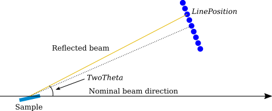

.. algorithm::

.. summary::

.. relatedalgorithms::

.. properties::

Description
-----------

Moves the specified detector component to a given angle between the beam and
the sample-to-detector vector. The detector component is moved as a
block. The rest of the instrument components remain in original positions. The component
can be shifted vertically (default), or rotated around the sample position. When rotating
around the sample, an optional rotation can be applied so that the detector always faces
the sample.

In the most basic operation, the detector is moved to the angle specified by ``TwoTheta``.
This case is schematically shown below for rotation around the sample position and
``DetectorFacesSample`` set to ``True``.

If ``LinePosition`` and ``PixelSize`` are also given, the detector will be moved such
that the angle will be ``TwoTheta`` for the pixel at workspace index ``LinePosition``.
Note that ``LinePosition`` can be a fractional index making it possible to adjust the
detector angle to a fitted line position. The figure below illustrates this option.

.. note::
   The line positions can be acquired by using, for instance,
   :ref:`FindReflectometryLines <algm-FindReflectometryLines>`.

Previous Versions
-----------------

For version 1 of the algorithm, please see :ref:`SpecularReflectionPositionCorrect-v1. <algm-SpecularReflectionPositionCorrect-v1>`

Usage
-----

.. include:: ../usagedata-note.txt

**Example - Correct 'point-detector'**

.. testcode:: SpecularReflectionPositionCorrectPointDetector

   print('point-detector')
   polref = Load(Filename=r'POLREF00004699.raw', PeriodList=1)
   polref = polref[0]

   instr = polref.getInstrument()
   print('Original position: ' + str(instr.getComponentByName('point-detector').getPos()))

   polref_vert = SpecularReflectionPositionCorrect(polref, TwoTheta = 2*0.49, DetectorComponentName='point-detector', DetectorCorrectionType='VerticalShift')
   instr = polref_vert.getInstrument()
   print('Vertical shift:    ' + str(instr.getComponentByName('point-detector').getPos()))

   polref_rot = SpecularReflectionPositionCorrect(polref, TwoTheta = 2*0.49, DetectorComponentName='point-detector', DetectorCorrectionType='RotateAroundSample')
   instr = polref_rot.getInstrument()
   print('Rotated:           ' + str(instr.getComponentByName('point-detector').getPos()))

Output:

Note that in this case the difference between shifting the detectors vertically or rotating them is negligible.

.. testoutput:: SpecularReflectionPositionCorrectPointDetector

   point-detector
   Original position: [...,...,...]
   Vertical shift:    [...,...,...]
   Rotated:           [...,...,...]

**Example - Correct 'lineardetector'**

.. testcode:: SpecularReflectionPositionCorrectLinearDetector

   print('lineardetector')
   polref = Load(Filename=r'POLREF00004699.raw', PeriodList=1)
   polref = polref[0]

   instr = polref.getInstrument()
   print('Original position: ' + str(instr.getComponentByName('lineardetector').getPos()))

   polref_vert = SpecularReflectionPositionCorrect(polref, TwoTheta = 2*0.49, DetectorComponentName='lineardetector')
   instr = polref_vert.getInstrument()
   print('Vertical shift:    ' + str(instr.getComponentByName('lineardetector').getPos()))

   polref_rot = SpecularReflectionPositionCorrect(polref, TwoTheta = 2*0.49, DetectorComponentName='lineardetector', DetectorCorrectionType='RotateAroundSample')
   instr = polref_rot.getInstrument()
   print('Rotated:           ' + str(instr.getComponentByName('lineardetector').getPos()))

Output:

.. testoutput:: SpecularReflectionPositionCorrectLinearDetector

   lineardetector
   Original position: [...,...,...]
   Vertical shift:    [...,...,...]
   Rotated:           [...,...,...]

**Example - Correct 'OSMOND'**

.. testcode:: SpecularReflectionPositionCorrectOSMONDDetector

   print('OSMOND')
   polref = Load(Filename=r'POLREF00004699.raw', PeriodList=1)
   polref = polref[0]

   instr = polref.getInstrument()
   print('Original position: ' + str(instr.getComponentByName('OSMOND').getPos()))

   polref_vert = SpecularReflectionPositionCorrect(polref, TwoTheta = 2*0.49, DetectorComponentName='OSMOND')
   instr = polref_vert.getInstrument()
   print('Vertical shift:    ' + str(instr.getComponentByName('OSMOND').getPos()))

   polref_rot = SpecularReflectionPositionCorrect(polref, TwoTheta = 2*0.49, DetectorComponentName='OSMOND', DetectorCorrectionType='RotateAroundSample')
   instr = polref_rot.getInstrument()
   print('Rotated:           ' + str(instr.getComponentByName('OSMOND').getPos()))

Output:

.. testoutput:: SpecularReflectionPositionCorrectOSMONDDetector

   OSMOND
   Original position: [...,...,...]
   Vertical shift:    [...,...,...]
   Rotated:           [...,...,...]

**Example - Rotate given pixel**

.. testcode:: SpecularReflectionPositionCorrectLinePosition

   import numpy
   # We'll just use an empty workspace here.
   ws = LoadEmptyInstrument(InstrumentName='D17')
   # Get rid of monitors
   ExtractMonitors(ws, DetectorWorkspace='ws')
   ws = mtd['ws']
   line_position = 22.
   spectrum_info = ws.spectrumInfo()
   two_theta = numpy.rad2deg(spectrum_info.twoTheta(int(line_position)))
   print('Pixel {} 2theta'.format(int(line_position)))
   print('before angle correction: {:.3}'.format(two_theta))
   ws = SpecularReflectionPositionCorrect(
       ws,
       TwoTheta=1.5,
       DetectorCorrectionType='RotateAroundSample',
       DetectorComponentName='detector',
       DetectorFacesSample=True,
       LinePosition=line_position,
       PixelSize=0.001195)
   spectrum_info = ws.spectrumInfo()
   two_theta = numpy.rad2deg(spectrum_info.twoTheta(int(line_position)))
   print('after angle correction: {:.3}'.format(two_theta))

Output:

.. testoutput:: SpecularReflectionPositionCorrectLinePosition

   Pixel 22 2theta
   before angle correction: ...
   after angle correction: ...

.. categories::

.. sourcelink::
