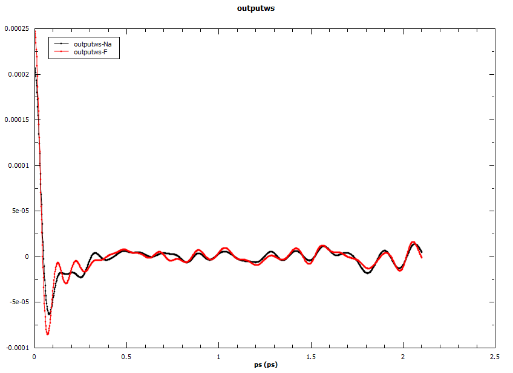

.. algorithm::

.. summary::

.. relatedalgorithms::

.. properties::

Description
------------
Loads a netcdf file generated by nMoldyn containing MMTK format trajectories. The algorithm calculates, sums and averages velocity auto-correlations of every type of particle. The correlations are not properly scaled with incoherent scattering lengths as of version 1.0.

Example
------------
Velocity auto-correlations calculated for sodium fluoride.

Usage
-------

.. code-block:: python

    AutoCorr = VelocityAutoCorrelations(InputFile = 'trajectories.nc',
                                                            Timestep = '2.0')

.. categories::

.. sourcelink::
