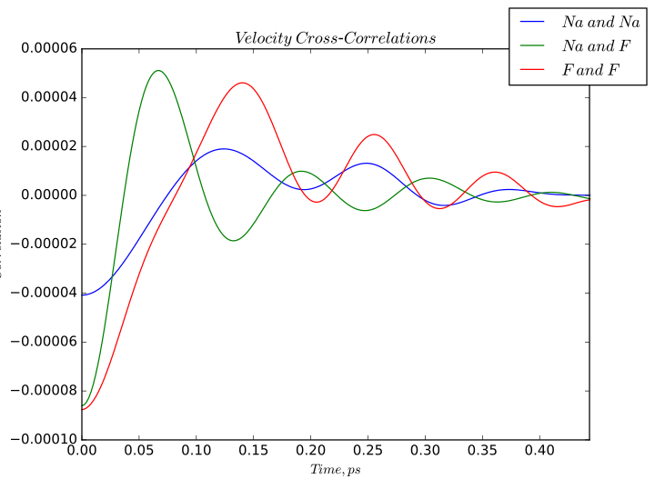

.. algorithm::

.. summary::

.. relatedalgorithms::

.. properties::

Description
------------
Loads a netcdf file generated by nMoldyn containing MMTK format trajectories. The algorithm calculates velocity cross-correlations of each pair of particles, sums and averages the correlations into bins according to the type of pairing. The correlations are also scaled by coherent scattering lengths of different atom types.

Example
------------
Velocity cross-correlations calculated for sodium fluoride.

Usage
-------

.. code-block:: python

    CrossCorr = VelocityCrossCorrelations(InputFile = 'trajectories.nc',
                                                               Timestep = '2.0')

.. categories::

.. sourcelink::
