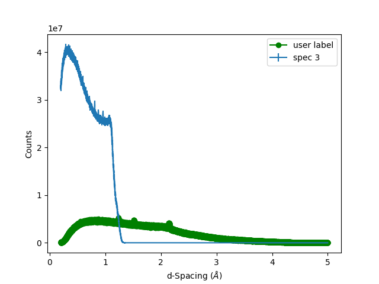
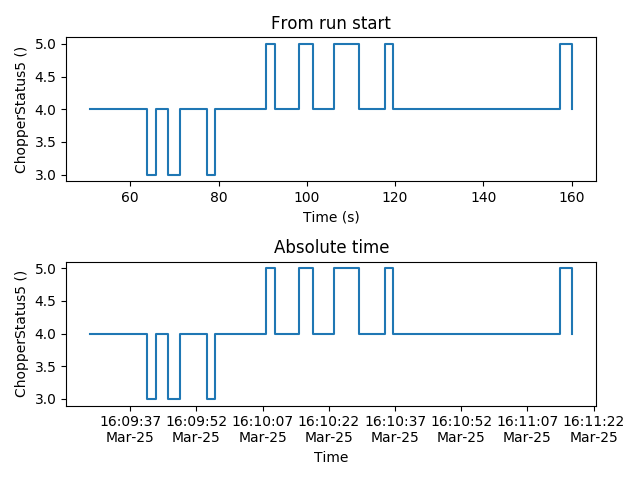
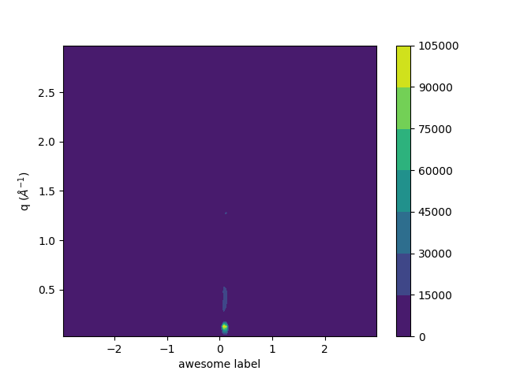
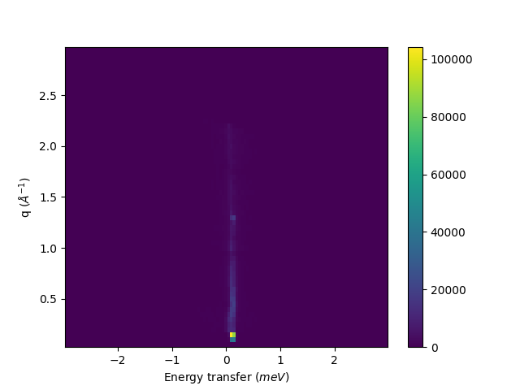
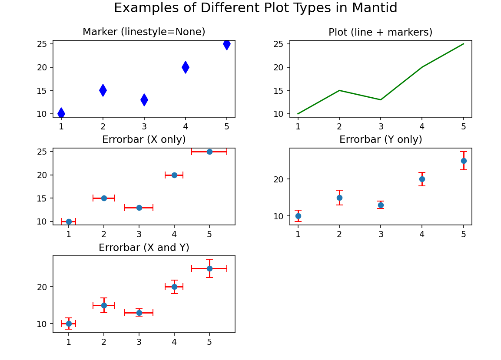

.. _mantid.plots:

====================
 :mod:`mantid.plots`
====================

The functions in this module are intended to be used with matplotlib's
object oriented abstract program interface (API). matplotlib's
(stateful) functional interface is discouraged by matplotlib.
The object oriented API allow for customization as well.

The plotting of a :class:`mantid.api.MatrixWorkspace` or a
:class:`mantid.api.IMDHistoWorkspace` can happen in two different ways.
The use of a ``mantid`` projection allows most matplotlib-like
experience:

.. code-block:: python

    import matplotlib.pyplot as plt
    from mantid import plots

    #some code here to get a workspace, and x, y, yerr arrays

    fig, ax = plt.subplots(subplot_kw={'projection':'mantid'})
    ax.errorbar(workspace,'rs',specNum=1) #for workspaces
    ax.errorbar(x,y,yerr,'bo')            #for arrays
    fig.show()

If the ``mantid`` projection is not used, the plotting functions take a
:class:`matplotlib.axes.Axes` and a :class:`mantid.api.MatrixWorkspace` or
:class:`mantid.api.IMDHistoWorkspace`, with some keywords that are
specific to Mantid an the type or workspace used. While there are defaults for the
labels, you can easily override them after the initial plotting is
called. A useful reference is matplotlib's `anatomy of a figure
<https://matplotlib.org/examples/showcase/anatomy.html>`_.

.. include:: ../../../../usagedata-note.txt

All of the examples below can be run with the following imports, but
not all are used in all places.

.. code-block:: python

   from mantid.simpleapi import mtd, Load, LoadEventNexus, Rebin, ConvertUnits, SofQW, Transpose
   from mantid import plots
   import matplotlib.pyplot as plt
   from matplotlib.colors import LogNorm

First, load some diffraction data and see what the automatic axes will
be using :func:`~mantid.plots.helperfunctions.get_axes_labels`.

.. code-block:: python

   Load(Filename="PG3_733", OutputWorkspace="PG3_733")
   print(plots.helperfunctions.get_axes_labels(mtd['PG3_733']))

Which will print the ``y-label`` then the labels for all the other
axes as properly escaped for use directly in
:py:meth:`matplotlib.axes.Axes.set_xlabel`.

.. code-block:: python

   ('Counts', 'd-Spacing ($\\AA$)', 'Spectrum')

To generate a 1D plots of some spectra with ``mantid`` projection:

.. code-block:: python

   fig, ax = plt.subplots(subplot_kw={'projection':'mantid'})
   ax.plot(mtd['PG3_733'], 'go-', specNum=1, label='user label')
   ax.errorbar(mtd['PG3_733'],  wkspIndex=2)
   ax.legend()
   fig.show()

or without:

.. code-block:: python

   fig, ax = plt.subplots()
   plots.plotfunctions.plot(ax, mtd['PG3_733'], 'go-', specNum=1, label='user label')
   plots.plotfunctions.errorbar(ax, mtd['PG3_733'],  wkspIndex=2)
   ax.legend()
   fig.show()

This example demonstrates adding multiple spectra onto a single 1D
plot and overriding some of the default behavior. :func:`~mantid.plots.MantidAxes.plot` is a normal
line plot, while :func:`~mantid.plots.MantidAxes.errorbar` adds the uncertainties. It should be
warned that every call to one of the plot functions will automatically
annotate the axes with the last one called being the one that takes
effect.

The :func:`~mantid.plots.MantidAxes.plot` function also allows
plotting sample logs.

.. code-block:: python

   from mantid import plots
   import matplotlib.pyplot as plt
   w = LoadEventNexus(Filename='CNCS_7860_event.nxs')
   fig = plt.figure()
   ax1 = fig.add_subplot(211, projection = 'mantid')
   ax2 = fig.add_subplot(212, projection = 'mantid')
   ax1.plot(w, LogName = 'ChopperStatus5')
   ax1.set_title('From run start')
   ax2.plot(w, LogName = 'ChopperStatus5', FullTime = True)
   ax2.set_title('Absolute time')
   fig.tight_layout()
   fig.show()

Two common ways to look at 2D plots are :func:`~mantid.plots.MantidAxes.contourf` and
:func:`~mantid.plots.MantidAxes.pcolormesh`. The difference between these is the
:func:`~mantid.plots.MantidAxes.contourf` calculates smooth lines of constant
value, where the :func:`~mantid.plots.MantidAxes.pcolormesh` is the actual data
values.
:func:`~mantid.plots.MantidAxes.pcolormesh` is similar to :func:`~mantid.plots.MantidAxes.pcolor`,
but uses a different mechanism and returns a different object; pcolor returns a PolyCollection
but pcolormesh returns a QuadMesh.
It is much faster, so it is almost always preferred for large arrays.

.. code-block:: python

   LoadEventNexus(Filename='CNCS_7860_event.nxs', OutputWorkspace='CNCS_7860_event')
   ConvertUnits(InputWorkspace='CNCS_7860_event', OutputWorkspace='CNCS_7860_event', Target='DeltaE', EMode='Direct', EFixed=3)
   Rebin(InputWorkspace='CNCS_7860_event', OutputWorkspace='CNCS_7860_event', Params='-3,0.05,3')
   SofQW(InputWorkspace='CNCS_7860_event', OutputWorkspace='CNCS_7860_sqw', QAxisBinning='0,0.05,3', EMode='Direct', EFixed=3)
   Transpose(InputWorkspace='CNCS_7860_sqw',  OutputWorkspace='CNCS_7860_sqw')

   fig, ax = plt.subplots(subplot_kw={'projection':'mantid'})
   c = ax.contourf(mtd['CNCS_7860_sqw'], norm=LogNorm())
   ax.set_xlabel('awesome label')
   fig.colorbar(c)
   fig.show()

Similarly, showing the actual values with :func:`~mantid.plots.MantidAxes.pcolormesh`

.. code-block:: python

   fig, ax = plt.subplots(subplot_kw={'projection':'mantid'})
   c = ax.pcolormesh(mtd['CNCS_7860_sqw'], norm=LogNorm())
   fig.colorbar(c)
   fig.show()

A couple of notes about :func:`~mantid.plots.MantidAxes.pcolor`,
:func:`~mantid.plots.MantidAxes.pcolormesh`,
and :func:`~mantid.plots.MantidAxes.pcolorfast`:

* If the :class:`mantid.api.MatrixWorkspace` has unequal bins,
  the polygons/meshes will have sides not aligned
  with the axes. One can override this behavior by using the
  **axisaligned** keyword, and setting it to True
* If the :class:`mantid.api.MatrixWorkspace` has different numbers
  of bins the above functions will automatically use the
  **axisaligned** behavior (cannot be overridden). :func:`~mantid.plots.MantidAxes.contour`
  and the like cannot plot these type of workspaces.

In addition to the ``mantid`` projection, there is also the ``mantid3d`` projection for 3d plots.
Can be used much the same as the ``mantid`` projection, but by instead specifying ``mantid3d``
when giving the projection:

.. code-block:: python

    import matplotlib.pyplot as plt
    from mantid import plots

    #some code here to get a workspace, and x, y, yerr arrays

    fig, ax = plt.subplots(subplot_kw={'projection':'mantid3d'})
    ax.plot_wireframe(workspace)   #for workspaces
    ax.plot_wireframe(x,y,z)       #for arrays
    fig.show()

Matrix Workspace Plotting
=========================

The :ref:`Matrix Workspace <MatrixWorkspace_Plotting>` has some additional features that help simplify plotting data.
The `setPlotType()` method allows you to define how a workspace should be visualized when plotting. The following plot types are available:

- **marker**:
  A scatter plot where data points are displayed as markers without connecting lines. Ideal for visualizing individual data points.

- **plot**:
  A standard line plot that connects data points using lines. This is the default visualization for continuous data.

- **errorbar_x**:
  A plot with error bars in the x-direction only. Uses `dataX` for the x-values, `dataY` for the y-values, and `dataDx` for the x-error values.

- **errorbar_y**:
  A plot with error bars in the y-direction only. Uses `dataX` for the x-values, `dataY` for the y-values, and `dataE` for the y-error values.

- **errorbar_xy**:
  A plot with error bars in both x- and y-directions. Uses `dataX` for the x-values, `dataY` for the y-values, `dataDx` for the x-error values, and `dataE` for the y-error values.

These options can be set using:

.. code-block:: python

    workspace.setPlotType('marker') # or 'plot', 'errorbar_x', 'errorbar_y', 'errorbar_xy'
    workspace.getPlotType() # returns the current plot type

Types of functions
==================

**Informational**

* :func:`~mantid.plots.helperfunctions.get_axes_labels`

**1D Plotting**

* :func:`~mantid.plots.MantidAxes.plot` - Plot lines and/or markers
* :func:`~mantid.plots.MantidAxes.errorbar` - Plot values with errorbars
* :func:`~mantid.plots.MantidAxes.scatter` - Make a scatter plot

**2D Plotting**

* :func:`~mantid.plots.MantidAxes.contour` - Draw contours at specified levels
* :func:`~mantid.plots.MantidAxes.contourf` - Draw contours at calculated levels
* :func:`~mantid.plots.MantidAxes.pcolor` - Draw a pseudocolor plot of a 2-D array
* :func:`~mantid.plots.MantidAxes.pcolorfast` - Draw a pseudocolor plot of a 2-D array
* :func:`~mantid.plots.MantidAxes.pcolormesh` - Draw a quadrilateral mesh
* :func:`~mantid.plots.MantidAxes.tripcolor` - Draw a pseudocolor plot of an unstructured triangular grid
* :func:`~mantid.plots.MantidAxes.tricontour` - Draw contours at specified levels on an unstructured triangular grid
* :func:`~mantid.plots.MantidAxes.tricontourf` - Draw contours at calculated levels on an unstructured triangular grid

**3D Plotting**

* :func:`~mantid.plots.MantidAxes3D.plot` - Draws a line plot in 3D space
* :func:`~mantid.plots.MantidAxes3D.scatter` - Draws a scatter plot in 3d space
* :func:`~mantid.plots.MantidAxes3D.plot_wireframe` - Draws a wire frame linking all adjacent data plots
* :func:`~mantid.plots.MantidAxes3D.plot_surface` - Draws a surface linking all adjacent data points
* :func:`~mantid.plots.MantidAxes3D.contour` - Draws contour lines at specified levels of the data
* :func:`~mantid.plots.MantidAxes3D.contourf` - Draws filled contour lines at specified levels of the data

matplotlib demonstrates the difference between uniform and nonuniform
grids well in `this example
<https://matplotlib.org/gallery/images_contours_and_fields/tricontour_vs_griddata.html#sphx-glr-gallery-images-contours-and-fields-tricontour-vs-griddata-py>`_

Available Functions
===================

When using ``mantid`` projection
--------------------------------

.. autoclass:: mantid.plots.MantidAxes

   .. automethod:: contour
   .. automethod:: contourf
   .. automethod:: errorbar
   .. automethod:: pcolor
   .. automethod:: pcolorfast
   .. automethod:: pcolormesh
   .. automethod:: plot
   .. automethod:: scatter
   .. automethod:: tripcolor
   .. automethod:: tricontour
   .. automethod:: tricontourf

When using ``mantid3d`` projection
----------------------------------

.. autoclass:: mantid.plots.MantidAxes3D

   .. automethod:: contour
   .. automethod:: contourf
   .. automethod:: plot
   .. automethod:: plot_surface
   .. automethod:: plot_wireframe
   .. automethod:: scatter

Functions to use when **mantid** projection is not available
------------------------------------------------------------

.. automodule:: mantid.plots.axesfunctions
   :members: plot, errorbar, scatter, contour, contourf, pcolor,
             pcolorfast, pcolormesh, tripcolor, tricontour, tricontourf

Functions to use when **mantid3d** projection is not available
--------------------------------------------------------------

.. automodule:: mantid.plots.axesfunctions3D
   :members: plot, scatter, plot_wireframe, plot_surface,
             contour, contourf

Helper functions
----------------
.. automodule:: mantid.plots.datafunctions
   :members: get_distribution, get_normalization,
             points_from_boundaries, boundaries_from_points,
             get_wksp_index_dist_and_label, get_md_data, get_md_data1d,
             get_md_data2d_bin_bounds, get_md_data2d_bin_centers,
             get_spectrum, get_matrix_2d_data,get_uneven_data,
             get_sample_log, get_axes_labels
