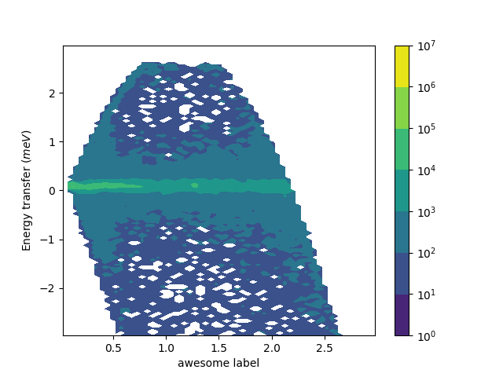

======================
 :mod:`mantid.plots`
======================

The functions in this module are intended to be used with matplotlib's
object oriented abstract program interface (API). matplotlib's
(stateful) functional interface is discouraged by matplotlib and does
allow for customization as well. Generically, these functions take a
:class:`matplotlib.axes.Axes` and a
:class:`mantid.api.MatrixWorkspace`. While there are defaults for the
labels, you can easily override them after the initial plotting is
called. A useful reference is matplotlib's `anatomy of a figure
<https://matplotlib.org/examples/showcase/anatomy.html>`_.

.. include:: ../../../../usagedata-note.txt

All of the examples below can be run with the following imports, but
not all are used in all places.

.. code-block:: python

   from mantid.simpleapi import mtd, Load, LoadEventNexus, Rebin, ConvertUnits, SofQW, Transpose
   from mantid import plots
   import matplotlib.pyplot as plt
   from matplotlib.colors import LogNorm

First, load some diffraction data and see what the automatic axes will
be using :func:`~mantid.plots.getAxesLabels`.

.. code-block:: python

   Load(Filename="PG3_733", OutputWorkspace="PG3_733")
   print(plots.getAxesLabels(mtd['PG3_733']))

Which will print the ``y-label`` then the labels for all the other
axes as properly escaped for use directly in
:py:meth:`matplotlib.axes.Axes.set_xlabel`.

.. code-block:: python

   ('Counts', 'd-Spacing ($\\AA$)', 'Spectrum')

To generate a 1D plots of some spectra.

.. code-block:: python

   fig, ax = plt.subplots()
   plots.plot(ax, mtd['PG3_733'], 'go-', specNum=1, label='user label')
   plots.errorbar(ax, mtd['PG3_733'],  wkspIndex=2)
   ax.legend()
   fig.show()

This example demonstrates adding multiple spectra onto a single 1D
plot and overriding some of the default behavior. :func:`~mantid.plots.plot` is a normal
line plot, while :func:`~mantid.plots.errorbar` adds the uncertainties. It should be
warned that every call to one of the plot functions will automatically
annotate the axes with the last one called being the one that takes
effect.

Two common ways to look at 2D plots are :func:`~mantid.plots.contourf` and
:func:`~mantid.plots.pcolormesh`. The difference between these is the
:func:`~mantid.plots.contourf` calculates smooth lines of constant
value, where the :func:`~mantid.plots.pcolormesh` is the actual data
values.

.. code-block:: python

   LoadEventNexus(Filename='CNCS_7860_event.nxs', OutputWorkspace='CNCS_7860_event')
   ConvertUnits(InputWorkspace='CNCS_7860_event', OutputWorkspace='CNCS_7860_event', Target='DeltaE', EMode='Direct', EFixed=3)
   Rebin(InputWorkspace='CNCS_7860_event', OutputWorkspace='CNCS_7860_event', Params='-3,0.05,3')
   SofQW(InputWorkspace='CNCS_7860_event', OutputWorkspace='CNCS_7860_sqw', QAxisBinning='0,0.05,3', EMode='Direct', EFixed=3)
   Transpose(InputWorkspace='CNCS_7860_sqw',  OutputWorkspace='CNCS_7860_sqw')

   fig, ax = plt.subplots()
   c = plots.contourf(ax, mtd['CNCS_7860_sqw'], norm=LogNorm())
   ax.set_xlabel('awesome label')
   fig.colorbar(c)
   fig.show()

Similarly, showing the actual values with :func:`~mantid.plots.pcolormesh`

.. code-block:: python

   fig, ax = plt.subplots()
   c = plots.pcolormesh(ax, mtd['CNCS_7860_sqw'], norm=LogNorm())
   fig.colorbar(c)
   fig.show()

.. figure:: ../../../../images/mantid_plots_pcolormesh.png
   :align: center
   :figwidth: image

Types of functions
==================

**Informational**

* :func:`~mantid.plots.getAxesLabels`

**1D Plotting**

* :func:`~mantid.plots.plot` - Plot lines and/or markers
* :func:`~mantid.plots.errorbar` - Plot valuse with errorbars
* :func:`~mantid.plots.scatter` - Make a scatter plot

**2D Plotting - uniform grid**

* :func:`~mantid.plots.contour` - Draw contours at specified levels
* :func:`~mantid.plots.contourf` - Draw contours at calculated levels
* :func:`~mantid.plots.pcolor` - Draw a pseudocolor plot of a 2-D array
* :func:`~mantid.plots.pcolorfast` - Draw a pseudocolor plot of a 2-D array
* :func:`~mantid.plots.pcolormesh` - Draw a quadrilateral mesh

**2D Plotting - nonuniform grid**

* :func:`~mantid.plots.tripcolor` - Draw a pseudocolor plot of an unstructured triangular grid
* :func:`~mantid.plots.triplot` - Draw a unstructured triangular grid as lines and/or markers
* :func:`~mantid.plots.tricontour` - Draw contours at specified levels on an unstructured triangular grid
* :func:`~mantid.plots.tricontourf` - Draw contours at calculated levels on an unstructured triangular grid

matplotlib demonstrates the difference between uniform and nonuniform
grids well in `this example
<https://matplotlib.org/gallery/images_contours_and_fields/tricontour_vs_griddata.html#sphx-glr-gallery-images-contours-and-fields-tricontour-vs-griddata-py>`_

Available Functions
===================

.. automodule:: mantid.plots
   :members: getAxesLabels, plot, errorbar, scatter, contour,
             contourf, pcolor, pcolorfast, pcolormesh, tripcolor,
             triplot, tricontour, tricontourf
