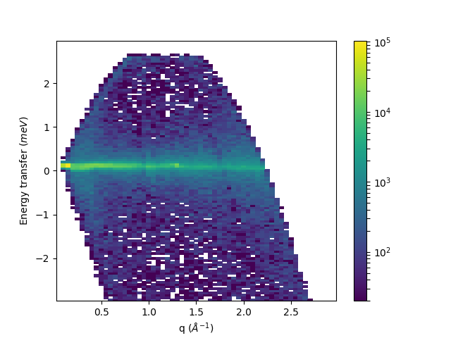

======================
 :mod:`mantid.plots`
======================

The functions in this module are intended to be used with matplotlib's
object oriented abstract program interface (API). matplotlib's
(stateful) functional interface is discouraged by matplotlib. 
The object oriented API allow for customization as well.

The plotting of a :class:`mantid.api.MatrixWorkspace` or a
:class:`mantid.api.IMDHistoWorkspace` can happen in two different ways.
The use of a ``mantid`` projection allows most matplotlib-like
experience:

.. code-block:: python
    
    import matplotlib.pyplot as plt
    from mantid import plots
    
    #some code here to get a workspace, and x, y, yerr arrays
        
    fig, ax = plt.subplots(subplot_kw={'projection':'mantid'})
    ax.errorbar(workspace,'rs',specNum=1) #for workspaces
    ax.errorbar(x,y,yerr,'bo')            #for arrays
    fig.show()

If the ``mantid`` projection is not used, the plotting functions take a
:class:`matplotlib.axes.Axes` and a :class:`mantid.api.MatrixWorkspace` or
:class:`mantid.api.IMDHistoWorkspace`, with some keywords that are
specific to Mantid an the type or workspace used. While there are defaults for the
labels, you can easily override them after the initial plotting is
called. A useful reference is matplotlib's `anatomy of a figure
<https://matplotlib.org/examples/showcase/anatomy.html>`_.

.. include:: ../../../../usagedata-note.txt

All of the examples below can be run with the following imports, but
not all are used in all places.

.. code-block:: python

   from mantid.simpleapi import mtd, Load, LoadEventNexus, Rebin, ConvertUnits, SofQW, Transpose
   from mantid import plots
   import matplotlib.pyplot as plt
   from matplotlib.colors import LogNorm

First, load some diffraction data and see what the automatic axes will
be using :func:`~mantid.plots.functions.getAxesLabels`.

.. code-block:: python

   Load(Filename="PG3_733", OutputWorkspace="PG3_733")
   print(plots.functions.getAxesLabels(mtd['PG3_733']))

Which will print the ``y-label`` then the labels for all the other
axes as properly escaped for use directly in
:py:meth:`matplotlib.axes.Axes.set_xlabel`.

.. code-block:: python

   ('Counts', 'd-Spacing ($\\AA$)', 'Spectrum')

To generate a 1D plots of some spectra with ``mantid`` projection:

.. code-block:: python

   fig, ax = plt.subplots(subplot_kw={'projection':'mantid'})
   ax.plot(mtd['PG3_733'], 'go-', specNum=1, label='user label')
   ax.errorbar(mtd['PG3_733'],  wkspIndex=2)
   ax.legend()
   fig.show()

or without:

.. code-block:: python

   fig, ax = plt.subplots()
   plots.functions.plot(ax, mtd['PG3_733'], 'go-', specNum=1, label='user label')
   plots.functions.errorbar(ax, mtd['PG3_733'],  wkspIndex=2)
   ax.legend()
   fig.show()

.. figure:: ../../../../images/mantid_plots_1D.png
   :align: center
   :figwidth: image

This example demonstrates adding multiple spectra onto a single 1D
plot and overriding some of the default behavior. :func:`~mantid.plots.MantidAxes.plot` is a normal
line plot, while :func:`~mantid.plots.MantidAxes.errorbar` adds the uncertainties. It should be
warned that every call to one of the plot functions will automatically
annotate the axes with the last one called being the one that takes
effect.

Two common ways to look at 2D plots are :func:`~mantid.plots.MantidAxes.contourf` and
:func:`~mantid.plots.MantidAxes.pcolormesh`. The difference between these is the
:func:`~mantid.plots.MantidAxes.contourf` calculates smooth lines of constant
value, where the :func:`~mantid.plots.MantidAxes.pcolormesh` is the actual data
values.
:func:`~mantid.plots.MantidAxes.pcolormesh` is similar to :func:`~mantid.plots.MantidAxes.pcolor`,
but uses a different mechanism and returns a different object; pcolor returns a PolyCollection
but pcolormesh returns a QuadMesh.
It is much faster, so it is almost always preferred for large arrays.

.. code-block:: python

   LoadEventNexus(Filename='CNCS_7860_event.nxs', OutputWorkspace='CNCS_7860_event')
   ConvertUnits(InputWorkspace='CNCS_7860_event', OutputWorkspace='CNCS_7860_event', Target='DeltaE', EMode='Direct', EFixed=3)
   Rebin(InputWorkspace='CNCS_7860_event', OutputWorkspace='CNCS_7860_event', Params='-3,0.05,3')
   SofQW(InputWorkspace='CNCS_7860_event', OutputWorkspace='CNCS_7860_sqw', QAxisBinning='0,0.05,3', EMode='Direct', EFixed=3)
   Transpose(InputWorkspace='CNCS_7860_sqw',  OutputWorkspace='CNCS_7860_sqw')

   fig, ax = plt.subplots(subplot_kw={'projection':'mantid'})
   c = ax.contourf(mtd['CNCS_7860_sqw'], norm=LogNorm())
   ax.set_xlabel('awesome label')
   fig.colorbar(c)
   fig.show()

.. figure:: ../../../../images/mantid_plots_contourf.png
   :align: center
   :figwidth: image

Similarly, showing the actual values with :func:`~mantid.plots.MantidAxes.pcolormesh`

.. code-block:: python

   fig, ax = plt.subplots(subplot_kw={'projection':'mantid'})
   c = ax.pcolormesh(mtd['CNCS_7860_sqw'], norm=LogNorm())
   fig.colorbar(c)
   fig.show()

A couple of notes about :func:`~mantid.plots.MantidAxes.pcolor`, 
:func:`~mantid.plots.MantidAxes.pcolormesh`, 
and :func:`~mantid.plots.MantidAxes.pcolorfast`:

* If the :class:`mantid.api.MatrixWorkspace` has unequal bins, 
  the polygons/meshes will have sides not aligned
  with the axes. One can override this behavior by using the 
  **axisaligned** keyword, and setting it to True
* If the :class:`mantid.api.MatrixWorkspace` has different numbers
  of bins the above functions will automatically use the
  **axisaligned** behavior (cannot be overriden). :func:`~mantid.plots.MantidAxes.contour`
  and the like cannot plot these type of workspaces.

Types of functions
==================

**Informational**

* :func:`~mantid.plots.functions.getAxesLabels`

**1D Plotting**

* :func:`~mantid.plots.MantidAxes.plot` - Plot lines and/or markers
* :func:`~mantid.plots.MantidAxes.errorbar` - Plot valuse with errorbars
* :func:`~mantid.plots.MantidAxes.scatter` - Make a scatter plot

**2D Plotting**

* :func:`~mantid.plots.MantidAxes.contour` - Draw contours at specified levels
* :func:`~mantid.plots.MantidAxes.contourf` - Draw contours at calculated levels
* :func:`~mantid.plots.MantidAxes.pcolor` - Draw a pseudocolor plot of a 2-D array
* :func:`~mantid.plots.MantidAxes.pcolorfast` - Draw a pseudocolor plot of a 2-D array
* :func:`~mantid.plots.MantidAxes.pcolormesh` - Draw a quadrilateral mesh
* :func:`~mantid.plots.MantidAxes.tripcolor` - Draw a pseudocolor plot of an unstructured triangular grid
* :func:`~mantid.plots.MantidAxes.tricontour` - Draw contours at specified levels on an unstructured triangular grid
* :func:`~mantid.plots.MantidAxes.tricontourf` - Draw contours at calculated levels on an unstructured triangular grid

matplotlib demonstrates the difference between uniform and nonuniform
grids well in `this example
<https://matplotlib.org/gallery/images_contours_and_fields/tricontour_vs_griddata.html#sphx-glr-gallery-images-contours-and-fields-tricontour-vs-griddata-py>`_

Available Functions
===================

When using ``mantid`` projection
--------------------------------
 
.. autoclass:: mantid.plots.MantidAxes
   :members: plot, errorbar, scatter, contour,
             contourf, pcolor, pcolorfast, pcolormesh, tripcolor,
             tricontour, tricontourf

Functions to use when **mantid** projection is not available
------------------------------------------------------------

.. automodule:: mantid.plots.functions
   :members: getAxesLabels, plot, errorbar, scatter, contour,
             contourf, pcolor, pcolorfast, pcolormesh, tripcolor,
             tricontour, tricontourf
