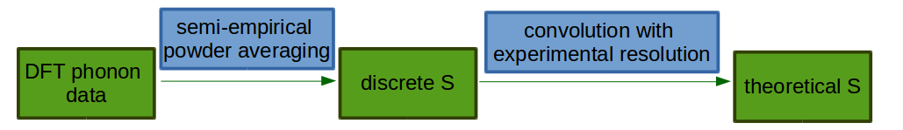

.. _DynamicalStructureFactorFromAbInitio:

Ab-initio calculation of dynamical structure factor (S)
=======================================================

Introduction
++++++++++++

The purpose of this document is to explain the link between theoretical and experimental :math:`S(\mathbf{Q}, \omega)` and to
describe the general idea how theoretical S from ab-initio is calculated by available plugins in Mantid.

During an inelastic neutron scattering experiment sample is exposed to neutron flux and response of a sample in the
form of dynamical structure factor  is recorded. In principle, one obtains phonon (vibrational) spectrum which is often
quite  difficult to analyse. In order to better understand experimental results one can use modeling methods. One of the
most successful theoretical method in predicting phonon spectrum is ab-initio method DFT [1].

Usual approach in calculating phonon spectra within DFT is presented in the figure above. First, one defines initial
guess for the structure in interest. The initial guess should be as close as possible to an experimental structure.
Then, one optimise structure within DFT. By optimising structure one should understand finding the closest to the
initial guess local minimum of energy within accuracy of DFT method. At the closest minimum there
should be no effective force on atoms. For that structure the dynamical matrix, e.g, second derivative of system Hamiltonian with respect to
atomic displacements is calculated. Eigenvectors obtained from diagonalisation of this matrix are atomic displacements
and eigenvalues are squared frequencies of vibrations. Those vibrations are sometime called *modes* or *fundamentals*.
Using atomic displacements and frequencies obtained by DFT method one can calculate theoretical :math:`S(\mathbf{Q}, \omega)`. :math:`S(\mathbf{Q}, \omega)`
is calculated for each atom separately. Total S is sum over all partial atomic contributions.

Working equations
+++++++++++++++++

Powder
~~~~~~

From DFT calculations one usually obtains phonon data for infinite single crystal (there are ways to perform
calculations for molecule, e.g, gas phase). In order to compare it with experiment in which sample is in the form of
powder one has to perform powder averaging. Usually semi-empirical formula is used [2], [3]:

:math:`S^j (\mathbf{Q},\omega_i) = S^j (Q,\omega_i) = \frac{Q^2 TrB_{\omega_i}}{3} exp\left(-Q^2 \alpha^j_{\omega_i} coth^2\left(\frac{\hbar \omega_i}{2 k_B T}\right)  \right)\sigma^j`

where :math:`B` and :math:`A` are tensors created from atomic displacements in the following way:

:math:`B^j_{\omega_i} = c^j_{\omega_i}(c^{j}_{\omega_i})^T M^j  \frac{C_1}{\omega_i}`

:math:`A^j = \sum_i B^j_{\omega_i}`

with

:math:`Q` -- momentum transfer which occurs during neutron scattering. In principle, momentum transfer :math:`\mathbf{Q}` is a vector but due to powder averaging S for the powder case depends on length of :math:`\mathbf{Q}`

:math:`\alpha^j_{\omega_i}` -- semi-empirical parameter calculated as: :math:`\alpha^j_{\omega_i} = \frac{1}{5} \left \lbrace Tr A^j  + \frac{2 B^j_{\omega_i}: A^j}{Tr B^j_{\omega_i}} \right\rbrace`

:math:`Tr` -- trace operation

:math:`:` --  tensor contraction operation

:math:`j` -- indicates :math:`j`-th atoms

:math:`i` -- indicates :math:`i`-th energy transition

:math:`\omega_i` -- frequency for :math:`i`-th transition in :math:`cm^{-1}` (called also mode or fundamental)

:math:`c^j_{\omega_i}`  -- atomic displacement for :math:`j`-th atom and :math:`i`-th frequency in atomic units

:math:`M_j` -- mass of :math:`j`-th atom in atomic units

:math:`C_1` --  :math:`\hbar / (4 / \pi)` expressed in spectroscopic units

:math:`k_B` -- Boltzmann constant

:math:`T` -- temperature in K

:math:`\sigma_j` -- cross-section for :math:`j`-th atom

The formula above is valid for *first order quantum events*, e. g., transitions :math:`0 \rightarrow 1` for each phonon. In order to
reconstruct spectrum one has to also consider higher order quantum events. For second order quantum event one should
consider transitions :math:`0 \rightarrow 2`, but also simultaneous transitions :math:`0 \rightarrow 1`, :math:`0 \rightarrow 1'` for different phonons. Within harmonic approximation all second
order transitions form the following  set: :math:`\lbrace \omega_1 + \omega_1, \omega_1 + \omega_2, \omega_1 + \omega_3, \ldots,  \omega_p + \omega_p \rbrace`.
Cardinality of this set is :math:`p^2`, where :math:`p` is a number of fundamentals. In practice one can reduce this number by taking into consideration realistic energy  window
and neglecting those :math:`\omega_{ij}=\omega_i + \omega_j` for which :math:`S(Q, \omega_i)` is negligible.
Within harmonic approximation each phonon is treated as independent harmonic quantum oscillator.  The formula for :math:`S(Q, \omega_{ik})` is as follows [4]:

:math:`S^j(Q, \omega_{ik}) = \frac{Q^4}{15  C}\left( TrB^j_{\omega_i}TrB^j_{\omega_k} + B^j_{\omega_i}:B^j_{\omega_k} + B^j_{\omega_k}:B^j_{\omega_i} \right) exp\left(-Q^2 \beta^j coth^2\left(\frac{\hbar \omega_{ik}}{2 k_B T} \right) \right)\sigma^j`

where:

:math:`\beta^j = A^j / 3`

:math:`C` -- is a constant,  :math:`C=2` if :math:`i=j` and :math:`C=1` otherwise

Similarly one can define contribution for the third quantum order event (:math:`0 \rightarrow 3`, simultaneous  :math:`0 \rightarrow 1`, :math:`0 \rightarrow 1'`, :math:`0 \rightarrow 1''` for different oscillators ,etc.. ) [4]:

:math:`S^j(Q, \omega_{ikl}) = \frac{9Q^6}{543}\left( TrB^j_{\omega_i} TrB^j_{\omega_k} TrB^j_{\omega_l}  \right)  exp\left(-Q^2 \beta^j coth^2\left(\frac{\hbar \omega_{ikl}}{2 k_B T}\right) \right)\sigma^j`

Usually in order to reconstruct experimental spectrum it is enough to give contribution up to fourth order (:math:`0 \rightarrow 4` , simultaneous :math:`0 \rightarrow 1`, :math:`0 \rightarrow 1'`, :math:`0 \rightarrow 1''`, :math:`0 \rightarrow 1'''` for different oscillators, etc.)  [4]:

:math:`S^j(Q, \omega_{iklm}) = \frac{27Q^8}{9850}\left( TrB^j_{\omega_i} TrB^j_{\omega_k} TrB^j_{\omega_l}TrB^j_{\omega_m}  \right) exp\left(-Q^2 \beta^j coth^2\left(\frac{\hbar \omega_{iklm}}{2 k_B T}\right) \right)\sigma^j`

In the similar way as for the second quantum order event one can reduce number of energy transitions by taking into account considered energy window and neglecting small S.

After evaluating equations above one obtains discrete S for each quantum order and for each atom: :math:`S_{discrete}`. In order to compare such a spectrum with an experimental spectrum one has to convolve it with experimental resolution:

:math:`S_{theory}^{nj}(Q, \omega) = S_{discrete}^{nj}(Q, \omega) * f(\omega)`

where:

:math:`j` -- indicates :math:`j`-th atoms

:math:`n` -- indicates :math:`n`-order event

:math:`f(\omega)` -- resolution function

:math:`S_{theory}` -- it is *theoretical S* which can be compared with experimental results

For `Tosca <http://www.isis.stfc.ac.uk/instruments/tosca/tosca4715.html>`_  and Tosca-like instruments :math:`f(\omega)` has the following form:

:math:`f(\omega)=1.0 / \sqrt{\sigma(\omega)  \pi}  \exp(-(\omega)^2  / \sigma(\omega))`

where:

:math:`\sigma(\omega) = A  \omega^2  + B  \omega + C`

with :math:`A`, :math:`B`, :math:`C` as constants.

Moreover, in case of Tosca and Tosca-like instruments length of momentum transfer depends on frequency (*indirect geometry spectrometer*).
The formula for :math:`Q^2` is as follows:

:math:`Q^2(\omega)=k^2_i(\omega) + k^2_f - 2  \sqrt{k^2_i(\omega)  k^2_f} cos(\theta)`

where:

:math:`k^2_i(\omega)=(\omega + E_{final})  \hbar/ (4  \pi)` expressed in the spectroscopic units

:math:`k^2_f=E_{final}  \hbar/(4 \pi)`

with

:math:`E_{final}` -- final energy on the crystal analyser in :math:`cm^{-1}`

:math:`cos(\theta)` -- cosines of crystal analyser angle in radians

Current implementation
++++++++++++++++++++++
Calculation of theoretical S from ab-initio results is implemented in :ref:`Abins <algm-Abins>`. At the moment Abins supports
`CASTEP <http://www.castep.org/>`_ and `CRYSTAL <http://www.crystal.unito.it/index.php>`_ DFT programs. As it comes to instruments,
`Tosca <http://www.isis.stfc.ac.uk/instruments/tosca/tosca4715.html>`_ and Tosca-like instruments are supported.

References
++++++++++

[1] W. Kohn et al., *Inhomogeneous Electron Gas*, Phys. Rev. B {\bf 136}, 864 (1964).

[2] J. Howard, B.C. Boland, J. Tomkinson, *Intensities in inelastic neutron scattering spectra: a test of recent theory*, Chem. Phys. 77 (1983).

[3] J. Howard and J. Tomkinson, *An analytical method for the calculation of the relative intensities of bending and stretching modes in inelastic neutron scattering spectra*, Chem. Phys. Letters 98 (1983).

[4] P. C H Mitchell, S. F. Parker, A. J. Ramirez-Cuesta, J. Tomkinson, *Vibrational Spectroscopy with Neutrons With Applications in Chemistry, Biology, Materials Science and Catalysis*, ISBN: 978-981-256-013-1

.. categories:: Concepts