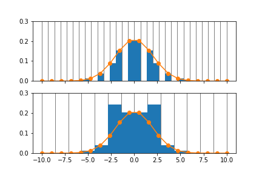

.. _AbinsImplementation:

Abins: Implementation details
=============================

Introduction
------------

Abins is a relatively complex algorithm with some unique
infrastructure and built-in design decisions. Details are collected
here: this is primarily for the benefit of those developing or
hacking Abins.

Sampling
--------

While the scattering cross-sections are calculated for individual
events and enumerated combinations of events, the output spectra are
histograms which have been resampled and broadened on a finite grid.

The data range is determined by three parameters:

- *min_wavenumber*, set in ``AbinsParameters.sampling``
- *max_wavenumber*, set in ``AbinsParameters.sampling``
- *bin_width*, a parameter set in the main Abins algorithm interface
  and passed as an argument to internal functions as appropriate. This
  parameter is more exposed than the energy range, as a convenient to
  the user. However, it should be applied consistently within a single
  application of Abins and functions may assume that this value was
  also used elsewhere.

These parameters are used to establish the edges of the sample *bins*;
the largest value is rounded up from *max_wavenumber* to contain a
whole number of *bin_width*.

The histogram of data sampled in these N bins has N-1 "points", which
should be aligned with the corresponding bin centres if plotted as a
line.

Broadening
----------

The legacy implementation of broadening uses a Gaussian kernel with a
fixed number of points spread over a range scaled to the peak width,
set by the *pkt_per_peak* and *fwhm* parameters in
``AbinsParameters.sampling``. This method is not recommended, as
aliasing occurs when the x-coordinates are not commensurate with the
histogram bin.

These parameters are retained temporarily in order to allow a
comparison with the newer broadening implementations, but will
not be used going forwards.

Deprecation plans
-----------------

- The *pkt_per_peak* and *fwhm* parameters in
  ``AbinsParameters.sampling`` are no longer in use and should be
  removed in a future release.

- The "SingleCrystal" modules and objects support non-existent
  functionality and should be removed. They may return when that
  functionality is added, but it is likely that their interfaces will
  change in the process.

- The *frequencies_threshold* parameter in
  ``AbinsParameters.sampling`` is currently non-functional and should
  be removed until it *is* functional.
