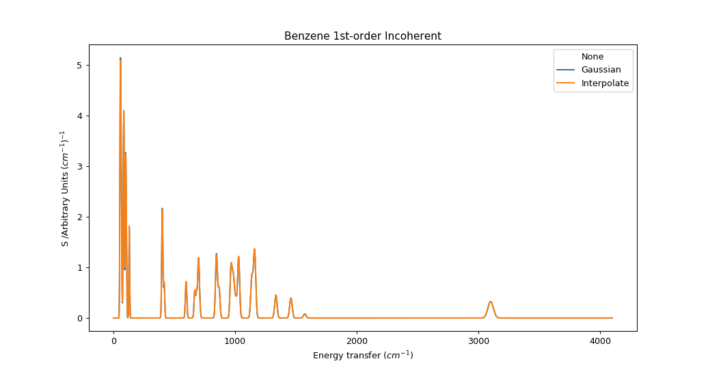
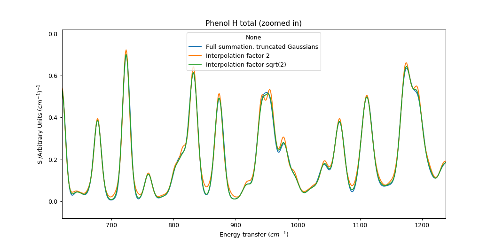

.. _AbinsInterpolatedBroadening:

Abins: Fast approximate broadening with "interpolate"
=====================================================

.. contents::

The "interpolate" scheme in ``AbinsModules.Instruments.Broadening``
estimates broadened spectra using a limited number of kernel
evaluations or convolution steps in order to reduce the computation
time. The method appears to be novel, so some explanation is needed.

Consider first that we can approximate a Gaussian function by a linear
combination of two other Gaussians; one narrower and one wider. If the
mixing parameters are linearly based on the relationship between the
widths the results are not impressive:

.. plot::

   from __future__ import (absolute_import, division, print_function, unicode_literals)

   import numpy as np
   from scipy.optimize import curve_fit
   import matplotlib.pyplot as plt
   from matplotlib.lines import Line2D

   def gaussian(x, sigma=2, center=0):
       g = np.exp(-0.5 * ((x - center) / sigma)**2) / (sigma * np.sqrt(2 * np.pi))
       return g

   margin = 0.05

   def plot_linear_interp():
       """Plot linearly-interpolated Gaussians with wide sigma range"""

       g1_center = 0
       g2_center = 40
       sigma_max = 4
       sigma_min = 1

       x = np.linspace(-10, 50, 401)

       fig, ax = plt.subplots()
       for sigma, color in zip(np.linspace(sigma_min, sigma_max, 5),
                               ['C0', 'C1', 'C2', 'C3', 'C4']):
           center = (g1_center
                     + ((sigma - sigma_min)
                        * (g2_center - g1_center) / (sigma_max - sigma_min)))
           ax.plot(x, gaussian(x, sigma=sigma, center=center), c=color)

           low_ref = gaussian(x, sigma=sigma_min, center=center)
           high_ref = gaussian(x, sigma=sigma_max, center=center)
           mix = (sigma - sigma_min) / (sigma_max - sigma_min)
           ax.plot(x, (1 - mix) * low_ref + mix * high_ref,
                   c=color, linestyle='--')

       ax.set_xlim([-10, 50])
       ax.set_ylim([0, None])
       ax.tick_params(labelbottom=False, labelleft=False)

       custom_lines = [Line2D([0], [0], color='k', linestyle='-', lw=2),
                       Line2D([0], [0], color='k', linestyle='--', lw=2)]

       ax.legend(custom_lines, ['Exact', 'Linear interpolation'])
       fig.subplots_adjust(left=margin, bottom=margin,
                           right=(1 - margin), top=(1 - margin))

   plot_linear_interp()

But if we optimise the mixing parameter at each width then the
magnitudes improve significantly, even if the shapes remain distinctly non-Gaussian:

.. plot::

   from __future__ import (absolute_import, division, print_function, unicode_literals)

   import numpy as np
   from scipy.optimize import curve_fit
   import matplotlib.pyplot as plt
   from matplotlib.lines import Line2D

   def gaussian(x, sigma=2, center=0):
       g = np.exp(-0.5 * ((x - center) / sigma)**2) / (sigma * np.sqrt(2 * np.pi))
       return g

   margin = 0.05

   def plot_optimised_interp(sigma_max=4):
       g1_center = 0
       g2_center = 40
       sigma_min = 1

       x = np.linspace(-10, 10, 101)
       npts = 7

       fig, [ax1, ax2, ax3] = plt.subplots(nrows=3,
                                           sharex=True,
                                           gridspec_kw={
                                               'height_ratios': [3, 1, 1]})
       mix1_list, mix2_list = [], []

       def gaussian_mix(x, w1, w2):
           """Return a linear combination of two Gaussians with weights"""
           return (w1 * gaussian(x, sigma=sigma_min)
                   + w2 * gaussian(x, sigma=sigma_max))

       for sigma, color in zip(np.linspace(sigma_min, sigma_max, npts),
                               ['C0', 'C1', 'C2', 'C3', 'C4', 'C5', 'C6']):
           ydata = gaussian(x, sigma=sigma)
           (mix1, mix2), _ = curve_fit(gaussian_mix, x, ydata, p0=[0.5, 0.5])

           x_offset = (g1_center
                       + ((sigma - sigma_min)
                          * (g2_center - g1_center) / (sigma_max - sigma_min)))
           actual = gaussian(x, sigma=sigma)
           est = gaussian_mix(x, mix1, mix2)
           rms = np.sqrt(np.mean((actual - est)**2))
           ax1.plot(x + x_offset, actual, color=color)
           ax1.plot(x + x_offset, est, color=color, linestyle='--')
           ax2.plot([x_offset], [rms], 'o', c='C0')

           mix1_list.append(mix1)
           mix2_list.append(mix2)

       custom_lines = [Line2D([0], [0], color='k', linestyle='-', lw=2),
                       Line2D([0], [0], color='k', linestyle='--', lw=2)]

       ax1.legend(custom_lines, ['Exact', 'Optimised interpolation'])

       ax2.set_ylabel('RMS error')

       ax3.plot(np.linspace(g1_center, g2_center, npts), mix1_list)
       ax3.plot(np.linspace(g1_center, g2_center, npts), mix2_list)
       ax3.set_ylabel('Weights')
       ax3.set_ylim([0, 1])

   plot_optimised_interp(sigma_max=4)

This error is closely related to the width difference between the
endpoints. Here the range is reduced from a factor 4 to a factor 2,
and the resulting functions are visually quite convincing

.. plot::

   from __future__ import (absolute_import, division, print_function, unicode_literals)

   import numpy as np
   from scipy.optimize import curve_fit
   import matplotlib.pyplot as plt
   from matplotlib.lines import Line2D

   def gaussian(x, sigma=2, center=0):
       g = np.exp(-0.5 * ((x - center) / sigma)**2) / (sigma * np.sqrt(2 * np.pi))
       return g

   margin = 0.05

   def plot_optimised_interp(sigma_max=4):
       g1_center = 0
       g2_center = 40
       sigma_min = 1

       x = np.linspace(-10, 10, 101)
       npts = 7

       fig, [ax1, ax2, ax3] = plt.subplots(nrows=3,
                                           sharex=True,
                                           gridspec_kw={
                                               'height_ratios': [3, 1, 1]})
       mix1_list, mix2_list = [], []

       def gaussian_mix(x, w1, w2):
           """Return a linear combination of two Gaussians with weights"""
           return (w1 * gaussian(x, sigma=sigma_min)
                   + w2 * gaussian(x, sigma=sigma_max))

       for sigma, color in zip(np.linspace(sigma_min, sigma_max, npts),
                               ['C0', 'C1', 'C2', 'C3', 'C4', 'C5', 'C6']):
           ydata = gaussian(x, sigma=sigma)
           (mix1, mix2), _ = curve_fit(gaussian_mix, x, ydata, p0=[0.5, 0.5])

           x_offset = (g1_center
                       + ((sigma - sigma_min)
                          * (g2_center - g1_center) / (sigma_max - sigma_min)))
           actual = gaussian(x, sigma=sigma)
           est = gaussian_mix(x, mix1, mix2)
           rms = np.sqrt(np.mean((actual - est)**2))
           ax1.plot(x + x_offset, actual, color=color)
           ax1.plot(x + x_offset, est, color=color, linestyle='--')
           ax2.plot([x_offset], [rms], 'o', c='C0')

           mix1_list.append(mix1)
           mix2_list.append(mix2)

       custom_lines = [Line2D([0], [0], color='k', linestyle='-', lw=2),
                       Line2D([0], [0], color='k', linestyle='--', lw=2)]

       ax1.legend(custom_lines, ['Exact', 'Optimised interpolation'])

       ax2.set_ylabel('RMS error')

       ax3.plot(np.linspace(g1_center, g2_center, npts), mix1_list)
       ax3.plot(np.linspace(g1_center, g2_center, npts), mix2_list)
       ax3.set_ylabel('Weights')
       ax3.set_ylim([0, 1])

   plot_optimised_interp(sigma_max=2)

while a gap of :math:`\sqrt{2}` is practically indistinguishable with error below 1% of the peak maximum.

.. plot::

   from __future__ import (absolute_import, division, print_function, unicode_literals)

   import numpy as np
   from scipy.optimize import curve_fit
   import matplotlib.pyplot as plt
   from matplotlib.lines import Line2D

   def gaussian(x, sigma=2, center=0):
       g = np.exp(-0.5 * ((x - center) / sigma)**2) / (sigma * np.sqrt(2 * np.pi))
       return g

   margin = 0.05

   def plot_optimised_interp(sigma_max=4):
       g1_center = 0
       g2_center = 40
       sigma_min = 1

       x = np.linspace(-10, 10, 101)
       npts = 7

       fig, [ax1, ax2, ax3] = plt.subplots(nrows=3,
                                           sharex=True,
                                           gridspec_kw={
                                               'height_ratios': [3, 1, 1]})
       mix1_list, mix2_list = [], []

       def gaussian_mix(x, w1, w2):
           """Return a linear combination of two Gaussians with weights"""
           return (w1 * gaussian(x, sigma=sigma_min)
                   + w2 * gaussian(x, sigma=sigma_max))

       for sigma, color in zip(np.linspace(sigma_min, sigma_max, npts),
                               ['C0', 'C1', 'C2', 'C3', 'C4', 'C5', 'C6']):
           ydata = gaussian(x, sigma=sigma)
           (mix1, mix2), _ = curve_fit(gaussian_mix, x, ydata, p0=[0.5, 0.5])

           x_offset = (g1_center
                       + ((sigma - sigma_min)
                          * (g2_center - g1_center) / (sigma_max - sigma_min)))
           actual = gaussian(x, sigma=sigma)
           est = gaussian_mix(x, mix1, mix2)
           rms = np.sqrt(np.mean((actual - est)**2))
           ax1.plot(x + x_offset, actual, color=color)
           ax1.plot(x + x_offset, est, color=color, linestyle='--')
           ax2.plot([x_offset], [rms], 'o', c='C0')

           mix1_list.append(mix1)
           mix2_list.append(mix2)

       custom_lines = [Line2D([0], [0], color='k', linestyle='-', lw=2),
                       Line2D([0], [0], color='k', linestyle='--', lw=2)]

       ax1.legend(custom_lines, ['Exact', 'Optimised interpolation'])

       ax2.set_ylabel('RMS error')

       ax3.plot(np.linspace(g1_center, g2_center, npts), mix1_list)
       ax3.plot(np.linspace(g1_center, g2_center, npts), mix2_list)
       ax3.set_ylabel('Weights')
       ax3.set_ylim([0, 1])

   plot_optimised_interp(sigma_max=np.sqrt(2))

For TOSCA :math:`\sigma = a f^2 + b f + c` where :math:`a, b, c$ = $10^{-7}, 0.005, 2.5`. For an energy range of 32 cm\ :sup:`-1` to 4100 cm\ :sup:`-1` sigma ranges from 2.66 to 24.68, which could covered by 5 Gaussians separated by width factor 2 or 9 Gaussians seperated by width factor :math:`\sqrt{2}`.
This could present a significant cost saving compared to full evaluation of ~4000 convolution kernels (one per convolution bin).

We can build on this by performing convolution of the full spectrum with each of the sampled kernels, and then interpolate *between the spectra* using the predetermined mixing weights. The convolution is performed efficiently using FFTs, and relatively little memory is required to hold this limited number of spectra and interpolate between them.

.. plot::

   from __future__ import (absolute_import, division, print_function, unicode_literals)

   import matplotlib.pyplot as plt
   import numpy as np
   from AbinsModules.Instruments import Broadening

   bins = np.linspace(0, 100, 1001, dtype=np.float64)
   frequencies = (bins[:-1] + bins [1:]) / 2

   # Generate synthetic data with two peaks
   intensities = np.zeros_like(frequencies)
   peak1_loc = 300
   peak2_loc = 600
   intensities[peak1_loc] = 1.5
   intensities[peak2_loc] = 1

   sigma = np.linspace(1, 10, 1000)
   peak1_sigma = sigma[peak1_loc]
   peak2_sigma = sigma[peak2_loc]

   fig, (ax1, ax2, ax3) = plt.subplots(nrows=3, sharex=True, figsize=(8,6))

   # Original spectrum
   ax1.plot(frequencies, intensities, 'k-', label='Unbroadened spectrum')

   # Narrow limit
   freq_points, spectrum = Broadening.broaden_spectrum(frequencies=frequencies,
                                                       bins=bins,
                                                       s_dft=intensities,
                                                       sigma=(peak1_sigma * np.ones_like(frequencies)),
                                                       scheme='gaussian')
   ax2.plot(freq_points, spectrum, label='Convolve with min(sigma)')

   # Broad limit
   freq_points, spectrum = Broadening.broaden_spectrum(frequencies=frequencies,
                                                       bins=bins,
                                                       s_dft=intensities,
                                                       sigma=(peak2_sigma * np.ones_like(frequencies)),
                                                       scheme='gaussian')
   ax2.plot(freq_points, spectrum, label='Convolve with max(sigma)')

   # Reference method: sum individually
   freq_points, spectrum = Broadening.broaden_spectrum(frequencies=frequencies,
                                                       bins=bins,
                                                       s_dft=intensities,
                                                       sigma=sigma,
                                                       scheme='gaussian')
   ax3.plot(freq_points, spectrum, 'k-', label='Sum individual peaks')

   # Interpolated
   freq_points, spectrum = Broadening.broaden_spectrum(frequencies=frequencies,
                                                       bins=bins,
                                                       s_dft=intensities,
                                                       sigma=sigma,
                                                       scheme='interpolate')
   ax2.plot(freq_points, spectrum, c='C2', linestyle='--', label='Interpolated', zorder=0.5)
   ax3.plot(freq_points, spectrum, c='C2', linestyle='--', label='Interpolated', zorder=0.5)

   ax1.legend()
   ax2.legend()
   ax3.legend()

   for ax in ax1, ax2, ax3:
       ax.tick_params(labelbottom=False, labelleft=False)

   margin=0.05
   fig.subplots_adjust(left=margin, right=(1-margin), bottom=margin, top=(1-margin))

   fig.savefig('abins_interp_broadening_schematic.png')

This procedure is not strictly equivalent to a summation over frequency-dependent functions, even if there is no interpolation error.
At each energy coordinate :math:`\epsilon` we "see" a fragment of full spectrum convolved at the same width as any points at :math:`\epsilon` would be.
In a typical indirect INS spectrum which becomes broader at high energy, this would overestimate the contribution from peaks originating below this :math:`\epsilon` and underestimate the contribution from peaks originating above :math:`\epsilon`.
As a result, peaks will appear asymmetric.
In practice, the magnitude of this error depends on the rate of change of :math:`\sigma` relative to the size of :math:`\sigma`.
In the case of the TOSCA parameters, the error is very small. This should be re-evaluated for other instruments with different energy-dependent broadening functions.

We can see the artefacts of this approach more clearly if we use fewer Gaussians (spaced by factor 2) and zoom in on the spectrum. The interpolation method has a tendency to show small peaks at turning points; this may be related to the imperfection in the shape of the smooth bell.

.. categories:: Concepts
