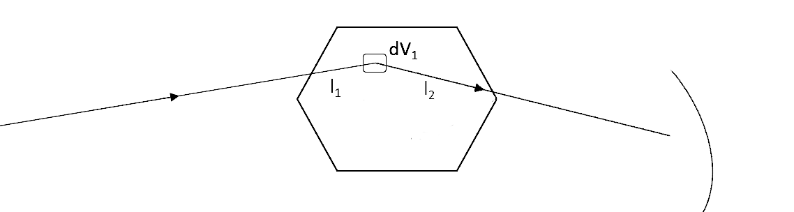

.. _Sample Corrections:

Absorption and Multiple Scattering Corrections
==============================================

.. contents::

Introduction
-------------
To discuss sample corrections, specifically the absorption and multiple scattering, we must first define terms pertinent to the calculations of these corrections.

Total cross section (:math:`\sigma_t`)
#######################################
First, we define the total cross section per atom, which for the majority of elements, is equal to the sum of the element's scattering and absorption cross sections:

.. math::
   :label: total_xs

   \sigma_t (\lambda) = \sigma_s (\lambda) + \sigma_a (\lambda)

where :math:`\lambda` is the neutron wavelength, :math:`\sigma_s = \int_{\Omega} \frac{d\sigma}{d\Omega} \left( \lambda, 2\theta \right) d\Omega`, and
:math:`\frac{d\sigma}{d\Omega} \left( \lambda, 2\theta \right)` is the differential cross-section which is the cross-section (:math:`\sigma`) per solid angle (:math:`d\Omega`).

Scattering cross section (:math:`\sigma_s` )
#############################################
Typically, the scattering cross section is directly found from tabulated single atom values [1]_ and with good approximation, assumed independent of wavelength.
If we observe the equation above for :math:`\sigma_s`, we have that it is equal to the integration of the differential cross section. Yet, for the typical diffraction experiment,
the differential cross-section is exactly the quantity we wish to measure. Thus, to proceed one could chose from the following:

1) Measure the sample and integrate over all :math:`d\Omega` (very difficult to do exactly since instruments typically cannot cover all :math:`4 \pi` of :math:`\Omega`).
2) Perform a transmission measurement to directly measure :math:`\sigma_t` and subtract a known value for :math:`\sigma_a` (also not typical).
3) Use tabulated single atom values for :math:`\sigma_s` [1]_ (bingo!).

For the energies used to measure structure of materials, :math:`\sigma_s` is to
reasonable approximation independent of :math:`\lambda`. However, exceptions include nuclear resonances, strong Bragg scattering as in beryllium, and significant inelastic effects. [2]_

Absorption cross section (:math:`\sigma_a`)
###########################################
For the absorption cross section, again typically the cross section is used from the same tabulated single atom values [1]_ but is only valid for the reference wavelength, 1.7982 :math:`\AA`,
at which it was measured at. Thus, we can look up the value of :math:`\sigma_a (1.7982 \AA)`. Yet, the absorption cross section is a linear function of wavelength (away from nuclear resonances).
Thus, we can calculate the absorption cross section at other wavelengths from:

.. math::
   :label: abs_xs

    \sigma_a (\lambda) = \sigma_a (1.7982 \AA) \left( \frac{\lambda}{1.7982} \right)

**NOTE:** In Mantid, the reference wavelength is defined as a variable :code:`ReferenceLambda` in :code:`NeutronAtom.cpp` [3]_. This variable should be used for consistency in all sample correction algorithms that
calculate :math:`\sigma_a (\lambda)` from this reference wavelength.

Attenuation Length (:math:`\mu`)
#################################
The attenuation length is defined as:

.. math::
   :label: attenuation_length

    \mu = \rho \sigma_t = \rho \left( \sigma_s + \sigma_a \right)

where :math:`\rho` is the atomic number density of the sample.
Note that :math:`\rho` is not the crystallographic or microscopic density of a unit cell but the macroscopic density of the bulk sample. If one were to measure a powder sample, the powder would not pack
perfectly and thus there would be a given packing fraction, :math:`f`. Then, if the microscopic density is given as :math:`\rho_{micro}`, it is related to :math:`\rho` via:

.. math::
   :label: packing_fraction

    \rho = f * \rho_{micro}

The definition of :math:`\rho` is used throughout the rest of this documentation.

Techniques for Calculating Corrections
######################################

Methods for calculating the absorption corrections (and also the multiple scattering)  generally fall into these categories:

1) Analytical solutions. For some simple situations it is possible to do an exact, analytical integration to produce a formula for the absorption correction based on parameters of the sample

* Very fast.
* Results are often stored in look up tables.
* Use often involves interpolating between tabulated results.
* Implemented in Mantid

2) Numerical integration

* Generally provides quicker solutions than Monte Carlo methods.
* Some assumptions are included: sample geometries and the scattering processes.
* Less flexible than the Monte Carlo integration or ray-tracing for tackling different problems.
* Implemented in Mantid

3) Monte Carlo integration

* Monte Carlo is used for the numerical integration technique.
* The performance relative to classical numerical integration depends on the number of dimensions in the integration. Monte Carlo integration is faster for a large number of dimensions
* Relaxation of most assumptions needed by analytical solutions.
* More flexible than the analytical techniques for shapes, beam profiles, and mixed number of scattering processes.
* Implemented in Mantid

4) Monte Carlo ray tracing

* Most general solution in that it is a virtual neutron experiment with all neutron histories kept. Slowest to solution.
* Relatively no assumptions needed. Can simulate mixed numbers of scattering, complex scattering processes (ie scattering sample to sample environment back to sample then to detector), moderator and guides included.
* Most flexible but mainly a tool for designing new instruments than for calculating sample corrections.
* Typically calculated in another program specific to ray tracing and then imported into Mantid.
* Some ray tracing solutions reduce the cost of simulating neutrons that never reach a detector by forcing neutrons into certain trajectories and assigning weights. This type of enhanced ray tracing approach is very similar to a Monte Carlo integration

The analytical and numerical integration methods generally provide a quicker solution, but at the expense of having to make assumptions about sample geometries and scattering processes that make them less flexible than the Monte Carlo techniques (integration and ray-tracing).
However, in many cases analytical and numerical integration solutions are satisfactory and allow much more efficient analysis of results.

.. _Absorption Corrections:

Absorption
------------

.. plot:: concepts/AbsorptionAndMultipleScattering_plot_abs.py

   Comparison of absorption methods with the assumptions of elastic scattering and isotropic scattering for in-plane detectors. The sample is Vanadium rod 4cm tall with 0.25cm diameter with standard number density. Algorithms compared are :ref:`MayersSampleCorrection <algm-MayersSampleCorrection>`, :ref:`CarpenterSampleCorrection <algm-CarpenterSampleCorrection>`, :ref:`AbsorptionCorrection <algm-AbsorptionCorrection>` (numerical integration), and :ref:`MonteCarloAbsorption <algm-MonteCarloAbsorption>`.

Introduction
###############
Determination of the structure and/or dynamics of samples depends on the analysis of single scattering data.
Overall, the absorption correction is a factor, :math:`A`, such that 0 < :math:`A` < 1 . It is a factor that accounts for the loss of intensity from single scattering in the sample (or other component in the instrument).
due to both scattering and capture events in the sample. The factor :math:`A` is divided by the measured intensity. Thus, the absorption correction has an overall multiplicative enhancement of the measured intensity.

Basic Sample Absorption Theory
###############################
The figure shows how a general single scattering process might occur. The neutron travels
a certain distance :math:`l_1` through the sample before a single scattering event occurs in
the volume element :math:`dV` of the sample. Then, the neutron travels a final length :math:`l_2` before leaving the sample and being picked up by
a detector.

To formulate the absorption sample correction, first, we assume we have a homogeneous sample of a given shape that is fully illuminated by the incident beam.
Then, the number of neutrons per unit solid angle scattered once by a volume element :math:`dV` of the sample and seen by a detector is given by:

.. math::
   :label: dI1

   dI_1(\theta) = J_0 \rho \frac{d\sigma}{d\Omega} \left( \theta \right) exp \left[ -\mu (\lambda_1) l_1 + - \mu (\lambda_2) l_2 \right] dV

where :math:`J_0` is the incident flux, :math:`\rho` is the atomic number density, :math:`\frac{d\sigma}{d\Omega} \left( \theta \right)` is the differential cross-section,
:math:`l_1` and :math:`l_2` are the path lengths for incident neutrons to :math:`dV` and from :math:`dV` to the detector, respectively,
and :math:`\lambda_1` and :math:`\lambda_2` are the incident and scattered wavelength, respectively.

Yet, this is only the contribution from a single volume element, or voxel, of the sample volume that contributes to a detector. Thus, if we integrate over the entire sample volume (all the voxels),
we arrive at the total intensity of neutrons scattered once through an angle :math:`\theta` and then leaving the sample without further scattering, given as:

.. math::
   :label: I1

   I_1(\theta) &= \int_V dI_1 \\
               &= J_0 \rho \frac{d\sigma}{d\Omega} \left( \theta \right) \int_{V} exp \left[ -\mu (\lambda_1) l_1 + -\mu (\lambda_2) l_2 \right] dV \\
               &= J_0 \rho \frac{d\sigma}{d\Omega} \left( \theta \right) A V

In the last part of the equation for :math:`I_1(\theta)`, we have introduced the term :math:`A`, given as:

.. math::
   :label: absorption_factor

    A = \frac{1}{V} \int_{V} exp \left[ -\mu (\lambda_1) l_1 + -\mu (\lambda_2) l_2 \right] dV

This is the basic absorption correction for a single sample volume (i.e. no container included, no partial correction factors, no partial illumination, etc.).
NOTE: In some references, this term :math:`A` is instead defined as the inverse :math:`A^{-1}`. Some references use the notation here: [2]_ [4]_ [5]_ [7]_ [8]_ and [10]_, while others use the inverse notation: [6]_.

For elastic scattering, :math:`\lambda_1` = :math:`\lambda_2` = :math:`\lambda` and we can simplify to:

.. math::
   :label: absorption_factor_elastic

    A_{elastic} = \frac{1}{V} \int_{V} exp \left[ -\mu (\lambda) \left( l_1 + l_2 \right) \right] dV

Gauge Volume
############

The gauge volume refers to the region of the sample that is both illuminated by the incident neutron beam and visible to the detector. Only neutrons that are scattered within this volume and reach the detector contribute to the measured signal. Therefore, accurate absorption corrections must account for the size and shape of the gauge volume to avoid over- or under-estimating the absorption evaluation.

In normal experimental setups, the neutron beam only partially covers the sample and therefore the gauge volume has to be defined to be smaller than the sample volume. To accommodate this, Mantid provides multiple methods for defining the gauge volume. These methods are prioritized in the following order:

1. **Explicit Gauge Volume via DefineGaugeVolume:**
   Users can explicitly define a custom gauge volume using the :ref:`algm-DefineGaugeVolume` algorithm. This is the highest-priority method and overrides other definitions. It allows complete flexibility in specifying the shape and position of the gauge volume.

2. **Intersection of Beam and Sample via SetBeam:**
   If no gauge volume is defined, the :ref:`algm-SetBeam` algorithm can define the beam shape and size, and automatically compute its intersection with the sample or container geometry to create the gauge volume. This approach reflects the partial illumination seen in real experiments and is useful for modeling realistic beam profiles.

   Note that this method assumes the center of the beam—and therefore the gauge volume—is at the origin of the instrument coordinate system. The same assumption is made for the sample when only its dimensions are provided. While this may not exactly match real setups (where beam and sample positions may vary slightly), the impact on absorption calculations is typically minor.

3. **Full Sample or Container Volume:**
   If neither a gauge volume nor beam shape is provided, the full sample or container geometry is assumed to be the gauge volume. This default approach may overestimate the volume contributing to the signal in cases where the beam only partially illuminates the sample.

In numerical and Monte Carlo integration-based absorption corrections, using an accurate gauge volume is critical for correct computation of the path lengths :math:`l_1` and :math:`l_2` in the absorption factor expressions (e.g., Eq. :eq:`absorption_factor`). It also plays a role when including detector and beam profiles in Eq. :eq:`absorption_factor_partial_illumination`.

Partial Absorption Correction Factors: Paalman and Pings Formalism
###################################################################

When the scattering of a sample (liquid, powder, gas, etc.) is measured, the sample is often held in a thick sample container. This container contributes significantly to the measured neutron beam. Often the empty container is measured and the signal from the container (:math:`C`) subtracted from the signal of sample plus container (:math:`S+C`).

The Paalman-Pings formalism (PPF) [4]_ provides a framework for correcting for individual component absorption contributions, or the partial absorption correction factors, when a sample is measured in a container and, possibly, one or more sample environments. PPF builds on the earlier work of Ritter [5]_, who described a graphical approach of accounting for partial absorption correction factors. The PPF goes beyond the work of Ritter in two important ways

* The graphical approach is formulated instead using numerical integration.
* The contribution from the sample/container correlation region, or the interface, where the density of each is affected due to their inter-material interactions.

In their analysis, Paalman and Pings show that the latter point is not generally of consequence since this region only exists for a few angstroms in most materials, but the ability to account for it is re-assuring. The sample/container interaction could be of significant importance in cases where the container and sample are single crystal or poly-crystalline.

Generally, the container measurement (neglecting multiple scattering and inelastic effects) is written:

.. math::
   :label: ppf_container

    I^E_{C} = I_C A_{C,C}

* :math:`I^E_C` experimental intensity from the isolated container.
* :math:`I_C` theoretical intensity from the isolated container.
* :math:`A_{C,C}` is the absorption factor for scattering in the container region and absorption in the container.

The full PPF for the sample and container measurement (neglecting multiple scattering and inelastic effects) is written:

.. math::
   :label: ppf_sample_container

    I^E_{S+C} = I_SA_{S,SC} + I_CA_{C,SC} + I_{SC}A_{SC,SC}

* :math:`I^E_{S+C}` experimentally measured intensity from :math:`S+C`.
* :math:`I_S` theoretical intensity from the isolated sample.
* :math:`I_C` theoretical intensity from the isolated container.
* :math:`I_{SC}` theoretical intensity from the correlated sample and container interface.
* :math:`A_{S,SC}` is the absorption factor for scattering in the sample region and absorption by the sample and container.
* :math:`A_{C,SC}` is the absorption factor for scattering in the container region and absorption by the sample and container.
* :math:`A_{SC,SC}` is the absorption factor for scattering in the correlated sample and container interface and absorption by the sample and container.

As discussed above, the final term in this expression is generally neglected.

General Notes
##############

Integration Methods
^^^^^^^^^^^^^^^^^^^

The numerical and Monte Carlo integration approaches can be further extended in a number of ways:

1. The beam profile (and similarly the detector visibility of the sample) can also be included to accommodate partial illumination of the sample by the beam by means of a convolution function for the shape of the profile. [10]_ The beam profile and detector profile can be defined as a function of the volume element :math:`dV` as :math:`P(dV)` and :math:`D(dV)`, respectively. These can then be included into Eq. :eq:`absorption_factor` as:

.. math::
    :label: absorption_factor_partial_illumination

    A = \frac{1}{V'} \int_{V} exp \left[ -\mu (\lambda_1) l_1 + -\mu (\lambda_2) l_2 \right] P(dV) D(dV) dV

where :math:`V = \int_V P(dV) D(dV) dV` is the effective volume of the cylinder in the beam.

2. Building on (1), the PPF can also be generalized to include the beam and detector profiles. [10]_

Legends for Absorption Correction Algorithms in Mantid Table
#############################################################

Indicates the energy modes that the algorithm can accommodate:

+-------------+-----------+
| Legend for Energy Mode  |
+=============+===========+
| E           | Elastic   |
+-------------+-----------+
| D           | Direct    |
+-------------+-----------+
| I           | Indirect  |
+-------------+-----------+

Indicates the technique used for calculating the absorption correction:

+------------+-------------------------+
|  Legend for Technique                |
+============+=========================+
|  A         | Analytical              |
+------------+-------------------------+
|  NI        | Numerical Integration   |
+------------+-------------------------+
|  MC        | Monte Carlo             |
+------------+-------------------------+

Due to the overlap between the Monte Carlo integration and Monte Carlo ray tracing techniques a single classification of "Monte Carlo" is used

Options that describe what functions the algorithm is capable of and the output types:

+-----------+------------------------------------------------------------------------------------------------------------------------------+
| Legend for Functions                                                                                                                     |
+===========+==============================================================================================================================+
| L         | Loads correction from file                                                                                                   |
+-----------+------------------------------------------------------------------------------------------------------------------------------+
| MS        | Multiple scattering correction calculated                                                                                    |
+-----------+------------------------------------------------------------------------------------------------------------------------------+
| FI        | Full illumination of sample by beam                                                                                          |
+-----------+------------------------------------------------------------------------------------------------------------------------------+
| PI        | Full or partial illumination of sample by beam                                                                               |
+-----------+------------------------------------------------------------------------------------------------------------------------------+
| W         | Outputs a corrected sample workspace                                                                                         |
+-----------+------------------------------------------------------------------------------------------------------------------------------+
| A         | Absorption correction calculated                                                                                             |
+-----------+------------------------------------------------------------------------------------------------------------------------------+
| A\+       | Calculates both sample and container absorption corrections (:math:`A_{s,s}`, :math:`A_{c,c}`)                               |
+-----------+------------------------------------------------------------------------------------------------------------------------------+
| A\++      | Calculates full set of partial absorption corrections (:math:`A_{s,s}`, :math:`A_{s,sc}`, :math:`A_{c,c}`, :math:`A_{c,sc}`) |
+-----------+------------------------------------------------------------------------------------------------------------------------------+

Absorption Correction Algorithms in Mantid Table
#################################################

+-------------------------------------------------------------------------------------+-------------+------------+---------------------------------+--------------------+---------------------+---------------------------------------------------------------------------------------+
| Algorithm                                                                           | Energy Mode | Technique  | Geometry                        | Input Units        | Functions           | Notes                                                                                 |
+=====================================================================================+=============+============+=================================+====================+=====================+=======================================================================================+
| :ref:`AbsorptionCorrection <algm-AbsorptionCorrection>`                             | E,D,I       | NI         | Any Shape                       | Wavelength         | A,PI                || Approximates sample shape using cuboid mesh of given element size                    |
|                                                                                     |             |            |                                 |                    |                     || Base class: AbsorptionCorrection                                                     |
+-------------------------------------------------------------------------------------+-------------+------------+---------------------------------+--------------------+---------------------+---------------------------------------------------------------------------------------+
| :ref:`AnnularRingAbsorption <algm-AnnularRingAbsorption>`                           | E,D,I       | MC         | Annular / Hollow Cylinder       | Wavelength         | A,PI                | Wrapper for MonteCarloAbsorption for hollow cylindrical sample                        |
+-------------------------------------------------------------------------------------+-------------+------------+---------------------------------+--------------------+---------------------+---------------------------------------------------------------------------------------+
| :ref:`AnvredCorrection <algm-AnvredCorrection>`                                     | E           | A          | Sphere                          | Wavelength or TOF  | A,FI,W              ||  Absorption for spheres with additional corrections in ANVRED program from ISAW:     |
|                                                                                     |             |            |                                 |                    |                     ||  - weight factors for pixels of instrument                                           |
|                                                                                     |             |            |                                 |                    |                     ||  - correct for the slant path through the scintillator glass and scale factors       |
+-------------------------------------------------------------------------------------+-------------+------------+---------------------------------+--------------------+---------------------+---------------------------------------------------------------------------------------+
| :ref:`ApplyPaalmanPingsCorrection <algm-ApplyPaalmanPingsCorrection>`               | E,D,I       |            | Cylinder or Flat Plate / Slab   | Wavelength         | W                   || Simply applies the correction workspaces from other Paalman-Pings-style algorithms   |
|                                                                                     |             |            |                                 |                    |                     || Can also apply shift and scale factors to container workspaces                       |
+-------------------------------------------------------------------------------------+-------------+------------+---------------------------------+--------------------+---------------------+---------------------------------------------------------------------------------------+
| :ref:`CalculateCarpenterSampleCorrection <algm-CalculateCarpenterSampleCorrection>` | E           | A          | Cylinder                        | Wavelength         | A,MS,FI             ||  Only applicable to Vanadium                                                         |
|                                                                                     |             |            |                                 |                    |                     ||  In-plane only                                                                       |
+-------------------------------------------------------------------------------------+-------------+------------+---------------------------------+--------------------+---------------------+---------------------------------------------------------------------------------------+
| :ref:`CalculateMonteCarloAbsorption <algm-CalculateMonteCarloAbsorption>`           | E,D,I       | MC         || Cylinder or                    | Wavelength         | A\+,PI              || Uses multiple calls to SimpleShapeMonteCarloAbsorption to calculate                  |
|                                                                                     |             |            || Flat Plate / Slab or           |                    |                     || sample and container correction workspaces                                           |
|                                                                                     |             |            || Annular / Hollow Cylinder      |                    |                     || (Deprecated)                                                                         |
+-------------------------------------------------------------------------------------+-------------+------------+---------------------------------+--------------------+---------------------+---------------------------------------------------------------------------------------+
| :ref:`CarpenterSampleCorrection <algm-CarpenterSampleCorrection>`                   | E           | A          | Cylinder                        | Wavelength         | A,MS,FI,W           ||  Calls CalculateCarpenterSampleCorrection                                            |
|                                                                                     |             |            |                                 |                    |                     ||                                                                                      |
+-------------------------------------------------------------------------------------+-------------+------------+---------------------------------+--------------------+---------------------+---------------------------------------------------------------------------------------+
| :ref:`CuboidGaugeVolumeAbsorption <algm-CuboidGaugeVolumeAbsorption>`               | E,D,I       | NI         | Cuboid section                  | Wavelength         | A,PI                | Base class: AbsorptionCorrection via wrapping                                         |
|                                                                                     |             |            | in Any Shape sample             |                    |                     | via wrapping :ref:`FlatPlateAbsorption <algm-FlatPlateAbsorption>`                    |
+-------------------------------------------------------------------------------------+-------------+------------+---------------------------------+--------------------+---------------------+---------------------------------------------------------------------------------------+
| :ref:`CylinderAbsorption <algm-CylinderAbsorption>`                                 | E,D,I       | NI         | Cylinder                        | Wavelength         | A,FI                | Base class: AbsorptionCorrection                                                      |
+-------------------------------------------------------------------------------------+-------------+------------+---------------------------------+--------------------+---------------------+---------------------------------------------------------------------------------------+
| :ref:`CylinderPaalmanPingsCorrection <algm-CylinderPaalmanPingsCorrection>`         | E,D,I       | NI         | Cylinder                        | Wavelength         | A\++,PI             | in-plane only                                                                         |
+-------------------------------------------------------------------------------------+-------------+------------+---------------------------------+--------------------+---------------------+---------------------------------------------------------------------------------------+
| :ref:`FlatPlateAbsorption <algm-FlatPlateAbsorption>`                               | E,D,I       | NI         | Flat Plate / Slab               | Wavelength         | A,FI                | Base class: AbsorptionCorrection                                                      |
+-------------------------------------------------------------------------------------+-------------+------------+---------------------------------+--------------------+---------------------+---------------------------------------------------------------------------------------+
| :ref:`FlatPlatePaalmanPingsCorrection <algm-FlatPlatePaalmanPingsCorrection>`       | E,D,I       | NI         | Flat Plate / Slab               | Wavelength         | A\++,FI             |                                                                                       |
+-------------------------------------------------------------------------------------+-------------+------------+---------------------------------+--------------------+---------------------+---------------------------------------------------------------------------------------+
| :ref:`HRPDSlabCanAbsorption <algm-HRPDSlabCanAbsorption>`                           | E           | NI         || HRPD aluminium flat plate only | Wavelength         | A\+*,FI             || Only for HRPD via hard-coded dimensions.                                             |
|                                                                                     |             |            ||                                |                    |                     || Uses :ref:`FlatPlateAbsorption <algm-FlatPlateAbsorption>` for sample.               |
|                                                                                     |             |            || with HRPD vanadium windows     |                    |                     || Uses slightly different analytical formula for aluminium holder and vanadium windows |
|                                                                                     |             |            || with HRPD vanadium windows     |                    |                     || for the HRPD instrument.                                                             |
|                                                                                     |             |            ||                                |                    |                     || \*Outputs a single correction workspace with both sample and container corrections   |
+-------------------------------------------------------------------------------------+-------------+------------+---------------------------------+--------------------+---------------------+---------------------------------------------------------------------------------------+
| :ref:`IndirectAnnulusAbsorption <algm-IndirectAnnulusAbsorption>`                   | I           | MC         || Annular / Hollow Cylinder for  | Wavelength         | A\+,W               || Workflow algorithm specific to Indirect geometry spectrometers.                      |
|                                                                                     |             |            || both sample and container      |                    |                     || Uses MonteCarloAbsorption for sample and container.                                  |
|                                                                                     |             |            ||                                |                    |                     || Will apply calculated absorption corrections and subtract container from sample.     |
+-------------------------------------------------------------------------------------+-------------+------------+---------------------------------+--------------------+---------------------+---------------------------------------------------------------------------------------+
| :ref:`IndirectCylinderAbsorption <algm-IndirectCylinderAbsorption>`                 | I           | MC         || Cylinder for sample and        | Wavelength         | A\+,W               || Workflow algorithm specific to Indirect geometry spectrometers.                      |
|                                                                                     |             |            || Annular / Hollow Cylinder      |                    |                     || Uses MonteCarloAbsorption for sample and container.                                  |
|                                                                                     |             |            || for container                  |                    |                     || Will apply calculated absorption corrections and subtract container from sample.     |
+-------------------------------------------------------------------------------------+-------------+------------+---------------------------------+--------------------+---------------------+---------------------------------------------------------------------------------------+
| :ref:`IndirectFlatPlateAbsorption <algm-IndirectFlatPlateAbsorption>`               | I           | MC         || Flat Plate / Slab for both     | Wavelength         | A\+,W               || Workflow algorithm specific to Indirect geometry spectrometers.                      |
|                                                                                     |             |            || sample and container           |                    |                     || Uses MonteCarloAbsorption for sample and container.                                  |
|                                                                                     |             |            ||                                |                    |                     || Will apply calculated absorption corrections and subtract container from sample.     |
+-------------------------------------------------------------------------------------+-------------+------------+---------------------------------+--------------------+---------------------+---------------------------------------------------------------------------------------+
| :ref:`MayersSampleCorrection <algm-MayersSampleCorrection>`                         | E           | NI         | Cylinder                        | TOF                | A,MS,FI,W           |                                                                                       |
+-------------------------------------------------------------------------------------+-------------+------------+---------------------------------+--------------------+---------------------+---------------------------------------------------------------------------------------+
| :ref:`MonteCarloAbsorption <algm-MonteCarloAbsorption>`                             | E,D,I       | MC         | Any Shape                       | Wavelength         | A\+*,PI             || "Workhorse" of the MC-based algorithms                                               |
|                                                                                     |             |            |                                 |                    |                     || \*Outputs a single correction workspace with both sample and container corrections   |
+-------------------------------------------------------------------------------------+-------------+------------+---------------------------------+--------------------+---------------------+---------------------------------------------------------------------------------------+
| :ref:`MultipleScatteringCorrection <algm-MultipleScatteringCorrection>`             | E, EI       |            |                                 |                    |                     ||                                                                                      |
+-------------------------------------------------------------------------------------+-------------+------------+---------------------------------+--------------------+---------------------+---------------------------------------------------------------------------------------+
| :ref:`PaalmanPingsAbsorptionCorrection <algm-PaalmanPingsAbsorptionCorrection>`     | E           | NI         || Any Shape                      || Wavelength        | A\++,PI             || Calculates Paalman Pings partial absorption factors based on AbsorptionCorrection    |
+-------------------------------------------------------------------------------------+-------------+------------+---------------------------------+--------------------+---------------------+---------------------------------------------------------------------------------------+
| :ref:`PaalmanPingsMonteCarloAbsorption <algm-PaalmanPingsMonteCarloAbsorption>`     | E,D,I       | MC         || Cylinder or                    || Wavelength        | A\++,PI             || Calculates Paalman Pings partial absorption factors using MonteCarloAbsorption       |
|                                                                                     |             |            || Flat Plate / Slab or           || Energy Transfer   |                     ||                                                                                      |
|                                                                                     |             |            || Annular / Hollow Cylinder      || Momentum Transfer |                     ||                                                                                      |
+-------------------------------------------------------------------------------------+-------------+------------+---------------------------------+--------------------+---------------------+---------------------------------------------------------------------------------------+
| :ref:`PearlMCAbsorption <algm-PearlMCAbsorption>`                                   | E           | MC         | Any Shape                       | N/A                | L                   || Simply reads in pre-computed :math:`\mu` values for PEARL instrument from an         |
|                                                                                     |             |            |                                 |                    |                     || external Monte Carlo program. Uses :ref:`LoadAscii <algm-LoadAscii>`                 |
+-------------------------------------------------------------------------------------+-------------+------------+---------------------------------+--------------------+---------------------+---------------------------------------------------------------------------------------+
| :ref:`SimpleShapeMonteCarloAbsorption <algm-SimpleShapeMonteCarloAbsorption>`       | E,D,I       | MC         || Cylinder or                    | Wavelength         | A,PI                || Wrapper for MonteCarloAbsorption for 3 shape types                                   |
|                                                                                     |             |            || Flat Plate / Slab or           |                    |                     ||                                                                                      |
|                                                                                     |             |            || Annular / Hollow Cylinder      |                    |                     ||                                                                                      |
+-------------------------------------------------------------------------------------+-------------+------------+---------------------------------+--------------------+---------------------+---------------------------------------------------------------------------------------+
| :ref:`SphericalAbsorption <algm-SphericalAbsorption>`                               | E           | NI         | Sphere                          | Wavelength         | A,FI,W              |  Wrapper around :ref:`AnvredCorrection <algm-AnvredCorrection>`                       |
+-------------------------------------------------------------------------------------+-------------+------------+---------------------------------+--------------------+---------------------+---------------------------------------------------------------------------------------+

.. _Multiple Scattering Corrections:

Multiple Scattering
-------------------

.. plot:: concepts/AbsorptionAndMultipleScattering_plot_ms.py

   Comparison of multiple scattering methods with the assumptions of elastic scattering and isotropic scattering for in-plane detectors. The sample is Vanadium rod 4cm tall with 0.25cm diameter with standard number density. Algorithms compared are :ref:`MayersSampleCorrection <algm-MayersSampleCorrection>`, :ref:`CarpenterSampleCorrection <algm-CarpenterSampleCorrection>`, :ref:`MultipleScatteringCorrection <algm-MultipleScatteringCorrection>` (numerical integration), and :ref:`DiscusMultipleScatteringCorrection <algm-DiscusMultipleScatteringCorrection>`.

Introduction
############

Determination of the structure and/or dynamics of samples depends on the analysis of single scattering data.
Small but unwanted higher-order scattering is always present although in many typical
experiments multiple scattering effects are negligible. However, in some cases the data may
contain a significant contribution from multiple scattering. In neutron scattering, the absorption cross-section is often much smaller than the scattering cross-section.
For this reason it is necessary to account for multiple scattering events. Using the PPF notation from previously, the measured beam from :math:`S+C`
(neglecting multiple scattering and inelastic effects) is given as:

.. math::
   :label: ppf_sample_container_ms

    I^E_{S+C} = [I_SA_{S,SC} + I_CA_{C,SC} + I_{m,S+C}]

Thus, the multiple scattering is a parasitic signal that needs to be subtracted from the experimentally measured :math:`I^E` intensity.
To get an idea of when and why multiple scattering
corrections are needed, let us define :math:`\sigma_n` as the likelihood of a neutron being scattered :math:`n` times.
Then it is possible to show [6]_ that:

.. math::
   :label: sigma_m

	\sigma_m \sim (\frac{\sigma_s}{\sigma_t})^m

Where practical, the shape and thickness of a sample are carefully chosen to minimize as much
unwanted multiple. This may be achieved by using a sample that is either [7]_

* Small in comparison with its mean free path.
* Strongly absorbing (the absorption cross section is much greater than the scattering cross section. Usually this means the dimensions of a sample are chosen to ensure that between 10% and 20% of incident neutrons end up being scattered [8]_ ).

Increasing the absorption cross section is not always attainable - due to the type of material in question - or desirable, due to
the accompanying intensity losses becoming overly prohibitive.

Theory
############
The figure shows how a general double scattering process might occur. The neutron travels
a certain distance :math:`l_1` through the sample before the first scattering event in the volume
element :math:`dV_1`. The second scattering occurs in another volume element :math:`dV_2` after a distance
:math:`l_{12}` has been traversed following which the neutron travels a final length :math:`l_2` before
leaving the sample and being picked up by a detector.

.. figure:: ../images/MultipleScatteringVolume.png
   :alt: MultipleScatteringVolume.png

We define the multiple scattering intensity, :math:`I_m`, in terms of the total scattering intensity, :math:`I_{total}`, from :math:`n` number of orders of scattering intensity, :math:`I_n`, as:

.. math::
   :label: Itotal

    I_{total} &= I_1 + I_2 + I_3 + ... + I_n \\
              &= I_1 + \sum_{i=2}^{n} I_i \\
              &= I_1 + I_m

Then, we see that to compute the multiple scattering, we must compute :math:`n-1` scattering intensity terms to subtract from the total, :math:`I_{total}`.

Let us first just consider the secondary scattering term, :math:`I_2`. We again assume we have a homogeneous sample of a given shape that is fully illuminated by the incident beam.
Then, extending from Eq. :eq:`dI1`, we have that the number of neutrons per unit solid angle scattered once by a volume element :math:`dV_1` and then a second time by
a volume element :math:`dV_2` of the sample and seen by a detector is given by:

.. math::
   :label: dI2

   dI_2(\theta_s) = J_0 \rho^2 \frac{d\sigma}{d\Omega} \left( \theta_1 \right) \frac{d\sigma}{d\Omega} \left( \theta_2 \right) \frac{exp \left[ -\mu (\lambda_1) l_1 + - \mu (\lambda_{12}) l_{12} + - \mu (\lambda_2) l_2 \right]}{l_{12}^2} dV dV

where :math:`\theta_1` is the angle between the incident path and scatter path from :math:`dV_1`,
:math:`\theta_2` is the angle between scatter path from :math:`dV_1` and  scatter path from `dV_2`,
:math:`\theta_s` is the angle between the incident path and scatter path from :math:`dV_2` to the detector,
:math:`\mu_{12}` is the scattered wavelength from volume element :math:`dV_1`,
and the :math:`l_12` term is due to the inverse square law (that as the distance increases between :math:`dV_1` and
:math:`dV_2`, the solid angle subtended by :math:`dV_2` at :math:`dV_1` decreases as the inverse square of :math:`l_{12}`).

And the total secondary scattering intensity seen by a detector is:

.. math::
   :label: I2

   I_2(\theta_s) &= \int_{V} \int_{V} dI_2  \\
                 &= J_0 \rho^2 \frac{d\sigma}{d\Omega} \left( \theta_1 \right) \frac{d\sigma}{d\Omega} \left( \theta_2 \right) \int_{V} \int_{V} \frac{exp \left[ -\mu (\lambda_1) l_1 + - \mu (\lambda_{12}) l_{12} + - \mu (\lambda_2) l_2 \right]}{l_{12}^2} dV dV

We can generalize this for :math:`i^{th}` order of scatter terms as:

.. math::
   :label: dIi

   dI_i(\theta_s) = J_0 \rho^n \prod_{j=1}^{i} \frac{d\sigma}{d\Omega} \left( \theta_j \right) \frac{exp \left[ -\mu (\lambda_1) l_1 + - \sum_{j=1}^{i-1} \mu (\lambda_{j,j+1}) l_{j,j+1} + - \mu (\lambda_i) l_i \right]}{ \prod_{j=1}^{i-1} l_{j,j+1}^2}  dV^{i}

and

.. math::
   :label: Ii

   I_i(\theta_s) &= \int_V ... \int_V dI_i  \\
                 &= J_0 \rho^n \prod_{j=1}^{i} \frac{d\sigma}{d\Omega} \left( \theta_j \right) \int_V ... \int_V \frac{exp \left[ -\mu (\lambda_1) l_1 + - \sum_{j=1}^{i-1} \mu (\lambda_{j,j+1}) l_{j,j+1} + - \mu (\lambda_i) l_i \right]}{ \prod_{j=1}^{i-1} l_{j,j+1}^2} dV^{i}

Which then the multiple scattering up to the :math:`n` order scattering term is given as:

.. math::
   :label: Im

   I_m &= \sum_{i=2}^n I_i \\
       &= \sum_{i=2}^{n} \int_V ... \int_V dI_i  \\
       &= \sum_{i=2}^{n} J_0 \rho^i \prod_{j=1}^{i} \frac{d\sigma}{d\Omega} \left( \theta_j \right) \int_V ... \int_V \frac{exp \left[ -\mu (\lambda_1) l_1 + - \sum_{j=1}^{i-1} \mu (\lambda_{j,j+1}) l_{j,j+1} + - \mu (\lambda_i) l_i \right]}{ \prod_{j=1}^{i-1} l_{j,j+1}^2} dV^{i}

Thus, some of the difficulties in correcting multiple scattering arises from:

1. For each :math:`i^{th}` order of scattering we must perform :math:`i` volume integrals :math:`dV^{i}` over the sample (although these terms tend to zero as explained in the introduction).
2. Without the elastic scattering assumption, we need to know each emerging :math:`\lambda_i` due to energy transfer of the :math:`i^{th}` scattering event.
3. Without the isotropic approximation, we need to know each :math:`\frac{d\sigma}{d\Omega} \left( \theta_i \right)` of the :math:`i^{th}` scattering event. This requires knowledge of :math:`\frac{d\sigma}{d\Omega}`, which is exactly what we are usually trying to measure (for diffraction)!
4. It is arbitrary at which :math:`n^{th}` order of scatter should the correction be cutoff.
5. This kind of calculation is difficult for all but the simplest of geometries (i.e. cylindrical, planar and spherical) although Monte Carlo integration methods may be utilized for the multiple scattering calculations of more general shapes.

Assumptions
############

Elastic Scattering
^^^^^^^^^^^^^^^^^^
To address (2) above, we can assume elastic scattering and then Eq. :eq:`Im` becomes:

.. math::
   :label: Im_elastic

    I_{m,elastic} = \sum_{i=2}^{n} J_0 \rho^i \prod_{j=1}^{i} \frac{d\sigma}{d\Omega} \left( \theta_j \right) \int_V ... \int_V \frac{exp \left[ -\mu (\lambda) \left( l_1 + \sum_{j=1}^{i-1} l_{j,j+1} + l_i \right) \right]}{ \prod_{j=1}^{i-1} l_{j,j+1}^2} dV^{i}

Isotropic Scattering
^^^^^^^^^^^^^^^^^^^^^
To address (3) above, we can assume isotropic scattering and then Eq. :eq:`Im` becomes:

.. math::
   :label: Im_isotropic

    I_{m,isotropic} = \sum_{i=2}^{n} J_0 \rho^i \left( \frac{\sigma}{4\pi} \right)^i \int_V ... \int_V \frac{exp \left[ -\mu (\lambda_1) l_1 + - \sum_{j=1}^{i-1} \mu (\lambda_{j,j+1}) l_{j,j+1} + - \mu (\lambda_i) l_i \right]}{ \prod_{j=1}^{i-1} l_{j,j+1}^2} dV^{i}

Elastic + Isotropic Scattering
^^^^^^^^^^^^^^^^^^^^^^^^^^^^^^
Combining both the elastic and isotropic assumptions, we have:

.. math::
   :label: Im_elastic_isotropic

    I_{m,elastic+isotropic} = \sum_{i=2}^{n} J_0 \rho^i \left( \frac{\sigma}{4\pi} \right)^i \int_V ... \int_V \frac{exp \left[ -\mu (\lambda) \left( l_1 + \sum_{j=1}^{i-1} l_{j,j+1} + l_i \right) \right]}{ \prod_{j=1}^{i-1} l_{j,j+1}^2} dV^{i}

Constant Ratio for  :math:`\frac{I_n}{I_{n-1}} = \Delta`
^^^^^^^^^^^^^^^^^^^^^^^^^^^^^^^^^^^^^^^^^^^^^^^^^^^^^^^^
To address (4), a typical assumption in the analytical method [6]_ [9]_ approaches is to assume that the ratio :math:`\frac{I_n}{I_{n-1}}` is a constant, :math:`\Delta`, thus:

.. math::
    :label: delta

    \frac{I_n}{I_{n-1}} = \frac{I_2}{I_1} = \Delta

Then, with the assumption that :math:`\Delta < 1`, Eq. :eq:`Im` can be manipulated into a geometric series:

.. math::
   :label: Im_proof

   I_m &= \sum_{i=2}^n I_i = \sum_{i=2}^n I_i \prod_{j=1}^{i-1} \frac{I_{j}}{I_{j}} = \sum_{i=2}^n I_i \frac{I_1}{I_{i-1}} \prod_{j=2}^{i-1} \frac{I_{j}}{I_{j-1}} \\
       &=  \sum_{i=2}^n I_1 \prod_{j=2}^{i} \frac{I_{j}}{I_{j-1}} = \sum_{i=2}^n I_1 \prod_{j=2}^{i} \Delta \\
       &= I_1 \sum_{i=2}^n \Delta^{i-1}

Similarly:

.. math::
   :label: Im_delta_proof

   I_m \Delta = I_1 \Delta \sum_{i=2}^n \Delta^{i-1} = I_1 \sum_{i=2}^n \Delta^{i}

Subtracting Eq. :eq:`Im_delta_proof` from Eq. :eq:`Im_proof`, we have:

.. math::
   :label: Im_delta_difference

    I_m - I_m \Delta &= I_1 \sum_{i=2}^n \Delta^{i-1}  - I_1 \sum_{i=2}^n \Delta^{i} \\
                     &= I_1 (\Delta - \Delta^{n})

Which, solving for :math:`I_m` and based on the assumption :math:`\Delta < 1`, implying :math:`\Delta^n << \Delta`, we arrive at:

.. math::
   :label: Im_geometric

    I_m &= I_1 \frac{\Delta - \Delta^{n}}{1 - \Delta} \\
        &\approx I_1 \frac{\Delta }{1 - \Delta}

NOTE: Sears arrived at a separate equation for :math:`I_m` based on flat plate samples but supposedly general enough for any shape sample: :math:`I_{m,Sears} = I_1 \left( \frac{exp(2\delta)-1}{2\delta} - 1 \right)`.
However, comparisons of both equations for cylinders show that Eq. :eq:`Im_geometric` is more accurate solution. [10]_

From Eq. :eq:`Im_geometric`, we are left with calculating :math:`\Delta`:

.. math::
   :label: delta_equation

    \Delta &= \frac{I_n}{I_{n-1}} = \frac{I_2}{I_1} \\
           &= \frac{ J_0 \rho^2 \frac{d\sigma}{d\Omega} \left( \theta_1 \right) \frac{d\sigma}{d\Omega} \left( \theta_2 \right) \int_{V} \int_{V} \frac{exp \left[ -\mu (\lambda_1) l_1 + - \mu (\lambda_{12}) l_{12} + - \mu (\lambda_2) l_2 \right]}{l_{12}^2} dV dV }
                   { J_0 \rho \frac{d\sigma}{d\Omega} \left( \theta_s \right) \int_{V} exp \left[ -\mu (\lambda_1) l_1 + -\mu (\lambda_2) l_2 \right] dV  } \\
           &= \frac{ \rho \frac{d\sigma}{d\Omega} \left( \theta_1 \right) \frac{d\sigma}{d\Omega} \left( \theta_2 \right) \int_{V} \int_{V} \frac{exp \left[ -\mu (\lambda_1) l_1 + - \mu (\lambda_{12}) l_{12} + - \mu (\lambda_2) l_2 \right]}{l_{12}^2} dV dV }
                   { \frac{d\sigma}{d\Omega} \left( \theta_s \right) \int_{V} exp \left[ -\mu (\lambda_1) l_1 + -\mu (\lambda_2) l_2 \right] dV  }

Using the isotropic approximation, we arrive at:

.. math::
   :label: delta_equation_elastic

    \Delta_{elastic} &= \frac{ \rho \left( \frac{\sigma_s}{4 \pi} \right)^2 \int_{V} \int_{V} \frac{exp \left[ -\mu (\lambda_1) l_1 + - \mu (\lambda_{12}) l_{12} + - \mu (\lambda_2) l_2 \right]}{l_{12}^2} dV dV }
                             { \frac{\sigma_s}{4 \pi}  \int_{V} exp \left[ -\mu (\lambda_1) l_1 + -\mu (\lambda_2) l_2 \right] dV  } \\
                     &= \frac{ \rho \sigma_s A_2 }{ 4 \pi A_1  }

where :math:`A_2` is the secondary scattering absorption factor and :math:`A_1` is the single scattering absorption factor, equivalent to :math:`A` in Eq. :eq:`absorption_factor`.
The absorption factors can be further simplified by using the elastic scattering assumption from Eq. :eq:`absorption_factor_elastic`.

We can now begin to solve for :math:`I_m` by taking Eq. :eq:`Im_geometric` and substituting this into Eq. :eq:`Itotal`:

.. math::
    :label: ms_derivation_part1

    I_{total} &= I_1 + I_m \\
              &= I_1 + I_1 \frac{\Delta }{1 - \Delta} \\
              &= I_1 \left( 1 + \frac{\Delta }{1 - \Delta} \right) \\
              &= I_1 \left( \frac{1}{1 - \Delta} \right) \\

Solving this for :math:`I_1`, we see that:

.. math::
    :label: ms_derivation_part2

    I_1 &= I_{total} \left( 1 - \Delta \right) \\
        &= I_{total}  - I_{total} \Delta

Thus, comparing Eq. :eq:`ms_derivation_part2` and Eq. :eq:`delta_equation_elastic` with Eq. :eq:`Itotal`, we see that:

.. math::
    :label: Im_equation

    I_m &= I_{total} \Delta \\
        &= I_{total} \frac{ \rho V \sigma_s A_2 }{ 4 \pi A_1  }

General Notes
##############

Analytical Methods
^^^^^^^^^^^^^^^^^^^^^

The analytical approach has been further extended in a number of ways:

1. The beam profile (and similarly the detector visibility of the sample) can also be included to accommodate partial illumination of the sample by the beam by means of a convolution function for the shape of the profile. [10]_
2. The isotropic approximation can be relaxed, giving anisotropic scattering for the single scattering term :math:`I_1` in Eq. :eq:`Im_isotropic`. This can be realized by either producing a solvable equation for :math:`\frac{d\sigma}{d\Omega}` [6]_ or by using a model equation for :math:`\frac{d\sigma}{d\Omega}`. [11]_
3. The constant ratio assumption can be tested by computing the higher orders of scattering terms with comparison to Monte Carlo (for flat plate and cylinder comparisons to Monte Carlo, see [12]_).

Monte Carlo Methods
^^^^^^^^^^^^^^^^^^^^

Monte Carlo approaches are a "brute force" technique that does require more computational time than the analytical approaches yet does not suffer many of the drawbacks
to the analytical approach. Such drawbacks included assumptions of isotropic scattering required to formulate the solvable equations, not being able to include
the intermediate energy transfers for scattering, and easier flexibility to handle complicated shapes for sample, container, and/or sample environments.

In the Monte Carlo ray tracing technique, a virtual experiment is performed such that individual neutrons are put on a trajectory through a model of the
instrument with scattering kernels defined for samples, containers, and other components of the instrument.
Neutron histories are recorded so there is a clear distinction between single and multiple scattered neutrons and the multiple scattering correction
is easily obtained from the result.

Small Angle Scattering
^^^^^^^^^^^^^^^^^^^^^^
In some areas, such as small angle scattering, there may be useful approximations that can be
applied that are not present for the more general wide angle scattering case.
Again matters may become complicated, as for example small angle scatter followed by incoherent
scatter from hydrogen can be more significant in blurring sharp features than double small angle scatter.
For early considerations of multiple small angle scattering see for example [13]_ [14]_.

Legends for Multiple Scattering Correction Algorithms in Mantid Table
######################################################################
Indicates the energy modes that the algorithm can accommodate:

+-------------+-----------+
| Legend for Energy Mode  |
+=============+===========+
| E           | Elastic   |
+-------------+-----------+
| D           | Direct    |
+-------------+-----------+
| I           | Indirect  |
+-------------+-----------+

Indicates the technique used for calculating the absorption correction:

+------------+-------------------------+
|  Legend for Technique                |
+============+=========================+
|  NI        | Numerical Integration   |
+------------+-------------------------+
|  MC        | Monte Carlo             |
+------------+-------------------------+

Options that describe what functions the algorithm is capable of, assumptions, and the output types:

+-----------+------------------------------------------------------------------------------------------------------------------------------+
| Functions                                                                                                                                |
+===========+==============================================================================================================================+
| L         | Loads correction from file                                                                                                   |
+-----------+------------------------------------------------------------------------------------------------------------------------------+
| FI        | Full illumination of sample by beam                                                                                          |
+-----------+------------------------------------------------------------------------------------------------------------------------------+
| PI        | Full or partial illumination of sample by beam                                                                               |
+-----------+------------------------------------------------------------------------------------------------------------------------------+
| W         | Outputs a corrected sample workspace                                                                                         |
+-----------+------------------------------------------------------------------------------------------------------------------------------+
| IA        | Isotropic assumption is used for all orders of scattering                                                                    |
+-----------+------------------------------------------------------------------------------------------------------------------------------+
| EA        | Elastic scattering assumption is used                                                                                        |
+-----------+------------------------------------------------------------------------------------------------------------------------------+

Multiple Scattering Correction Algorithms in Mantid Table
##########################################################

+-------------------------------------------------------------------------------------+-------------+------------+---------------------------------+----------------------+---------------------+---------------------------------------------------------------------------------------+
| Algorithm                                                                           | Energy Mode | Technique  | Geometry                        | Input Units          | Functions           | Notes                                                                                 |
+=====================================================================================+=============+============+=================================+======================+=====================+=======================================================================================+
| :ref:`CalculateCarpenterSampleCorrection <algm-CalculateCarpenterSampleCorrection>` | E           | A          | Cylinder                        | Wavelength           | IA,EA,FI            ||  Only applicable to Vanadium                                                         |
|                                                                                     |             |            |                                 |                      |                     ||  In-plane only                                                                       |
+-------------------------------------------------------------------------------------+-------------+------------+---------------------------------+----------------------+---------------------+---------------------------------------------------------------------------------------+
| :ref:`CarpenterSampleCorrection <algm-CarpenterSampleCorrection>`                   | E           | A          | Cylinder                        | Wavelength           | IA,EA,FI,W          ||  Only applicable to Vanadium                                                         |
|                                                                                     |             |            |                                 |                      |                     ||  In-plane only                                                                       |
+-------------------------------------------------------------------------------------+-------------+------------+---------------------------------+----------------------+---------------------+---------------------------------------------------------------------------------------+
| :ref:`DiscusMultipleScatteringCorrection <algm-DiscusMultipleScatteringCorrection>` | E,D,I       | MC         | Any Shape                       | Momentum (elastic)   | PI                  ||  Based on Monte Carlo program DISCUS [16]_ (or MINUS).                               |
|                                                                                     |             |            |                                 | DeltaE (inelastic)   |                     ||  It has been ported to C++ and integrated in to the Mantid framework featuring:      |
|                                                                                     |             |            |                                 |                      |                     ||  - Mantid geometry (mesh\\CSG shape descriptions)                                    |
|                                                                                     |             |            |                                 |                      |                     ||  - multi-threading for reduced run times                                             |
|                                                                                     |             |            |                                 |                      |                     ||  - spatial interpolation and wavelength interpolation                                |
+-------------------------------------------------------------------------------------+-------------+------------+---------------------------------+----------------------+---------------------+---------------------------------------------------------------------------------------+
| :ref:`LoadMcStas <algm-LoadMcStas>`                                                 | E,D,I       | MC         | Any Shape                       | -                    | L                   ||  Loads McStas [15]_ v2.1 histogram or event data files.                              |
|                                                                                     |             |            |                                 |                      |                     ||  Can extract multiple scattering and subtract from scattering in Mantid              |
+-------------------------------------------------------------------------------------+-------------+------------+---------------------------------+----------------------+---------------------+---------------------------------------------------------------------------------------+
| :ref:`MayersSampleCorrection <algm-MayersSampleCorrection>`                         | E           | NI+MC      | Cylinder                        | TOF                  | IA,EA,FI,W          |   Uses Monte Carlo integration to evaluate the analytical integral.                   |
+-------------------------------------------------------------------------------------+-------------+------------+---------------------------------+----------------------+---------------------+---------------------------------------------------------------------------------------+
| :ref:`MultipleScatteringCorrection <algm-MultipleScatteringCorrection>`             | E           | NI         | Any shape                       | Wavelength           | FI,IA,EA            |                                                                                       |
+-------------------------------------------------------------------------------------+-------------+------------+---------------------------------+----------------------+---------------------+---------------------------------------------------------------------------------------+
| :ref:`VesuvioCalculateMS <algm-VesuvioCalculateMS>`                                 | I           | MC         | Flat Plate / Slab               | TOF                  | IA,FI               ||  Monte Carlo ray tracing algorithm for deep inelastic neutron scattering.            |
|                                                                                     |             |            |                                 |                      |                     ||  Calculates both total and multiple scattering output workspaces. Specific to        |
|                                                                                     |             |            |                                 |                      |                     ||  `Vesuvio <https://www.isis.stfc.ac.uk/Pages/Vesuvio.aspx>`__ but possibly general.  |
+-------------------------------------------------------------------------------------+-------------+------------+---------------------------------+----------------------+---------------------+---------------------------------------------------------------------------------------+

References
------------

.. [1] NIST Center for Neutron Research tabulated neutron scattering lengths and cross sections. - https://www.ncnr.nist.gov/resources/n-lengths/list.html
.. [2] A.K. Soper (2012). GudrunN and GudrunX manual. - https://www.isis.stfc.ac.uk/OtherFiles/Disordered%20Materials/Gudrun-Manual-2017-10.pdf
.. [3] Mantid source code for `NeutronAtom.cpp to define ReferenceLambda variable. <https://github.com/mantidproject/mantid/blob/master/Framework/Kernel/src/NeutronAtom.cpp#L23>`__
.. [4] H. H. Paalman, and C. J. Pings. (1962) *Numerical Evaluation of X‐Ray Absorption Factors for Cylindrical Samples and Annular Sample Cells*, Journal of Applied Physics 33:8 2635–2639 `doi: 10.1063/1.1729034 <http://dx.doi.org/10.1063/1.1729034>`__
.. [5] H. L. Ritter, R. L. Harris, & R. E. Wood (1951) *On the X-Ray Absorption Correction for Encased Diffracters in the Debye-Sherrer Technique*, Journal of Applied Physics 22:2 169-176 `doi: 10.1063/1.699919 <https://doi.org/10.1063/1.1699919>`__
.. [6] E. J. Lindley & J. Mayers (Ed.). (1988). *Chapter 10: Experimental method and corrections to data*. United Kingdom: Adam Hilger. - https://inis.iaea.org/search/search.aspx?orig_q=RN:20000574
.. [7] V.F. Sears (1975): *Slow-neutron multiple scattering*, `Advances in Physics <http://dx.doi.org/10.1080/00018737500101361>`__, 24:1, 1-45
.. [8] A.K.Soper, W.S.Howells and A.C.Hannon *ATLAS - Analysis of Time-of-Flight Diffraction Data from Liquid and Amorphous Samples* Rutherford Appleton Laboratory Report (1989): `RAL-89-046 <http://wwwisis2.isis.rl.ac.uk/disordered/Manuals/ATLAS/ATLAS%20manual%20v1.0.pdf>`__
.. [9] I. A. Blech,& B. L. Averbach (Ed.). (1965). *Multiple Scattering of Neutrons in Vanadium and Copper*. Physical Review 137:4A A1113–A1116 `doi: 10.1103/PhysRev.137.A1113 <https://doi.org/10.1103/PhysRev.137.A1113>`__
.. [10] A. K. Soper & P. A. Egelstaff (1980). *Multiple Scattering and Attenuation of Neutrons in Concentric Cylinders: I. Isotropic First Scattering*. Nuclear Instruments and Methods 178 415–425 `doi: 10.1016/0029-554X(80)90820-4 <https://doi.org/10.1016/0029-554X(80)90820-4>`__
.. [11] S. J. Cocking & C. R. T. Heard (1965). *Multiple Scattering in Plane Samples: Application to Scattering of Thermal Neutrons*. Report AERE - R5016, Harwell, Berkshire.
.. [12] J. Mayers & R. Cywinski (1985). *A Monte Carlo Evaluation of Analytical Multiple Scattering Corrections for Unpolarised Neutron Scatting and Polarization Analysis Data*. Nuclear Instruments and Methods in Physics Research Section A: Accelerators, Spectrometers, Detectors, and Associated Equipment 241, 519-531 `doi: 10.1016/0168-9002(85)90607-2 <https://doi.org/10.1016/0168-9002(85)90607-2>`__
.. [13] J.Schelten & W.Schmatz, J.Appl.Cryst. 13(1980)385-390
.. [14] J.R.D.Copley J.Appl.Cryst 21(1988)639-644
.. [15] McStas: A neutron ray-trace simulation package `website <http://mcstas.org/>`__
.. [16] M. W. Johnson, (1974). *Discus: A computer program for calculation of multiple scattering effects in inelastic neutron scattering experiments*. Report AERE-R7682 UKAEA AERE Harwell, Oxfordshire. `Report <https://www.isis.stfc.ac.uk/Pages/discus-manual6827.pdf>`__

.. categories:: Concepts
