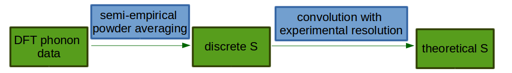

.. _DynamicalStructureFactorFromAbInitio:

Ab initio calculation of dynamical structure factor (S)
=======================================================

Introduction
------------

The purpose of this document is to explain the link between theoretical and experimental :math:`S(\mathbf{Q}, \omega)` and to
describe in general how the theoretical :math:`S` is calculated from from *ab initio* data by plugins in Mantid.

During an inelastic neutron scattering experiment, a sample is exposed to neutron flux and a response is recorded in the form of dynamical structure factor, :math:`S(\mathbf{Q}, \omega)`.
In principle, one obtains a vibrational spectrum that can be quite difficult to analyse; in crystalline materials this is
related to the wavevector-dependent *phonon* spectrum.
In order to better understand experimental outputs, one can compare with results from modelling.
*Ab initio* calculations, especially within density-functional theory (DFT) [#Kohn1964]_, have proven quite successful in predicting vibrational spectra.

.. image:: ../images/dft_phonon_scheme.png
    :align: center

The usual workfow for calculating phonon spectra within DFT is presented in the figure above. First, one defines an
initial guess for the structure of interest.
The initial guess should be as close as possible to an experimental structure, and is usually derived from elastic X-ray and/or neutron scattering measurements.
Then the structure parameters are locally optimised within DFT, finding the nearest structure that minimises the DFT energy.
At this point, there should be no net force on the atoms.

For this "relaxed" structure the dynamical matrix is calculated at a set of phonon wavevectors :math:`\mathbf{k}`, and converted to a set of physical frequencies and displacements that contribute to the dynamics of the material.
The dynamical matrix is related by a Fourier transform (at the given :math:`\mathbf{k}`-points) to the Hessian of the system -- the second derivative of the system Hamiltonian with respect to atomic displacements.
While it is possible to calculate the dynamical matrix at arbitrary :math:`\mathbf{k}`-points by perturbation theory,
it is typical to compute these on a regular grid or, equivalently, compute the Hessian up to some real-space supercell of the crystal structure.
This model allows an inexpensive "Fourier interpolation" of frequencies and displacements at arbitrary :math:`\mathbf{k}`-points, as long as the supercell size is sufficient to contain the relevant atomic interactions.

Solution of the dynamical matrix vibrational at each sampled wavevector :math:`\mathbf{k}` produces a set of *modes*, which are related to the *fundamental* vibrational excitations of the system. :math:`\mathbf{k}` corresponds to a neutron momentum transfer :math:`\mathbf{Q}`,
with eigenvalues related to the energy transfer :math:`\omega` and eigenvectors related to atomic displacements.
By inserting this second-order model into the response-function theory of neutron scattering we can calculate :math:`S(\mathbf{Q}, \omega)` within the harmonic approximation.

Some further simplifications are made in order to account for powder-averaging and higher-order excitations at reasonable computational cost: the method current implemented in Abins is a

- DOS-like
- almost-isotropic
- incoherent approximation
- with simplified high-order terms.

The incoherent approximation allows each atom to be calculated separately,
then the total spectrum is obtained as a sum over all atomic contributions.

This method is well-established for molecular spectroscopy; studies of inorganic crystals, on the other hand, tend to calculate the coherent scattering and neglect multi-phonon terms.

Working equations
-----------------

The vibrational part of the structure factor :math:`S(\mathbf{Q}, \omega)` is related by a Fourier transform to the intermediate scattering function :math:`F(\mathbf{Q}, t) = \frac{1}{N} \sum_{i,i^\prime} \left< \exp[i \mathbf{Q} (\mathbf{r}_i(t) - \mathbf{r}_i^\prime(0))] \right>`. This is a double-sum over atom pairs :math:`i, i^\prime` in a thermally-averaged correlation function.

Solving this for a quantum harmonic oscillator, making the incoherent approximation and a Taylor expansion of the exponential term allows the double-sum over atoms to be separated into a sum over atoms :math:`i`, vibrational mode indices :math:`\nu` and quantum orders :math:`n`. These intensities may be computed independently:

:math:`S_i(\mathbf{Q}, n\omega_{\nu}) = \sigma_i \frac{[\mathbf{Q Q : B}_{\nu,i} \left<n + 1\right>]^{n}}{n!} \exp(-\mathbf{Q Q : A}_i)`

in which :math:`\sigma_i` is an atomic cross-section while :math:`\mathbf{B_{\nu,i}}` and :math:`\mathbf{A}_i` are quadratic dispacement tensors of individual phonon modes and the overall atomic dispacements, respectively.
Similar expressions are formed for combination modes in which :math:`n\omega` becomes :math:`\sum^n \omega_\nu` and :math:`\mathbf{B}_{\nu,i}^{n}` is replaced by :math:`\prod_\nu^n \mathbf{B}_{\nu,i}`.

The displacement tensors can be obtained from the calculated phonon eigenvectors :math:`{\mathbf{c}}`: :math:`\mathbf{B_{\nu_i}}` is mode-dependent and thermally-occupied in the expression above by :math:`\left<n+1\right>` Bose statistics while :math:`\mathbf{A}_i` is a property of each atom site and includes occupation :math:`\left<2n+1\right>`: at low temperature both terms reduce to 1.

:math:`\mathbf{B}_{\nu,i} = \mathbf{c}_{\nu,i} \mathbf{c}_{\nu,i}^\intercal \frac{\hbar}{2 M_i \omega_\nu}`

:math:`A_i = \sum_i \mathbf{B}_{\omega,i} \left<2n + 1\right>`

where :math:`\mathbf{c}_{i, \nu}`  -- normalised eigenvector for atom :math:`i` in mode :math:`\nu` and :math:`M_i` is the mass of atom :math:`i`.

In DFT studies of solid materials, the simulation region is generally a finite unit cell with periodic boundary conditions.
This models an infinite perfect crystal; in order to compare such calculations with powder experiments, orientational averaging should be considered.
In Abins, the "almost-isotropic approximation" is applied to the spherical integration over reciprocal space, replacing the vector :math:`\mathbf{Q}` with a scalar :math:`Q` [#Howard1983]_:sup:`,` [#Howard1983b]_:

:math:`S_i (Q,\omega_\nu) = \sigma_i \frac{Q^2 \mathrm{Tr}\mathbf{B}_{\nu,i}}{3} \exp\left(-Q^2 \alpha_{\nu,i} \right)`

where

:math:`\alpha_{\nu,i} = \frac{1}{5} \left \lbrace \mathrm{Tr} \mathbf{A}_i  + \frac{2 \mathbf{B}^{\omega_\nu,i}: \mathbf{A}_i}{\mathrm{Tr} \mathbf{B}^{\omega_\nu,i}} \right\rbrace`

Where :math:`\mathrm{Tr}` denotes the "trace" and :math:`:` the tensor "contraction" operation.

Note that the exponential term is no longer a "pure" Debye--Waller factor, as some mode-dependence is introduced by the powder-averaging.
We have also conflated the phonon mode indices and their original wavevector :math:`\mathbf{k}` into a single index :math:`\nu`; this is a "DOS-like approximation" in which we assume that the reciprocal lattice spacing is small relative to the observed :math:`Q`, and so spherical averaging will approximate an even sampling of the Brillouin zone.

The formula above covers the *first-order quantum events* -- the transitions :math:`0 \rightarrow 1` for each phonon.
The :math:`1 \rightarrow 0` events (i.e. energy *to* the scattered neutron) are currently neglected, as the contribution vanishes at low temperature.
The powder-averaging derivations are more complex for higher-order quantum events.
At second order some exponential terms are neglected, and isotropic Debye-Waller factor is used without any mode-dependence [#Mitchell]_.

:math:`S_i(Q, \omega_\nu + \omega_{\nu^{\prime}}) = \frac{Q^4}{15  C}\left( \mathrm{Tr}\mathbf{B}_{i,\nu}\mathrm{Tr}\mathbf{B}_{i,\nu^\prime} + \mathbf{B}_{i,\nu}:\mathbf{B}_{i,\nu^\prime} + \mathbf{B}_{i,\nu^\prime}:\mathbf{B}_{i,\nu} \right) \exp\left(-Q^2 \mathbf{A}_i / 3 \right)\sigma_i`

where :math:`C = \begin{cases} 2  & \textrm{if $\nu=\nu^\prime$} \\ 1 & \textrm{otherwise} \end{cases}`

For higher-order events we can further simplify with a fully isotropic approximation :math:`\mathbf{Q Q}:\mathbf{B} \approx Q^2 \mathrm{Tr}\mathbf{B} / 3`:

:math:`S_i(Q, \omega_\nu + \omega_{\nu^{\prime}} + \cdots) = \frac{Q^{2n}}{n!} \left[\prod_\nu \frac{\mathrm{Tr}\mathbf{B}_{i,\nu}}{3} \right] \exp\left(-Q^2 \frac{\mathrm{Tr}\mathbf{A}_i}{3} \right) \sigma_i`

While a significant simplification, this allows the "combinatorial explosion" of phonon-mode combinations to be replaced by a recursive series of convolution operations:

:math:`S_i^n(Q, \omega, n) =  \frac{\sigma_i}{n!}s_i^n(Q, \omega, n) \exp\left(-Q^2 \mathbf{A}_i / 3 \right)`

:math:`s_i^n(Q, \omega) = \frac{Q^2 \mathrm{Tr}\mathbf{B}_{i,\omega}}{3} * s_i^{n-1}(Q, \omega)`

Note that the mode-by-mode calculation is replaced by convolution of frequency-dependent spectra. NEED TO USE DELTA FUNCTION OR SOMETHING TO SHOW HOW THIS WORKS.

After evaluating the above equations one obtains the discrete :math:`S` for each quantum order and for each atom: :math:`S_\mathrm{discrete}`.
In order to compare these functions with an experimental spectrum one has to convolve them with experimental resolution

:math:`S_\mathrm{theory}^{nj}(Q, \omega) = S_\mathrm{discrete}^{nj}(Q, \omega) * f(\omega)`

where:

:math:`j` -- indicates :math:`j`-th atoms

:math:`n` -- indicates :math:`n`-order event

:math:`f(\omega)` -- is a resolution function

:math:`S_\mathrm{theory}` -- is *theoretical* :math:`S` to be compared with experimental results.

For `TOSCA <http://www.isis.stfc.ac.uk/instruments/tosca/tosca4715.html>`_  and TOSCA-like instruments :math:`f(\omega)` has the following form:

:math:`f(\omega)=1.0 / \sqrt{\sigma(\omega)  \pi}  \exp(-(\omega)^2  / \sigma(\omega))`

where:

:math:`\sigma(\omega) = A  \omega^2  + B  \omega + C`

with :math:`A`, :math:`B`, :math:`C` as constants.

Moreover, in case of TOSCA and TOSCA-like instruments, the length of momentum transfer depends on frequency (*indirect geometry spectrometer*).
The formula for :math:`Q^2` is as follows:

:math:`Q^2(\omega)=k^2_i(\omega) + k^2_f - 2  \sqrt{k^2_i(\omega)  k^2_f} cos(\theta)`

where:

:math:`k^2_i(\omega)=(\omega + E_{final})  \hbar/ (4  \pi)` expressed in the spectroscopic units

:math:`k^2_f=E_{final}  \hbar/(4 \pi)`

with

:math:`E_{final}` -- being the final energy on the crystal analyser in :math:`cm^{-1}` and

:math:`\theta` -- is the crystal analyser angle in radians. (TOSCA has two angles to consider, corresponding to the forward- and back-scattering detectors).

Current implementation
----------------------

Calculation of theoretical :math:`S` from *ab initio* results is implemented in :ref:`Abins <algm-Abins>`. At the moment Abins supports phonon outputs from the
`CASTEP <http://www.castep.org/>`_, `CRYSTAL <http://www.crystal.unito.it/index.php>`_, Gaussian and DMOL3 *ab initio* codes.
The Gamma-point frequencies are used and phonon bands are assumed to be flat throughout the Brillouin zone; this assumption is primarily applicable for incoherent scattering in molecular crystals.
Instrument parameters are included for
`TOSCA <http://www.isis.stfc.ac.uk/instruments/tosca/tosca4715.html>`_ and should be useful for TOSCA-like instruments.

Citing Abins
------------

If Abins is used as part of your data analysis routines, please cite the relevant reference [#Dymkowski2018]_.

References
----------

.. [#Kohn1964] W. Kohn et al., *Inhomogeneous Electron Gas*, Phys. Rev. B {\bf 136}, 864 (1964).

.. [#Howard1983] J. Howard, B.C. Boland, J. Tomkinson, *Intensities in inelastic neutron scattering spectra: a test of recent theory*, Chem. Phys. 77 (1983).

.. [#Howard1983b] J. Howard and J. Tomkinson, *An analytical method for the calculation of the relative intensities of bending and stretching modes in inelastic neutron scattering spectra*, Chem. Phys. Letters 98 (1983).

.. [#Mitchell] P. C H Mitchell, S. F. Parker, A. J. Ramirez-Cuesta, J. Tomkinson, *Vibrational Spectroscopy with Neutrons With Applications in Chemistry, Biology, Materials Science and Catalysis*, ISBN: 978-981-256-013-1

.. [#Dymkowski2018] K. Dymkowski, S. F. Parker, F. Fernandez-Alonso and S. Mukhopadhyay,  “AbINS: The modern software for INS interpretation” , Physica B, doi:10.1016/j.physb.2018.02.034 (2018).

.. categories:: Concepts
