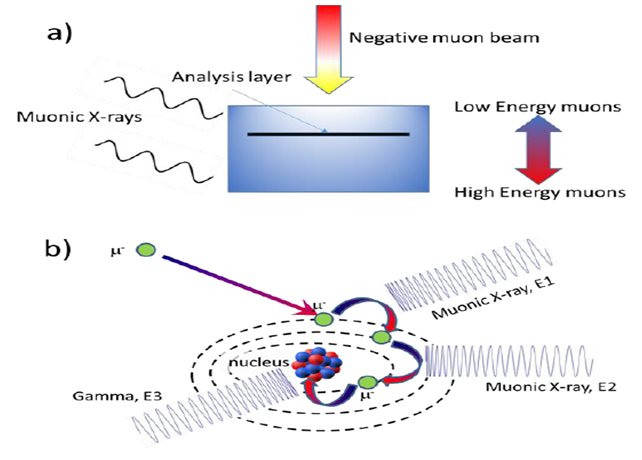

.. _Elemental analysis using negative muons:

Elemental analysis using negative muons
=======================================

.. contents::
  :local:

Overview
--------
Elemental analysis is a non-destructive, depth selective method of determining the elemental composition of a sample by using negative muons.
This leads to the sample emitting gamma and X-rays that can be detected.

What happens when a muon is implanted in a sample?
--------------------------------------------------
A Muon is captured by an atom, forming a mounic atom.
Muon cascades down atom to the first energy level :math:`N = 1` (1s) within :math:`~10e-13` seconds, resulting in the emission of muonic x-rays [#HIL1]_.
Radiative muon capture could occur and result in a the emission of a gamma ray [#MEA]_.

.. math::	\mu^-  +  p   \rightarrow   \nu_\mu  + n + \gamma,

where :math:`\nu_mu` is muon neutrino.

Controlling implantation depth of muons
---------------------------------------
The implantation depth depends on the density of the target material and is proportional to the momentum of the incident muons.
At ISIS [#HIL3]_, the momentum of the muons can be tuned from :math:`17 \textit{MeV/c}` to :math:`120 \textit{MeV/c}` [#MAT]_.
The maximum penetration depth is a few metres for most gases depending on the pressure.
For most metals the maximum penetration depth is a few centimetres, with a resolution of few :math:`10's` to :math:`100's` of microns.

Advantages over other methods
-----------------------------
Another method for determining the elemental composition of a material is X-ray fluorescene, which uses electrons to create X-rays.
The mass of a muon is over :math:`200` times greater than the mass of an electron.
This allows muon elemental analysis to probe energies that are an order of magnitude higher X-ray fluorescenes.
Unlike X-ray fluorescene, muon elemental analysis is non destructive and can detect low atomic numbers.
Selecting the momentum of the muon allows for penetration depth within the material to be chosen.
Muons are also able to distinguish between different isotopes of the same element.

References
----------
.. [#HIL1] Hillier, A.D. et al (in press). Depth Dependent Bulk Elemental Analysis using Negative Muons, D’Amico ,S. , Venuti ,V.,
			Handbook of cultural heritage , Springer.
.. [#MEA] Measday, D. F. (2001). The nuclear physics of muon capture. Physics Reports, 354(4-5), 243-409.
.. [#HIL3] Hillier , A.D. et al (2019).Muons at ISIS., Philos. Trans. R. Soc A Math. Phys. Eng. Sci., Vol. 377, pp. 1-7.
.. [#MAT] Matsuzaki, T. et al (2001). The RIKEN-RAL pulsed muon facility. Nuclear Instruments and Methods in Physics Research
			Section A: Accelerators, Spectrometers, Detectors and Associated Equipment, 465(2-3), 365-383.
