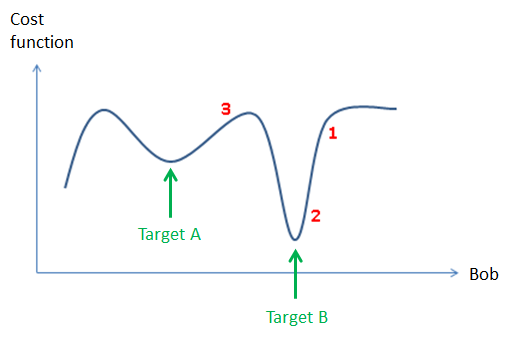
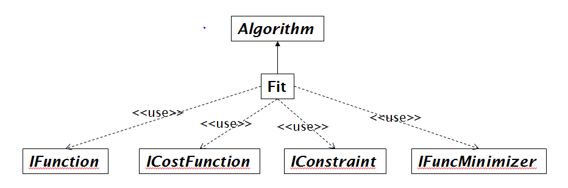

.. _Fitting:

Fitting
=======

Introduction
------------
Fitting in Mantid is the process of trying to fit a model to some data,
where data may originate from measurements at beamlines, simulations or
in fact can be any data which has the form:

-  :math:`x` - could for example be a TOF value, a Q value or a temperature value, or :math:`x` can represent a point in a multi-dimensional space, for example, :math:`x` could represent :math:`(Q_x, Q_y, Q_z)`

-  :math:`y^{obs}` - is the observed or calculated value at :math:`x`

-  :math:`\sigma` - is an error estimate of :math:`y^{obs}`

Error estimates are important in data reduction and data analysis and
see :ref:`here <Error Propagation>` for information about how Mantid
deals with error propagation. However, errors may optionally not be used in
fitting, by choosing a cost function that does not depend on these.

A cost function (also sometimes called a figure of merit or goodness of fit)
is some metric which attempts to give an indication as to how good a given
model fits some data. The by far most common way of measuring the difference
between a model and data, for example for fitting neutron faciltiy data, is to use
a so-called least-squares cost function which has the form

.. math:: \sum_i \left( \frac{y_i^{obs}-y_i}{\sigma_i} \right)^2

where :math:`y_i` is shorthand for :math:`y(x_i)`, i.e. the :math:`y`-value
calculated at the observed value :math:`x_i` from a model, and :math:`y_i^{obs}`
and :math:`\sigma_i` the observed and error estimate values at :math:`x_i` respectively.
Mantid supports a number of other cost functions and these are described :ref:`here <algm-Fit>`.
The above cost function is the default Mantid cost function. If you use the
:ref:`Fit algorithm <algm-Fit>` this cost function goes under the name
'Least squares' and in some placed in Mantid is referred to as Chi-sq.

Consider the simple example where a model depends on just one fitting parameter,
here called Bob. The :math:`y_i`'s then only depend on this parameter and hence the same
is true for the cost function. Below is shown a made up example of how such a
cost function could depend on the fitting parameter Bob:

The primary problem which Mantid deals with is that of
local minimization, also referred to as downhill minimization. Referencing to
the figure above, this corresponds either to reach target B through fitting from
the value of the fitting parameter shown by the red label 1 or 2, or reach
target A from the parameter position 3. This is the common problem in
reducing/analysing where 'good' initial values of the fitting parameters are known, for
instance from: knowledge of the instrument, the scientific problem in question,
or a peak search algorithm is assumed to provide good initial fitting parameter values.

Local minimization algorithms can be grouped into strictly downhill minimizers and local
minimizers, where the former will find a lower value whereas
for the latter this is not guaranteed. For a description of the minimizers
Mantid supports see :ref:`here <algm-Fit>`. The default Mantid minimizer is
Levenberg-Marquardt,
which is a strictly downhill mimimizer. Mantid has a plug-in mechanism for added
minimizers and hence the number of minimizers which Mantid supports is not static.
For example recently a minimizer called FABADA was added which
is aimed at fitting for Bayesian data analysis. The minimizers supported in Mantid
perform differently in terms of accuracy and run time requirements. For a
comparison of different minimizers see :ref:`Fitting Minimizers <FittingMinimizers>`. New fitting
minimizers can be added through the plug-in mechanism or as is demonstrated in the
section entitled 'Global fitting' can be scripted from minimizers that already exist.

Fitting in Mantid is more than just selecting a cost functions and minimizer.
The Mantid fitting framework it is a pluggable framework that at a top level
looks like this

:ref:`Fit <algm-Fit>` is the algorithm that puts together the users choice of
minimizer (IFuncMinimizer) and cost function (ICostFunction), but also the fit
function (IFunction). The fit function defines the model that is used to model
the data. The user defined fit function can be a complex mathematical product,
sum and convolution of other fit functions. For more information for
how to create a model see the documentation for :ref:`Fit <algm-Fit>`, the
Fitting section of the Mantid Introduction :ref:`tutorial <mantid_basic_course>`
for how to do this using the Fit Function Toolbox and
this Python fit tutorial: :ref:`emwp_py_fit_funcs`.

From the class diagram above note fitting also support constraints (IConstraint),
see :ref:`here <algm-Fit>` for more on this. Further fitting parameters can be
:ref:`tied <algm-Fit>` to specific values or tied to other fitting parameters
through mathematical formulas.

Multiple datasets and sequential fitting
----------------------------------------
Mantid can fit multiple datasets to one model. This can perhaps most easily be
done using the :ref:`Fit Script Generator interface <Fit_Script_Generator-ref>`.

Sequential fitting is simply the sequential fitting of datasets
using the same fit function, and where, for example, fitting parameters obtained
from one fit may be used as starting values in a next fit and so on. For
an example of sequential fitting see :ref:`here <WorkbenchPlotWindow_Fitting>`

How do you know if a fit is successful
--------------------------------------
If you are fitting using the Fit Function toolbox or the Multi-dataset
Fitting interface then you get visual feedback as to how well the fit was.

If you are scientists experienced in fitting a particular type of data
then the absolute value of the cost function may be sufficient in itself
to tell whether a fit is successful.

As described in the :ref:`Fit algorithm documentation <algm-Fit>` this
algorithm can output the result of parameters + error estimates and
a matrix called the correlation matrix, which tells how
parameters are correlated. The information from the correlation matrix
and the error estimates (which happens to be the square root of the
diagonal elements of the correlation matrix) can help highlight how much
you can trust the fit. For example, if some fitting parameters are strongly
correlated you may consider trying to introduce ties to help reduce
this correlation.

The :ref:`Fit <algm-Fit>` algorithm returns an OutputStatus property,
which can be monitored.

Create an algorithm or code that aims to be clever, for a given fitting
problem, beyond that of the generic Fit algorithm. An example of this
is :ref:`FitPeak <algm-FitPeak>` which aims to fit single peaks
with some checks to ensure results are physical.

If you remain unsure if a given fit was successful then e.g. try the
tool :ref:`ProfileChiSquared1D <algm-ProfileChiSquared1D>`, which allows
inspection of the cost function in the neighbourhood of a found minimum.

Global fitting
-------------------------
As of this writing the primary use of Mantid fitting is to do local
minimization.

Many well known global fitting algorithms are very simple in their
implementation.

To demonstrate an example of this, below is shown how to script
a global fitting algorithm, which for example in http://dx.doi.org/10.1107/S0021889810008113
has been shown to be competitive with a tuned Simulation Annealing algorithm
(https://en.wikipedia.org/wiki/Simulated_annealing)
implementation used for solving crystal structures from powder diffraction data.

**Example: Multi local minimizations from random starting points**

.. testcode:: LocalMinimizationRandowStartingPoints

    # This script demonstrates a global fitting algorithm, which simply does local minimizations from random
    # starting positions of the fitting parameters.
    # For this demo example, just one fitting parameter is globally fitted, the peak center of a Gaussian peak
    # Please bear in mind the example here is to demonstrate this algorithm not provide a real global fitting problem

    from random import random
    from time import sleep

    data = Load('HRP39182.RAW',LoadLogFiles=False, SpectrumList="1")

    # Specify the fitting interval
    startX = 93000
    endX = 93300

    # Set best very high value of the cost function to ensure lower is found at first attempt
    costFuncBest = 1e+100

    # Do local minimization from random starting positions
    numOfRandowAttempts = 10
    for i in range(10):
        # pick a randow value for the peak centre fitting parameter in the fitting interval
        tryCentre = str(startX + random()*(endX-startX))

        # Do a fit from this starting value of the peak centre fitting parameter
        # Note choice of local minimizer will affect the outcome
        fit_results = Fit(InputWorkspace='data', WorkspaceIndex=0, \
                          StartX = startX, EndX=endX, Output='fit', \
                          Function='name=Gaussian,Height=10,PeakCentre='+tryCentre+',Sigma=20',
                          Minimizer='Conjugate gradient (Fletcher-Reeves imp.)')
        costFuncVal = fit_results.OutputChi2overDoF

        # Here simply keep record of the best fit found, but this could easily be extended to
        # keep a record of all the minima found
        if costFuncVal < costFuncBest:
            costFuncBest = costFuncVal
            # here keep clone of best fit
            CloneWorkspace(InputWorkspace='fit_Workspace', OutputWorkspace='fitBest')

        # Uncomment the sleep if would like to watch this algorithm trying to
        # find the global minima (graphically and/or from command line)
        # print(costFuncVal)
        # sleep(2)

    print('test')

.. testoutput:: LocalMinimizationRandowStartingPoints
    :hide:
    :options: +NORMALIZE_WHITESPACE

    test

.. categories:: Concepts
