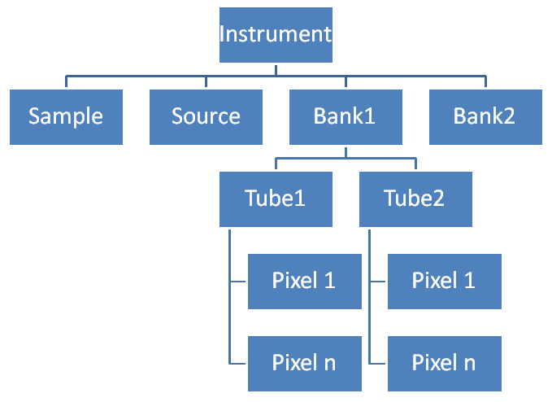

.. _Geometry of Position:

Geometry of Position
====================

What is it?
-----------

In Mantid we need to be able to define the position and orientation of
every component within an :ref:`instrument <instrument>`.

What is a component?
--------------------

A component is an abstract concept that is anything that we want to
define a position for, it could be a detector pixel, a whole detector
bank, a sample position or the whole instrument itself. For each
component we store:

-  A link to it's parent component.
-  Position co-ordinates as a `3D
   Vector <http://en.wikipedia.org/wiki/Vector_(spatial)>`__, internally
   these store the location in `cartesian
   co-ordinates <http://en.wikipedia.org/wiki/Cartesian_coordinate_system>`__
   in metres, but can also be set in `spherical
   co-ordinates <http://en.wikipedia.org/wiki/Spherical_coordinate_system>`__.
   This position is the relative position compared to it's parent.
-  Orientation as a
   `quaternion <http://en.wikipedia.org/wiki/Quaternion>`__. The
   orientation is applied after any position adjustment relative to the
   parent.

Subtypes of Component
~~~~~~~~~~~~~~~~~~~~~

Object Component
^^^^^^^^^^^^^^^^

An object component is a component that has a
:ref:`shape <Geometry of Shape>`. Shapes can contain a lot more information
to properly define them, and therefore take more memory. Where an
instrument contains a lot of instances of the same shape Mantid shares
one instance of the object(shape) across all of the object components
that need it.

Component Assembly
^^^^^^^^^^^^^^^^^^

This component that is a logical collection of several smaller
components, an example of this is a bank of detector pixels. The whole
instrument itself is a Component Assembly which contains all of the
other top level components in the Instrument tree.

Instrument Tree
---------------

|SimpleInstrumentTree.png| Most instruments in Mantid are defined using
a tree structure allowing the top level structure objects to be reused
if they are repeated in an instrument. This is an example of a
simplified instrument tree, the lines show the links between the parent
and child relationships of the components. Full details on how to define
an instrument can be found :ref:`here <InstrumentDefinitionFile>`.

.. categories:: Concepts
