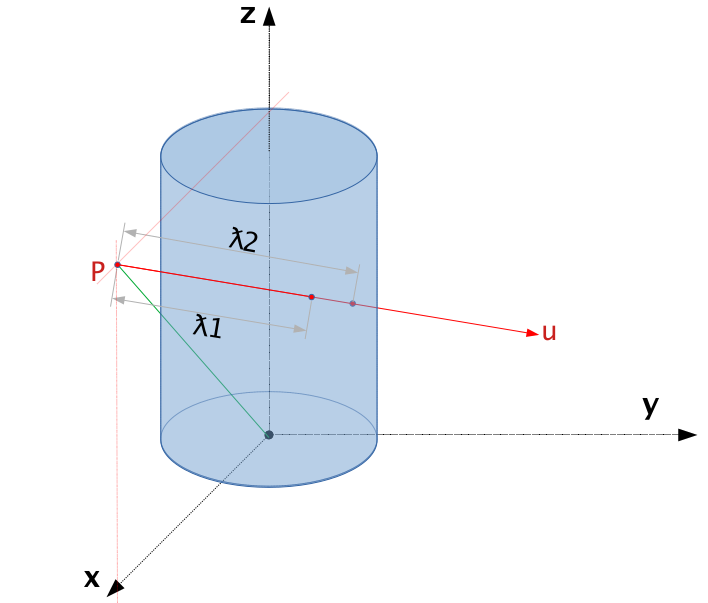

.. _Geometry of Shape:

Geometry of Shape
=================

What is it?
-----------

In Mantid we use `constructive solid geometry
(CSG) <http://en.wikipedia.org/wiki/Constructive_solid_geometry>`__ to
describe the shape of an object. This involves the creation of more
complex shapes by the union, complement or intersection of simple
primitive surfaces.

Why did we use CSG
------------------

Defining our object shape using CSG was selected for a number of
reasons:

#. Using Surfaces based on mathematical equations rather than meshes of
   vertices give much better accuracy when tracking the interaction of
   particles through objects.
#. Scientists think in the shape of objects this way, for example if
   they have a sample that is a sphere radius 0.03m with a conical
   extrusion on top then that is exactly how they describe it in CSG.
   Otherwise they would need to be able to describe the co-ordinates for
   each vertex of the surface.

What shapes can be constructed
------------------------------

Mantid has direct support for creating various shapes directly,
including

-  Sphere
-  Infinite Cylinder
-  Cylinder (finite height)
-  Slice of cylinder ring
-  Infinite Plane
-  Cuboid
-  Infinite Cone

Some of these shapes are infinite surfaces (the infinite plane, cone and
cylinder) these are therefore not very useful on there own, but in
combination with other shapes they can be capped as required.

For example if you cap and infinite Cylinder with two infinite planes
you get a finite capped cylinder. This is in fact how the Cylinder shape
is defined internally within Mantid.

For more on this see
:ref:`HowToDefineGeometricShape <HowToDefineGeometricShape>`.

Calculating intersections between shapes
----------------------------------------

Intersection of a line and a cylinder
*************************************

The line in Mantid is the equivalent of a ray in Math, and the cylinder here is
referring to a cylindrical surface.
The current intersection solver implemented in Mantid is using the parametrization
method where a quadratic equation is solved to find the intersection point.
This section will provide an in-depth derivation on how the final parameterization
is formed, which is directly used in the source code.

For an arbitrary cylindrical surface, it can be uniquely defined by its radius :math:`r`
and symmetry axis :math:`\mathbf\epsilon`.
Similarly, a line/ray can be uniquely defined by its starting point :math:`\mathbf{p}`
and direction vector (unit vector) :math:`\mathbf{\mu}`.
Through parameterization, we can express an arbitrary line/ray in 3D as:

.. math::

   \begin{cases}
      x = p_0 + \mu_0 \cdot \lambda \\
      y = p_1 + \mu_1 \cdot \lambda \\
      z = p_2 + \mu_2 \cdot \lambda
   \end{cases}

where :math:`\lambda` is the distance one need to walk from the starting point along
the direction of :math:`\mathbf{\mu}` to reach a point on the line.

The parameterization of a random cylindrical surface in 3D can be complicated, but
there is a simple mathematical expression when some special reference frame is used.
More specifically, when the symmetry axis is one of the axis of the reference
frame (using z-axis as an example here), a cylindrical surface can be expressed as:

.. math::

   x^2 + y^2 = r^2

The easiest way to solve for the intersection point is to plug the line parameterization
into the equation above.
However, this is not possible at the moment because the two equations are not in
the same reference frame.
Therefore, we need to convert the line parameterization parameters into the special
cylindrical surface reference framework before we can solve for :math:`\lambda`.

The figure above shows one of the special reference frame that can make the math
a lot easier to handle.
In this reference frame, the origin is a random point along the symmetry axis of
the cylinder surface, and the symmetry axis is the z-axis.
The starting point of the line, :math:`\mathbf{p}` and the z-axis defines the
x-z plane.
In this reference frame, the expression for the cylindrical surface is exactly
the same as the one shown above, and the line parameterization can be expressed
as

.. math::

   \begin{cases}
   x = p_x + \mu_x \cdot \lambda \\
   y = p_y + \mu_y \cdot \lambda \\
   z = p_z + \mu_z \cdot \lambda
   \end{cases}

Notice that :math:`(p_x, p_y, p_z)` are the covariance of :math:`\mathbf{p}` in
this special reference frame, and :math:`(\mu_x, \mu_y, \mu_z)` are the covariance
of the direction vector :math:`\mathbf{\mu}` in this reference frame.
The remaining task is to find the value of :math:`(p_x, p_y, p_z)` and
:math:`(\mu_x, \mu_y, \mu_z)` from :math:`(p_0, p_1, p_2)` and :math:`(\mu_0, \mu_1, \mu_2)`.

Since :math:`\mathbf{p}` is in the x-z plane, we get :math:`p_y = 0` for free.
Therefore, the remaining two covariance can be expressed as:

.. math::

   p_z = \mathbf{p} \cdot \mathbf\epsilon = \sum_{i=0}^2 p_i\epsilon_i \\
   p_x = \sqrt{|\mathbf{p}|^2 - p_z^2}

Notice that all the values on the left-hand are all in the special reference
frame whereas the values on the right-hand are in the general/global reference
frame.

Another thing worth mentioning here is that the expression above is assuming the
special reference frame and the original reference frame share the same origin,
which is true in most cases in mantid.
However, if they are not the same, we need to take into consideration of the
rigid-body shift due to change of origin, which can be easily done by:

.. math::

   p_i = p_i - o_i

where :math:`o_i` is the covariance of the new origin in the general reference
frame.

As for the covariances of the direction vector, the z component is relatively
easy,

.. math::

   \mu_z = \mathbf{\mu} \cdot \mathbf\epsilon = \sum_{i=0}^2 \mu_i\epsilon_i

Finding the x component takes a little bit extra efforts.
The x-axis of the special reference frame can be expressed as a unit vector:

.. math::
   \hat{\mathbf{x}} = \dfrac{1}{p_x} (\mathbf{p} - p_z \mathbf\epsilon)

Therefore,

.. math::

   \mu_x = \mathbf{\mu} \cdot \hat{\mathbf{x}}

Since direction vector is a unit vector, we can easily find

.. math::

   \mu_y = \sqrt{1 - \mu_x^2 - \mu_z^2}

Now we can plug the line parameterization into the cylindrical surface equation
to get the interception by solving for :math:`\lambda`, which gives us

.. math::

   (p_x + \mu_x \lambda)^2 + (\mu_y \lambda)^2 &= r^2 \\
   \Rightarrow
   p_x^2 + 2 p_x \mu_x \lambda + \mu_x^2 \lambda^2 + \mu_y^2 \lambda^2 &= r^2 \\
   \Rightarrow
   (1 - \mu_z^2) \lambda^2 + 2 p_x \mu_x \lambda + p_x^2 - r^2 &= 0

For a standard quadratic equation, :math:`a_2x^2 + a_1x^1 + a_0x^0 = 0`, we have

.. math::

   a_2 = 1 - \mu_z^2 = 1 - (\sum_{i=0}^2 \mu_i\epsilon_i)^2

and

.. math::

   a_1 &= 2 p_x \mu_x = 2 p_x (\mathbf{\mu} \cdot \hat{\mathbf{x}}) \\
       &= 2 p_x (\mathbf{\mu} \cdot \dfrac{1}{p_x}(\mathbf{p} - p_z \mathbf\epsilon)) \\
       &= 2 [\mathbf{\mu} \cdot (\mathbf{p} - p_z \mathbf\epsilon)] \\
       &= 2 \sum_{i=0}^2 \mu_i (p_i - p_z \epsilon_i) \\
       &= 2 (\sum_{i=0}^2 \mu_i p_i - p_z \sum_{i=0}^2 \mu_i \epsilon_i) \\
       &= 2 (\sum_{i=0}^2 \mu_i p_i - \sum_{i=0}^2 p_i\epsilon_i \sum_{i=0}^2 \mu_i \epsilon_i)

and

.. math::

   a_0 &= p_x^2 - r^2 = |\mathbf{p}|^2 - p_z^2 - r^2 \\
       &= (\sum_{i=0}^2 p_i p_i)^2 - (\sum_{i=0}^2 p_i\epsilon_i)^2 - r^2

.. categories:: Concepts
