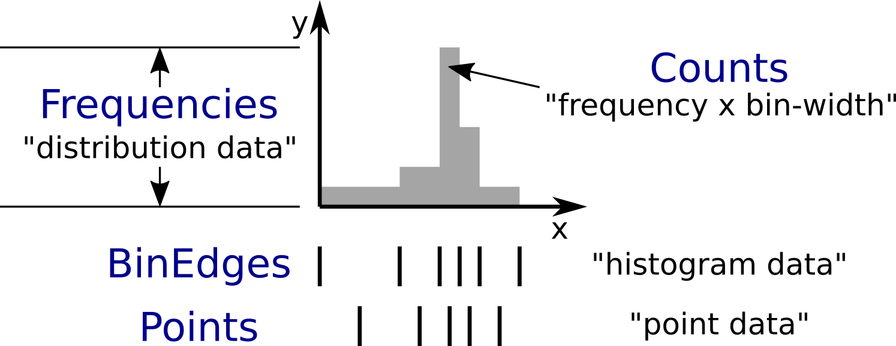

.. _HistogramData:

======================================
Transition to the HistogramData module
======================================

.. contents::
  :local:

HistogramData is a new Mantid module dealing with histograms.
This is **not** a replacement for ``Histogram1D`` or ``ISpectrum``, but rather deals with the **histogram** part of the data stored in those classes.
This document is intended for Mantid developers.
It informs about the transition to the new way of dealing with histograms, and explains the new interfaces.

Introduction
------------

Motivation
##########

- Make working with histograms **easier**.
- Provide a **safer** way of working with histograms.
- Details can be found in the `design document <https://github.com/mantidproject/documents/blob/master/Design/histogram_type.md>`_.

Concepts
########

   The histogram concept and nomenclature in Mantid.
   The expressions commonly used in Mantid to refer to these concepts are given in quotation marks.
   Details can be found in the text below.
   The CamelCase keywords are new types and will be introduced later.

Histogram data in Mantid is stored in a number of different ways that reflect the way it was produced, or the way algorithms deal with the data:

- The x-data (typically corresponding to TOF or units derived from TOF) can represent bin edges (1 more than y-values), or points (1 for each y-value).
  Conversions between the two cases are done with the algorithms ``ConvertToPointData`` and ``ConvertToHistogram``.
- The y-data can be counts or counts divided by bin-width.
  In the latter case a workspace is said to contain *distribution data*.
  Conversions between the two cases are done with the algorithms ``ConvertToDistribution`` and ``ConvertFromDistribution``.
- The e-data (uncertainties) follows the same distinction as y-data.
  It typically stores the standard-deviation, but is sometimes (internally and temporarily) converted to a variance, i.e., the square of the standard-deviation.

The new histogram type described below is designed to follow the needs of the current way Mantid deals with histograms (the following description is mainly for x-data, but the same applies to y-data):

1. Some algorithms work with bin edges, some with points, and many do not care.
2. We need to share data, e.g., when the bin edges of all histograms in a workspace are identical. This is currently handled in ``ISpectrum``, ``Histogram1D``, and ``EventList``, which store a copy-on-write pointer (``Kernel::cow_ptr``) to a ``std::vector<double>``.

Mantid developers are all familiar with these two facts:

1. Algorithms that "do not care" access the data and simply work with it. All other algorithms attempt to determine whether the x-data corresponds bin edges or points by comparing its length to that of the y-data (or alternatively use ``MatrixWorkspace::isHistogramData()``). Based on the result they may convert, e.g., bin edges to points.
2. The copy-on-write mechanism is reflected in the interface of ``ISpectrum`` and ``MatrixWorkspace``:

   .. code-block:: c++
     :linenos:

     using MantidVec = std::vector<double>;
     using MantidVecPtr = Kernel::cow_ptr<std::vector<double>>;

     // Current ISpectrum interface:
     void setX(const MantidVec &X);
     void setX(const MantidVecPtr &X);
     void setX(const MantidVecPtr::ptr_type &X);
     MantidVec &dataX();
     const MantidVec &dataX() const;
     const MantidVec &readX() const;
     MantidVecPtr ptrX() const; // renamed to refX() in MatrixWorkspace

   - Non-``const`` access to data in a spectrum will trigger a copy.
   - To avoid triggering the copy we use ``readX()``.
   - When we want to share data we use ``setX()`` with a ``shared_ptr`` or ``cow_ptr`` (can be obtained with ``ptrX()`` or ``refX()``).

The shortcomings of the current implementation are mostly obvious and can also be found in the `design document <https://github.com/mantidproject/documents/blob/master/Design/histogram_type.md>`_.

The new ``Histogram`` type
--------------------------

Motivation
##########

In its final form, we will be able to do things like the following (things not implemented yet are marked with an asterisk (*)):

.. code-block:: c++
  :linenos:

  BinEdges edges{1.0, 2.0, 4.0, 8.0};
  Counts counts1{4, 100, 4};
  Counts counts2{0, 100, 0};
  Histogram histogram1(edges, counts1);
  Histogram histogram2(edges, counts2);
  // x-data in histogram1 and histogram2 is shared

  // Uncertainties are auto-generated, unless specified explicitly
  auto errors = histogram1.countStandardDeviations();
  errors[0]; // 2.0
  errors[1]; // 10.0
  errors[2]; // 2.0

  // Arithmetics with histograms (*)
  histogram1 += histogram2; // Checks size, throws if mismatched!
  auto counts = histogram1.counts();
  counts[0]; // 4.0
  counts[1]; // 200.0
  counts[2]; // 4.0
  // Deals with errors as well!
  errors = histogram1.countStandardDeviations();
  errors[0]; // 2.0
  errors[1]; // sqrt(200.0)
  errors[2]; // 2.0

  // Need bin centers (point data) instead of bin edges?
  auto points = histogram.points();
  // Need variance instead of standard deviation?
  auto variances = histogram.countVariances();
  // Need frequencies (distribution data) instead of counts?
  auto frequencies = histogram.frequencies();
  auto variances = histogram.frequencyVariances();

  // Type-safe operations
  CountStandardDeviations sigmas{0.1, 0.1};
  histogram.setCountVariances(sigmas); // Ok, squares internally
  sigmas += CountVariances{0.01, 0.01}; // Ok, takes sqrt before adding (*)
  sigmas[0]; // 0.2
  sigmas[1]; // 0.2

Further planned features:

- Arithmetics will all sub-types (``BinEdges``, ``Points``, ``Counts``, and ``Frequencies``, and also their respective ``Variances`` and ``StandardDeviations``).
- Generating bin edges (linear, logarithmic, ...).
- Extend the ``Histogram`` interface with more common operations.
- Non-member functions for more complex operations on histograms such as rebinning.
- Validation of data, e.g., non-zero bin widths and positivity of uncertainties.

**Any feedback on additional capabilities of the new data types is highly appreciated.
I will happily consider adding more features as long as they fit the overall design.
Please get in** `contact <mailto:simon.heybrock@esss.se>`_ **with me!**

Basic changes have been merged (soon after the 3.7 release).
We will then work on reducing the use of the old interface (``readX()``, ``dataX()``, ``readY()``, ...) as much as possible.
After that, more features will follow.

We also want to expose most parts of the ``HistogramData`` module to Python, but no schedule has been decided yet.
Parts of the old interface will be kept alive for now, in particular to maintain support for the old Python interface.

Overview
########

- A new module ``HistogramData`` has been added.
- ``Histogram1D`` and ``EventList`` now store their histogram data in the new type ``HistogramData::Histogram``.
- The public interface of ``ISpectrum`` and ``MatrixWorkspace`` gives access to ``Histogram`` and its components, in a fashion similar to ``readX()``, ``dataX()``, etc.
- The old ``readX()``/``dataX()`` interface is still available for the time being, but its use is unsafe (as before) and it should not be used anymore.

``MatrixWorkspace`` thus has a number of new public methods (details follow below):

.. code-block:: c++
  :linenos:

  class MatrixWorkspace {
  public:
    // Note return by value (see below)
    Histogram histogram(const size_t index) const;
    template <typename... T> void setHistogram(const size_t index, T &&... data) &;

    // Note return by value (see below)
    BinEdges binEdges(const size_t index) const;
    Points points(const size_t index) const;

    template <typename... T> void setBinEdges(const size_t index, T &&... data) &;
    template <typename... T> void setPoints(const size_t index, T &&... data) &;

    // Note return by value (see below)
    Counts counts(const size_t index) const;
    CountVariances countVariances(const size_t index) const;
    CountStandardDeviations countStandardDeviations(const size_t index) const;
    Frequencies frequencies(const size_t index) const;
    FrequencyVariances frequencyVariances(const size_t index) const;
    FrequencyStandardDeviations frequencyStandardDeviations(const size_t index) const;

    template <typename... T> void setCounts(const size_t index, T &&... data) & ;
    template <typename... T> void setCountVariances(const size_t index, T &&... data) & ;
    template <typename... T> void setCountStandardDeviations(const size_t index, T &&... data) & ;
    template <typename... T> void setFrequencies(const size_t index, T &&... data) & ;
    template <typename... T> void setFrequencyVariances(const size_t index, T &&... data) & ;
    template <typename... T> void setFrequencyStandardDeviations(const size_t index, T &&... data) & ;

    const HistogramX &x(const size_t index) const;
    const HistogramY &y(const size_t index) const;
    const HistogramE &e(const size_t index) const;

    HistogramX &mutableX(const size_t index) &;
    HistogramY &mutableY(const size_t index) &;
    HistogramE &mutableE(const size_t index) &;

    Kernel::cow_ptr<HistogramX> sharedX(const size_t index) const;
    Kernel::cow_ptr<HistogramY> sharedY(const size_t index) const;
    Kernel::cow_ptr<HistogramE> sharedE(const size_t index) const;

    void setSharedX(const size_t index, const Kernel::cow_ptr<HistogramX> &x) &;
    void setSharedY(const size_t index, const Kernel::cow_ptr<HistogramY> &y) &;
    void setSharedE(const size_t index, const Kernel::cow_ptr<HistogramE> &e) &;
  };

``Histogram``
#############

- Contains copy-on-write pointers (``cow_ptr``) to the x-data, y-data, and e-data.
- Therefore: **copying** and return-by-value (see ``Histogram MatrixWorkspace::histogram(size_t)``) **is cheap**!
- The interface gives access to the data as well as the pointer:

.. code-block:: c++
  :linenos:

  class Histogram {
  public:
    // ...
    // Replacement for readX() and dataX() const
    const HistogramX &x() const;
    const HistogramY &y() const;
    const HistogramE &e() const;
    // Replacement for dataX()
    HistogramX &mutableX() &;
    HistogramY &mutableY() &;
    HistogramE &mutableE() &;

    // Replacement for refX()
    Kernel::cow_ptr<HistogramX> sharedX() const;
    Kernel::cow_ptr<HistogramY> sharedY() const;
    Kernel::cow_ptr<HistogramE> sharedE() const;
    // Replacement for setX()
    void setSharedX(const Kernel::cow_ptr<HistogramX> &x) &;
    void setSharedY(const Kernel::cow_ptr<HistogramY> &y) &;
    void setSharedE(const Kernel::cow_ptr<HistogramE> &e) &;
  };

Note that there is also Dx-data, but it is not widely used and thus omited from this documentation.
The interface for Dx is mostly equivalent to that for E.

``HistogramX``, ``HistogramY``, and ``HistogramE``
##################################################

- The current fundamental type for x-data, ``std::vector<double>``, is replaced by ``HistogramX``.
- The current fundamental type for y-data, ``std::vector<double>``, is replaced by ``HistogramY``.
- The current fundamental type for e-data, ``std::vector<double>``, is replaced by ``HistogramE``.
- Internally these are also a ``std::vector<double>`` and the interface is almost identical.
- However, they do not allow for size modifications, since that could bring a histogram into an inconsistent state, e.g., by resizing the x-data without also resizing the y-data.

``BinEdges``
############

- For algorithms that work with bin edges, ``Histogram`` provides an interface for accessing and modifying the x-data as if it were stored as bin edges:

  .. code-block:: c++
    :linenos:

    class Histogram {
    public:
      // Returns by value!
      BinEdges binEdges() const;
      // Accepts any arguments that can be used to construct BinEdges
      template <typename... T> void setBinEdges(T &&... data) &;
    };

- If the histogram stores point data, ``Histogram::binEdges()`` will automatically compute the bin edges from the points.
- ``BinEdges`` contains a ``cow_ptr`` to ``HistogramX``. If the histogram stores bin edges, the ``BinEdges`` object returned by ``Histogram::binEdges()`` references the same ``HistogramX``, i.e., there is **no expensive copy** involved.
- Setting the same ``BinEdges`` object on several histograms will share the underlying data.
- ``Histogram::setBinEdges()`` includes a size check and throws if the histogram is incompatible with the size defined by the method arguments.

``Points``
##########

- For algorithms that work with points, ``Histogram`` provides an interface for accessing and modifying the x-data as if it were stored as points:

  .. code-block:: c++
    :linenos:

    class Histogram {
    public:
      // Returns by value!
      Points points() const;
      // Accepts any arguments that can be used to construct Points
      template <typename... T> void setPoints(T && ... data) &;
    };

- If the histogram stores bin edges, ``Histogram::points()`` will automatically compute the points from the bin edges.
- ``Points`` contains a ``cow_ptr`` to ``HistogramX``. If the histogram stores points, the ``Points`` object returned by ``Histogram::points()`` references the same ``HistogramX``, i.e., there is **no expensive copy** involved.
- Setting the same ``Points`` object on several histograms will share the underlying data.
- ``Histogram::setPoints()`` includes a size check and throws if the histogram is incompatible with the size defined by the method arguments.

``Counts``
##########

- For algorithms that work with counts, ``Histogram`` provides an interface for accessing and modifying the y-data as if it were stored as counts:

  .. code-block:: c++
    :linenos:

    class Histogram {
    public:
      // Returns by value!
      Counts counts() const;
      // Accepts any arguments that can be used to construct Counts
      template <typename... T> void setCounts(T &&... data) &;
    };

- Currently the histogram stores counts directly. If this were ever not the case, ``Histogram::counts()`` will automatically compute the counts from the frequencies.
- ``Counts`` contains a ``cow_ptr`` to ``HistogramY``. If the histogram stores counts (as in the current implementation), the ``Counts`` object returned by ``Histogram::counts()`` references the same ``HistogramY``, i.e., there is **no expensive copy** involved.
- Setting the same ``Counts`` object on several histograms will share the underlying data.
- ``Histogram::setCounts()`` includes a size check and throws if the histogram is incompatible with the size defined by the method arguments.

``Frequencies``
###############

- For algorithms that work with frequencies (defined as counts divided by the bin width), ``Histogram`` provides an interface for accessing and modifying the y-data as if it were stored as frequencies:

  .. code-block:: c++
    :linenos:

    class Histogram {
    public:
      // Returns by value!
      Frequencies frequencies() const;
      // Accepts any arguments that can be used to construct Frequencies
      template <typename... T> void setFrequencies(T &&... data) &;
    };

- Currently the histogram stores counts. ``Histogram::counts()`` will automatically compute the frequencies from the counts.
- ``Frequencies`` contains a ``cow_ptr`` to ``HistogramY``.
- Setting the same ``Frequencies`` object on several histograms **will not share** the underlying data since a conversion is required. This is in contrast to ``BinEdges`` and ``Points`` where the internal storage mode is changed when setters are used. This is currently not the case for ``Counts`` and ``Frequencies``, i.e., y-data is always stored as counts.
- ``Histogram::setFrequencies()`` includes a size check and throws if the histogram is incompatible with the size defined by the method arguments.

``CountVariances``, ``CountStandardDeviations``, ``FrequencyVariances``, and ``FrequencyStandardDeviations``
############################################################################################################

- For algorithms that work with counts or frequencies, ``Histogram`` provides an interface for accessing and modifying the e-data as if it were stored as variances or standard deviations of counts or frequencies:

  .. code-block:: c++
    :linenos:

    class Histogram {
    public:
      // Return by value!
      CountVariances countVariances() const;
      CountStandardDeviations countStandardDeviations() const;
      FrequencyVariances frequencyVariances() const;
      FrequencyStandardDeviations frequencyStandardDeviations() const;
      // Accept any arguments that can be used to construct the respectivy object
      template <typename... T> void setCountVariances(T &&... data) &;
      template <typename... T> void setCountStandardDeviations(T &&... data) &;
      template <typename... T> void setFrequencyVariances(T &&... data) &;
      template <typename... T> void setFrequencyStandardDeviations(T &&... data) &;
    };

- Currently the histogram stores the standard deviations of the counts. When accessing the uncertainties via any of the other 3 types the above interface methods, ``Histogram`` will automatically compute the requested type from the standard deviations of the counts.
- Each of the 4 types for uncertainties contains a ``cow_ptr`` to ``HistogramE``. In the current implementation the ``CountStandardDeviations`` object returned by ``Histogram::countStandardDeviations()`` references the same ``HistogramE`` as stored in the histogram, i.e., there is no expensive copy involved.
- Setting the same ``CountStandardDeviations`` object on several histograms will share the underlying data.
- Setting any of the other 3 uncertantity objects on several histograms will not share the underlying data, since a conversion needs to take place.
- All ``Histogram`` setters for uncertainties includes a size check and throw if the histogram is incompatible with the size defined by the method arguments.

Code examples
#############

All new classes and functions described here are part of the module ``HistogramData``. The following code examples assume ``using namespace HistogramData;``.

Working with bin edges and counts
~~~~~~~~~~~~~~~~~~~~~~~~~~~~~~~~~

.. code-block:: c++
  :linenos:

  /////////////////////////////////////////////////////
  // Construct like std::vector<double>:
  /////////////////////////////////////////////////////
  Counts counts(length); // initialized to 0.0
  Counts counts(length, 42.0);
  Counts counts{0.1, 0.2, 0.4, 0.8};
  std::vector<double> data(...);
  Counts counts(data);
  Counts counts(data.begin() + 1, data.end());
  Counts counts(std::move(data));

  /////////////////////////////////////////////////////
  // Iterators:
  /////////////////////////////////////////////////////
  BinEdges edges = {1.0, 2.0, 4.0};
  if(edges.cbegin() != edges.cend())
    *(edges.begin()) += 0.1;
  // Range-based for works thanks to iterators:
  for (auto &edge : edges)
    edge += 0.1;

  /////////////////////////////////////////////////////
  // Index operator:
  /////////////////////////////////////////////////////
  BinEdges edges = {1.0, 2.0, 4.0};
  edges[0]; // 1.0
  edges[1]; // 2.0
  edges[2]; // 4.0

  // Only const! This is not possible:
  edges[0] += 0.1; // DOES NOT COMPILE

  // REASON: BinEdges contains a copy-on-write pointer to data, dereferencing in
  // tight loop is expensive, so interface prevents things like this:
  for (size_t i = 0; i < edges.size(); ++i)
    edges[i] += 0.1; // does not compile

  // If you need write access via index, use:
  auto x = edges.mutableData(); // works similar to current dataX()
  for (size_t i = 0; i < x.size(); ++i)
    x[i] += 0.1*i;

  // Better (for simple cases):
  edges += 0.1;

Working with points
~~~~~~~~~~~~~~~~~~~

.. code-block:: c++
  :linenos:

  // Works identically to BinEdges
  Points points{0.1, 0.2, 0.4};
  // ...

  // Type safe!
  BinEdges edges(...);
  points = edges; // DOES NOT COMPILE

  // Can convert
  points = Points(edges); // Points are defined as mid-points between edges
  edges = BinEdges(points); // Note that this is lossy, see ConvertToHistogram

Working with histograms
~~~~~~~~~~~~~~~~~~~~~~~

.. code-block:: c++
  :linenos:

  /////////////////////////////////////////////////////
  // Construct Histogram:
  /////////////////////////////////////////////////////
  Histogram histogram(BinEdges{0.1, 0.2, 0.4}, Counts(2, 1000));
  histogram.xMode(); // returns Histogram::XMode::BinEdges

  /////////////////////////////////////////////////////
  // Assignment:
  /////////////////////////////////////////////////////
  histogram2 = histogram1; // Data is automatically shared

  /////////////////////////////////////////////////////
  // Basic access:
  /////////////////////////////////////////////////////
  auto edges = histogram.binEdges(); // size 3, references Histogram::x()
  auto points = histogram.points(); // size 2, computed on the fly
  points[0]; // 0.15
  points[1]; // 0.3
  const auto &x = histogram.x(); // size 3
  auto &x = histogram.mutableX(); // size 3

  /////////////////////////////////////////////////////
  // Modify bin edges:
  /////////////////////////////////////////////////////
  auto edges = histogram.binEdges();
  edges[1] += 0.1;
  histogram.setBinEdges(edges);

  /////////////////////////////////////////////////////
  // Outlook (not implemented yet):
  /////////////////////////////////////////////////////
  histogram2 += histogram1; // Checks for compatible x, adds y and e

  /////////////////////////////////////////////////////
  // Side remark -- bin edges and points:
  /////////////////////////////////////////////////////
  Histogram histogram(BinEdges{0.1, 0.2, 0.4});
  histogram.xMode(); // returns Histogram::XMode::BinEdges
  auto edges = histogram.binEdges(); // size 3, references Histogram::x()
  auto points = histogram.points(); // size 2, computed on the fly
  // XMode::BinEdges, size 3 is compatible with Points of size 2, so:
  histogram.setPoints(points); // size check passes
  histogram.xMode(); // returns Histogram::XMode::Points
  edges = histogram.binEdges(); // size 3, computed on the fly
  points = histogram.points(); // size 2, references Histogram::x()
  // Note that edges is now different from its initial values (same
  // behavior as ConvertToPointData followed by ConvertToHistogram).

Working with the new ``MatrixWorkspace`` interface
~~~~~~~~~~~~~~~~~~~~~~~~~~~~~~~~~~~~~~~~~~~~~~~~~~

.. code-block:: c++
  :linenos:

  // Setting Histograms
  outputWS->setHistogram(i, inputWS->histogram(i));
  outputWS->setHistogram(i, eventWS->histogram(i)); // ok, histogram data computed based on events
  outputWS->setHistogram(i, BinEdges{0.1, 0.2, 0.4}, Counts(2, 1000.0));
  eventWS->setHistogram(i, Points{0.1, 0.2, 0.4}); // throws, EventWorkspace needs bin edges
  eventWS->setHistogram(i, BinEdges{0.1, 0.2, 0.4}, Counts(2, 1000.0)); // throws, cannot have Y data
  eventWS->setHistogram(i, BinEdges{0.1, 0.2, 0.4}); // ok

  // Setting BinEdges , Counts, ...
  outputWS->setCounts(i, 2, 1000.0);
  outputWS->setCounts(i, data.begin() + 42, data.end());

  // Preserve sharing
  outputWS->setSharedY(i, inputWS->sharedY(i));
  outputWS->setCounts(i, inputWS->counts(i)); // also shares, 'Counts' wraps a cow_ptr
  outputWS->setBinEdges(i, inputWS->binEdges(i)); // shares if input storage mode is 'XMode::BinEdges'

Legacy interface
################

For compatibility reasons an interface to the internal data, equivalent to the old interace, is still available. Using it is discouraged, since it cannot enforce size checks!

.. code-block:: c++
  :linenos:

  class Histogram {
  public:
    MantidVec &dataX();
    const MantidVec &dataX() const;
    const MantidVec &readX() const;
    // Pointer access is slightly modified, holding a HistogramX:
    void setX(const Kernel::cow_ptr<HistogramX> &X);
    Kernel::cow_ptr<HistogramX> ptrX() const;
  };

Rollout status
--------------

In principle, ``Histogram`` removes the need for conversions between storage types of Y and E data, i.e., the algorithms ``ConvertToDistribution`` and ``ConvertFromDistribution``, and manual conversions between standard deviations and variances.

- We have not progressed far enough with refactoring to do this.
- Just as before the introduction of ``Histogram``, converting the data and accessing it in the wrong way will create nonsensical results.
  For example:

  - Converting a workspace with ``ConvertToDistribution`` and then running another algorithm that interprets ``readY()`` as counts does not make sense.
  - ``Histogram`` does not yet protect us from that in its current state. Running ``ConvertToDistribution`` and then accessing data as ``counts()`` or ``frequencies()`` will not convert correctly, since the ``Histogram`` does not know that an external conversion algorithm has been run on its data.

- It is essential to fix this as a next step, there are two options:

  - Option A: Remove all such conversions from Mantid, if data is required as one type or another use ``counts()`` or ``frequencies()``.
  - Option B: Make changing the storage type of Y and E data in ``Histogram`` possible. This implies that we cannot use ``Histogram::y()`` in algorithms that require ``Counts``, since this is not guaranteed anymore.

Storing the uncertainties as standard deviations vs. storing them as variances suffers from a very similar problem.

Both options have shortcomings and I have currently not made up my mind about the best solution.
In any case this will be a major change and is thus not part of the initial introduction of the ``HistogramData`` module.
I would be happy about feedback or other ideas.

Dealing with problems
---------------------

There are two issues you might encounter when implementing new algorithms or when running existing scripts that are not part of our automated testing:

1. Exceptions to due size mismatch.
   The ``Histogram`` type validates the size of X, Y, and E data in (non-legacy) setters.
   The best solution is to determine the correct size at creation time of the workspace.
   Alternatively, you can simply set a new histogram with different size via ``MatrixWorkspace::setHistogram()`` (not yet available in Python).

2. Exceptions about the storage mode of the X data, ``Histogram::Xmode``.
   This happens rarely, typically by creating a workspace that contains histogram data (bin edges) and modifying the size via the legacy interface to store point data (or vice versa).
   These size modifications are only possible via the legacy interface.
   The best solution is to determine the storage mode at creation time of the workspace, by specifying the correct length of the X data.
   If that is not possible, use the new setters such as ``setBinEdges()``, they will trigger a conversion of the internal storage mode (not yet available in Python).

.. categories:: Concepts
