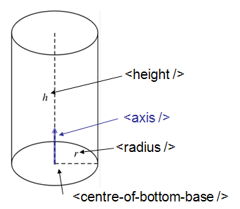
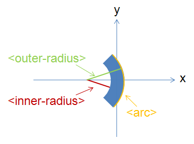
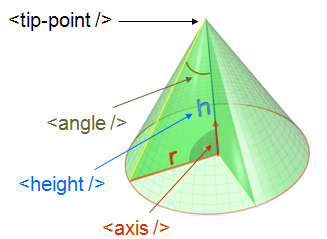
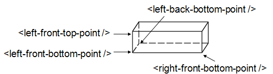
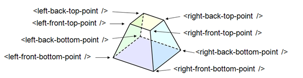

.. _HowToDefineGeometricShape:

How To Define Geometric Shape
=============================

Overview
--------

Primitive Shapes
~~~~~~~~~~~~~~~~

There is direct support for defining any of the following geometric
shapes to add :ref:`Instrument Definition File <InstrumentDefinitionFile>`.

-  Sphere
-  Infinite Cylinder
-  Cylinder (finite height)
-  Slice of cylinder ring
-  Infinite Plane
-  Cuboid
-  Infinite Cone
-  Cone

Combining Primitive shapes
~~~~~~~~~~~~~~~~~~~~~~~~~~

In addition to the shapes listed above, other shapes may be defined by
combining already defined shapes into new ones. This is done using an
algebra that follows the following notation:

+------------+----------------------------------------------------------------------------------------------------------------------------------------------------------------+------------------------------------------------------------------------------------------------------+
| Operator   | Description                                                                                                                                                    | Example                                                                                              |
+============+================================================================================================================================================================+======================================================================================================+
| :          | Union (i.e two or more things making up one shape). See e.g. also `1 <http://en.wikipedia.org/wiki/Union_(set_theory)>`__                                      | a body = legs : torso : arms : head                                                                  |
+------------+----------------------------------------------------------------------------------------------------------------------------------------------------------------+------------------------------------------------------------------------------------------------------+
| " "        | "space" shared between shapes, i,e. intersection (the common region of shapes). See e.g. also `2 <http://en.wikipedia.org/wiki/Intersection_(set_theory)>`__   | "small-circle = big-circle small-circle" (where the small circle placed within the big-circle)       |
+------------+----------------------------------------------------------------------------------------------------------------------------------------------------------------+------------------------------------------------------------------------------------------------------+
| \#         | Complement                                                                                                                                                     | \# sphere = shape defined by all points outside sphere                                               |
+------------+----------------------------------------------------------------------------------------------------------------------------------------------------------------+------------------------------------------------------------------------------------------------------+
| ( )        | Brackets are used to emphasise which shapes an operation should be applied to.                                                                                 | box1 (# box2) is the intersection between box1 and the shape defined by all points not inside box2   |
+------------+----------------------------------------------------------------------------------------------------------------------------------------------------------------+------------------------------------------------------------------------------------------------------+

Axes and units of measure
~~~~~~~~~~~~~~~~~~~~~~~~~

All objects are defined with respect to cartesian axes (x,y,z), and the
`default <IDF#Using_.3Cdefaults.3E>`__ unit of all supplied values are
metres(m). Objects may be defined so that the origin (0,0,0) is at the
centre, so that when rotations are applied they do not also apply an
unexpected translation.

Within instrument definitions we support the concept of defining a
rotation by specifying what point the object is
`facing <InstrumentDefinitionFile#Using_.3Cfacing.3E>`__. To apply that
correctly the side of the object we consider to be the front is the xy
plane. Hence, when planning to use
`facing <InstrumentDefinitionFile#Using_.3Cfacing.3E>`__ the shape
should be defined such that the positive y-axis is considered to be up,
the x-axis the width, and the z-axis the depth of the shape.

To be aware off
---------------

When defining a shape you have complete freedom to define it with
respect to whatever coordinate system you like. However, we have a least
the following recommendation

-  The origin of coordinate system of a shape is used for calculating
   the L2 distances. Therefore at least for any TOF instruments where
   you care about L2 distances, the origin should be chosen to be at the
   position on your detector shape that is best used for calculation the
   L2 distance

Examples
--------

Defining a sphere
~~~~~~~~~~~~~~~~~

.. code-block:: xml

      <sphere id="some-sphere">
        <centre x="0.0"  y="0.0" z="0.0" />
        <radius val="0.5" />
      </sphere>

      <algebra val="some-sphere" />

Any shape must be given an ID name. Here the sphere has been given the
name "some-sphere". The purpose of the ID name is to use it in the
description, here this is done with the line . The description is
optional. If it is left out the algebraic intersection is taken between
any shapes defined.

Defining a ball with a hole through it along the x-axis
~~~~~~~~~~~~~~~~~~~~~~~~~~~~~~~~~~~~~~~~~~~~~~~~~~~~~~~

.. code-block:: xml

      <cylinder id="stick">
        <centre-of-bottom-base x="-0.5" y="0.0" z="0.0" />
        <axis x="1.0" y="0.0" z="0.0" />
        <radius val="0.05" />
        <height val="1.0" />
      </cylinder>

      <sphere id="some-sphere">
        <centre x="0.0"  y="0.0" z="0.0" />
        <radius val="0.5" />
      </sphere>

      <algebra val="some-sphere (# stick)" />

This algebra string reads as follows: take the *intersection* between a
sphere and the shape defined by all points *not* inside a cylinder of
length 1.0 along the x-axis. Note the brackets around # stick in the
algebraic string are optional, but here included to emphasis that the
"space" between the "some-sphere" and "(# stick)" is the intersection
operator.

Notation used to defined any of the predefined geometric shapes
---------------------------------------------------------------

Sphere
~~~~~~

.. code-block:: xml

      <sphere id="A">
        <centre x="4.1"  y="2.1" z="8.1" />
        <radius val="3.2" />
      </sphere>

Cylinder
~~~~~~~~

.. code-block:: xml

      <cylinder id="A">
        <centre-of-bottom-base r="0.0" t="0.0" p="0.0" />  <!-- here position specified using spherical coordinates -->
        <axis x="0.0" y="0.2" z="0" />
        <radius val="1" />
        <height val="10.2" />
      </cylinder>

   XMLcylinderDescription.png‎

Infinite cylinder
~~~~~~~~~~~~~~~~~

.. code-block:: xml

      <infinite-cylinder id="A" >
        <centre x="0.0" y="0.2" z="0" />
        <axis x="0.0" y="0.2" z="0" />
        <radius val="1" />
      </infinite-cylinder>

Slice of cylinder ring
~~~~~~~~~~~~~~~~~~~~~~

.. code-block:: xml

      <slice-of-cylinder-ring id="A">
        <inner-radius val="0.0596"/>
        <outer-radius val="0.0646"/>
        <depth val="0.01"/>
        <arc val="45.0"/>
      </slice-of-cylinder-ring>

This XML element defines a slice of a cylinder ring. Most importantly
the part of this shape facing the sample is flat and looks like this:

   XMLsliceCylinderRingDescription.png

For this shape you may find it useful to specify a
:ref:`Bounding-Box <Bounding-Box>`.

Cone
~~~~

.. code-block:: xml

      <cone id="A" >
        <tip-point x="0.0" y="0.2" z="0" />
        <axis x="0.0" y="0.2" z="0" />
        <angle val="30.1" />
        <height val="10.2" />
      </cone>

   XMLconeDescription.png

Infinite cone
~~~~~~~~~~~~~

.. code-block:: xml

      <infinite-cone id="A" >
        <tip-point x="0.0" y="0.2" z="0" />
        <axis x="0.0" y="0.2" z="0" />
        <angle val="30.1"  />
      </infinite-cone>

Infinite plane
~~~~~~~~~~~~~~

Is the 3D shape of all points on the plane and all points on one side of
the infinite plane, the side which point away from the infinite plane in
the direction of the normal vector.

.. code-block:: xml

      <infinite-plane id="A">
        <point-in-plane x="0.0" y="0.2" z="0" />
        <normal-to-plane x="0.0" y="0.2" z="0" />
      </infinite-plane>

Cuboid
~~~~~~

.. code-block:: xml

      <cuboid id="shape">
        <left-front-bottom-point x="0.0025" y="-0.1" z="0.0"  />
        <left-front-top-point  x="0.0025" y="-0.1" z="0.02"  />
        <left-back-bottom-point  x="-0.0025" y="-0.1" z="0.0"  />
        <right-front-bottom-point  x="0.0025" y="0.1" z="0.0"  />
      </cuboid>
      <algebra val="shape" />

This particular example describes a cuboid with the origin at the centre
of the front face, which is here facing the negative z-axis and has the
dimensions 0.005mm x 0.2mm (in the xy-plane), and the depth of this
cuboid is 0.02mm.

   XMLcuboidDescription.png

Another example of a cuboid is

.. code-block:: xml

      <cuboid id="shape">
        <left-front-bottom-point x="0.0" y="-0.1" z="-0.01"  />
        <left-front-top-point  x="0.0" y="0.1" z="-0.01"  />
        <left-back-bottom-point  x="0.001" y="-0.1" z="-0.01"  />
        <right-front-bottom-point  x="0.0" y="-0.1" z="0.01"  />
      </cuboid>
      <algebra val="shape" />

which describes a cuboid with a front y-z plane (looking down the
x-axis). The origin is assumed to be the centre of this front surface,
which has dimensions 200mm along y and 20mm along z. The depth of this
cuboid is taken to be 1mm (along x).

Hexahedron
~~~~~~~~~~

.. code-block:: xml

      <hexahedron id="Bertie">
        <left-back-bottom-point  x="0.0" y="0.0" z="0.0"  />
        <left-front-bottom-point x="1.0" y="0.0" z="0.0"  />
        <right-front-bottom-point x="1.0" y="1.0" z="0.0"  />
        <right-back-bottom-point  x="0.0" y="1.0" z="0.0"  />
        <left-back-top-point  x="0.0" y="0.0" z="2.0"  />
        <left-front-top-point  x="0.5" y="0.0" z="2.0"  />
        <right-front-top-point  x="0.5" y="0.5" z="2.0"  />
        <right-back-top-point  x="0.0" y="0.5" z="2.0"  />
      </hexahedron>

   XMLhexahedronDescription.png

For this shape you may find it useful to specify a
:ref:`Bounding-Box <Bounding-Box>`.

Tapered Guide
~~~~~~~~~~~~~

Available from version 3.0 onwards.

A tapered guide is a special case of hexahedron; a "start" rectangular
aperture which in a continued fashion changes into an "end" rectangular
aperture.

.. code-block:: xml

      <tapered-guide id="A Guide">
          <aperture-start height="2.0" width="2.0" />
          <length val="3.0" />
          <aperture-end height="4.0" width="4.0" />
          <centre x="0.0" y="5.0" z="10.0" /> <!-- Optional.  Defaults to (0, 0 ,0) -->
          <axis x="0.5" y="1.0" z="0.0" /> <!-- Optional.  Defaults to (0, 0 ,1) -->
      </tapered-guide>

The centre value denotes the centre of the start aperture. The specified
axis runs from the start aperture to the end aperture. "Height" is along
the y-axis and "width" runs along the x-axis, before the application of
the "axis" rotation.

For this shape you may find it useful to specify a
:ref:`Bounding-Box <Bounding-Box>`.

.. _Bounding-Box:

Bounding-Box
------------

When a geometric shape is rendered in the MantidPlot instrument viewer a
bounding box is automatically created for each geometric shape. This
works well for shapes such as cylinders and cuboids. However, for more
complex shapes and combined shapes the library used for the
visualization sometimes struggle, which can results in your instrument
being viewed artificially very small (and you have to zoom in for a long
time to see your instrument) and often in this context that the
visualization axes does not display properly. For such cases this can be
fixed by explicitly adding a bounding-box using the notation
demonstrated below

.. code-block:: xml

      <hexahedron id="shape">
        <left-front-bottom-point x="0.0" y="-0.037" z="-0.0031"  />
        <right-front-bottom-point x="0.0" y="-0.037" z="0.0031"  />
        <left-front-top-point x="0.0" y="0.037" z="-0.0104"  />
        <right-front-top-point x="0.0" y="0.037" z="0.0104"  />
        <left-back-bottom-point x="0.005" y="-0.037" z="-0.0031"  />
        <right-back-bottom-point x="0.005" y="-0.037" z="0.0031"  />
        <left-back-top-point x="0.005" y="0.037" z="-0.0104"  />
        <right-back-top-point x="0.005" y="0.037" z="0.0104"  />
      </hexahedron>
      <algebra val="shape" />

      <bounding-box>
        <x-min val="0.0"/>
        <x-max val="0.005"/>
        <y-min val="-0.037"/>
        <y-max val="0.037"/>
        <z-min val="-0.0104"/>
        <z-max val="0.0104"/>
      </bounding-box>

Note for the best effect this bounding box should be enclosing the shape
as tight as possible.

.. categories:: Concepts
