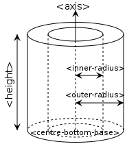

.. _HowToDefineGeometricShape:

How To Define Geometric Shape
=============================

Overview
--------

Primitive Shapes
~~~~~~~~~~~~~~~~

There is direct support for defining any of the following geometric
shapes to add :ref:`Instrument Definition File <InstrumentDefinitionFile>`.

- Sphere_
- `Cylinder (finite height) <Cylinder_>`_
- `Hollow Cylinder (finite height) <Hollow Cylinder_>`_
- `Infinite Cylinder`_
- `Slice of Cylinder Ring`_
- `Cone`_
- `Infinite Cone`_
- `Infinite Plane`_
- Cuboid_
- Hexahedron_
- `Tapered Guide`_

Combining Primitive shapes
~~~~~~~~~~~~~~~~~~~~~~~~~~

In addition to the shapes listed above, other shapes may be defined by
combining already defined shapes into new ones. This is done using an
algebra that follows the following notation:

+------------+----------------------------------------------------------------------------------------------------------------------------------------------------------------+------------------------------------------------------------------------------------------------------+
| Operator   | Description                                                                                                                                                    | Example                                                                                              |
+============+================================================================================================================================================================+======================================================================================================+
| :          | Union (i.e two or more things making up one shape). See e.g. also `1 <http://en.wikipedia.org/wiki/Union_(set_theory)>`__                                      | a body = legs : torso : arms : head                                                                  |
+------------+----------------------------------------------------------------------------------------------------------------------------------------------------------------+------------------------------------------------------------------------------------------------------+
| " "        | "space" shared between shapes, i,e. intersection (the common region of shapes). See e.g. also `2 <http://en.wikipedia.org/wiki/Intersection_(set_theory)>`__   | "small-circle = big-circle small-circle" (where the small circle placed within the big-circle)       |
+------------+----------------------------------------------------------------------------------------------------------------------------------------------------------------+------------------------------------------------------------------------------------------------------+
| \#         | Complement                                                                                                                                                     | \# sphere = shape defined by all points outside sphere                                               |
+------------+----------------------------------------------------------------------------------------------------------------------------------------------------------------+------------------------------------------------------------------------------------------------------+
| ( )        | Brackets are used to emphasise which shapes an operation should be applied to.                                                                                 | box1 (# box2) is the intersection between box1 and the shape defined by all points not inside box2   |
+------------+----------------------------------------------------------------------------------------------------------------------------------------------------------------+------------------------------------------------------------------------------------------------------+

Axes and units of measure
~~~~~~~~~~~~~~~~~~~~~~~~~

All objects are defined with respect to cartesian axes (x,y,z), and the
:ref:`default <Using defaults>` unit of all supplied values are
metres(m). Objects may be defined so that the origin (0,0,0) is at the
centre, so that when rotations are applied they do not also apply an
unexpected translation.

Within instrument definitions we support the concept of defining a
rotation by specifying what point the object is :ref:`facing <Using facing>`.
To apply that correctly the side of the object we consider to be the front
is the xy plane. Hence, when planning to use :ref:`facing <Using facing>`
the shape should be defined such that the positive y-axis is considered
to be up, the x-axis the width, and the z-axis the depth of the shape.

To be aware of
--------------

When defining a shape you have complete freedom to define it with
respect to whatever coordinate system you like. However, we have a least
the following recommendation

-  The origin of coordinate system of a shape is used for calculating
   the L2 distances. Therefore, at least for any TOF instruments where
   you care about L2 distances, the origin should be chosen to be at the
   position on your detector shape that is best used for calculation the
   L2 distance

Examples
--------

Defining a sphere
~~~~~~~~~~~~~~~~~

.. rstcheck: ignore-next-code-block
.. code-block:: xml

      <sphere id="some-sphere">
        <centre x="0.0"  y="0.0" z="0.0" />
        <radius val="0.5" />
      </sphere>

      <algebra val="some-sphere" />

Any shape must be given an ID name. Here the sphere has been given the
name "some-sphere". The purpose of the ID name is to use it in the
description, here this is done with the line . The description is
optional. If it is left out the algebraic intersection is taken between
any shapes defined.

Defining a ball with a hole through it along the x-axis
~~~~~~~~~~~~~~~~~~~~~~~~~~~~~~~~~~~~~~~~~~~~~~~~~~~~~~~

.. rstcheck: ignore-next-code-block
.. code-block:: xml

      <cylinder id="stick">
        <centre-of-bottom-base x="-0.5" y="0.0" z="0.0" />
        <axis x="1.0" y="0.0" z="0.0" />
        <radius val="0.05" />
        <height val="1.0" />
      </cylinder>

      <sphere id="some-sphere">
        <centre x="0.0"  y="0.0" z="0.0" />
        <radius val="0.5" />
      </sphere>

      <algebra val="some-sphere (# stick)" />

This algebra string reads as follows: take the *intersection* between a
sphere and the shape defined by all points *not* inside a cylinder of
length 1.0 along the x-axis. Note the brackets around # stick in the
algebraic string are optional, but here included to emphasis that the
"space" between the "some-sphere" and "(# stick)" is the intersection
operator.

Notation used to defined any of the predefined geometric shapes
---------------------------------------------------------------

Sphere
~~~~~~

.. code-block:: xml

      <sphere id="A">
        <centre x="4.1"  y="2.1" z="8.1" />
        <radius val="3.2" />
      </sphere>

Cylinder
~~~~~~~~

.. code-block:: xml

      <cylinder id="A">
        <centre-of-bottom-base r="0.0" t="0.0" p="0.0" />  <!-- here position specified using spherical coordinates -->
        <axis x="0.0" y="0.2" z="0" />
        <radius val="1" />
        <height val="10.2" />
      </cylinder>

.. figure:: ../images/XMLcylinderDescription.png
   :alt: XMLcylinderDescription.png‎
   :align: center

   Schematic of a cylinder

Hollow Cylinder
~~~~~~~~~~~~~~~

.. code-block:: xml

      <hollow-cylinder id="A">
        <centre-of-bottom-base r="0.0" t="0.0" p="0.0" />  <!-- here position specified using spherical coordinates -->
        <axis x="0.0" y="1.0" z="0" />
        <inner-radius val="0.007" />
        <outer-radius val="0.01" />
        <height val="0.05" />
      </hollow-cylinder>

   Schematic of a hollow cylinder

Infinite Cylinder
~~~~~~~~~~~~~~~~~

.. code-block:: xml

      <infinite-cylinder id="A" >
        <centre x="0.0" y="0.2" z="0" />
        <axis x="0.0" y="0.2" z="0" />
        <radius val="1" />
      </infinite-cylinder>

Slice of Cylinder Ring
~~~~~~~~~~~~~~~~~~~~~~

.. code-block:: xml

      <slice-of-cylinder-ring id="A">
        <inner-radius val="0.0596"/>
        <outer-radius val="0.0646"/>
        <depth val="0.01"/>
        <arc val="45.0"/>
      </slice-of-cylinder-ring>

This XML element defines a slice of a cylinder ring. Most importantly
the part of this shape facing the sample is flat and looks like this:

.. figure:: ../images/XMLsliceCylinderRingDescription.png
   :alt: XMLsliceCylinderRingDescription.png

   XMLsliceCylinderRingDescription.png

Cone
~~~~

.. code-block:: xml

      <cone id="A" >
        <tip-point x="0.0" y="0.2" z="0" />
        <axis x="0.0" y="0.2" z="0" />
        <angle val="30.1" />
        <height val="10.2" />
      </cone>

.. figure:: ../images/XMLconeDescription.png
   :alt: XMLconeDescription.png

   XMLconeDescription.png

Infinite Cone
~~~~~~~~~~~~~

.. code-block:: xml

      <infinite-cone id="A" >
        <tip-point x="0.0" y="0.2" z="0" />
        <axis x="0.0" y="0.2" z="0" />
        <angle val="30.1"  />
      </infinite-cone>

Infinite Plane
~~~~~~~~~~~~~~

Is the 3D shape of all points on the plane and all points on one side of
the infinite plane, the side which point away from the infinite plane in
the direction of the normal vector.

.. code-block:: xml

      <infinite-plane id="A">
        <point-in-plane x="0.0" y="0.2" z="0" />
        <normal-to-plane x="0.0" y="0.2" z="0" />
      </infinite-plane>

Cuboid
~~~~~~

Here the dimensions are used to define a 2m x 4m x 0.2m cuboid with its centre at (10,10,10).

.. rstcheck: ignore-next-code-block
.. code-block:: xml

      <cuboid id="some-cuboid">
        <width val="2.0" />
        <height val="4.0"  />
        <depth  val="0.2" />
        <centre x="10.0" y="10.0" z="10.0"  />
      </cuboid>
      <algebra val="some-cuboid" />

.. plot::
    :alt: Cuboid Dimension XML Example image

    # import mantid algorithms, numpy and matplotlib
    from mantid.simpleapi import *
    import matplotlib.pyplot as plt
    import numpy as np
    from mpl_toolkits.mplot3d.art3d import Poly3DCollection

    cuboid = " \
    <cuboid id='some-cuboid'> \
      <width val='2.0' />  \
      <height val='4.0'  /> \
      <depth  val='0.2' />  \
      <centre x='10.0' y='10.0' z='10.0'  />  \
    </cuboid>  \
    <algebra val='some-cuboid' /> \
    "

    ws = CreateSampleWorkspace()
    SetSample(ws, Geometry={'Shape': 'CSG', 'Value': cuboid})
    sample = ws.sample()
    shape = sample.getShape()
    mesh = shape.getMesh()
    facecolors = ['purple','mediumorchid','royalblue','b','red','firebrick','green', 'darkgreen','grey','black', 'gold', 'orange']
    mesh_polygon = Poly3DCollection(mesh, facecolors=facecolors)

    fig, axes = plt.subplots(subplot_kw={'projection':'mantid3d'})
    axes.add_collection3d(mesh_polygon)

    axes.set_title('Sample Shape: Cuboid')
    axes.set_xlabel('X / m')
    axes.set_ylabel('Y / m')
    axes.set_zlabel('Z / m')

    axes.set_mesh_axes_equal(mesh)
    axes.view_init(elev=20, azim=-27)

    def arrow(ax, vector, origin = None, factor = None, color = 'r',linestyle = '-'):
        if origin == None:
            origin = (ax.get_xlim3d()[1],ax.get_ylim3d()[1],ax.get_zlim3d()[1])
        ax.quiver(
             origin[0], origin[1], origin[2],
             vector[0], vector[1], vector[2],
             color = color,
             linestyle = linestyle
        )

    origins = [[11,10,9.5],[9,8,11.1],[10,12,10.5]]
    colors = ['purple','black','b']
    vectors = [[0,2,0],[0,0,-1],[1,0,0]]
    for i in range(3):
        vector, origin = vectors[i], origins[i]
        arrow(axes, vector=vector, origin=origin, color =colors[i])
        if i == 1:
            origin[2] = 8.9
        arrow(axes, vector=np.multiply(vector,-1), origin=origin, color =colors[i])

    axes.text(8,7.2,9.65, "DEPTH", color='black', fontsize=12)
    axes.text(10.5,11.5,11, "WIDTH", color='b', fontsize=12)
    axes.text(11,9.5,9, "HEIGHT", color='purple', fontsize=12)

    fig.show()

In the next example, four points are used to describe a 2m x 0.8m x 0.4m cuboid with the its centre at the origin.

.. rstcheck: ignore-next-code-block
.. code-block:: xml

      <cuboid id="shape">
        <left-front-bottom-point x="1" y="-0.4" z="-0.3"  />
        <left-front-top-point  x="1" y="-0.4" z="0.3"  />
        <left-back-bottom-point  x="-1" y="-0.4" z="-0.3"  />
        <right-front-bottom-point  x="1" y="0.4" z="-0.3"  />
      </cuboid>
      <algebra val="shape" />

.. plot::
    :alt: Cuboid Point XML Example image

    # import mantid algorithms, numpy and matplotlib
    from mantid.simpleapi import *
    import matplotlib.pyplot as plt
    import numpy as np
    from mpl_toolkits.mplot3d.art3d import Poly3DCollection

    cuboid = ' \
    <cuboid id="shape"> \
      <left-front-bottom-point x="1" y="-0.4" z="-0.3"  /> \
      <left-front-top-point  x="1" y="-0.4" z="0.3"  /> \
      <left-back-bottom-point  x="-1" y="-0.4" z="-0.3"  /> \
      <right-front-bottom-point  x="1" y="0.4" z="-0.3"  /> \
    </cuboid> \
    <algebra val="shape" /> \
    '

    ws = CreateSampleWorkspace()
    SetSample(ws, Geometry={'Shape': 'CSG', 'Value': cuboid})
    sample = ws.sample()
    shape = sample.getShape()
    mesh = shape.getMesh()

    mesh_polygon = Poly3DCollection(mesh, edgecolor = 'black' , linewidths=0.2)
    mesh_polygon.set_facecolor((1,0,0,0.1))

    fig, axes = plt.subplots(subplot_kw={'projection':'mantid3d'}, figsize = (8,6))
    axes.add_collection3d(mesh_polygon)

    axes.set_title('Cuboid defined by \n Points')
    axes.set_xlabel('X / m')
    axes.set_ylabel('Y / m')
    axes.set_zlabel('Z / m')

    axes.set_mesh_axes_equal(mesh)
    axes.view_init(elev=29, azim=-22)

    colors = ('darkorange','darkgreen','#33638DFF', '#440154FF')
    points = [[1,-0.4,-0.3], [1,-0.4,0.3], [-1,-0.4,-0.3], [1,0.4,-0.3]]
    point_names = ('left-front-\nbottom-point', 'left-front-\ntop-point', 'left-back-\nbottom-point', 'right-front-\nbottom-point')
    for i in range(4):
        axes.scatter(points[i][0],points[i][1],points[i][2], color=colors[i])
        text_points = points[i]
        if i % 2 == 0:
            text_points[1] -= 0.7
            text_points[2] -= 0.2
        if i == 1:
            text_points[1] -= 0.7
            text_points[2] -= 0.2
        if i == 3:
            text_points[1] -= 0.1
            text_points[2] -= 0.4
        axes.text(text_points[0],text_points[1],text_points[2],point_names[i], color=colors[i], fontsize=14)

    axes.scatter(0,0,0, color='b')
    axes.text(0,0.1,-0.15, "ORIGIN", color='b', fontsize=12)

    fig.show()

Hexahedron
~~~~~~~~~~

.. code-block:: xml

      <hexahedron id="Bertie">
        <left-back-bottom-point  x="0.0" y="0.0" z="0.0"  />
        <left-front-bottom-point x="1.0" y="0.0" z="0.0"  />
        <right-front-bottom-point x="1.0" y="1.0" z="0.0"  />
        <right-back-bottom-point  x="0.0" y="1.0" z="0.0"  />
        <left-back-top-point  x="0.0" y="0.0" z="2.0"  />
        <left-front-top-point  x="0.5" y="0.0" z="2.0"  />
        <right-front-top-point  x="0.5" y="0.5" z="2.0"  />
        <right-back-top-point  x="0.0" y="0.5" z="2.0"  />
      </hexahedron>

.. figure:: ../images/XMLhexahedronDescription.png
   :alt: XMLhexahedronDescription.png

   XMLhexahedronDescription.png

Tapered Guide
~~~~~~~~~~~~~

Available from version 3.0 onwards.

A tapered guide is a special case of hexahedron; a "start" rectangular
aperture which in a continued fashion changes into an "end" rectangular
aperture.

.. code-block:: xml

      <tapered-guide id="A Guide">
          <aperture-start height="2.0" width="2.0" />
          <length val="3.0" />
          <aperture-end height="4.0" width="4.0" />
          <centre x="0.0" y="5.0" z="10.0" /> <!-- Optional.  Defaults to (0, 0 ,0) -->
          <axis x="0.5" y="1.0" z="0.0" /> <!-- Optional.  Defaults to (0, 0 ,1) -->
      </tapered-guide>

The centre value denotes the centre of the start aperture. The specified
axis runs from the start aperture to the end aperture. "Height" is along
the y-axis and "width" runs along the x-axis, before the application of
the "axis" rotation.

Rotating Shapes
~~~~~~~~~~~~~~~

*Note that some shapes (such as* `Cylinder (finite height) <Cylinder_>`_ *and* `Tapered Guide`_ *) can be oriented in a
certain direction, using the* ``axis`` *tag, but this representation isn't general enough to support
all possible 3D rotations for all shapes.*

Most shapes can be rotated individually or as part of an ensemble, by using the
``rotate`` or ``rotate-all`` tags respectively.
The shapes that can be rotated are: Sphere_, `Cylinder (finite height) <Cylinder_>`_,
`Hollow Cylinder (finite height) <Hollow Cylinder_>`_, `Infinite Cylinder`_,
`Slice of Cylinder Ring`_, `Infinite Plane`_, Cuboid_, Hexahedron_ and `Tapered Guide`_.

Use the ``rotate`` tag to rotate a shape **individually around its centre** (or centre-of-bottom-base).
The shape is rotated by an angle in degrees around the x,y and z axes in that order. To rotate a
cuboid 90° clockwise around x and 45° anti-clockwise around y:

.. rstcheck: ignore-next-code-block
.. code-block:: xml

      <cuboid id="stick">
        <width val="3.0" />
        <height val="0.5"  />
        <depth  val="0.5" />
        <centre x="0.0" y="0.0" z="0.0"  />
        <rotate x="90" y="-45" z="0" />
      </cuboid>

      <algebra val="stick" />

Use the ``rotate-all`` tag to rotate a combined shape **about the origin**. To rotate the unison of a
sphere on the end of a cylinder (by 90° clockwise around x and 45° anti-clockwise around y):

.. rstcheck: ignore-next-code-block
.. code-block:: xml

      <cylinder id="stick">
        <centre-of-bottom-base x="-1.0" y="0.0" z="0.0" />
        <axis x="1.0" y="0.0" z="0.0" />
        <radius val="0.2" />
        <height val="2.0" />
      </cylinder>

      <sphere id="some-sphere">
        <centre x="2.0"  y="0.0" z="0.0" />
        <radius val="0.5" />
      </sphere>

      <algebra val="some-sphere (: stick)" />
      <rotate-all x="90" y="-45" z="0" />

All these rotatable shapes (expect for `Infinite Plane`_ and `Infinite Cylinder`_) can be plotted to check
your shape definition is correct. For more details see :ref:`Mesh_Plots`.

Shapes will be automatically rotated, if a rotation is set using :ref:`algm-SetGoniometer`.
This goniometer rotation is about the origin and can work alongside manual rotation tags.
Note the rotations are applied in the order ``rotate``, ``rotate-all``, ``goniometer``.

.. _Bounding-Box:

Bounding-Box
------------

When a geometric shape is rendered in the :ref:`instrument viewer <InstrumentViewer>`,
Mantid will attempt to automatically construct an axis-aligned bounding box for every
geometric shape that does not have one yet. Well-defined bounding boxes are
required by many features of Mantid, from correctly rendering the instrument
to performing calculations in various algorithms.

The automatically calculated bounding boxes can generally be relied upon and
are usually ideal. However, if the automatic calculation fails to produce a
reasonable bounding box, or if performance becomes an issue with particularly
complex shapes, you have the option of adding a manually pre-calculated
bounding box.

A typical symptom of the automatic calculation creating an incorrect bounding
box is your instrument appearing very small when viewed (forcing you to zoom
in for a long time to see it). In such cases, the axis visualizations also
tend to not display properly.

A custom bounding-box can be added to shapes using the following notation:

.. rstcheck: ignore-next-code-block
.. code-block:: xml

      <hexahedron id="shape">
        <left-front-bottom-point x="0.0" y="-0.037" z="-0.0031"  />
        <right-front-bottom-point x="0.0" y="-0.037" z="0.0031"  />
        <left-front-top-point x="0.0" y="0.037" z="-0.0104"  />
        <right-front-top-point x="0.0" y="0.037" z="0.0104"  />
        <left-back-bottom-point x="0.005" y="-0.037" z="-0.0031"  />
        <right-back-bottom-point x="0.005" y="-0.037" z="0.0031"  />
        <left-back-top-point x="0.005" y="0.037" z="-0.0104"  />
        <right-back-top-point x="0.005" y="0.037" z="0.0104"  />
      </hexahedron>
      <algebra val="shape" />

      <bounding-box>
        <x-min val="0.0"/>
        <x-max val="0.005"/>
        <y-min val="-0.037"/>
        <y-max val="0.037"/>
        <z-min val="-0.0104"/>
        <z-max val="0.0104"/>
      </bounding-box>

Note for the best effect this bounding box should be enclosing the shape
as tight as possible.

.. categories:: Concepts
