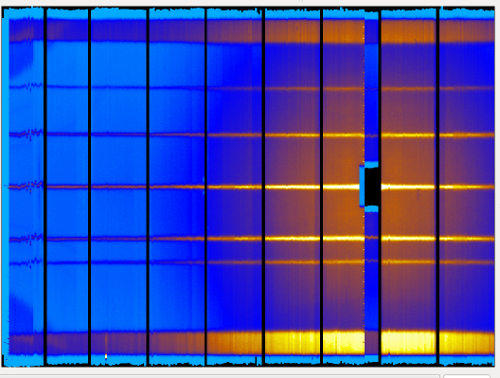
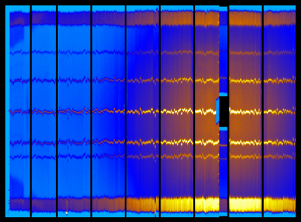

.. _How_to_reset_detectors_calibration:

How to reset detectors calibration
==================================

Some NeXuS data files have the calibration inside the data. Hence, in loading
time, Mantid will load the positions for the detector and correct them.
These new positions are kept inside the parameter maps that each
instrument has.

Some times you may be interested in resetting the calibrated
values, in order to see how the uncalibrated instrument. You may do this
through two steps.

Let's load a calibrated workspace: MERLIN 12024 (cycle 11/05):

.. code-block:: python

    mer12024 = :ref:`Load <algm-Load>`('MER12024')

Open the Instrument View and select Cylindrical Rendering, you will see
something like:

This image is clearly calibrated. To reset the calibration, execute:

.. code-block:: python

    empty_instr = LoadEmptyInstrument('MANTIDINSTALL/instrument/MERLIN_Definition.xml')
    CopyInstrumentParameters(empty_instr, mer12024)

The result is reseting the calibration of this workspace as you can see
in the image below:

.. categories:: Calibration
