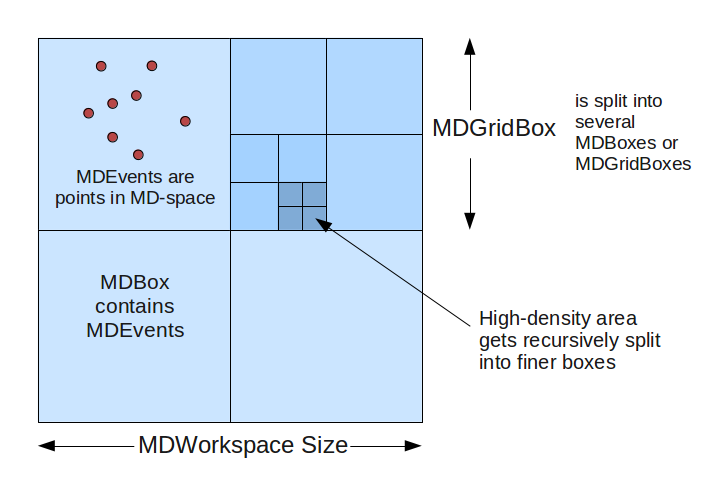

.. _MDWorkspace:

============
MD Workspace
============

.. contents::
  :local:

The MD Workspace [MDWorkspace] (short for "Multi-Dimensional" Workspace) is a generic
data structure holdings points (MDEvents) that are defined by their
position in several dimensions. See also
:ref:`MDHistoWorkspace <MDHistoWorkspace>`.

Description of MDWorkspace
--------------------------

-  **Dimensions**: A MDWorkspace can have between 1 and 9 dimensions.

   -  Each dimension is defined with a name, units, and minimum/maximum
      extents.

-  **MDEvent**: A MDEvent is simply a point in space defined by its
   coordinates, plus a signal (weight) and error.

   -  The MDLeanEvent type contains only coordinates, signal and error.
   -  The MDEvent type also contains a run index (for multiple runs
      summed into one workspace) and a detector ID, allowing for more
      information to be extracted.

-  The class is named MDEventWorkspace.

Structure
#########

The MDWorkspace is a container that can hold a large number of MDEvents.
The events are organized into "boxes": types are MDBox and MDGridBox. At
the simplest level, an MDWorkspace will be a single MDBox with an
unsorted bunch of events.

In order to allow for efficient searching and binning of these events,
the boxes are organized into a recursive boxing structure (adaptive mesh
refinement). During MDWorkspace construction, if a MDBox is found to
contain too many events, it will be split into smaller boxes.

   MDWorkspace\_structure.png
   
The threshold for splitting is defined in
:ref:`CreateMDWorkspace <algm-CreateMDWorkspace>` as the SplitThreshold
parameter. Each parent box will get split into N sub-boxes in each
dimension. For example, in a 2D workspace, you might split a parent box
into 4x4 sub-boxes, creating 16 MDBoxes under the parent box (which
becomes a MDGridBox). The level of splitting is defined in the SplitInto
parameter.

Creating a MDWorkspace
----------------------

There are several algorithms that will create a MDWorkspace:

-  :ref:`CreateMDWorkspace <algm-CreateMDWorkspace>` creates a blank MDWorkspace
   with any arbitrary set of dimensions.
-  :ref:`CreateMD <algm-CreateMD>` Creates an MDWorkspace in the Q3D, HKL frame.
-  :ref:`ConvertToDiffractionMDWorkspace <algm-ConvertToDiffractionMDWorkspace>`
   converts an :ref:`EventWorkspace <EventWorkspace>` or
   :ref:`Workspace2D <Workspace2D>` from detector space to reciprocal
   space, for elastic single-crystal or powder diffraction experiments.
-  :ref:`ConvertToMD <algm-ConvertToMD>` converts workspaces for
   inelastic experiments.
-  :ref:`SliceMD <algm-SliceMD>` takes a slice out of a MDWorkspace to create a
   new one.
-  :ref:`LoadSQW <algm-LoadSQW>` converts from the SQW format.

File-Backed MDWorkspaces
------------------------

For workspaces with a large number of events that would not fit in
memory, it is possible to use a NXS file back-end as a data store. The
box structure will always remain in memory, but the underlying events
will be stored in a file and retrieved only when required. This can be
set at creation (:ref:`CreateMDWorkspace <algm-CreateMDWorkspace>`) or when
loading from a file, or an in-memory MDWorkspace can be converted to
file-backed with the :ref:`SaveMD <algm-SaveMD>` algorithm.

Because of disk IO, file-backed MDWorkspaces are slower to process for
some operations (e.g. binning or slicing). Some types of visualization
and analysis, however, are just as fast with file-backed MDWorkspaces as
their in-memory equivalent.

Viewing MDWorkspaces
--------------------

-  Right-click on a MDWorkspace and select:

   -  **Show Vates Simple Interface**: to open a `simplified 3D
      view <http://www.mantidproject.org/VatesSimpleInterface>`__ based on Paraview.
   -  **Show Slice Viewer**: to open the `Slice
      Viewer <http://www.mantidproject.org/MantidPlot:_SliceViewer>`__, which shows 2D slices of the
      multiple-dimensional workspace.

-  You can also `use Python script to open the
   SliceViewer <http://www.mantidproject.org/SliceViewer_Python_Interface>`__.

Or, you can load a MDWorkspace .nxs file in Paraview if
the proper plugin is installed.

Working with Table Workspaces in Python
---------------------------------------

Accessing Workspaces
####################

The methods for getting a variable to an MDWorkspace is the same as shown in the :ref:`Workspace <Workspace-Accessing_Workspaces>` help page.

If you want to check if a variable points to something that is an MDWorkspace Workspace you can use this:

.. testcode:: CheckMDWorkspace

    from mantid.api import IMDEventWorkspace

    mdws = CreateMDWorkspace(Dimensions=3, Extents='-10,10,-10,10,-10,10', Names='A,B,C', Units='U,U,U')

    if isinstance(mdws, IMDEventWorkspace):
        print mdws.name() + " is a " + mdws.id()

Output:

.. testoutput:: CheckMDWorkspace
    :options: +NORMALIZE_WHITESPACE

    mdws is a MDEventWorkspace<MDLeanEvent,3>

MD Workspace Properties
#######################

For a full list of the available properties and operation look at the :py:obj:`IMDEventWorkspace api page <mantid.api.IMDEventWorkspace>`.

.. testcode:: MDWorkspaceProperties

   ws = CreateMDWorkspace(Dimensions='2', EventType='MDEvent', Extents='-10,10,-10,10',
                         Names='Q_lab_x,Q_lab_y', Units='A,B')
   FakeMDEventData(ws, UniformParams="1000000")

   print "Number of events =", ws.getNEvents()
   print "Number of dimensions =", ws.getNumDims()
   print "Normalization =", ws.displayNormalization()
   for i in range(ws.getNumDims()):
       dimension = ws.getDimension(i)
       print "\tDimension {0} Name: {1}".format(i,
          dimension.name)

   bc =ws.getBoxController()
   print "Is the workspace using a file back end?", bc.isFileBacked()
   backEndFilename = bc.getFilename()

.. testoutput:: MDWorkspaceProperties
   :hide:
   :options: +ELLIPSIS,+NORMALIZE_WHITESPACE

   Number of events = 1000000
   Number of dimensions = 2
   Normalization = VolumeNormalization
      Dimension 0 Name: Q_lab_x
      Dimension 1 Name: Q_lab_y
   Is the workspace using a file back end? False

Dimensions
^^^^^^^^^^

As a generic multi dimensional container being able to access information about the dimensions is very important.

.. testcode:: MDWorkspaceDimensions

   ws = CreateMDWorkspace(Dimensions='3', EventType='MDEvent', Extents='-10,10,-5,5,-1,1',
                        Names='Q_lab_x,Q_lab_y,Q_lab_z', Units='1\A,1\A,1\A')
   FakeMDEventData(ws, UniformParams="1000000")

   print "Number of dimensions =", ws.getNumDims()
   for i in range(ws.getNumDims()):
      dimension = ws.getDimension(i)
      print "\tDimension {0} Name: {1} id: {2} Range: {3}-{4} {5}".format(i,
          dimension.getDimensionId(),
          dimension.name,
          dimension.getMinimum(),
          dimension.getMaximum(),
          dimension.getUnits())

   print "The dimension assigned to X =", ws.getXDimension().name
   print "The dimension assigned to Y =", ws.getYDimension().name
   try:
      print "The dimension assigned to Z =", ws.getZDimension().name
   except RuntimeError:
       # if the dimension does not exist you will get a RuntimeError
      print "Workspace does not have a Z dimension"

   # you can also get a dimension by it's id
   dim = ws.getDimensionIndexById("Q_lab_x")
   # or name
   dim = ws.getDimensionIndexByName("Q_lab_x")

.. testoutput:: MDWorkspaceDimensions
   :hide:
   :options: +ELLIPSIS,+NORMALIZE_WHITESPACE

   Number of dimensions = 3
      Dimension 0 Name: Q_lab_x id: Q_lab_x Range: -10.0-10.0 1\A
      Dimension 1 Name: Q_lab_y id: Q_lab_y Range: -5.0-5.0 1\A
      Dimension 2 Name: Q_lab_z id: Q_lab_z Range: -1.0-1.0 1\A
   The dimension assigned to X = Q_lab_x
   The dimension assigned to Y = Q_lab_y
   The dimension assigned to Z = Q_lab_z

Accessing the Data
^^^^^^^^^^^^^^^^^^

To access the data of an MDWorkspace you need to convert it to a regular grid, or :ref:`MDHistoWorkspace`.

.. testcode:: MDWorkspaceConvertToHisto

   # Setup 
   mdWS = CreateMDWorkspace(Dimensions=4, Extents=[-1,1,-1,1,-1,1,-10,10], Names="H,K,L,E", Units="U,U,U,V")
   FakeMDEventData(InputWorkspace=mdWS, PeakParams='500000,0,0,0,0,3')

   # Create a histogrammed (binned) workspace with 100 bins in each of the H, K and L dimensions
   histoWS = BinMD(InputWorkspace=mdWS, AlignedDim0='H,-1,1,100', AlignedDim1='K,-1,1,100', AlignedDim2='L,-1,1,100')

   # Or you can also use CutMD, to define bin widths and the cut projection
   from mantid.api import Projection
   SetUB(Workspace=mdWS, a=1, b=1, c=1, alpha=90, beta=90, gamma=90)
   SetSpecialCoordinates(InputWorkspace=mdWS, SpecialCoordinates='HKL')

   projection = Projection([1,1,0], [-1,1,0])
   proj_ws = projection.createWorkspace()

   # Apply the cut with bin widths of 0.1 in  H,K and L and integrating over -5 to +5 in E
   out_md = CutMD(mdWS, Projection=proj_ws, PBins=([0.1], [0.1], [0.1], [-5,5]), NoPix=True)

.. categories:: Concepts
